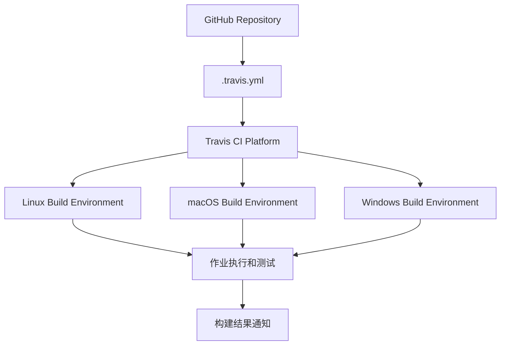

# Travis CI

## 1. 概述

Travis CI 是一个基于云的持续集成服务，专门为 GitHub 项目提供自动化构建和测试能力。作为最早流行的 CI/CD 服务之一，Travis CI 以其简单的配置和与 GitHub 的深度集成而著称，特别适合开源项目和个人开发者。

## 2. 核心特性

### 2.1 主要优势
- **GitHub 深度集成**: 与 GitHub 仓库无缝连接，支持自动触发构建
- **简洁配置**: 使用 `.travis.yml` YAML 文件进行简单直观的配置
- **多语言支持**: 原生支持多种编程语言和框架
- **开源友好**: 对公开仓库提供免费的构建服务
- **矩阵构建**: 支持多版本、多环境的并行测试

### 2.2 架构组成


## 3. 快速开始

### 3.1 基础配置
在项目根目录创建 `.travis.yml` 文件：

```yaml
language: node_js
node_js:
  - "18"
  - "20"

install:
  - npm install

script:
  - npm test

after_success:
  - npm run coverage

notifications:
  email:
    recipients:
      - developer@example.com
    on_success: always
    on_failure: always
```

### 3.2 多语言项目配置
```yaml
language: python
python:
  - "3.8"
  - "3.9"
  - "3.10"
  - "3.11"

install:
  - pip install -r requirements.txt

script:
  - pytest tests/
```

## 4. 配置详解

### 4.1 语言和环境配置
```yaml
language: node_js

node_js:
  - "18"
  - "20"
  - lts/*

os:
  - linux
  - osx

dist: focal  # Ubuntu 20.04 Focal Fossa

arch:
  - amd64
  - arm64

env:
  global:
    - NODE_ENV=test
    - COVERAGE=true
  matrix:
    - TEST_SUITE=unit
    - TEST_SUITE=integration
```

### 4.2 构建阶段配置
```yaml
before_install:
  - echo "Starting build process"
  - sudo apt-get update

install:
  - npm ci

before_script:
  - echo "Setting up test environment"
  - export DATABASE_URL=postgresql://localhost/test

script:
  - npm run test:ci

after_script:
  - echo "Cleaning up"
  - npm run cleanup

after_success:
  - echo "Build successful"
  - npm run report-coverage

after_failure:
  - echo "Build failed"
  - ./scripts/notify-failure.sh
```

### 4.3 缓存和依赖管理
```yaml
cache:
  directories:
    - node_modules
    - $HOME/.npm
    - $HOME/.cache

before_cache:
  - rm -f $HOME/.npm/anonymous-cli-metrics.json

addons:
  apt:
    packages:
      - libssl-dev
      - postgresql-client
    sources:
      - sourceline: 'deb https://apt.postgresql.org/pub/repos/apt/ focal-pgdg main'
        key_url: 'https://www.postgresql.org/media/keys/ACCC4CF8.asc'
```

## 5. 部署功能

### 5.1 自动化部署配置
```yaml
deploy:
  provider: heroku
  api_key: $HEROKU_API_KEY
  app: my-production-app
  on:
    branch: main
  run:
    - "npm run db:migrate"

deploy:
  provider: pages
  github_token: $GITHUB_TOKEN
  local_dir: dist/
  on:
    branch: main

deploy:
  provider: s3
  access_key_id: $AWS_ACCESS_KEY
  secret_access_key: $AWS_SECRET_KEY
  bucket: my-app-bucket
  region: us-east-1
```

### 5.2 多环境部署
```yaml
jobs:
  include:
    - stage: test
      script: npm test
    - stage: deploy-staging
      if: branch = main AND type = push
      script: npm run deploy-staging
    - stage: deploy-production
      if: tag IS present
      script: npm run deploy-production

stages:
  - test
  - name: deploy
    if: branch = main
```

## 6. 高级功能

### 6.1 矩阵构建
```yaml
matrix:
  include:
    - language: node_js
      node_js: "18"
      env: TEST_TYPE=unit
    - language: node_js
      node_js: "20"
      env: TEST_TYPE=integration
    - language: python
      python: "3.10"
      env: TEST_TYPE=e2e

  exclude:
    - language: python
      python: "3.8"
      env: TEST_TYPE=e2e

  allow_failures:
    - env: TEST_TYPE=experimental
```

### 6.2 自定义构建环境
```yaml
services:
  - docker
  - postgresql
  - redis

addons:
  postgresql: "13"
  chrome: stable

before_install:
  - docker run -d -p 5432:5432 postgres:13
  - sleep 10  # Wait for services to start

env:
  - DATABASE_URL=postgresql://postgres@localhost:5432/test
  - REDIS_URL=redis://localhost:6379
```

### 6.3 条件执行
```yaml
jobs:
  include:
    - name: "Linux Tests"
      os: linux
      script: ./test-linux.sh
    - name: "macOS Tests"
      os: osx
      script: ./test-macos.sh
    - name: "Windows Tests"
      os: windows
      script: ./test-windows.sh

  allow_failures:
    - os: windows  # Windows tests can fail without failing build

  fast_finish: true
```

## 7. 集成功能

### 7.1 GitHub 集成
```yaml
branches:
  only:
    - main
    - develop
    - /^feature-.*$/
  except:
    - experimental

pull_requests:
  branches:
    only:
      - main

github_token: $GITHUB_TOKEN  # for deployment to GitHub Pages

notifications:
  webhooks: https://my-app.com/travis-webhook
```

### 7.2 代码质量工具集成
```yaml
before_script:
  - curl -sSfL https://raw.githubusercontent.com/golangci/golangci-lint/master/install.sh | sh -s -- -b $(go env GOPATH)/bin v1.50.0

script:
  - golangci-lint run ./...
  - go test -v ./...
  - go build -o myapp

after_success:
  - go test -coverprofile=coverage.out ./...
  - bash <(curl -s https://codecov.io/bash) -f coverage.out
```

### 7.3 容器化构建
```yaml
sudo: required

services:
  - docker

script:
  - docker build -t myapp:latest .
  - docker run myapp:latest npm test

deploy:
  provider: script
  script: ./deploy-docker.sh
  on:
    branch: main
```

## 8. 最佳实践

### 8.1 配置优化
```yaml
# 使用缓存加速构建
cache:
  apt: true
  directories:
    - node_modules
    - vendor/bundle
  timeout: 3600  # 1 hour cache timeout

# 并行执行测试
script:
  - npm run test:unit &
  - npm run test:integration &
  - wait

# 设置构建超时
timeout: 1800  # 30 minutes
```

### 8.2 安全实践
```yaml
# 使用环境变量保护敏感信息
env:
  global:
    - secure: "ENCRYPTED_API_KEY"
    - secure: "ENCRYPTED_DATABASE_URL"

# 部署密钥管理
deploy:
  provider: heroku
  api_key:
    secure: $HEROKU_API_KEY_ENCRYPTED

# 访问控制
branches:
  only:
    - main
    - develop
```

### 8.3 监控和通知
```yaml
notifications:
  email:
    recipients:
      - team@example.com
    on_success: always
    on_failure: always

  slack:
    rooms:
      - secure: "SLACK_WEBHOOK_ENCRYPTED"
    on_success: always
    on_failure: always

  webhooks:
    - https://my-monitoring-service.com/travis
    - https://my-chat-app.com/webhook

 irc:
    channels:
      - "irc.freenode.org#my-project"
    on_success: always
    on_failure: always
```

## 9. 故障排除

### 9.1 常见问题处理
```yaml
# 调试模式
before_install:
  - set -x  # Enable debug mode
  - env  # Print environment variables

# 服务启动等待
before_script:
  - ./wait-for-services.sh
  - sleep 10  # Additional wait time

# 资源清理
after_script:
  - docker system prune -f
  - rm -rf tmp/
```

### 9.2 本地测试
```bash
# 使用 Travis CLI 进行本地测试
gem install travis
travis login
travis lint  # 验证配置文件语法
travis setup deploy  # 设置部署配置

# 模拟构建环境
docker run -it -v $(pwd):/project travisci/ci-garnet:packer-1512502276-986baf0
```
