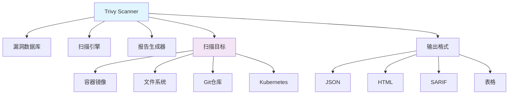

# Trivy - 容器安全扫描工具

## 1. 概述

Trivy 是一个简单而全面的容器漏洞扫描工具，用于检测容器镜像、文件系统、Git 仓库中的安全漏洞。它支持多种漏洞数据库，包括 OS 包漏洞和语言特定漏洞。

## 2. 核心概念

### 2.1 架构组件


### 2.2 关键特性
- **多目标支持**: 容器镜像、文件系统、Git 仓库、Kubernetes 资源
- **全面漏洞检测**: OS 包漏洞和语言特定依赖漏洞
- **快速扫描**: 轻量级且快速，无需复杂配置
- **多种输出格式**: JSON、HTML、SARIF、表格等
- **CI/CD 集成**: 易于集成到各种 CI/CD 流水线
- **策略检查**: 支持自定义安全策略

## 3. 安装与配置

### 3.1 安装方法
```bash
#!/bin/bash
# install-trivy.sh

# 方法1: 使用包管理器
# Ubuntu/Debian
sudo apt-get install wget apt-transport-https gnupg lsb-release
wget -qO - https://aquasecurity.github.io/trivy-repo/deb/public.key | sudo apt-key add -
echo deb https://aquasecurity.github.io/trivy-repo/deb $(lsb_release -sc) main | sudo tee -a /etc/apt/sources.list.d/trivy.list
sudo apt-get update
sudo apt-get install trivy

# RHEL/CentOS
sudo yum install -y trivy

# macOS
brew install aquasecurity/trivy/trivy

# 方法2: 二进制安装
curl -sfL https://raw.githubusercontent.com/aquasecurity/trivy/main/contrib/install.sh | sh -s -- -b /usr/local/bin

# 方法3: Docker 方式
docker run aquasec/trivy:latest

# 验证安装
trivy --version
```

### 3.2 基础配置
```yaml
# ~/.trivy.yaml
db:
  repository: ghcr.io/aquasecurity/trivy-db
  cache-dir: /tmp/trivy/db
  update-interval: 24h

cache:
  dir: /tmp/trivy/cache

scan:
  skip-dirs:
    - node_modules
    - vendor
  skip-files:
    - "*.log"
    - "*.tmp"

report:
  format: table
  output: trivy-report.txt
  exit-code: 1
  ignore-unfixed: false
  severity:
    - CRITICAL
    - HIGH
    - MEDIUM
    - LOW

vulnerability:
  types:
    - os
    - library

compliance:
  types:
    - docker-cis
    - kubernetes-cis

secret:
  config:
    allowed-rules:
      - aws-access-key-id
      - aws-secret-access-key
```

## 4. 基本使用

### 4.1 扫描命令
```bash
#!/bin/bash
# trivy-basic-usage.sh

# 扫描容器镜像
trivy image nginx:alpine
trivy image your-registry/your-app:latest

# 扫描文件系统
trivy fs /path/to/scan
trivy fs .  # 扫描当前目录

# 扫描 Git 仓库
trivy repo https://github.com/your/repo.git
trivy repo .  # 扫描当前 Git 仓库

# 扫描 Kubernetes 集群
trivy k8s --report summary cluster
trivy k8s pod my-pod -n my-namespace

# 扫描配置文件
trivy config /path/to/config
trivy config .  # 扫描当前目录的配置文件

# 扫描特定目标
trivy image --severity CRITICAL,HIGH nginx:alpine
trivy image --ignore-unfixed nginx:alpine
trivy image --vuln-type os nginx:alpine
trivy image --scanners vuln,secret nginx:alpine
```

### 4.2 输出格式
```bash
#!/bin/bash
# trivy-output-formats.sh

# 表格格式 (默认)
trivy image --format table nginx:alpine

# JSON 格式
trivy image --format json nginx:alpine > report.json

# HTML 格式
trivy image --format html nginx:alpine > report.html

# SARIF 格式 (用于 GitHub Code Scanning)
trivy image --format sarif nginx:alpine > report.sarif

# CycloneDX 格式
trivy image --format cyclonedx nginx:alpine > report.xml

# 模板自定义输出
trivy image --format template --template "@contrib/gitlab.tpl" nginx:alpine

# 输出到文件
trivy image --output report.txt nginx:alpine

# 退出码控制
trivy image --exit-code 1 --severity CRITICAL,HIGH nginx:alpine
```

## 5. CI/CD 集成

### 5.1 GitHub Actions 集成
```yaml
# .github/workflows/trivy-scan.yml
name: Trivy Security Scan

on:
  push:
    branches: [ main, develop ]
  pull_request:
    branches: [ main ]
  schedule:
    - cron: '0 0 * * 0'  # 每周运行一次

jobs:
  trivy-scan:
    name: Run Trivy scanner
    runs-on: ubuntu-latest
    permissions:
      contents: read
      security-events: write
    
    steps:
    - name: Checkout code
      uses: actions/checkout@v3
    
    - name: Set up Docker
      uses: docker/setup-buildx-action@v2
    
    - name: Build Docker image
      run: docker build -t your-app:${{ github.sha }} .
    
    - name: Run Trivy vulnerability scanner
      uses: aquasecurity/trivy-action@master
      with:
        image-ref: 'your-app:${{ github.sha }}'
        format: 'sarif'
        output: 'trivy-results.sarif'
        severity: 'CRITICAL,HIGH'
        exit-code: '1'
        ignore-unfixed: true
        vuln-type: 'os,library'
    
    - name: Upload Trivy scan results to GitHub Security tab
      uses: github/codeql-action/upload-sarif@v2
      with:
        sarif_file: 'trivy-results.sarif'
    
    - name: Run Trivy filesystem scan
      run: |
        trivy fs --severity CRITICAL,HIGH --exit-code 1 .
    
    - name: Run Trivy config scan
      run: |
        trivy config --severity CRITICAL,HIGH --exit-code 1 .
```

### 5.2 GitLab CI 集成
```yaml
# .gitlab-ci.yml
stages:
  - test
  - security

trivy-image-scan:
  stage: security
  image:
    name: aquasec/trivy:latest
    entrypoint: [""]
  variables:
    TRIVY_USERNAME: $CI_REGISTRY_USER
    TRIVY_PASSWORD: $CI_REGISTRY_PASSWORD
    TRIVY_AUTH_URL: $CI_REGISTRY
    TRIVY_NO_PROGRESS: "true"
    TRIVY_CACHE_DIR: .trivycache
  script:
    - trivy image --exit-code 1 --severity CRITICAL,HIGH $CI_REGISTRY_IMAGE:$CI_COMMIT_SHA
    - trivy image --format template --template "@contrib/gitlab.tpl" -o gl-dependency-scanning-report.json $CI_REGISTRY_IMAGE:$CI_COMMIT_SHA
  artifacts:
    reports:
      dependency_scanning: gl-dependency-scanning-report.json
    paths:
      - gl-dependency-scanning-report.json
    expire_in: 1 week

trivy-fs-scan:
  stage: security
  image:
    name: aquasec/trivy:latest
    entrypoint: [""]
  script:
    - trivy fs --exit-code 1 --severity CRITICAL,HIGH .
    - trivy config --exit-code 1 --severity CRITICAL,HIGH .
  cache:
    paths:
      - .trivycache
```

## 6. 高级配置

### 6.1 自定义策略配置
```yaml
# .trivy-policy.yaml
apiVersion: v1
kind: Config
spec:
  policies:
    - name: no-critical-vulns
      description: No critical vulnerabilities allowed
      severity: CRITICAL
      resources:
        - kind: image
        - kind: filesystem
      conditions:
        - vulnerabilities:
            severities:
              - CRITICAL
            states:
              - OPEN
      actions:
        - type: deny
    
    - name: allowed-secrets
      description: Allow specific secrets
      resources:
        - kind: filesystem
      conditions:
        - secrets:
            types:
              - aws-access-key-id
              - aws-secret-access-key
      actions:
        - type: allow
    
    - name: cis-docker-compliance
      description: Docker CIS compliance checks
      resources:
        - kind: config
      conditions:
        - compliance:
            standards:
              - docker-cis-1.2.0
            controls:
              - 5.4
              - 5.5
      actions:
        - type: warn

checks:
  - id: CVE-2021-44228
    severity: CRITICAL
    match:
      vulnerability:
        id: CVE-2021-44228
    actions:
      - type: deny
```

### 6.2 忽略文件配置
```yaml
# .trivyignore
# 忽略特定漏洞
CVE-2019-18276
CVE-2021-44228 until=2023-12-31

# 忽略特定包的漏洞
# Package: openssl
CVE-2021-3449

# 忽略特定严重性
* severity: LOW

# 忽略未修复的漏洞
* until=2023-12-31

# 正则表达式匹配
.*log4j.* until=2023-12-31

# 特定镜像的漏洞
your-registry/your-app:*
CVE-2020-12345
```

## 7. 漏洞管理

### 7.1 漏洞排除策略
```bash
#!/bin/bash
# trivy-vulnerability-management.sh

# 生成忽略文件
trivy image --format json nginx:alpine | jq -r '.Results[].Vulnerabilities[] | select(.Severity == "LOW") | .VulnerabilityID' > .trivyignore

# 检查忽略的漏洞
trivy image --ignorefile .trivyignore nginx:alpine

# 审计依赖漏洞
trivy image --list-all-pkgs nginx:alpine

# 只显示固定漏洞
trivy image --ignore-unfixed nginx:alpine

# 按包名过滤
trivy image --filter "pkg_name=openssl" nginx:alpine

# 排除特定目录
trivy fs --skip-dirs node_modules,vendor .

# 排除特定文件
trivy fs --skip-files "*.log,*.tmp" .

# 数据库管理
trivy image --download-db-only  # 只下载数据库
trivy image --skip-db-update    # 跳过数据库更新
trivy image --reset             # 重置数据库和缓存
```

### 7.2 漏洞报告分析
```bash
#!/bin/bash
# trivy-report-analysis.sh

# 生成详细报告
trivy image --format json --output trivy-report.json nginx:alpine

# 分析报告
jq '.Results[].Vulnerabilities | group_by(.Severity) | map({severity: .[0].Severity, count: length})' trivy-report.json

# 提取关键漏洞
jq -r '.Results[].Vulnerabilities[] | select(.Severity == "CRITICAL") | .VulnerabilityID + " " + .PkgName + " " + .InstalledVersion' trivy-report.json

# 统计漏洞数量
jq '[.Results[].Vulnerabilities[]] | length' trivy-report.json

# 按包分组统计
jq '.Results[].Vulnerabilities | group_by(.PkgName) | map({package: .[0].PkgName, count: length}) | sort_by(.count) | reverse' trivy-report.json

# 生成 HTML 报告
trivy image --format html --output trivy-report.html nginx:alpine

# 发送邮件报告
if trivy image --exit-code 1 --severity CRITICAL nginx:alpine; then
  echo "No critical vulnerabilities found"
else
  echo "Critical vulnerabilities found!" | mail -s "Trivy Scan Alert" admin@example.com
fi
```

## 8. 集成扫描

### 8.1 多目标扫描脚本
```bash
#!/bin/bash
# comprehensive-scan.sh

set -e

# 扫描当前目录的文件系统
echo "Scanning filesystem..."
trivy fs --severity CRITICAL,HIGH --exit-code 0 .

# 扫描容器镜像
echo "Scanning Docker images..."
IMAGES=$(docker images --format "{{.Repository}}:{{.Tag}}" | grep -v "<none>")
for image in $IMAGES; do
    echo "Scanning $image"
    trivy image --severity CRITICAL,HIGH --exit-code 0 $image
done

# 扫描 Git 仓库
echo "Scanning Git repository..."
trivy repo --severity CRITICAL,HIGH --exit-code 0 .

# 扫描 Kubernetes 资源
if command -v kubectl &> /dev/null; then
    echo "Scanning Kubernetes resources..."
    trivy k8s --report summary cluster
fi

# 扫描配置文件
echo "Scanning configuration files..."
trivy config --severity CRITICAL,HIGH --exit-code 0 .

echo "All scans completed successfully!"
```

### 8.2 定期扫描任务
```yaml
# trivy-scheduler.yaml
apiVersion: batch/v1beta1
kind: CronJob
metadata:
  name: trivy-daily-scan
spec:
  schedule: "0 2 * * *"  # 每天凌晨2点
  jobTemplate:
    spec:
      template:
        spec:
          containers:
          - name: trivy
            image: aquasec/trivy:latest
            args:
            - image
            - --severity
            - CRITICAL,HIGH
            - --exit-code
            - 1
            - --format
            - json
            - --output
            - /tmp/trivy-report.json
            - your-registry/your-app:latest
            volumeMounts:
            - name: trivy-cache
              mountPath: /tmp/trivy
          restartPolicy: OnFailure
          volumes:
          - name: trivy-cache
            emptyDir: {}
```

## 9. 性能优化

### 9.1 缓存和性能配置
```bash
#!/bin/bash
# trivy-performance.sh

# 使用缓存目录
export TRIVY_CACHE_DIR=/tmp/trivy-cache
mkdir -p $TRIVY_CACHE_DIR

# 离线模式（使用本地数据库）
trivy image --offline-scan nginx:alpine

# 跳过数据库更新
trivy image --skip-db-update nginx:alpine

# 并行扫描
trivy image --parallel 10 nginx:alpine

# 内存限制
trivy image --memory 4G nginx:alpine

# 超时设置
trivy image --timeout 10m nginx:alpine

# 清除缓存
trivy image --clear-cache
trivy image --reset

# 只扫描特定漏洞类型
trivy image --vuln-type os nginx:alpine  # 只扫描OS漏洞
trivy image --vuln-type library nginx:alpine  # 只扫描库漏洞

# 只使用特定扫描器
trivy image --scanners vuln nginx:alpine  # 只扫描漏洞
trivy image --scanners secret nginx:alpine  # 只扫描密钥
trivy image --scanners config nginx:alpine  # 只扫描配置
```

## 10. 安全策略实施

### 10.1 策略即代码
```yaml
# security-policies.yaml
apiVersion: v1
kind: Config
spec:
  policies:
    - name: no-critical-vulnerabilities
      description: Reject images with critical vulnerabilities
      resources:
        - kind: image
      conditions:
        - vulnerabilities:
            severities:
              - CRITICAL
            states:
              - OPEN
      actions:
        - type: deny
        - type: log
          message: "Critical vulnerability found: {{ .Vulnerability.ID }}"
    
    - name: no-exposed-secrets
      description: Reject images with exposed secrets
      resources:
        - kind: image
        - kind: filesystem
      conditions:
        - secrets:
            types:
              - aws-access-key-id
              - github-token
              - ssh-private-key
      actions:
        - type: deny
    
    - name: cis-docker-compliance
      description: Enforce Docker CIS compliance
      resources:
        - kind: config
      conditions:
        - compliance:
            standards:
              - docker-cis-1.2.0
            controls:
              - 5.4  # Ensure containers use trusted base images
              - 5.5  # Ensure unnecessary packages are not installed
      actions:
        - type: warn

  checks:
    - id: log4shell
      description: Detect Log4Shell vulnerability
      match:
        vulnerability:
          id: CVE-2021-44228
      actions:
        - type: deny
        - type: alert
          message: "Log4Shell vulnerability detected!"
```

### 10.2 强制安全扫描
```bash
#!/bin/bash
# enforce-security-scan.sh

# 预提交钩子
cat > .git/hooks/pre-commit << 'EOF'
#!/bin/bash

# 运行 Trivy 文件扫描
if ! trivy fs --severity CRITICAL,HIGH --exit-code 1 .; then
    echo "Security scan failed! Please fix vulnerabilities before committing."
    exit 1
fi

# 运行 Trivy 配置扫描
if ! trivy config --severity CRITICAL,HIGH --exit-code 1 .; then
    echo "Configuration scan failed! Please fix issues before committing."
    exit 1
fi
EOF

chmod +x .git/hooks/pre-commit

# 预推送钩子
cat > .git/hooks/pre-push << 'EOF'
#!/bin/bash

# 构建并扫描 Docker 镜像
docker build -t temp-image:latest .
if ! trivy image --severity CRITICAL,HIGH --exit-code 1 temp-image:latest; then
    echo "Docker image scan failed! Please fix vulnerabilities before pushing."
    docker rmi temp-image:latest
    exit 1
fi
docker rmi temp-image:latest
EOF

chmod +x .git/hooks/pre-push
```
