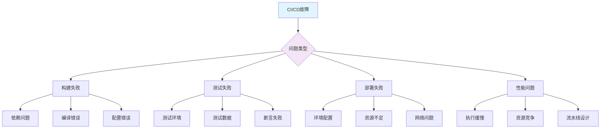

# CI/CD 故障排除与优化指南

## 1. 概述

CI/CD 流水线的稳定性和性能直接影响软件交付效率。本指南提供全面的故障排除方法和性能优化策略，帮助团队快速识别和解决 CI/CD 流程中的问题，同时优化资源使用和提升执行效率。

## 2. 故障排除框架

### 2.1 问题分类与诊断流程


### 2.2 快速诊断清单
```bash
#!/bin/bash
# ci-cd-quick-check.sh

# 1. 检查基础设施状态
echo "=== 基础设施状态 ==="
kubectl get nodes -o wide
docker info | grep -E 'Status|Containers'
aws ec2 describe-instances --query 'Reservations[].Instances[].State.Name' --filters Name=instance-type,Values=t3.medium

# 2. 检查网络连通性
echo "=== 网络连通性 ==="
ping -c 3 github.com
curl -I https://registry.npmjs.org
nc -zv artifact-registry.example.com 443

# 3. 检查资源使用情况
echo "=== 资源使用 ==="
free -h
df -h
top -bn1 | head -10

# 4. 检查服务状态
echo "=== 服务状态 ==="
systemctl status docker --no-pager
systemctl status jenkins --no-pager
kubectl get pods --all-namespaces

# 5. 检查日志错误
echo "=== 错误日志 ==="
journalctl -u docker --since "1 hour ago" --no-pager | grep -i error
docker logs ci-agent 2>&1 | tail -20
```

## 3. 常见故障场景

### 3.1 构建失败处理
```bash
#!/bin/bash
# build-failure-troubleshooting.sh

set -e

# 检查依赖问题
echo "检查依赖状态..."
npm ls --depth=0 2>&1 | grep -E "(ERR|missing)" || true
mvn dependency:tree | grep -E "(ERROR|FAILURE)" || true

# 检查缓存一致性
echo "清理缓存..."
npm cache verify
mvn dependency:purge-local-repository

# 检查环境变量
echo "环境变量检查..."
env | grep -E "(NODE|JAVA|MAVEN|PATH)" | sort

# 检查磁盘空间
echo "磁盘空间检查..."
df -h . | awk '{print $4 " free on " $1}'

# 重试构建
echo "重试构建..."
if [[ "$RETRY_COUNT" -lt 3 ]]; then
  echo "第$((RETRY_COUNT+1))次重试..."
  export RETRY_COUNT=$((RETRY_COUNT+1))
  exec "$0" "$@"
fi

# 最终失败处理
echo "构建失败，请检查以上输出"
exit 1
```

### 3.2 测试失败诊断
```yaml
# test-failure-diagnosis.yaml
diagnosis_steps:
  - name: 检查测试环境
    actions:
      - 验证测试数据库连接
      - 检查测试数据完整性
      - 确认环境变量配置
    
  - name: 分析测试结果
    actions:
      - 查看测试报告详情
      - 识别失败测试模式
      - 检查断言准确性
    
  - name: 隔离问题
    actions:
      - 单独运行失败测试
      - 使用调试模式执行
      - 检查测试依赖关系
    
  - name: 修复验证
    actions:
      - 本地复现问题
      - 修复代码或测试
      - 验证修复效果

common_issues:
  - 环境配置不一致
  - 测试数据污染
  - 竞态条件
  - 时间敏感性测试
  - 资源泄漏
```

### 3.3 部署故障处理
```bash
#!/bin/bash
# deployment-troubleshooting.sh

# 检查目标环境状态
echo "检查Kubernetes集群状态..."
kubectl cluster-info
kubectl get nodes

# 检查资源可用性
echo "检查资源配额..."
kubectl describe quota
kubectl get pods -n kube-system

# 检查网络策略
echo "检查网络连通性..."
kubectl run test-pod --rm -it --image=busybox -- sh -c "nslookup kubernetes.default && wget -O- http://google.com"

# 检查镜像可用性
echo "检查镜像拉取..."
kubectl describe pod ${POD_NAME} | grep -A 10 Events
docker pull ${IMAGE_NAME} || skopeo inspect docker://${IMAGE_NAME}

# 回滚策略
if [[ "$DEPLOYMENT_FAILED" == "true" ]]; then
  echo "执行回滚..."
  kubectl rollout undo deployment/${APP_NAME}
  kubectl rollout status deployment/${APP_NAME}
fi
```

## 4. 性能优化策略

### 4.1 构建阶段优化
```yaml
# build-optimization.yaml
optimization_strategies:
  caching:
    dependency_cache:
      enabled: true
      paths:
        - ~/.m2/repository
        - ~/.npm
        - ~/.cache/pip
      strategy: "pull-push"
    
    build_cache:
      enabled: true
      key: "$CI_COMMIT_SHA"
      paths:
        - target/classes
        - build/
        - dist/
    
  parallelization:
    test_parallelization:
      enabled: true
      workers: 4
      split_strategy: "timing"
    
    build_stages:
      enabled: true
      stages:
        - compile
        - test
        - package
      parallel_stages: [test_unit, test_integration]
    
  resource_optimization:
    memory_limits: "4Gi"
    cpu_limits: "2"
    disk_space: "20Gi"
    
  tool_optimization:
    gradle_daemon: true
    maven_parallel: true
    npm_cache: true
```

### 4.2 流水线优化配置
```yaml
# pipeline-optimization.yaml
pipeline:
  structure:
    stages:
      - pre_build:
          timeout: 300s
          conditions: "always"
      
      - build:
          timeout: 1800s
          dependencies: [pre_build]
      
      - test:
          timeout: 2700s
          parallel: true
      
      - deploy:
          timeout: 900s
          manual_approval: true
    
  optimization:
    skip_redundant_builds:
      enabled: true
      conditions: "changes_in(['src/**', 'pom.xml', 'package.json'])"
    
    incremental_builds:
      enabled: true
      cache_strategy: "content-based"
    
    resource_allocation:
      build_agents: "auto-scaling"
      storage: "ephemeral-ssd"
      network: "high-bandwidth"
    
  monitoring:
    performance_metrics:
      - build_duration
      - test_coverage
      - deployment_frequency
      - failure_rate
    
    alerting:
      slow_builds: "> 30min"
      high_failure_rate: "> 10%"
      resource_exhaustion: "memory > 90%"
```

## 5. 资源管理

### 5.1 资源配额与限制
```yaml
# resource-management.yaml
resources:
  quotas:
    per_project:
      cpu: "20"
      memory: "40Gi"
      pods: "100"
      storage: "100Gi"
    
    per_user:
      cpu: "4"
      memory: "8Gi"
      pods: "20"
    
  limits:
    build_containers:
      cpu: "2"
      memory: "4Gi"
      ephemeral_storage: "20Gi"
    
    test_containers:
      cpu: "1"
      memory: "2Gi"
    
  requests:
    guaranteed_resources:
      cpu: "0.5"
      memory: "1Gi"
    
  autoscaling:
    scale_up:
      cpu_utilization: "70%"
      memory_utilization: "80%"
      queue_length: "50"
    
    scale_down:
      delay: "300s"
      utilization: "30%"
```

### 5.2 成本优化策略
```bash
#!/bin/bash
# cost-optimization.sh

# 识别资源浪费
echo "分析资源使用情况..."
kubectl top pods --all-namespaces | sort -k3 -n -r | head -10
kubectl get pods --all-namespaces -o json | jq '.items[] | select(.status.phase == "Running") | .metadata.name' | wc -l

# 优化构建节点
echo "调整构建节点配置..."
NODE_TYPE=$(aws ec2 describe-instances --instance-ids i-123456 | jq -r '.Reservations[].Instances[].InstanceType')
if [[ "$NODE_TYPE" == "m5.large" ]]; then
  echo "考虑降级到 t3.medium 用于开发环境"
fi

# 清理过期资源
echo "清理过期资源..."
docker system prune -af --volumes
kubectl delete pods --field-selector=status.phase==Succeeded --all-namespaces
aws s3 ls s3://my-artifacts/ | grep "2023-" | awk '{print $4}' | xargs -I {} aws s3 rm s3://my-artifacts/{}

# 使用 spot 实例
echo "配置 spot 实例..."
if [[ "$ENVIRONMENT" == "dev" ]]; then
  export INSTANCE_MARKET_TYPE="spot"
  export SPOT_MAX_PRICE="0.05"
fi
```

## 6. 监控与告警

### 6.1 关键监控指标
```yaml
# monitoring-metrics.yaml
metrics:
  performance:
    - name: pipeline_duration_seconds
      description: "流水线执行总时长"
      threshold: 3600
      severity: warning
    
    - name: build_duration_seconds
      description: "构建阶段时长"
      threshold: 1800
      severity: warning
    
    - name: test_duration_seconds
      description: "测试阶段时长"
      threshold: 2700
      severity: warning
    
  reliability:
    - name: success_rate
      description: "流水线成功率"
      threshold: 0.95
      severity: critical
    
    - name: failure_rate
      description: "流水线失败率"
      threshold: 0.05
      severity: critical
    
    - name: flaky_test_rate
      description: "不稳定测试比例"
      threshold: 0.1
      severity: warning
    
  resource_usage:
    - name: cpu_utilization
      description: "CPU 使用率"
      threshold: 0.8
      severity: warning
    
    - name: memory_utilization
      description: "内存使用率"
      threshold: 0.9
      severity: critical
    
    - name: disk_utilization
      description: "磁盘使用率"
      threshold: 0.85
      severity: warning
```

### 6.2 告警配置
```yaml
# alerting-config.yaml
alerts:
  immediate:
    - name: pipeline_failure
      condition: "pipeline_status == 'failed'"
      severity: critical
      channels: [slack, pagerduty]
      timeout: "5m"
    
    - name: high_cpu_usage
      condition: "cpu_utilization > 90%"
      severity: warning
      channels: [slack]
      timeout: "15m"
    
  delayed:
    - name: slow_builds
      condition: "build_duration > 1800"
      severity: warning
      channels: [email]
      delay: "30m"
    
    - name: low_success_rate
      condition: "success_rate < 0.9 for 1h"
      severity: critical
      channels: [slack, pagerduty]
      delay: "1h"
    
  scheduled:
    - name: weekly_performance_report
      schedule: "0 9 * * 1"  # 每周一9点
      channels: [email]
      metrics: [success_rate, pipeline_duration, resource_usage]
```

## 7. 日志分析

### 7.1 日志收集与分析
```bash
#!/bin/bash
# log-analysis.sh

# 收集最近错误日志
echo "收集错误日志..."
journalctl -u docker --since "24 hours ago" --no-pager | grep -i error > docker_errors.log
kubectl logs --all-containers=true --all-namespaces --since=24h | grep -E "(ERROR|Error|Exception)" > k8s_errors.log

# 分析构建日志模式
echo "分析构建失败模式..."
FAILED_BUILDS=$(find . -name "build.log" -exec grep -l "FAILURE" {} \;)
for build in $FAILED_BUILDS; do
  echo "分析失败构建: $build"
  grep -A 5 -B 5 "ERROR" "$build" | head -20
  echo "---"
done

# 性能日志分析
echo "分析性能瓶颈..."
grep "real" build_times.log | awk '{print $2}' | sort -n | tail -5
grep "CPU usage" resource_usage.log | awk '{if($3>80) print $0}'

# 生成报告
echo "生成诊断报告..."
{
  echo "CI/CD 系统诊断报告"
  echo "生成时间: $(date)"
  echo "=== 错误统计 ==="
  echo "Docker 错误: $(wc -l docker_errors.log | awk '{print $1}')"
  echo "K8s 错误: $(wc -l k8s_errors.log | awk '{print $1}')"
  echo "构建失败: $(echo "$FAILED_BUILDS" | wc -l)"
  echo "=== 性能指标 ==="
  echo "平均构建时间: $(awk '{sum+=$2; count++} END {print sum/count}' build_times.log)"
} > diagnostic_report.txt
```

### 7.2 日志查询模式
```sql
-- 常用日志查询模式
-- 查找最近一小时的错误
SELECT timestamp, level, message 
FROM logs 
WHERE level = 'ERROR' 
AND timestamp >= NOW() - INTERVAL '1 hour'
ORDER BY timestamp DESC;

-- 统计各阶段耗时
SELECT 
  pipeline_stage,
  AVG(duration_seconds) as avg_duration,
  MAX(duration_seconds) as max_duration,
  COUNT(*) as execution_count
FROM pipeline_metrics 
WHERE date = CURRENT_DATE
GROUP BY pipeline_stage;

-- 识别频繁失败的任务
SELECT 
  task_name,
  COUNT(*) as failure_count,
  AVG(retry_count) as avg_retries
FROM task_failures 
WHERE failure_time >= NOW() - INTERVAL '7 days'
GROUP BY task_name 
HAVING failure_count > 5
ORDER BY failure_count DESC;

-- 资源使用趋势分析
SELECT 
  date_trunc('hour', timestamp) as hour,
  AVG(cpu_usage) as avg_cpu,
  AVG(memory_usage) as avg_memory
FROM resource_metrics 
WHERE timestamp >= NOW() - INTERVAL '24 hours'
GROUP BY hour
ORDER BY hour;
```

## 8. 自动化修复

### 8.1 自愈机制
```yaml
# self-healing.yaml
self_healing_rules:
  - name: restart_failed_pod
    condition: "pod_status == 'Failed'"
    action: "kubectl delete pod {{ .Name }}"
    retry_limit: 3
    cooldown: "5m"
  
  - name: cleanup_disk_space
    condition: "disk_usage > 90%"
    action: "docker system prune -af && rm -rf /tmp/*"
    threshold: "85%"
    frequency: "1h"
  
  - name: restart_hung_process
    condition: "process_cpu > 95% for 5m"
    action: "systemctl restart {{ .Service }}"
    monitoring: "process_metrics"
  
  - name: scale_up_on_queue
    condition: "pending_tasks > 50"
    action: "kubectl scale deployment/worker --replicas=+2"
    scale_down: "pending_tasks < 10"
  
automated_recovery:
  build_failures:
    - action: "retry_build"
      conditions: "exit_code == 137"  # OOM
      parameters: "memory_limit=+2Gi"
    
    - action: "retry_with_cache_clean"
      conditions: "exit_code == 1 && log_contains('checksum')"
      parameters: "clean_cache=true"
  
  test_flakiness:
    - action: "retry_test"
      conditions: "test_status == 'flaky'"
      max_retries: 2
      backoff: "exponential"
  
  deployment_issues:
    - action: "rollback_deployment"
      conditions: "deployment_status == 'Failed' && health_check_failed"
      rollback_to: "previous_version"
```

### 8.2 预防性维护
```bash
#!/bin/bash
# preventive-maintenance.sh

# 定期清理任务
echo "执行预防性维护..."

# 清理 Docker 资源
docker system prune -af --volumes
docker image prune -a --filter "until=24h"

# 清理 Kubernetes 资源
kubectl delete pods --field-selector=status.phase==Succeeded --all-namespaces
kubectl delete jobs --field-selector=status.successful==1 --all-namespaces

# 清理日志文件
find /var/log -name "*.log" -type f -mtime +7 -delete
journalctl --vacuum-time=7d

# 更新基础镜像
docker pull alpine:latest
docker pull node:18-alpine
docker pull python:3.9-slim

# 检查证书过期
openssl x509 -in /etc/ssl/certs/ca-certificates.crt -noout -dates
kubeadm certs check-expiration

# 验证备份完整性
aws s3 ls s3://backup-bucket/ | grep "$(date +%Y-%m-%d)"
pg_dumpall | gzip > backup.sql.gz

echo "预防性维护完成"
```

## 9. 最佳实践总结

### 9.1 故障预防策略
```yaml
# prevention-strategies.yaml
prevention:
  design:
    - idempotent_operations: true
    - graceful_degradation: true
    - circuit_breakers: true
    
  testing:
    - chaos_engineering: true
    - failure_injection: true
    - load_testing: true
    
  deployment:
    - blue_green_deployment: true
    - canary_releases: true
    - automated_rollbacks: true
    
  monitoring:
    - synthetic_monitoring: true
    - real_user_monitoring: true
    - business_metrics: true
    
  documentation:
    - runbooks: true
    - playbooks: true
    - postmortems: true
```

### 9.2 持续改进流程
```yaml
# continuous-improvement.yaml
improvement_cycle:
  measure:
    - collect_metrics: true
    - analyze_trends: true
    - identify_bottlenecks: true
  
  analyze:
    - root_cause_analysis: true
    - cost_benefit_analysis: true
    - impact_assessment: true
  
  improve:
    - implement_solutions: true
    - test_effectiveness: true
    - document_changes: true
  
  control:
    - monitor_results: true
    - adjust_parameters: true
    - standardize_processes: true

key_metrics_tracking:
  - deployment_frequency: "daily"
  - lead_time_for_changes: "weekly"
  - mean_time_to_recovery: "weekly"
  - change_failure_rate: "monthly"
  - reliability_score: "monthly"
```