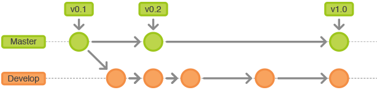
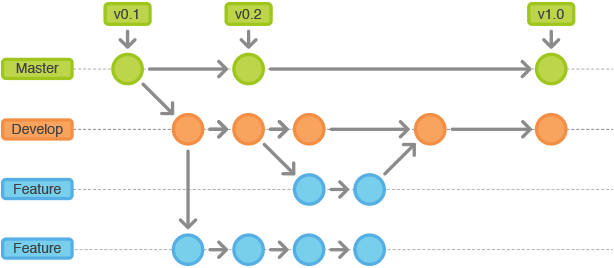
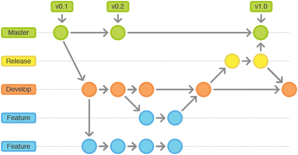
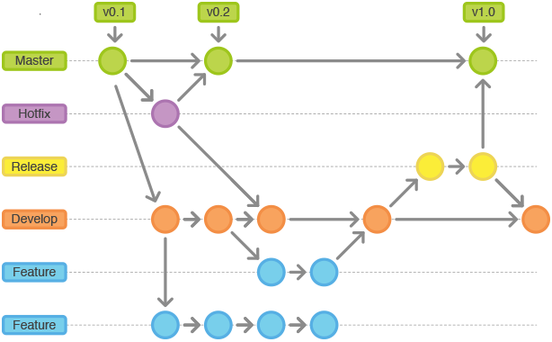
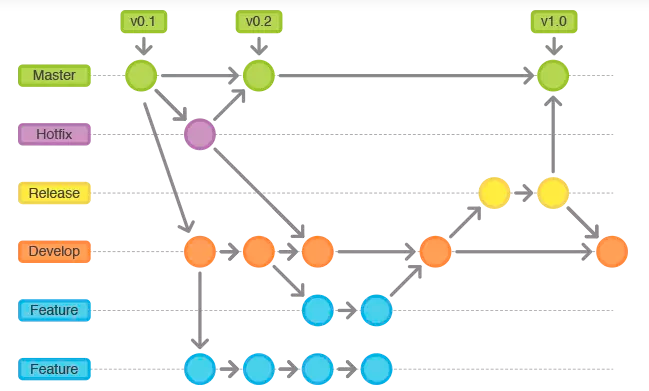

# GitFlow 工作流文档

## 概述

GitFlow 是一种基于 Git 的分支管理工作流，由 Vincent Driessen 提出。它通过定义严格的分支模型和清晰的分支角色，为团队协作和版本发布提供了高效的管理方式。本文档将介绍 GitFlow 的核心概念、分支角色、工作流程及常用命令。

## 分支角色

在 GitFlow 中，分支被划分为不同的角色，每个角色有特定的用途和生命周期。

### 主分支（Master）

主分支用于存储稳定的、可发布的代码版本。每次发布新版本时，都会在主分支上打上标签（如 v1.0, v2.0）。


### 开发分支（Develop）

开发分支是集成所有功能开发的主线分支。所有新功能开发都基于该分支进行，并最终合并回该分支。



### 功能分支（Feature）

功能分支用于开发新功能，通常从开发分支派生，开发完成后合并回开发分支。



### 发布分支（Release）

发布分支用于准备新的生产版本。它允许进行最后的调整和小修复，而不影响开发分支的进展。



### 热修复分支（Hotfix）

热修复分支用于快速修复生产环境中的紧急问题，从主分支派生，修复后直接合并回主分支和开发分支。



## 工作流程

### 初始化 GitFlow

使用以下命令初始化 GitFlow：

```bash
git flow init
```

### 功能开发流程

1. 开始新功能开发：
   ```bash
   git flow feature start <feature-name>
   ```

2. 完成功能开发：
   ```bash
   git flow feature finish <feature-name>
   ```


### 发布流程

1. 开始发布：
   ```bash
   git flow release start <release-version>
   ```

2. 完成发布：
   ```bash
   git flow release finish <release-version>
   ```

### 热修复流程

1. 开始热修复：
   ```bash
   git flow hotfix start <hotfix-version>
   ```

2. 完成热修复：
   ```bash
   git flow hotfix finish <hotfix-version>
   ```


## 命令行参考

GitFlow 提供了一系列命令行工具来简化分支管理：

```bash
git flow init          # 初始化 GitFlow
git flow feature       # 功能分支操作
git flow release       # 发布分支操作
git flow hotfix        # 热修复分支操作
git flow <command> help # 查看具体命令帮助
```


## 分支关系图

GitFlow 的分支关系可以通过以下示意图来理解：




## 最佳实践

1. **保持主分支稳定**：主分支应始终包含可部署的代码
2. **定期合并**：定期将开发分支合并到功能分支，避免大的合并冲突
3. **使用标签**：每次发布时在主分支上打上版本标签
4. **及时清理**：完成的功能分支和发布分支应及时删除

## 总结

GitFlow 提供了一个结构化的分支管理方案，特别适合有定期发布需求的团队。虽然它增加了分支管理的复杂性，但为团队协作和版本控制提供了清晰的规范和流程。


