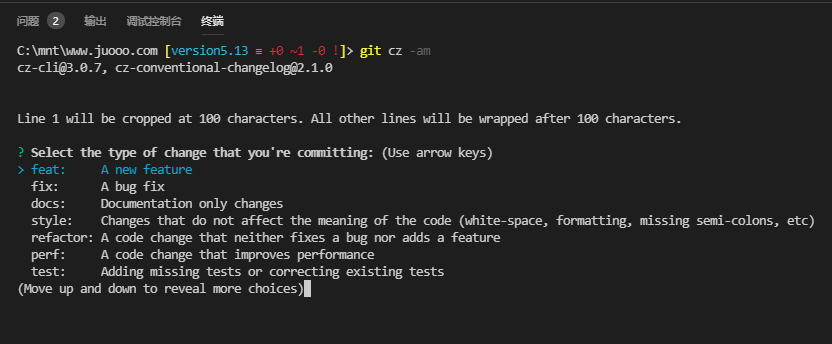

# Commitizen

仓库代码：[https://www.npmjs.com/package/commitizen](https://www.npmjs.com/package/commitizen)

前置环境条件要求

> NPM 5.2+

1、全局安装commitizen,cz-conventional-changelog

```shell
npm install -g commitizen
npm install -g cz-conventional-changelog
```

2、创建.czrc文件在当前用户的主目录（home）

```shell
echo '{ "path": "cz-conventional-changelog" }' > ~/.czrc
```

3、使用方法：在`git commit`命令替换为`git cz`即可

4、使用截图

