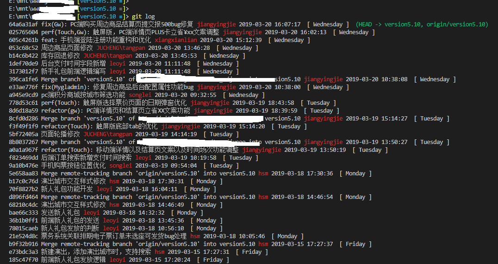

# Git 格式化配置

## 概述

Git 提供了强大的格式化功能，允许用户自定义 `git log`、`git show` 和 `git whatchanged` 等命令的输出格式。通过配置格式化选项，可以美化输出、提高可读性，并突出显示关键信息。

> 影响 git-log, git-show, git-whatchanged 默认格式化  
> 了解更多请查看 `git log --help`，`git config --help`

## 基础配置方法

### 永久性配置

```bash
# 设置全局格式化配置
git config --global format.pretty "%h %s %Cred%aN %Creset%cd %Cgreen%d"

# 设置当前仓库格式化配置
git config format.pretty "%h %s %Cred%aN %Creset%cd %Cgreen%d"
```

### 临时性使用

```bash
# 单次命令生效
git log --pretty=format:"%h %s %Cred%aN %Creset%cd %Cgreen%d"
git show --pretty=format:"%h %s %Cred%aN %Creset%cd %Cgreen%d"
git whatchanged --pretty=format:"%h %s %Cred%aN %Creset%cd %Cgreen%d"
```

## 格式化占位符详解

| 占位符 | 描述                  | 示例输出              |
|--------|-----------------------|-----------------------|
| `%h`   | 缩写提交哈希          | `6476a61f4`          |
| `%H`   | 完整提交哈希          | `6476a61f4...`       |
| `%s`   | 提交说明              | `feat: 新增登录功能` |
| `%aN`  | 作者姓名              | `tangfang`           |
| `%ae`  | 作者邮箱              | `user@example.com`   |
| `%cd`  | 提交日期              | `2019-03-20 16:02:13`|
| `%d`   | 引用名称（分支/标签） | `(HEAD -> main)`     |
| `%cn`  | 提交者姓名            | `JUCHENG`            |

## 颜色控制符

| 颜色代码      | 描述         |
|---------------|--------------|
| `%Creset`     | 重置颜色     |
| `%Cred`       | 红色         |
| `%Cgreen`     | 绿色         |
| `%Cblue`      | 蓝色         |
| `%Cyellow`    | 黄色         |
| `%Cmagenta`   | 洋红色       |
| `%Ccyan`      | 青色         |

## 实用格式化示例

### 1. 基础美化格式

```bash
git log --pretty=format:"%C(yellow)%h %Creset%s %Cgreen(%cr) %C(bold blue)<%aN>%Creset"
```

### 2. 详细输出格式

```bash
git log --pretty=format:"%h - %an, %ar : %s" --graph
```

### 3. 带分支信息的格式

```bash
git log --pretty=format:"%C(auto)%h %d %s %Cgreen(%cr) %C(bold blue)<%aN>%Creset"
```

### 4. 时间线格式

```bash
git log --pretty=format:"%ad | %h | %aN | %s" --date=short
```

## 高级配置技巧

### 别名配置

在 `~/.gitconfig` 中添加别名：

```ini
[alias]
    lg = log --pretty=format:'%C(yellow)%h %Creset%s %Cgreen(%cr) %C(bold blue)<%aN>%Creset' --graph
    hist = log --pretty=format:'%h %ad | %s%d [%an]' --graph --date=short
    prettylog = log --graph --oneline --decorate --all
```

### 日期格式定制

```bash
# 使用相对时间
git log --pretty=format:"%h %s %aN %ar"

# 使用自定义日期格式
git log --pretty=format:"%h %s %aN %ad" --date=format:'%Y-%m-%d %H:%M:%S'
```

## 效果展示

使用自定义格式化配置后，`git log` 输出效果如下：



如图中所示，配置后的输出格式具有以下特点：

- **提交哈希**：以黄色高亮显示，便于快速识别
- **提交信息**：白色显示，清晰展示修改内容
- **作者信息**：包含提交者姓名和邮箱地址
- **时间戳**：显示完整的提交日期和时间
- **版本信息**：包含版本号和功能说明

## 常用组合命令

### 查看最近提交

```bash
git log -n 10 --pretty=format:"%h %s %aN %ad" --date=short
```

### 按作者筛选

```bash
git log --author="tangfang" --pretty=format:"%h %s %ad"
```

### 时间范围查询

```bash
git log --since="2019-03-18" --until="2019-03-20" --pretty=format:"%h %s %aN %ad"
```

## 最佳实践

1. **统一团队格式**：在项目中共享 `.gitconfig` 格式化配置
2. **使用别名**：为常用格式创建别名提高效率
3. **颜色搭配**：合理使用颜色提高可读性但避免过度花哨
4. **信息适量**：包含必要信息但保持输出简洁

## 故障排除

如果颜色不显示，检查 Git 配置：

```bash
# 启用颜色输出
git config --global color.ui auto

# 检查当前配置
git config --get color.ui
```

通过合理配置 Git 格式化选项，可以显著提高代码审查和版本历史查看的效率。