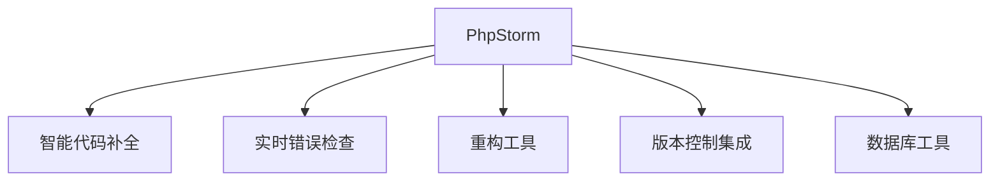

# PHP开发IDE工具全景指南

PHP作为广泛使用的服务器端脚本语言，拥有丰富的集成开发环境(IDE)选择。以下是专业PHP开发者常用的IDE工具及其核心特性分析：

## 1. 主流PHP IDE对比

### 功能矩阵比较

| IDE | 调试器 | 代码分析 | 框架支持 | 数据库工具 | 远程开发 | 价格 |
|------|--------|----------|----------|------------|----------|------|
| PhpStorm | 强大 | 高级 | Laravel/Symfony等 | 集成 | 支持 | $199/年 |
| VS Code | 插件 | 基础 | 需插件 | 插件 | 优秀 | 免费 |
| NetBeans | 内置 | 中等 | 部分 | 内置 | 有限 | 免费 |
| Eclipse PDT | 需配置 | 基础 | 有限 | 插件 | 需插件 | 免费 |
| Zend Studio | 专业 | 高级 | Zend/Laminas | 集成 | 支持 | $189/年 |

## 2. PhpStorm (JetBrains)

### 核心优势



### 特色功能

- **代码质量分析**：
  ```php
  // 自动检测问题示例
  function calculate($a, $b) {
      return $a + $b;
      // PhpStorm会警告未使用的$b参数
  }
  ```

- **框架支持**：
  - Laravel：路由自动补全、Artisan命令集成
  - Symfony：服务容器导航、YAML支持
  - WordPress：钩子函数提示、模板分析

### 调试配置示例

```xml
<!-- PHP Remote Debug配置 -->
<component name="PhpRemoteDebugConfiguration">
    <option name="host" value="127.0.0.1" />
    <option name="port" value="9003" />
    <option name="ideKey" value="PHPSTORM" />
</component>
```

## 3. Visual Studio Code + PHP插件

### 推荐插件组合

| 插件 | 功能 | 安装量 |
|------|------|--------|
| PHP Intelephense | 代码智能感知 | 10M+ |
| PHP Debug | XDebug集成 | 5M+ |
| Laravel Artisan | Artisan命令 | 2M+ |
| PHP Namespace Resolver | 命名空间处理 | 1M+ |

### 配置示例

```json
// settings.json
{
    "php.validate.executablePath": "/usr/bin/php",
    "php.executablePath": "/usr/bin/php",
    "intelephense.environment.phpVersion": "8.1",
    "intelephense.files.maxSize": 5000000
}
```

## 4. NetBeans for PHP

### 特色功能

- **PHPUnit集成**：
  ```php
  // 测试类右键可直接运行
  class CalculatorTest extends \PHPUnit\Framework\TestCase {
      public function testAdd() {
          $this->assertEquals(4, 2+2);
      }
  }
  ```

- **可视化调试**：
  ```
  变量监视窗口 → 调用堆栈视图 → 
  步进调试控制(Step Into/Over/Out)
  ```

### 项目结构支持

```
PHP Application
├─ Source Files
├─ Test Files
├─ Include Path
└─ Database Connections
```

## 5. Eclipse PDT

### 配置流程

1. 安装PHP Development Tools (PDT)
2. 配置PHP解释器路径
3. 设置项目PHP版本
4. 可选安装：
   - XDebug插件
   - Git集成
   - Symfony插件

### 代码模板示例

```xml
<!-- 代码模板定义 -->
<template name="php_getter" description="PHP Getter Method" context="php" enabled="true">
public function get${property}() {
    return $this-&gt;${property};
}
</template>
```

## 6. Zend Studio

### 企业级特性

- **Zend Debugger**：高性能调试工具
- **Server集成**：Zend Server监控
- **Docker支持**：容器化开发环境
- **性能分析**：Z-Ray集成

### 性能分析示例

```php
// 标记性能分析点
zend_monitor_custom_event('Checkout Process', 'Start');

// 业务代码...
zend_monitor_custom_event('Checkout Process', 'End');
```

## 7. 云端开发环境

### 云IDE选择

| 平台 | PHP支持 | 协作功能 | 集成环境 |
|------|---------|----------|----------|
| Gitpod | 完善 | 实时共享 | Docker-based |
| GitHub Codespaces | 支持 | PR集成 | 容器化 |
| PHPFog | 专业 | 团队协作 | 优化栈 |

### Gitpod配置示例

```yaml
# .gitpod.yml
image:
  file: .gitpod.Dockerfile

tasks:
  - init: composer install
    command: php -S 0.0.0.0:8000
```

## 8. 轻量级编辑器选项

### 快速开发工具

- **Sublime Text** + PHP插件：
  - PHPCompanion
  - SublimeLinter-php

- **Atom** + 插件包：
  - atom-ide-php
  - php-cs-fixer

- **Nova** (macOS专属)：
  - 原生PHP支持
  - 内置调试

## 9. 调试工具链

### XDebug配置

```ini
; php.ini 配置
[xdebug]
zend_extension=xdebug.so
xdebug.mode=debug
xdebug.client_host=127.0.0.1
xdebug.client_port=9003
xdebug.start_with_request=trigger
xdebug.idekey=PHPSTORM
```

### 调试工作流

```
设置断点 → 启动监听 → 
触发请求 → 步进调试 → 
变量检查 → 问题修复
```

## 10. 选择建议

### 项目规模匹配

| 项目类型 | 推荐工具 | 理由 |
|----------|----------|------|
| 企业级应用 | PhpStorm/Zend Studio | 完整工具链 |
| 中小项目 | VS Code/NetBeans | 轻量高效 |
| 微服务开发 | 云IDE | 环境一致性 |
| 教学/学习 | Sublime Text | 简洁易用 |

### 框架开发推荐

- **Laravel**：PhpStorm + Laravel插件
- **Symfony**：VS Code + Symfony插件
- **WordPress**：VS Code + WordPress代码片段

## 11. 生产力技巧

### 代码生成

```php
// PhpStorm快速生成Getter/Setter
// 输入prop→Tab → 生成属性
// 右键Refactor→Generate
private string $name;

// 自动生成
public function getName(): string {
    return $this->name;
}
```

### 数据库集成

```sql
-- IDE内直接执行查询
SELECT * FROM users 
WHERE created_at > :date 
ORDER BY id DESC
-- 自动参数绑定
```

## 12. 新兴趋势

### AI辅助开发

- **GitHub Copilot**：上下文代码建议
- **Tabnine**：全行代码补全
- **PhpStorm AI Assistant**：代码解释与生成

### 远程开发模式

```
本地IDE ←SSH→ 远程服务器
  ↑
Docker容器开发环境
```

PHP开发工具正向着智能化、云原生化方向发展。专业开发者建议掌握：
1. 深度调试技巧（XDebug配置）
2. 框架专用工具链（如Laravel Artisan集成）
3. 性能分析工具（Blackfire/Z-Ray）
4. 团队协作功能（Live Share/VCS集成）

根据2023年PHP开发者调查报告，PhpStorm以58%的使用率位居首位，VS Code以32%的占比快速增长。选择工具时应考虑项目需求、团队协作和个人工作习惯的平衡。