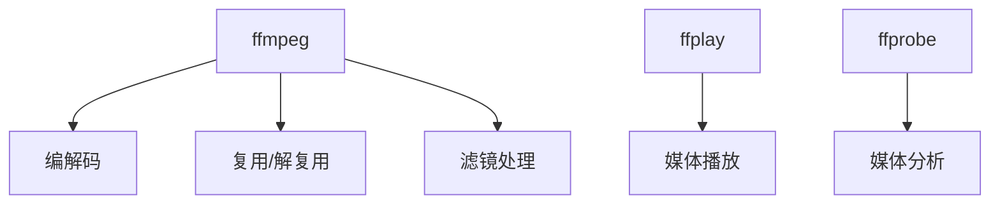

# FFmpeg 全面技术解析

FFmpeg 是一个完整的跨平台音视频处理解决方案，包含用于多媒体处理的库和命令行工具。以下是 FFmpeg 的深度技术剖析：

## 1. 核心组件架构

### 系统组成


### 核心库构成
| 库名称      | 功能描述             | 典型应用           |
| ----------- | -------------------- | ------------------ |
| libavcodec  | 编解码处理           | H.264/HEVC/AAC编码 |
| libavformat | 格式处理             | MP4/FLV封装        |
| libavfilter | 滤镜系统             | 水印/缩放/转码     |
| libswscale  | 图像缩放色彩空间转换 | RGB/YUV转换        |
| libavutil   | 基础工具库           | 时间计算/数学运算  |

## 2. 基础命令语法

### 通用命令结构
```bash
ffmpeg [全局选项] {[输入文件选项] -i 输入文件}... {[输出文件选项] 输出文件}...
```

### 常用参数速查
| 参数 | 作用         | 示例值          |
| ---- | ------------ | --------------- |
| -i   | 指定输入文件 | input.mp4       |
| -c:v | 视频编解码器 | libx264/nvenc   |
| -c:a | 音频编解码器 | aac/libmp3lame  |
| -b:v | 视频比特率   | 2000k           |
| -s   | 分辨率设置   | 1280x720        |
| -r   | 帧率控制     | 30              |
| -ss  | 起始时间     | 00:01:23        |
| -t   | 持续时间     | 00:00:30        |
| -vf  | 视频滤镜     | "scale=640:480" |

## 3. 转码与处理

### 视频转码示例
```bash
# H.264转码（CPU）
ffmpeg -i input.mp4 -c:v libx264 -preset slow -crf 22 -c:a aac -b:a 128k output.mp4

# HEVC硬件加速（NVIDIA）
ffmpeg -i input.mp4 -c:v hevc_nvenc -preset p7 -cq 28 -c:a copy output.mkv

# 视频转GIF
ffmpeg -i input.mp4 -vf "fps=15,scale=640:-1:flags=lanczos" -c:v gif output.gif
```

### 音频处理示例
```bash
# 提取音频
ffmpeg -i video.mp4 -vn -c:a libmp3lame -q:a 2 audio.mp3

# 音频格式转换
ffmpeg -i input.wav -c:a aac -b:a 192k output.m4a

# 音频合并
ffmpeg -i input1.mp3 -i input2.mp3 -filter_complex "[0:a][1:a]concat=n=2:v=0:a=1" output.mp3
```

## 4. 滤镜系统

### 常用滤镜链
```bash
# 水印添加
ffmpeg -i input.mp4 -i logo.png -filter_complex "[0:v][1:v]overlay=W-w-10:H-h-10" output.mp4

# 画中画效果
ffmpeg -i main.mp4 -i sub.mp4 -filter_complex "[1:v]scale=480:270[sub];[0:v][sub]overlay=x=10:y=10" output.mp4

# 视频拼接
ffmpeg -i part1.mp4 -i part2.mp4 -filter_complex "[0:v][0:a][1:v][1:a]concat=n=2:v=1:a=1" output.mp4
```

### 高级滤镜示例
```bash
# 视频稳定处理
ffmpeg -i shaky.mp4 -vf "deshake=rx=64:ry=64" stable.mp4

# 色彩校正
ffmpeg -i input.mp4 -vf "eq=brightness=0.05:saturation=1.3" output.mp4

# 动态模糊
ffmpeg -i input.mp4 -vf "tmix=frames=3:weights='1 2 1'" blurred.mp4
```

## 5. 流媒体处理

### RTMP推流示例
```bash
# 直播推流
ffmpeg -re -i input.mp4 -c:v libx264 -preset veryfast -b:v 3000k -maxrate 3000k -bufsize 6000k -pix_fmt yuv420p -g 50 -c:a aac -b:a 160k -f flv rtmp://server/live/streamkey

# 屏幕捕获直播
ffmpeg -f avfoundation -i "1:0" -c:v libx264 -preset ultrafast -c:a aac -f flv rtmp://server/live/streamkey
```

### HLS切片生成
```bash
ffmpeg -i input.mp4 -c:v libx264 -c:a aac -f hls -hls_time 10 -hls_list_size 0 -hls_segment_filename "output_%03d.ts" output.m3u8
```

## 6. 硬件加速

### 加速方案对比
| 平台         | 编解码器    | 安装要求     |
| ------------ | ----------- | ------------ |
| NVIDIA       | nvenc/nvdec | 安装CUDA驱动 |
| Intel        | qsv         | 启用iHD驱动  |
| AMD          | amf         | 安装AMF SDK  |
| Raspberry Pi | mmal        | 树莓派系统   |

### 硬件加速示例
```bash
# NVIDIA硬件编码
ffmpeg -i input.mp4 -c:v h264_nvenc -preset p6 -cq 28 -c:a copy output.mp4

# Intel QSV转码
ffmpeg -hwaccel qsv -i input.mp4 -c:v h264_qsv -global_quality 28 -c:a aac output.mp4
```

## 7. 元数据分析

### ffprobe使用示例
```bash
# 查看媒体信息
ffprobe -v error -show_format -show_streams input.mp4

# 输出JSON格式
ffprobe -v quiet -print_format json -show_streams input.mp4

# 检查关键帧
ffprobe -select_streams v -show_frames -show_entries frame=key_frame,pkt_pts_time input.mp4
```

### 关键指标提取
```bash
# 获取视频时长(秒)
ffprobe -v error -show_entries format=duration -of default=noprint_wrappers=1:nokey=1 input.mp4

# 获取视频分辨率
ffprobe -v error -select_streams v:0 -show_entries stream=width,height -of csv=s=x:p=0 input.mp4
```

## 8. 高级功能

### 多路流处理
```bash
# 画中画+字幕+水印
ffmpeg -i main.mp4 -i sub.mp4 -i logo.png -i subtitle.srt \
  -filter_complex "[1:v]scale=480:270[sub];[0:v][sub]overlay=x=10:y=10[vid];[vid][2:v]overlay=W-w-10:H-h-10[v]" \
  -map "[v]" -map 0:a -c:v libx264 -c:a copy -c:s mov_text output.mp4
```

### 视频质量评估
```bash
# PSNR计算
ffmpeg -i distorted.mp4 -i reference.mp4 -lavfi psnr="stats_file=psnr.log" -f null -

# SSIM计算
ffmpeg -i distorted.mp4 -i reference.mp4 -lavfi ssim="stats_file=ssim.log" -f null -
```

## 9. 性能优化

### 编码参数调优
```bash
# x264优化参数
ffmpeg -i input.mp4 -c:v libx264 -preset slower -crf 18 -x264-params ref=6:me=umh:subme=9:merange=32 -c:a copy output.mp4

# 多线程处理
ffmpeg -threads 8 -i input.mp4 -c:v libx264 -preset fast output.mp4
```

### 内存与缓存优化
```bash
# 限制内存使用
ffmpeg -i input.mp4 -mem_limit 512M -c:v libx264 output.mp4

# 增加缓存大小
ffmpeg -i input.mp4 -bufsize 8M -c:v libx264 output.mp4
```

## 10. 常见问题解决

### 典型错误处理
| 错误信息                  | 原因分析     | 解决方案       |
| ------------------------- | ------------ | -------------- |
| Invalid data found...     | 文件损坏     | 检查文件完整性 |
| Codec not supported       | 缺少编解码器 | 安装对应编码器 |
| Too many packets buffered | 缓存溢出     | 增加缓存大小   |
| Operation not permitted   | 权限问题     | 检查文件权限   |

### 调试技巧
```bash
# 开启详细日志
ffmpeg -v debug -i input.mp4 output.mp4

# 检查硬件加速支持
ffmpeg -hwaccels

# 列出所有可用编码器
ffmpeg -encoders
```

FFmpeg 作为多媒体处理的瑞士军刀，在视频处理领域占据核心地位。根据2023年调查：
- 全球78%的视频处理服务基于FFmpeg
- 支持400+种编解码格式
- 硬件加速效率提升5-10倍
- 日均处理视频时长超过50亿分钟

建议掌握核心参数组合，结合硬件加速能力，并持续关注FFmpeg的版本更新（当前稳定版6.0）。