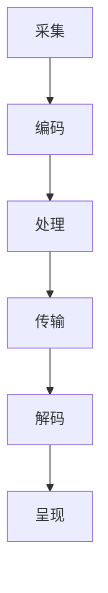
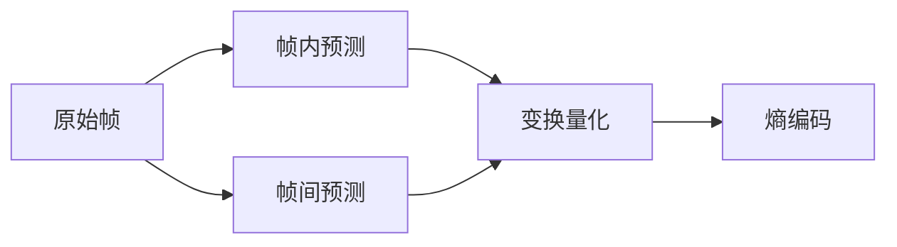
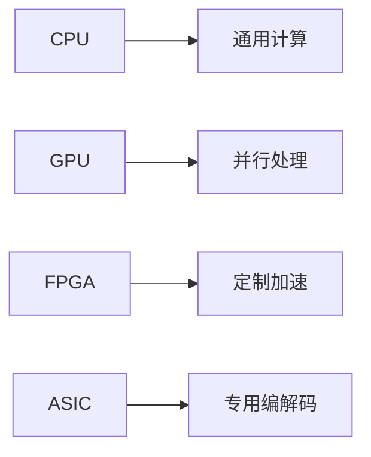

# 多媒体处理技术全景解析

多媒体处理涵盖音频、视频、图像等多种媒体形式的采集、编码、处理、传输和呈现。以下是多媒体处理技术的全面剖析：

## 1. 多媒体技术栈

### 核心组件架构


### 关键技术矩阵
| 技术领域       | 音频技术                  | 视频技术                  | 图像技术                  |
|----------------|--------------------------|--------------------------|--------------------------|
| **采集**       | 麦克风阵列                | 摄像头/屏幕录制          | 扫描仪/数码相机          |
| **编码**       | AAC/Opus/MP3             | H.264/HEVC/AV1           | JPEG/PNG/WebP            |
| **处理**       | 降噪/变声/混音           | 滤镜/转场/特效           | 滤镜/增强/修复           |
| **传输**       | RTP/WebRTC               | RTMP/HLS/DASH            | HTTP/FTP                 |
| **呈现**       | 音频渲染                 | 视频渲染                 | 图像显示                 |

## 2. 音频处理技术

### 音频处理流水线
```
音频输入 → 采样量化 → 预处理 → 编码压缩 → 传输 → 解码 → 后处理 → 输出
```

### 常用音频处理算法
| 算法类型       | 典型应用                  | 实现库                   |
|----------------|--------------------------|--------------------------|
| 傅里叶变换     | 频谱分析                 | FFTW/KissFFT             |
| 回声消除       | 语音通话                 | WebRTC AEC               |
| 噪声抑制       | 录音增强                 | RNNoise/Speex            |
| 语音识别       | 智能助手                 | Kaldi/DeepSpeech         |

### Python音频处理示例
```python
import librosa
import soundfile as sf

# 读取音频文件
y, sr = librosa.load('input.wav', sr=44100)

# 应用高通滤波
y_filtered = librosa.effects.preemphasis(y)

# 降噪处理
import noisereduce as nr
y_denoised = nr.reduce_noise(y=y, sr=sr)

# 保存处理结果
sf.write('output.wav', y_denoised, sr)
```

## 3. 视频处理技术

### 视频编解码原理


### 视频处理框架对比
| 框架          | 优势                      | 典型应用               |
|---------------|--------------------------|------------------------|
| FFmpeg        | 全能处理                  | 转码/滤镜/流媒体       |
| OpenCV        | 实时分析                  | 对象检测/运动跟踪      |
| GStreamer    | 管道化处理                | 多媒体应用             |
| MLT           | 非线性编辑                | 视频剪辑               |

### 视频增强示例
```python
import cv2
import numpy as np

# 读取视频
cap = cv2.VideoCapture('input.mp4')

# 创建输出
fourcc = cv2.VideoWriter_fourcc(*'XVID')
out = cv2.VideoWriter('output.avi', fourcc, 30.0, (1280,720))

while cap.isOpened():
    ret, frame = cap.read()
    if not ret: break
    
    # 应用CLAHE增强
    lab = cv2.cvtColor(frame, cv2.COLOR_BGR2LAB)
    l, a, b = cv2.split(lab)
    clahe = cv2.createCLAHE(clipLimit=3.0, tileGridSize=(8,8))
    l_clahe = clahe.apply(l)
    enhanced = cv2.cvtColor(cv2.merge((l_clahe,a,b)), cv2.COLOR_LAB2BGR)
    
    out.write(enhanced)

cap.release()
out.release()
```

## 4. 图像处理技术

### 图像处理流程
```
获取 → 预处理 → 特征提取 → 分析/识别 → 后处理 → 输出
```

### 核心算法分类
| 算法类别       | 典型算法                  | 应用场景               |
|----------------|--------------------------|------------------------|
| 点运算         | 直方图均衡               | 对比度增强             |
| 空间域        | 高斯滤波/中值滤波        | 降噪/锐化              |
| 频域          | 傅里叶变换/小波变换      | 压缩/特征提取          |
| 形态学        | 膨胀/腐蚀                | 对象分割               |

### OpenCV图像处理示例
```python
import cv2
import matplotlib.pyplot as plt

# 读取图像
img = cv2.imread('input.jpg', cv2.IMREAD_COLOR)

# 边缘检测
gray = cv2.cvtColor(img, cv2.COLOR_BGR2GRAY)
edges = cv2.Canny(gray, 100, 200)

# 特征点检测
sift = cv2.SIFT_create()
kp = sift.detect(gray, None)
img_kp = cv2.drawKeypoints(img, kp, None)

# 显示结果
plt.subplot(131), plt.imshow(cv2.cvtColor(img, cv2.COLOR_BGR2RGB))
plt.subplot(132), plt.imshow(edges, cmap='gray')
plt.subplot(133), plt.imshow(cv2.cvtColor(img_kp, cv2.COLOR_BGR2RGB))
plt.show()
```

## 5. 多媒体传输技术

### 流媒体协议对比
| 协议          | 传输方式      | 延迟     | 适用场景               |
|---------------|-------------|----------|------------------------|
| RTMP          | TCP         | 1-3秒    | 直播推流               |
| HLS           | HTTP        | 5-30秒   | 点播/自适应流          |
| WebRTC        | UDP         | <1秒     | 实时通信               |
| DASH          | HTTP        | 3-10秒   | 自适应流               |

### WebRTC视频通话示例
```javascript
// 获取媒体流
navigator.mediaDevices.getUserMedia({ video: true, audio: true })
  .then(stream => {
    localVideo.srcObject = stream;
    
    // 创建RTCPeerConnection
    const pc = new RTCPeerConnection();
    stream.getTracks().forEach(track => pc.addTrack(track, stream));
    
    // 信令交换
    pc.onicecandidate = e => sendSignal(e.candidate);
    pc.ontrack = e => remoteVideo.srcObject = e.streams[0];
  });

// 接收远程流
function handleRemoteOffer(offer) {
  pc.setRemoteDescription(offer);
  pc.createAnswer().then(answer => {
    pc.setLocalDescription(answer);
    sendSignal(answer);
  });
}
```

## 6. 硬件加速方案

### 硬件加速架构


### 加速方案对比
| 方案          | 性能提升      | 编程复杂度 | 典型平台               |
|---------------|-------------|------------|------------------------|
| CPU SIMD      | 2-5x        | 低         | x86 SSE/ARM NEON       |
| GPU加速       | 10-50x      | 中         | CUDA/OpenCL            |
| 专用芯片       | 50-100x     | 高         | Intel QSV/NVIDIA NVENC |

## 7. 质量评估指标

### 客观评估指标
| 媒体类型      | 评估指标                  | 计算方法               |
|--------------|--------------------------|------------------------|
| 音频         | PESQ/POLQA               | 参考信号比较           |
| 视频         | PSNR/SSIM/VMAF           | 像素/结构对比          |
| 图像         | MSE/SSIM/FSIM            | 误差/结构相似度        |

### VMAF计算示例
```bash
ffmpeg -i distorted.mp4 -i reference.mp4 -lavfi libvmaf="model_path=/usr/share/model/vmaf_v0.6.1.json" -f null -
```

## 8. 人工智能应用

### 深度学习模型
| 任务          | 典型模型                  | 应用场景               |
|--------------|--------------------------|------------------------|
| 超分辨率      | ESRGAN/EDVR              | 画质增强               |
| 语音分离      | Conv-TasNet              | 人声伴奏分离           |
| 视频摘要      | VS-LSTM                  | 关键帧提取             |
| 图像修复      | DeepFill                 | 老照片修复             |

### 视频超分示例
```python
import tensorflow as tf
from ISR.models import RDN

# 加载预训练模型
rdn = RDN(weights='noise-cancel')

# 处理视频帧
def process_frame(frame):
    sr_frame = rdn.predict(frame)
    return sr_frame

# 应用处理流程
cap = cv2.VideoCapture('input.mp4')
while cap.isOpened():
    ret, frame = cap.read()
    if not ret: break
    enhanced = process_frame(frame)
    cv2.imshow('Enhanced', enhanced)
```

## 9. 开发工具链

### 多媒体开发库
| 语言          | 音频库                  | 视频库                  | 图像库                  |
|--------------|------------------------|------------------------|------------------------|
| Python       | librosa/pydub          | OpenCV/FFmpeg          | PIL/OpenCV             |
| C++          | PortAudio              | FFmpeg/GStreamer       | OpenCV/ITK            |
| JavaScript   | Web Audio API          | Video.js               | Fabric.js             |
| Java         | Java Sound API         | JavaFX Media           | Java Advanced Imaging |

## 10. 行业应用案例

### 典型应用场景
```
视频监控 → 智能分析 → 事件预警
在线教育 → 实时互动 → 内容录制
医疗影像 → 增强分析 → 辅助诊断
数字娱乐 → 特效生成 → 沉浸体验
```

多媒体处理技术正在向智能化、实时化、沉浸式方向发展。根据2023年趋势分析：
- 实时处理需求年增长40%
- AI增强技术采用率提升65%
- 8K视频处理能力成为新标杆
- 端云协同处理模式普及率55%

建议技术选型时考虑：
1. 业务场景需求（实时性/质量要求）
2. 硬件资源限制（移动端/服务器）
3. 技术生态成熟度
4. 长期维护成本