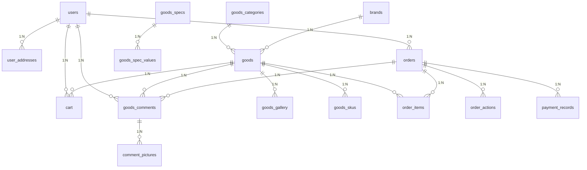
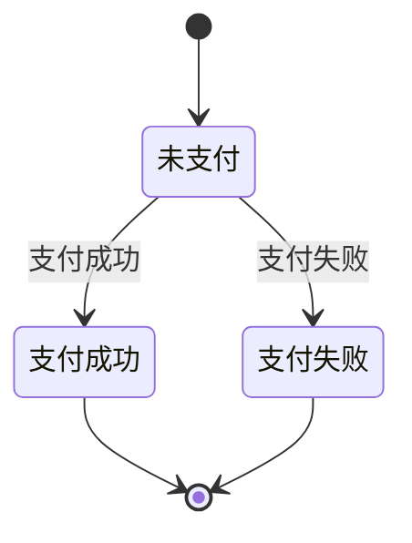

# 电商系统数据库设计文档

## 1. 数据库设计概述

本电商系统数据库设计包含16个核心表，涵盖用户管理、商品管理、订单管理、支付管理和评价管理等主要业务模块。数据库采用关系型设计，遵循第三范式(3NF)原则，确保数据的一致性和完整性。

### 1.1 设计原则

1. **规范化设计**：遵循数据库设计三范式
2. **性能优化**：合理设置索引和分区
3. **数据完整性**：使用外键约束和触发器
4. **可扩展性**：考虑未来业务扩展需求

### 1.2 实体关系图(ERD)

## 2. 核心表结构详解

### 2.1 用户模块

#### 2.1.1 用户表(users)

存储系统用户基本信息，采用密码哈希和盐值存储密码，确保安全性。

**关键字段说明**：
- `password_hash`：使用PBKDF2算法生成的密码哈希值
- `salt`：随机生成的密码盐值
- `status`：用户状态，用于账户禁用功能

**密码哈希计算公式**：
$$password\_hash = PBKDF2(password, salt, iterations, key\_length)$$

#### 2.1.2 用户地址表(user_addresses)

存储用户收货地址信息，支持设置默认地址。

**索引设计**：
- `idx_user_id`：加速用户地址查询
- `idx_is_default`：优化默认地址查询

### 2.2 商品模块

#### 2.2.1 商品分类表(goods_categories)

采用树形结构存储商品分类，支持多级分类。

**分类层级计算**：
$$category\_level = parent\_level + 1$$

#### 2.2.2 商品表(goods)

存储商品基本信息，支持多种商品状态标记。

**库存预警公式**：
$$stock\_alert = stock < warn\_stock$$

#### 2.2.3 商品SKU表(goods_skus)

使用JSON格式存储规格组合，支持灵活的商品变体管理。

**SKU价格计算公式**：
$$profit = price - cost\_price$$

### 2.3 订单模块

#### 2.3.1 订单表(orders)

存储订单主信息，包含完整的状态跟踪。

**订单金额计算公式**：
$$order\_amount = total\_amount + shipping\_fee - discount\_fee - coupon\_fee - integral\_fee + tax\_fee + service\_fee - platform\_discount$$

#### 2.3.2 订单商品表(order_items)

记录订单中的商品明细，支持退款和促销活动关联。

### 2.4 支付模块

#### 2.4.1 支付记录表(payment_records)

记录支付流水，支持多种支付方式。

**支付状态机**：

## 3. 性能优化建议

1. **索引策略**：
   - 为所有外键字段创建索引
   - 为高频查询条件创建组合索引
   - 考虑使用覆盖索引优化特定查询

2. **分区策略**：
   - 订单表可按创建时间范围分区
   - 商品评价表可按商品ID哈希分区

3. **缓存策略**：
   - 商品详情使用Redis缓存
   - 购物车数据可同时持久化和缓存

4. **查询优化**：
   - 复杂报表使用物化视图
   - 大数据量查询使用分页

## 4. 数据安全措施

1. **敏感数据加密**：
   - 用户密码使用PBKDF2算法加密
   - 支付信息使用AES加密存储

2. **数据访问控制**：
   - 实现行级安全策略
   - 敏感操作记录审计日志

3. **备份策略**：
   - 每日全量备份+增量备份
   - 异地灾备方案

## 5. 扩展性设计

1. **分库分表方案**：
   - 用户数据按用户ID哈希分片
   - 订单数据按时间范围分片

2. **读写分离**：
   - 主库负责写操作
   - 从库负责读操作

3. **NoSQL补充**：
   - 商品搜索使用Elasticsearch
   - 用户行为数据使用MongoDB

## 6. 数据库维护建议

1. **定期维护任务**：
   - 每周执行ANALYZE TABLE更新统计信息
   - 每月优化碎片化严重的表

2. **监控指标**：
   - 查询响应时间
   - 连接池使用率
   - 锁等待时间

3. **容量规划**：
   - 预估3年数据增长量
   - 预留30%的存储空间

该数据库设计支持电商系统核心业务流程，具有良好的性能、安全性和扩展性，能够满足高并发场景下的业务需求。

## 相关拓展

> [Laravel框架MySQL调优](/person/编程语言/PHP/Laravel框架MySQL调优.md)
> 
> [Laravel多级缓存案例](/person/编程语言/PHP/Laravel多级缓存案例.md)

> [ThinkPHP框架MySQL调优](/person/编程语言/PHP/ThinkPHP框架MySQL调优.md)
> 
> [ThinkPHP多级缓存案例](/person/编程语言/PHP/ThinkPHP多级缓存案例.md)