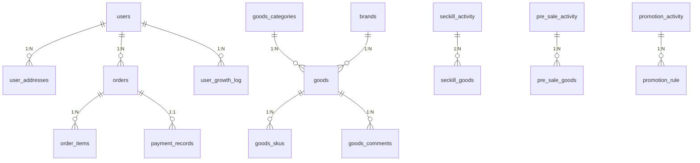

# 完整版电商数据库设计

## 一、基础表结构（16张表）

### 1. 用户表(users)
```sql
CREATE TABLE `users` (
  `id` bigint NOT NULL AUTO_INCREMENT COMMENT '用户ID',
  `username` varchar(50) NOT NULL COMMENT '用户名',
  `nickname` varchar(50) DEFAULT NULL COMMENT '昵称',
  `email` varchar(100) NOT NULL COMMENT '邮箱',
  `phone` varchar(20) NOT NULL COMMENT '手机号',
  `password_hash` varchar(255) NOT NULL COMMENT '密码哈希',
  `salt` varchar(50) NOT NULL COMMENT '密码盐',
  `gender` tinyint DEFAULT '0' COMMENT '性别(0-未知,1-男,2-女)',
  `birthday` date DEFAULT NULL COMMENT '生日',
  `avatar` varchar(255) DEFAULT NULL COMMENT '头像URL',
  `status` tinyint NOT NULL DEFAULT '1' COMMENT '状态(1-正常,0-禁用)',
  `register_time` datetime NOT NULL COMMENT '注册时间',
  `register_ip` varchar(50) DEFAULT NULL COMMENT '注册IP',
  `last_login_time` datetime DEFAULT NULL COMMENT '最后登录时间',
  `last_login_ip` varchar(50) DEFAULT NULL COMMENT '最后登录IP',
  `updated_at` datetime NOT NULL DEFAULT CURRENT_TIMESTAMP ON UPDATE CURRENT_TIMESTAMP COMMENT '更新时间',
  PRIMARY KEY (`id`),
  UNIQUE KEY `idx_username` (`username`),
  UNIQUE KEY `idx_email` (`email`),
  UNIQUE KEY `idx_phone` (`phone`),
  KEY `idx_status` (`status`)
) ENGINE=InnoDB DEFAULT CHARSET=utf8mb4 COMMENT='用户表';
```

### 2. 用户收货地址表(user_addresses)
```sql
CREATE TABLE `user_addresses` (
  `id` bigint NOT NULL AUTO_INCREMENT COMMENT '地址ID',
  `user_id` bigint NOT NULL COMMENT '用户ID',
  `receiver_name` varchar(50) NOT NULL COMMENT '收货人姓名',
  `receiver_phone` varchar(20) NOT NULL COMMENT '收货人电话',
  `province` varchar(50) NOT NULL COMMENT '省',
  `city` varchar(50) NOT NULL COMMENT '市',
  `district` varchar(50) NOT NULL COMMENT '区/县',
  `detailed_address` varchar(255) NOT NULL COMMENT '详细地址',
  `postal_code` varchar(20) DEFAULT NULL COMMENT '邮政编码',
  `is_default` tinyint NOT NULL DEFAULT '0' COMMENT '是否默认(1-是,0-否)',
  `created_at` datetime NOT NULL DEFAULT CURRENT_TIMESTAMP COMMENT '创建时间',
  `updated_at` datetime NOT NULL DEFAULT CURRENT_TIMESTAMP ON UPDATE CURRENT_TIMESTAMP COMMENT '更新时间',
  PRIMARY KEY (`id`),
  KEY `idx_user_id` (`user_id`),
  KEY `idx_is_default` (`is_default`),
  CONSTRAINT `fk_user_address` FOREIGN KEY (`user_id`) REFERENCES `users` (`id`)
) ENGINE=InnoDB DEFAULT CHARSET=utf8mb4 COMMENT='用户收货地址表';
```

### 3. 商品分类表(goods_categories)
```sql
CREATE TABLE `goods_categories` (
  `id` bigint NOT NULL AUTO_INCREMENT COMMENT '分类ID',
  `parent_id` bigint NOT NULL DEFAULT '0' COMMENT '父分类ID',
  `category_name` varchar(50) NOT NULL COMMENT '分类名称',
  `category_level` tinyint NOT NULL COMMENT '分类层级(1-一级,2-二级,3-三级)',
  `sort_order` int DEFAULT '0' COMMENT '排序值',
  `is_visible` tinyint NOT NULL DEFAULT '1' COMMENT '是否显示(1-是,0-否)',
  `icon_url` varchar(255) DEFAULT NULL COMMENT '分类图标',
  `keywords` varchar(255) DEFAULT NULL COMMENT '关键词',
  `description` varchar(500) DEFAULT NULL COMMENT '描述',
  `created_at` datetime NOT NULL DEFAULT CURRENT_TIMESTAMP COMMENT '创建时间',
  `updated_at` datetime NOT NULL DEFAULT CURRENT_TIMESTAMP ON UPDATE CURRENT_TIMESTAMP COMMENT '更新时间',
  PRIMARY KEY (`id`),
  KEY `idx_parent_id` (`parent_id`),
  KEY `idx_level` (`category_level`),
  KEY `idx_sort` (`sort_order`)
) ENGINE=InnoDB DEFAULT CHARSET=utf8mb4 COMMENT='商品分类表';
```

### 4. 品牌表(brands)
```sql
CREATE TABLE `brands` (
  `id` bigint NOT NULL AUTO_INCREMENT COMMENT '品牌ID',
  `brand_name` varchar(50) NOT NULL COMMENT '品牌名称',
  `brand_logo` varchar(255) DEFAULT NULL COMMENT '品牌logo',
  `brand_desc` varchar(500) DEFAULT NULL COMMENT '品牌描述',
  `sort_order` int DEFAULT '0' COMMENT '排序值',
  `is_show` tinyint DEFAULT '1' COMMENT '是否显示(1-是,0-否)',
  `created_at` datetime NOT NULL DEFAULT CURRENT_TIMESTAMP COMMENT '创建时间',
  `updated_at` datetime NOT NULL DEFAULT CURRENT_TIMESTAMP ON UPDATE CURRENT_TIMESTAMP COMMENT '更新时间',
  PRIMARY KEY (`id`),
  KEY `idx_sort` (`sort_order`),
  KEY `idx_show` (`is_show`)
) ENGINE=InnoDB DEFAULT CHARSET=utf8mb4 COMMENT='品牌表';
```

### 5. 商品表(goods)
```sql
CREATE TABLE `goods` (
  `id` bigint NOT NULL AUTO_INCREMENT COMMENT '商品ID',
  `category_id` bigint NOT NULL COMMENT '分类ID',
  `goods_name` varchar(100) NOT NULL COMMENT '商品名称',
  `goods_sn` varchar(50) NOT NULL COMMENT '商品编号',
  `brand_id` bigint DEFAULT NULL COMMENT '品牌ID',
  `market_price` decimal(10,2) DEFAULT NULL COMMENT '市场价',
  `shop_price` decimal(10,2) NOT NULL COMMENT '本店售价',
  `cost_price` decimal(10,2) DEFAULT NULL COMMENT '成本价',
  `stock` int NOT NULL DEFAULT '0' COMMENT '库存',
  `warn_stock` int DEFAULT '10' COMMENT '库存预警值',
  `goods_weight` decimal(10,2) DEFAULT NULL COMMENT '商品重量(kg)',
  `goods_brief` varchar(255) DEFAULT NULL COMMENT '商品简介',
  `goods_desc` text COMMENT '商品详情',
  `main_image` varchar(255) DEFAULT NULL COMMENT '主图URL',
  `is_on_sale` tinyint NOT NULL DEFAULT '1' COMMENT '是否上架(1-是,0-否)',
  `is_recommend` tinyint DEFAULT '0' COMMENT '是否推荐(1-是,0-否)',
  `is_new` tinyint DEFAULT '0' COMMENT '是否新品(1-是,0-否)',
  `is_hot` tinyint DEFAULT '0' COMMENT '是否热销(1-是,0-否)',
  `sales_count` int DEFAULT '0' COMMENT '销量',
  `comment_count` int DEFAULT '0' COMMENT '评论数',
  `rating` decimal(2,1) DEFAULT '5.0' COMMENT '平均评分',
  `created_at` datetime NOT NULL DEFAULT CURRENT_TIMESTAMP COMMENT '创建时间',
  `updated_at` datetime NOT NULL DEFAULT CURRENT_TIMESTAMP ON UPDATE CURRENT_TIMESTAMP COMMENT '更新时间',
  PRIMARY KEY (`id`),
  UNIQUE KEY `idx_goods_sn` (`goods_sn`),
  KEY `idx_category` (`category_id`),
  KEY `idx_brand` (`brand_id`),
  KEY `idx_on_sale` (`is_on_sale`),
  KEY `idx_sort` (`sales_count`),
  CONSTRAINT `fk_goods_category` FOREIGN KEY (`category_id`) REFERENCES `goods_categories` (`id`),
  CONSTRAINT `fk_goods_brand` FOREIGN KEY (`brand_id`) REFERENCES `brands` (`id`)
) ENGINE=InnoDB DEFAULT CHARSET=utf8mb4 COMMENT='商品表';
```

### 6. 商品图片表(goods_gallery)
```sql
CREATE TABLE `goods_gallery` (
  `id` bigint NOT NULL AUTO_INCREMENT COMMENT '图片ID',
  `goods_id` bigint NOT NULL COMMENT '商品ID',
  `img_url` varchar(255) NOT NULL COMMENT '图片URL',
  `img_desc` varchar(255) DEFAULT NULL COMMENT '图片描述',
  `sort_order` int DEFAULT '0' COMMENT '排序',
  `is_main` tinyint DEFAULT '0' COMMENT '是否主图(1-是,0-否)',
  PRIMARY KEY (`id`),
  KEY `idx_goods_id` (`goods_id`),
  KEY `idx_sort` (`sort_order`),
  CONSTRAINT `fk_goods_gallery` FOREIGN KEY (`goods_id`) REFERENCES `goods` (`id`)
) ENGINE=InnoDB DEFAULT CHARSET=utf8mb4 COMMENT='商品图片表';
```

### 7. 商品规格表(goods_specs)
```sql
CREATE TABLE `goods_specs` (
  `id` bigint NOT NULL AUTO_INCREMENT COMMENT '规格ID',
  `spec_name` varchar(50) NOT NULL COMMENT '规格名称',
  `spec_type` tinyint NOT NULL DEFAULT '1' COMMENT '规格类型(1-文字,2-图片)',
  `sort_order` int DEFAULT '0' COMMENT '排序值',
  PRIMARY KEY (`id`)
) ENGINE=InnoDB DEFAULT CHARSET=utf8mb4 COMMENT='商品规格表';
```

### 8. 商品规格值表(goods_spec_values)
```sql
CREATE TABLE `goods_spec_values` (
  `id` bigint NOT NULL AUTO_INCREMENT COMMENT '规格值ID',
  `spec_id` bigint NOT NULL COMMENT '规格ID',
  `value_name` varchar(50) NOT NULL COMMENT '规格值',
  `spec_image` varchar(255) DEFAULT NULL COMMENT '规格图片(用于图片类型规格)',
  `sort_order` int DEFAULT '0' COMMENT '排序值',
  PRIMARY KEY (`id`),
  KEY `idx_spec_id` (`spec_id`),
  CONSTRAINT `fk_spec_values` FOREIGN KEY (`spec_id`) REFERENCES `goods_specs` (`id`)
) ENGINE=InnoDB DEFAULT CHARSET=utf8mb4 COMMENT='商品规格值表';
```

### 9. 商品SKU表(goods_skus)
```sql
CREATE TABLE `goods_skus` (
  `id` bigint NOT NULL AUTO_INCREMENT COMMENT 'SKU ID',
  `goods_id` bigint NOT NULL COMMENT '商品ID',
  `sku_sn` varchar(50) NOT NULL COMMENT 'SKU编号',
  `spec_data` json NOT NULL COMMENT '规格组合JSON',
  `price` decimal(10,2) NOT NULL COMMENT '价格',
  `original_price` decimal(10,2) DEFAULT NULL COMMENT '原价',
  `cost_price` decimal(10,2) DEFAULT NULL COMMENT '成本价',
  `stock` int NOT NULL DEFAULT '0' COMMENT '库存',
  `warn_stock` int DEFAULT '10' COMMENT '库存预警值',
  `weight` decimal(10,2) DEFAULT NULL COMMENT '重量(g)',
  `volume` decimal(10,2) DEFAULT NULL COMMENT '体积(cm³)',
  `image_url` varchar(255) DEFAULT NULL COMMENT 'SKU图片',
  `status` tinyint NOT NULL DEFAULT '1' COMMENT '状态(1-启用,0-禁用)',
  `sales` int DEFAULT '0' COMMENT '销量',
  `created_at` datetime NOT NULL DEFAULT CURRENT_TIMESTAMP COMMENT '创建时间',
  `updated_at` datetime NOT NULL DEFAULT CURRENT_TIMESTAMP ON UPDATE CURRENT_TIMESTAMP COMMENT '更新时间',
  PRIMARY KEY (`id`),
  UNIQUE KEY `idx_sku_sn` (`sku_sn`),
  KEY `idx_goods_id` (`goods_id`),
  KEY `idx_status` (`status`),
  KEY `idx_sales` (`sales`),
  CONSTRAINT `fk_goods_skus` FOREIGN KEY (`goods_id`) REFERENCES `goods` (`id`)
) ENGINE=InnoDB DEFAULT CHARSET=utf8mb4 COMMENT='商品SKU表';
```

### 10. 订单表(orders)
```sql
CREATE TABLE `orders` (
  `id` bigint NOT NULL AUTO_INCREMENT COMMENT '订单ID',
  `order_sn` varchar(32) NOT NULL COMMENT '订单编号',
  `user_id` bigint NOT NULL COMMENT '用户ID',
  `order_status` tinyint NOT NULL DEFAULT '0' COMMENT '订单状态(0-待付款,1-待发货,2-待收货,3-已完成,4-已取消)',
  `shipping_status` tinyint NOT NULL DEFAULT '0' COMMENT '发货状态(0-未发货,1-已发货,2-已收货)',
  `pay_status` tinyint NOT NULL DEFAULT '0' COMMENT '支付状态(0-未支付,1-已支付)',
  `consignee` varchar(50) NOT NULL COMMENT '收货人',
  `country` varchar(50) DEFAULT NULL COMMENT '国家',
  `province` varchar(50) NOT NULL COMMENT '省',
  `city` varchar(50) NOT NULL COMMENT '市',
  `district` varchar(50) NOT NULL COMMENT '区/县',
  `address` varchar(255) NOT NULL COMMENT '详细地址',
  `mobile` varchar(20) NOT NULL COMMENT '手机号',
  `postscript` varchar(255) DEFAULT NULL COMMENT '订单附言',
  `shipping_fee` decimal(10,2) DEFAULT '0.00' COMMENT '运费',
  `discount_fee` decimal(10,2) DEFAULT '0.00' COMMENT '折扣金额',
  `coupon_fee` decimal(10,2) DEFAULT '0.00' COMMENT '优惠券减免',
  `integral_fee` decimal(10,2) DEFAULT '0.00' COMMENT '积分抵扣',
  `order_amount` decimal(10,2) NOT NULL COMMENT '订单总金额',
  `total_amount` decimal(10,2) NOT NULL COMMENT '商品总金额',
  `tax_fee` decimal(10,2) DEFAULT '0.00' COMMENT '税费',
  `service_fee` decimal(10,2) DEFAULT '0.00' COMMENT '服务费',
  `platform_discount` decimal(10,2) DEFAULT '0.00' COMMENT '平台优惠',
  `pay_time` datetime DEFAULT NULL COMMENT '支付时间',
  `shipping_time` datetime DEFAULT NULL COMMENT '发货时间',
  `confirm_time` datetime DEFAULT NULL COMMENT '确认收货时间',
  `transaction_id` varchar(100) DEFAULT NULL COMMENT '交易流水号',
  `shipping_company` varchar(50) DEFAULT NULL COMMENT '物流公司',
  `shipping_no` varchar(50) DEFAULT NULL COMMENT '物流单号',
  `invoice_id` bigint DEFAULT NULL COMMENT '发票ID',
  `seller_note` varchar(255) DEFAULT NULL COMMENT '商家备注',
  `buyer_note` varchar(255) DEFAULT NULL COMMENT '买家备注',
  `source` tinyint DEFAULT '1' COMMENT '订单来源(1-PC,2-APP,3-小程序,4-H5)',
  `is_deleted` tinyint DEFAULT '0' COMMENT '是否删除(1-是,0-否)',
  `created_at` datetime NOT NULL DEFAULT CURRENT_TIMESTAMP COMMENT '创建时间',
  `updated_at` datetime NOT NULL DEFAULT CURRENT_TIMESTAMP ON UPDATE CURRENT_TIMESTAMP COMMENT '更新时间',
  `delete_time` datetime DEFAULT NULL COMMENT '删除时间',
  PRIMARY KEY (`id`),
  UNIQUE KEY `idx_order_sn` (`order_sn`),
  KEY `idx_user_id` (`user_id`),
  KEY `idx_created_at` (`created_at`),
  KEY `idx_order_status` (`order_status`),
  KEY `idx_source` (`source`),
  KEY `idx_is_deleted` (`is_deleted`),
  CONSTRAINT `fk_order_user` FOREIGN KEY (`user_id`) REFERENCES `users` (`id`)
) ENGINE=InnoDB DEFAULT CHARSET=utf8mb4 COMMENT='订单表';
```

### 11. 订单商品表(order_items)
```sql
CREATE TABLE `order_items` (
  `id` bigint NOT NULL AUTO_INCREMENT COMMENT '记录ID',
  `order_id` bigint NOT NULL COMMENT '订单ID',
  `goods_id` bigint NOT NULL COMMENT '商品ID',
  `goods_name` varchar(100) NOT NULL COMMENT '商品名称',
  `goods_sn` varchar(50) NOT NULL COMMENT '商品编号',
  `sku_id` bigint DEFAULT NULL COMMENT 'SKU ID',
  `sku_sn` varchar(50) DEFAULT NULL COMMENT 'SKU编号',
  `spec_data` json DEFAULT NULL COMMENT '规格组合JSON',
  `goods_number` int NOT NULL COMMENT '购买数量',
  `market_price` decimal(10,2) DEFAULT NULL COMMENT '市场价',
  `goods_price` decimal(10,2) NOT NULL COMMENT '商品单价',
  `goods_attr` varchar(255) DEFAULT NULL COMMENT '商品属性',
  `is_real` tinyint DEFAULT '1' COMMENT '是否实物(1-是,0-否)',
  `is_gift` tinyint DEFAULT '0' COMMENT '是否赠品(1-是,0-否)',
  `refund_status` tinyint DEFAULT '0' COMMENT '退款状态(0-无退款,1-退款中,2-已退款)',
  `refund_amount` decimal(10,2) DEFAULT '0.00' COMMENT '退款金额',
  `refund_time` datetime DEFAULT NULL COMMENT '退款时间',
  `refund_reason` varchar(255) DEFAULT NULL COMMENT '退款原因',
  `after_sale_id` bigint DEFAULT NULL COMMENT '售后单ID',
  `promotion_id` bigint DEFAULT NULL COMMENT '促销活动ID',
  `promotion_type` tinyint DEFAULT NULL COMMENT '促销类型',
  PRIMARY KEY (`id`),
  KEY `idx_order_id` (`order_id`),
  KEY `idx_goods_id` (`goods_id`),
  KEY `idx_refund_status` (`refund_status`),
  KEY `idx_promotion` (`promotion_id`,`promotion_type`),
  CONSTRAINT `fk_order_items` FOREIGN KEY (`order_id`) REFERENCES `orders` (`id`),
  CONSTRAINT `fk_order_items_goods` FOREIGN KEY (`goods_id`) REFERENCES `goods` (`id`)
) ENGINE=InnoDB DEFAULT CHARSET=utf8mb4 COMMENT='订单商品表';
```

### 12. 订单操作日志表(order_actions)
```sql
CREATE TABLE `order_actions` (
  `id` bigint NOT NULL AUTO_INCREMENT COMMENT '操作ID',
  `order_id` bigint NOT NULL COMMENT '订单ID',
  `action_user` varchar(50) NOT NULL COMMENT '操作人',
  `order_status` tinyint NOT NULL COMMENT '订单状态',
  `shipping_status` tinyint NOT NULL COMMENT '发货状态',
  `pay_status` tinyint NOT NULL COMMENT '支付状态',
  `action_note` varchar(255) DEFAULT NULL COMMENT '操作备注',
  `log_time` datetime NOT NULL DEFAULT CURRENT_TIMESTAMP COMMENT '操作时间',
  PRIMARY KEY (`id`),
  KEY `idx_order_id` (`order_id`),
  CONSTRAINT `fk_order_actions` FOREIGN KEY (`order_id`) REFERENCES `orders` (`id`)
) ENGINE=InnoDB DEFAULT CHARSET=utf8mb4 COMMENT='订单操作日志表';
```

### 13. 支付记录表(payment_records)
```sql
CREATE TABLE `payment_records` (
  `id` bigint NOT NULL AUTO_INCREMENT COMMENT '支付ID',
  `order_id` bigint NOT NULL COMMENT '订单ID',
  `order_sn` varchar(32) NOT NULL COMMENT '订单编号',
  `user_id` bigint NOT NULL COMMENT '用户ID',
  `payment_sn` varchar(32) NOT NULL COMMENT '支付流水号',
  `payment_method` tinyint NOT NULL COMMENT '支付方式(1-支付宝,2-微信,3-银联,4-余额)',
  `payment_amount` decimal(10,2) NOT NULL COMMENT '支付金额',
  `payment_status` tinyint NOT NULL DEFAULT '0' COMMENT '支付状态(0-未支付,1-支付成功,2-支付失败)',
  `payment_time` datetime DEFAULT NULL COMMENT '支付时间',
  `callback_time` datetime DEFAULT NULL COMMENT '回调时间',
  `callback_data` text DEFAULT NULL COMMENT '回调数据',
  `transaction_id` varchar(100) DEFAULT NULL COMMENT '第三方交易号',
  `created_at` datetime NOT NULL DEFAULT CURRENT_TIMESTAMP COMMENT '创建时间',
  `updated_at` datetime NOT NULL DEFAULT CURRENT_TIMESTAMP ON UPDATE CURRENT_TIMESTAMP COMMENT '更新时间',
  PRIMARY KEY (`id`),
  UNIQUE KEY `idx_payment_sn` (`payment_sn`),
  KEY `idx_order_id` (`order_id`),
  KEY `idx_user_id` (`user_id`),
  KEY `idx_payment_status` (`payment_status`),
  KEY `idx_payment_time` (`payment_time`),
  CONSTRAINT `fk_payment_order` FOREIGN KEY (`order_id`) REFERENCES `orders` (`id`),
  CONSTRAINT `fk_payment_user` FOREIGN KEY (`user_id`) REFERENCES `users` (`id`)
) ENGINE=InnoDB DEFAULT CHARSET=utf8mb4 COMMENT='支付记录表';
```

### 14. 购物车表(cart)
```sql
CREATE TABLE `cart` (
  `id` bigint NOT NULL AUTO_INCREMENT COMMENT '购物车ID',
  `user_id` bigint NOT NULL COMMENT '用户ID',
  `session_id` varchar(32) DEFAULT NULL COMMENT '会话ID(未登录用户)',
  `goods_id` bigint NOT NULL COMMENT '商品ID',
  `sku_id` bigint DEFAULT NULL COMMENT 'SKU ID',
  `goods_name` varchar(100) NOT NULL COMMENT '商品名称',
  `quantity` int NOT NULL DEFAULT '1' COMMENT '购买数量',
  `price` decimal(10,2) NOT NULL COMMENT '加入时价格',
  `market_price` decimal(10,2) DEFAULT NULL COMMENT '市场价',
  `spec_data` json DEFAULT NULL COMMENT '规格属性',
  `selected` tinyint DEFAULT '1' COMMENT '是否选中(1-是,0-否)',
  `created_at` datetime NOT NULL DEFAULT CURRENT_TIMESTAMP COMMENT '创建时间',
  `updated_at` datetime NOT NULL DEFAULT CURRENT_TIMESTAMP ON UPDATE CURRENT_TIMESTAMP COMMENT '更新时间',
  PRIMARY KEY (`id`),
  KEY `idx_user_id` (`user_id`),
  KEY `idx_session_id` (`session_id`),
  KEY `idx_goods_id` (`goods_id`),
  CONSTRAINT `fk_cart_goods` FOREIGN KEY (`goods_id`) REFERENCES `goods` (`id`),
  CONSTRAINT `fk_cart_user` FOREIGN KEY (`user_id`) REFERENCES `users` (`id`)
) ENGINE=InnoDB DEFAULT CHARSET=utf8mb4 COMMENT='购物车表';
```

### 15. 商品评价表(goods_comments)
```sql
CREATE TABLE `goods_comments` (
  `id` bigint NOT NULL AUTO_INCREMENT COMMENT '评价ID',
  `order_id` bigint NOT NULL COMMENT '订单ID',
  `goods_id` bigint NOT NULL COMMENT '商品ID',
  `user_id` bigint NOT NULL COMMENT '用户ID',
  `username` varchar(50) NOT NULL COMMENT '用户名',
  `content` text NOT NULL COMMENT '评价内容',
  `comment_rank` tinyint NOT NULL COMMENT '评价等级(1-5星)',
  `is_anonymous` tinyint DEFAULT '0' COMMENT '是否匿名(1-是,0-否)',
  `has_picture` tinyint DEFAULT '0' COMMENT '是否有图(1-是,0-否)',
  `reply_content` text DEFAULT NULL COMMENT '商家回复',
  `reply_time` datetime DEFAULT NULL COMMENT '回复时间',
  `created_at` datetime NOT NULL DEFAULT CURRENT_TIMESTAMP COMMENT '创建时间',
  `updated_at` datetime NOT NULL DEFAULT CURRENT_TIMESTAMP ON UPDATE CURRENT_TIMESTAMP COMMENT '更新时间',
  PRIMARY KEY (`id`),
  KEY `idx_goods_id` (`goods_id`),
  KEY `idx_user_id` (`user_id`),
  KEY `idx_order_id` (`order_id`),
  CONSTRAINT `fk_comment_goods` FOREIGN KEY (`goods_id`) REFERENCES `goods` (`id`),
  CONSTRAINT `fk_comment_order` FOREIGN KEY (`order_id`) REFERENCES `orders` (`id`),
  CONSTRAINT `fk_comment_user` FOREIGN KEY (`user_id`) REFERENCES `users` (`id`)
) ENGINE=InnoDB DEFAULT CHARSET=utf8mb4 COMMENT='商品评价表';
```

### 16. 评价图片表(comment_pictures)
```sql
CREATE TABLE `comment_pictures` (
  `id` bigint NOT NULL AUTO_INCREMENT COMMENT '图片ID',
  `comment_id` bigint NOT NULL COMMENT '评价ID',
  `pic_url` varchar(255) NOT NULL COMMENT '图片URL',
  `sort_order` int DEFAULT '0' COMMENT '排序值',
  PRIMARY KEY (`id`),
  KEY `idx_comment_id` (`comment_id`),
  CONSTRAINT `fk_comment_pictures` FOREIGN KEY (`comment_id`) REFERENCES `goods_comments` (`id`)
) ENGINE=InnoDB DEFAULT CHARSET=utf8mb4 COMMENT='评价图片表';
```

## 二、新增表结构（扩展功能）

### 17. 用户成长体系表(user_growth_log)
```sql
CREATE TABLE `user_growth_log` (
  `id` bigint NOT NULL AUTO_INCREMENT COMMENT '记录ID',
  `user_id` bigint NOT NULL COMMENT '用户ID',
  `growth_value` int NOT NULL COMMENT '变动成长值',
  `change_type` tinyint NOT NULL COMMENT '变动类型(1-签到,2-消费,3-评价,4-活动)',
  `change_desc` varchar(100) NOT NULL COMMENT '变动说明',
  `related_id` bigint COMMENT '关联业务ID',
  `created_at` datetime NOT NULL DEFAULT CURRENT_TIMESTAMP COMMENT '创建时间',
  PRIMARY KEY (`id`),
  KEY `idx_user_id` (`user_id`),
  KEY `idx_created_at` (`created_at`)
) ENGINE=InnoDB DEFAULT CHARSET=utf8mb4 COMMENT='用户成长值记录表';
```

### 18. 秒杀活动表(seckill_activity)
```sql
CREATE TABLE `seckill_activity` (
  `id` bigint NOT NULL AUTO_INCREMENT COMMENT '活动ID',
  `name` varchar(100) NOT NULL COMMENT '活动名称',
  `start_time` datetime NOT NULL COMMENT '开始时间',
  `end_time` datetime NOT NULL COMMENT '结束时间',
  `status` tinyint NOT NULL DEFAULT 0 COMMENT '状态(0-未开始,1-进行中,2-已结束)',
  `limit_per_user` int NOT NULL DEFAULT 1 COMMENT '每人限购数量',
  `created_by` bigint NOT NULL COMMENT '创建人',
  `created_at` datetime NOT NULL DEFAULT CURRENT_TIMESTAMP COMMENT '创建时间',
  `updated_at` datetime NOT NULL DEFAULT CURRENT_TIMESTAMP ON UPDATE CURRENT_TIMESTAMP COMMENT '更新时间',
  PRIMARY KEY (`id`),
  KEY `idx_time` (`start_time`, `end_time`),
  KEY `idx_status` (`status`)
) ENGINE=InnoDB DEFAULT CHARSET=utf8mb4 COMMENT='秒杀活动表';
```

### 19. 秒杀商品表(seckill_goods)
```sql
CREATE TABLE `seckill_goods` (
  `id` bigint NOT NULL AUTO_INCREMENT COMMENT '记录ID',
  `activity_id` bigint NOT NULL COMMENT '活动ID',
  `goods_id` bigint NOT NULL COMMENT '商品ID',
  `sku_id` bigint NOT NULL COMMENT 'SKU ID',
  `seckill_price` decimal(10,2) NOT NULL COMMENT '秒杀价',
  `seckill_stock` int NOT NULL COMMENT '秒杀库存',
  `original_price` decimal(10,2) NOT NULL COMMENT '原价',
  `limit_buy` int NOT NULL DEFAULT 1 COMMENT '限购数量',
  `sort_order` int NOT NULL DEFAULT 0 COMMENT '排序',
  PRIMARY KEY (`id`),
  UNIQUE KEY `uk_activity_sku` (`activity_id`, `sku_id`),
  KEY `idx_goods` (`goods_id`),
  KEY `idx_sku` (`sku_id`)
) ENGINE=InnoDB DEFAULT CHARSET=utf8mb4 COMMENT='秒杀商品表';
```

### 20. 预售活动表(pre_sale_activity)
```sql
CREATE TABLE `pre_sale_activity` (
  `id` bigint NOT NULL AUTO_INCREMENT COMMENT '活动ID',
  `name` varchar(100) NOT NULL COMMENT '活动名称',
  `start_time` datetime NOT NULL COMMENT '开始时间',
  `end_time` datetime NOT NULL COMMENT '结束时间',
  `delivery_date` date NOT NULL COMMENT '预计发货日期',
  `deposit_amount` decimal(10,2) NOT NULL COMMENT '定金金额',
  `discount_amount` decimal(10,2) NOT NULL COMMENT '定金膨胀金额',
  `status` tinyint NOT NULL DEFAULT 0 COMMENT '状态(0-未开始,1-进行中,2-已结束)',
  `created_by` bigint NOT NULL COMMENT '创建人',
  `created_at` datetime NOT NULL DEFAULT CURRENT_TIMESTAMP COMMENT '创建时间',
  `updated_at` datetime NOT NULL DEFAULT CURRENT_TIMESTAMP ON UPDATE CURRENT_TIMESTAMP COMMENT '更新时间',
  PRIMARY KEY (`id`),
  KEY `idx_time` (`start_time`, `end_time`),
  KEY `idx_status` (`status`)
) ENGINE=InnoDB DEFAULT CHARSET=utf8mb4 COMMENT='预售活动表';
```

### 21. 预售商品表(pre_sale_goods)
```sql
CREATE TABLE `pre_sale_goods` (
  `id` bigint NOT NULL AUTO_INCREMENT COMMENT '记录ID',
  `activity_id` bigint NOT NULL COMMENT '活动ID',
  `goods_id` bigint NOT NULL COMMENT '商品ID',
  `sku_id` bigint NOT NULL COMMENT 'SKU ID',
  `pre_sale_price` decimal(10,2) NOT NULL COMMENT '预售价格',
  `original_price` decimal(10,2) NOT NULL COMMENT '原价',
  `pre_sale_stock` int NOT NULL COMMENT '预售库存',
  `limit_buy` int NOT NULL DEFAULT 1 COMMENT '限购数量',
  `sort_order` int NOT NULL DEFAULT 0 COMMENT '排序',
  PRIMARY KEY (`id`),
  UNIQUE KEY `uk_activity_sku` (`activity_id`, `sku_id`),
  KEY `idx_goods` (`goods_id`),
  KEY `idx_sku` (`sku_id`)
) ENGINE=InnoDB DEFAULT CHARSET=utf8mb4 COMMENT='预售商品表';
```

### 22. 用户行为记录表(user_behavior_log)
```sql
CREATE TABLE `user_behavior_log` (
  `id` bigint NOT NULL AUTO_INCREMENT COMMENT '记录ID',
  `user_id` bigint NOT NULL COMMENT '用户ID',
  `behavior_type` tinyint NOT NULL COMMENT '行为类型(1-浏览,2-点击,3-收藏,4-加购,5-下单)',
  `page_url` varchar(255) COMMENT '页面URL',
  `goods_id` bigint COMMENT '商品ID',
  `sku_id` bigint COMMENT 'SKU ID',
  `stay_duration` int COMMENT '停留时长(秒)',
  `device_info` varchar(100) COMMENT '设备信息',
  `ip_address` varchar(50) COMMENT 'IP地址',
  `location` varchar(100) COMMENT '地理位置',
  `created_at` datetime NOT NULL DEFAULT CURRENT_TIMESTAMP COMMENT '创建时间',
  PRIMARY KEY (`id`),
  KEY `idx_user_behavior` (`user_id`, `behavior_type`),
  KEY `idx_goods_behavior` (`goods_id`, `behavior_type`),
  KEY `idx_time` (`created_at`)
) ENGINE=InnoDB DEFAULT CHARSET=utf8mb4 COMMENT='用户行为日志表';
```

### 23. 搜索关键词统计表(search_keyword_stats)
```sql
CREATE TABLE `search_keyword_stats` (
  `id` bigint NOT NULL AUTO_INCREMENT COMMENT '记录ID',
  `keyword` varchar(50) NOT NULL COMMENT '搜索关键词',
  `search_count` int NOT NULL DEFAULT 1 COMMENT '搜索次数',
  `click_count` int NOT NULL DEFAULT 0 COMMENT '点击次数',
  `result_count` int NOT NULL DEFAULT 0 COMMENT '结果数量',
  `last_search_time` datetime NOT NULL COMMENT '最后搜索时间',
  PRIMARY KEY (`id`),
  UNIQUE KEY `uk_keyword` (`keyword`),
  KEY `idx_hot` (`search_count`, `click_count`)
) ENGINE=InnoDB DEFAULT CHARSET=utf8mb4 COMMENT='搜索关键词统计表';
```

### 24. 商品浏览记录表(goods_view_history)
```sql
CREATE TABLE `goods_view_history` (
  `id` bigint NOT NULL AUTO_INCREMENT COMMENT '记录ID',
  `user_id` bigint NOT NULL COMMENT '用户ID',
  `goods_id` bigint NOT NULL COMMENT '商品ID',
  `view_count` int NOT NULL DEFAULT 1 COMMENT '浏览次数',
  `last_view_time` datetime NOT NULL COMMENT '最后浏览时间',
  `device_type` tinyint COMMENT '设备类型(1-PC,2-APP,3-小程序)',
  PRIMARY KEY (`id`),
  UNIQUE KEY `uk_user_goods` (`user_id`, `goods_id`),
  KEY `idx_goods_view` (`goods_id`, `view_count`)
) ENGINE=InnoDB DEFAULT CHARSET=utf8mb4 COMMENT='商品浏览记录表';
```

### 25. 库存预警表(stock_warning)
```sql
CREATE TABLE `stock_warning` (
  `id` bigint NOT NULL AUTO_INCREMENT COMMENT '记录ID',
  `sku_id` bigint NOT NULL COMMENT 'SKU ID',
  `goods_id` bigint NOT NULL COMMENT '商品ID',
  `current_stock` int NOT NULL COMMENT '当前库存',
  `warning_stock` int NOT NULL COMMENT '预警库存',
  `status` tinyint NOT NULL DEFAULT 0 COMMENT '处理状态(0-未处理,1-已处理)',
  `created_at` datetime NOT NULL DEFAULT CURRENT_TIMESTAMP COMMENT '创建时间',
  `processed_at` datetime COMMENT '处理时间',
  `processed_by` bigint COMMENT '处理人',
  PRIMARY KEY (`id`),
  KEY `idx_sku` (`sku_id`),
  KEY `idx_status` (`status`),
  KEY `idx_time` (`created_at`)
) ENGINE=InnoDB DEFAULT CHARSET=utf8mb4 COMMENT='库存预警表';
```

### 26. 用户标签表(user_tags)
```sql
CREATE TABLE `user_tags` (
  `id` bigint NOT NULL AUTO_INCREMENT COMMENT '标签ID',
  `tag_name` varchar(50) NOT NULL COMMENT '标签名称',
  `tag_type` tinyint NOT NULL COMMENT '标签类型(1-系统,2-自定义)',
  `tag_desc` varchar(200) COMMENT '标签描述',
  `created_at` datetime NOT NULL DEFAULT CURRENT_TIMESTAMP COMMENT '创建时间',
  PRIMARY KEY (`id`),
  UNIQUE KEY `uk_tag_name` (`tag_name`)
) ENGINE=InnoDB DEFAULT CHARSET=utf8mb4 COMMENT='用户标签定义表';
```

### 27. 用户标签关联表(user_tag_relation)
```sql
CREATE TABLE `user_tag_relation` (
  `id` bigint NOT NULL AUTO_INCREMENT COMMENT '关系ID',
  `user_id` bigint NOT NULL COMMENT '用户ID',
  `tag_id` bigint NOT NULL COMMENT '标签ID',
  `created_at` datetime NOT NULL DEFAULT CURRENT_TIMESTAMP COMMENT '创建时间',
  PRIMARY KEY (`id`),
  UNIQUE KEY `uk_user_tag` (`user_id`, `tag_id`),
  KEY `idx_tag` (`tag_id`)
) ENGINE=InnoDB DEFAULT CHARSET=utf8mb4 COMMENT='用户标签关联表';
```

### 28. 物流轨迹表(logistics_tracking)
```sql
CREATE TABLE `logistics_tracking` (
  `id` bigint NOT NULL AUTO_INCREMENT COMMENT '记录ID',
  `logistics_no` varchar(50) NOT NULL COMMENT '物流单号',
  `status` varchar(50) NOT NULL COMMENT '物流状态',
  `status_desc` varchar(200) NOT NULL COMMENT '状态描述',
  `location` varchar(100) COMMENT '当前位置',
  `operator` varchar(50) COMMENT '操作员',
  `contact` varchar(20) COMMENT '联系方式',
  `update_time` datetime NOT NULL COMMENT '更新时间',
  `created_at` datetime NOT NULL DEFAULT CURRENT_TIMESTAMP COMMENT '创建时间',
  PRIMARY KEY (`id`),
  KEY `idx_logistics` (`logistics_no`),
  KEY `idx_time` (`update_time`)
) ENGINE=InnoDB DEFAULT CHARSET=utf8mb4 COMMENT='物流轨迹表';
```

### 29. 促销活动表(promotion_activity)
```sql
CREATE TABLE `promotion_activity` (
  `id` bigint NOT NULL AUTO_INCREMENT COMMENT '活动ID',
  `name` varchar(100) NOT NULL COMMENT '活动名称',
  `type` tinyint NOT NULL COMMENT '活动类型(1-满减,2-折扣,3-赠品,4-套装)',
  `start_time` datetime NOT NULL COMMENT '开始时间',
  `end_time` datetime NOT NULL COMMENT '结束时间',
  `status` tinyint NOT NULL DEFAULT 0 COMMENT '状态(0-未开始,1-进行中,2-已结束)',
  `description` text COMMENT '活动描述',
  `scope_type` tinyint NOT NULL DEFAULT 1 COMMENT '适用范围(1-全部商品,2-指定商品,3-指定分类)',
  `created_by` bigint NOT NULL COMMENT '创建人',
  `created_at` datetime NOT NULL DEFAULT CURRENT_TIMESTAMP COMMENT '创建时间',
  `updated_at` datetime NOT NULL DEFAULT CURRENT_TIMESTAMP ON UPDATE CURRENT_TIMESTAMP COMMENT '更新时间',
  PRIMARY KEY (`id`),
  KEY `idx_time` (`start_time`, `end_time`),
  KEY `idx_status` (`status`)
) ENGINE=InnoDB DEFAULT CHARSET=utf8mb4 COMMENT='促销活动表';
```

### 30. 促销规则表(promotion_rule)
```sql
CREATE TABLE `promotion_rule` (
  `id` bigint NOT NULL AUTO_INCREMENT COMMENT '规则ID',
  `activity_id` bigint NOT NULL COMMENT '活动ID',
  `condition_type` tinyint NOT NULL COMMENT '条件类型(1-金额,2-数量)',
  `condition_value` decimal(10,2) NOT NULL COMMENT '条件值',
  `discount_type` tinyint NOT NULL COMMENT '优惠类型(1-减金额,2-折扣,3-赠品)',
  `discount_value` decimal(10,2) NOT NULL COMMENT '优惠值',
  `gift_goods_id` bigint COMMENT '赠品商品ID',
  `sort_order` int NOT NULL DEFAULT 0 COMMENT '排序',
  PRIMARY KEY (`id`),
  KEY `idx_activity` (`activity_id`)
) ENGINE=InnoDB DEFAULT CHARSET=utf8mb4 COMMENT='促销规则表';
```

### 31. 促销范围表(promotion_scope)
```sql
CREATE TABLE `promotion_scope` (
  `id` bigint NOT NULL AUTO_INCREMENT COMMENT '范围ID',
  `activity_id` bigint NOT NULL COMMENT '活动ID',
  `target_id` bigint NOT NULL COMMENT '目标ID(商品ID/分类ID)',
  `target_type` tinyint NOT NULL COMMENT '目标类型(1-商品,2-分类)',
  PRIMARY KEY (`id`),
  UNIQUE KEY `uk_activity_target` (`activity_id`, `target_id`, `target_type`),
  KEY `idx_target` (`target_id`, `target_type`)
) ENGINE=InnoDB DEFAULT CHARSET=utf8mb4 COMMENT='促销范围表';
```

## 三、数据库关系图说明

### 主要实体关系
1. **用户中心**：users为核心表，关联user_addresses、user_growth_log等
2. **商品中心**：goods为核心表，关联goods_categories、brands、goods_skus等
3. **订单中心**：orders为核心表，关联order_items、payment_records等
4. **营销中心**：promotion_activity为核心表，关联promotion_rule、promotion_scope等
5. **数据分析**：user_behavior_log为核心表，关联search_keyword_stats等

### 关键外键关系


## 四、索引优化建议

### 必须添加的索引
1. 所有外键字段都应建立索引
2. 高频查询条件组合应建立复合索引
3. 排序字段应建立索引

### 示例优化
```sql
-- 商品表增加复合索引
ALTER TABLE goods 
ADD INDEX `idx_category_sales` (`category_id`, `sales_count`),
ADD INDEX `idx_brand_status` (`brand_id`, `is_on_sale`);

-- 订单表增加时间范围查询索引
ALTER TABLE orders
ADD INDEX `idx_user_time` (`user_id`, `created_at`),
ADD INDEX `idx_status_time` (`order_status`, `created_at`);
```

## 五、分库分表策略

### 垂直分库
1. 用户库：users, user_addresses, user_growth_log等
2. 商品库：goods, goods_categories, brands等
3. 订单库：orders, order_items, payment_records等
4. 营销库：promotion_activity, seckill_activity等

### 水平分表
1. 订单表按用户ID哈希分表
2. 订单商品表跟随订单表分表
3. 用户行为日志表按时间范围分表

```sql
-- 示例：订单表分表规则
CREATE TABLE orders_0 LIKE orders;
CREATE TABLE orders_1 LIKE orders;
-- 应用层根据user_id % 2决定路由到哪张表
```

这个完整版电商数据库设计包含了基础业务表和扩展功能表，共计31张表，涵盖了用户中心、商品中心、订单中心、营销中心和数据分析等核心模块，可根据实际业务需求进行适当调整。