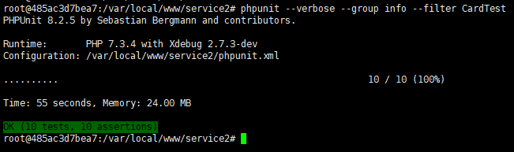

# PHPUnit单元测试

参考文档

- 官网：<https://phpunit.de/documentation.html>
- 中文文档：<http://www.phpunit.cn/>

环境要求：

- Linux(CentOS)
- php7
- xdebug

## 安装

根据当前PHP版本以及xdebug版本，安装合适的phpunit版本，如

```bash
wget https://phar.phpunit.de/phpunit-8.2.phar
chmod +x phpunit-8.2.phar
mv phpunit-8.2.phar /usr/local/bin/phpunit
phpunit --version
-- PHPUnit x.y.z by Sebastian Bergmann and contributors.
```

## 常用命令

- 测试所有单元测试类中的测试方法:`phpunit -v`  
- 测试指定的测试类：`phpunit -v --filter=CardTest::testMyfun` 或 `phpunit --v --filter CardTest::testMyfun`  
- 测试指定的测试类的分组测试方法[doc 通过@group mygroup表示]：phpunit --verbose --group mygroup --filter CardTest  
- 耗时测试可视化工具：<https://marmelab.com/phpunit-d3-report/>

> 结果



### 更多命令行参考

<https://phpunit.readthedocs.io/zh_CN/latest/textui.html>