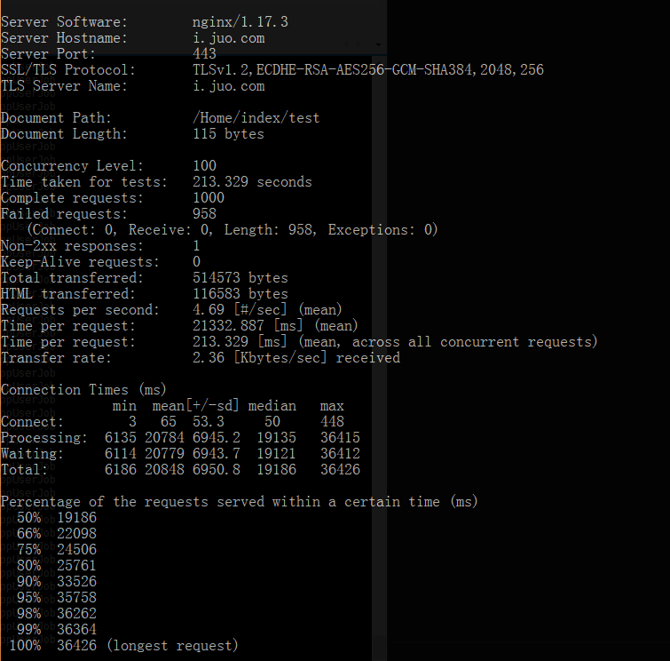

# AB测试

ab http压测工具  
abs https压测工具

## 参数

- `-n requests`     请求次数
- `-c concurrency`  并发数
- `-t timelimit`    测试所进行的最大秒数，其内部隐含值是-n 50000
- `-s timeout`      每次相应超时最大秒数
- `-b windowsize`   TCP发送/接收缓冲区的大小，以字节为单位。
- `-B address`      进行传出连接时要绑定的地址。
- `-p postfile`     包含了需要 POST 的数据的文件。该选项需要同时设置`-T`
- `-u putfile`      包含了需要 PUT 的数据的文件。该选项需要同时设置`-T`
- `-T content-type` POST/PUTPOST数据所使用的 Content-type 头信息, 例如'application/x-www-form-urlencoded'，默认值是'text/plain'
- `-v verbosity`    verbosity 要打印多少个疑难解答信息，设置详细级别 - 4和以上打印标题信息，3和以上打印响应代码（404,200等），2和以上打印警告和信息。
- `-w`              以HTML表的格式输出结果。默认时，它是白色背景的两列宽度的一张表。
- `-i`              执行HEAD请求，而不是GET。
- -`x attributes`   用作\<table\>的属性的字符串。 属性被插入\<table here\>。
- -`y attributes`   用作\<tr\>的属性的字符串。
- -`z attributes`   用作\<td\>的属性的字符串。
- `-C attribute`    将cookie添加到请求。 参数通常采用名称=值对的形式。 这个字段是可重复的。
- `-H attribute`    例如 ‘Accept-Encoding: gzip’ 插入所有普通标题行之后   -A attribute   添加基本的WWW认证，该属性是一个冒号分隔的用户名和密码，auth-username:password   -P attribute     添加基本代理验证，属性是一个冒号分隔的用户名和密码，proxy-auth-username:password   -X proxy:port   使用代理服务器和端口号。
- `-A attribute`    对服务器提供BASIC认证信任。用户名和密码由一个:隔开，并以base64编码形式发送。无论服务器是否需要(即,是否发送了401认证需求代码)，此字符串都会被发送。
- `-P attribute`    对一个中转代理提供BASIC认证信任。用户名和密码由一个:隔开，并以base64编码形式发送。无论服务器是否需要(即, 是否发送了401认证需求代码)，此字符串都会被发送。
- `-X proxy:port`   指定代理服务器的IP和端口。
- `-V`              打印版本号并退出。
- `-k`              启用 HTTP KeepAlive 功能，即在一个 HTTP 会话中执行多个请求。默认时，不启用 KeepAlive 功能。
- `-d`              不要显示百分点服务表。
- `-S`              不要显示信心估计和警告。
- `-q`              做超过150个请求时不要显示进度。
- `-l`              Accept variable document length (use this for dynamic pages)
- `-g filename`     将收集的数据输出到gnuplot格式文件
- `-e filename`     输出提供百分比的CSV文件。
- `-r`              不要退出套接字接收错误。
- `-m method`       Method name
- `-h`              显示使用情况信息（此消息）。

abs额外参数

- `-I`              Disable TLS Server Name Indication (SNI) extension
- `-Z ciphersuite`  指定SSL/TLS密码套件
- `-f protocol`     指定SSL/TLS协议(SSL3, TLS1, TLS1.1, TLS1.2 or ALL)

## 基本概念

- `PV`(page view): 是指页面被浏览的次数，比如你打开一网页，那么这个网站的pv就算加了一次；
- `TPS`(transactions per second): 是每秒内的事务数，比如执行了dml操作，那么相应的tps会增加；
- `QPS`(queries per second): 是指每秒内查询次数，比如执行了select操作，相应的qps会增加。
- `RPS`(requests per second)：是指每秒内请求次数

命令行

`ab -c 100 -n 10000 http://127.0.0.1:9501/`

执行结果

`abs -n 1000 -c 100 -k https://i.juo.com/Home/index/test`

执行结果

