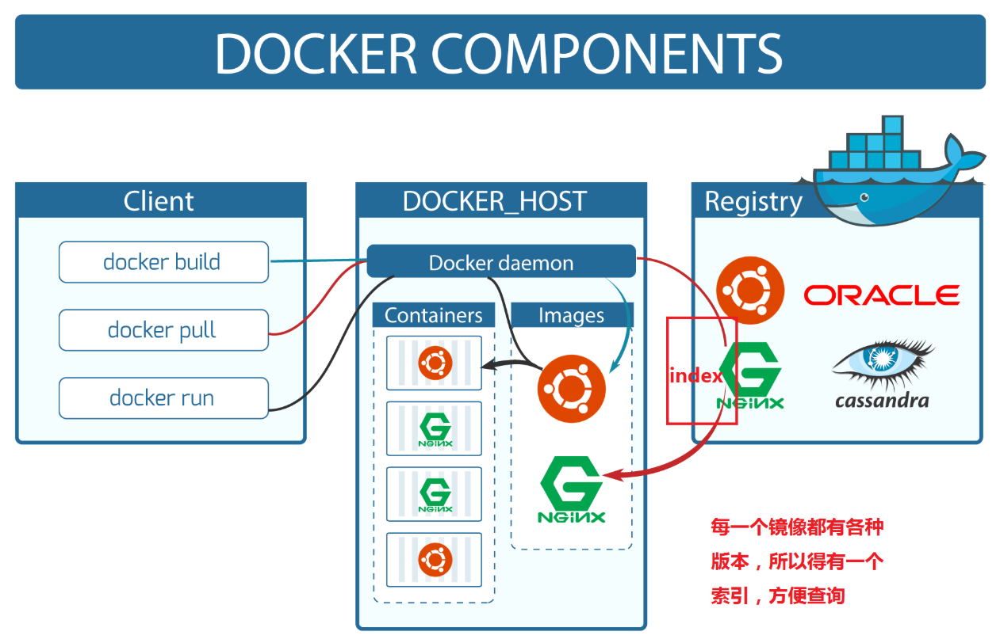

# Docker 架构原理

## 整体架构概览

Docker 采用客户端-服务器（C/S）架构，主要由以下核心组件构成：



## 核心组件详解

### 1. Docker Client (客户端)
Docker Client 是用户与 Docker 交互的主要接口，通过 REST API 与 Docker Daemon 通信。

```bash
# 用户命令示例
docker run -it ubuntu:20.04 /bin/bash
```

### 2. Docker Daemon (守护进程)
Docker 的核心引擎，负责管理镜像、容器、网络和存储卷。

**主要功能：**
- 镜像管理（构建、拉取、推送）
- 容器生命周期管理
- 网络配置
- 数据卷管理

### 3. Containerd (容器运行时)
负责容器的核心运行时管理，提供标准的容器接口。

```go
// Containerd 架构示意图
+-----------------------+
|   Docker Daemon       |
+-----------------------+
|       Containerd      |-----> Management API
+-----------------------+
|   Containerd-shim     |-----> Runtime (runc)
+-----------------------+
```

### 4. runc (OCI 运行时)
遵循 OCI (Open Container Initiative) 标准的底层容器运行时。

```bash
# runc 直接运行容器示例
runc run mycontainer
```

## Linux 内核技术基础

### Namespaces (命名空间)
提供资源隔离，每个命名空间中的进程拥有独立的系统视图。

**支持的命名空间类型：**
- **PID**: 进程隔离
- **NET**: 网络栈隔离  
- **IPC**: 进程间通信隔离
- **MNT**: 文件系统挂载点隔离
- **UTS**: 主机名和域名隔离
- **USER**: 用户和用户组隔离

### Control Groups (cgroups)
限制和隔离进程组的资源使用。

**主要功能：**
```bash
# 查看cgroup信息
cat /sys/fs/cgroup/memory/docker/<container_id>/memory.limit_in_bytes
```

**资源限制类型：**
- CPU 使用率限制
- 内存使用限制
- 磁盘 I/O 限制
- 网络带宽限制

### Union File Systems (联合文件系统)
实现镜像的分层存储和写时复制机制。

**常见实现：**
- **OverlayFS** (推荐)
- **AUFS** 
- **Device Mapper**
- **Btrfs**

## 镜像架构原理

### 分层存储机制
```
+-------------------+     +-------------------+
|   Container Layer |     |   Read-only       |
|   (可写层)        |     |   Image Layers    |
+-------------------+     +-------------------+
| Changes made at   |     | Base Image        |
| runtime           |     | (ubuntu:20.04)    |
+-------------------+     +-------------------+
```

**写时复制 (Copy-on-Write) 机制：**
- 多个容器共享相同的镜像层
- 运行时修改只在容器层进行
- 提高存储效率，减少磁盘占用

## 网络架构

### 网络驱动类型
| 网络类型 | 描述 | 适用场景 |
|---------|------|---------|
| **bridge** | 默认网络驱动 | 单主机容器通信 |
| **host** | 使用主机网络栈 | 高性能需求 |
| **overlay** | 多主机网络 | Swarm/K8s集群 |
| **macvlan** | MAC地址虚拟化 | 需要真实MAC地址 |
| **none** | 无网络 | 特殊安全需求 |

### 网络命名空间实现
```bash
# 查看容器网络命名空间
ls -la /proc/<pid>/ns/net

# 创建veth pair连接容器和主机
ip link add veth0 type veth peer name veth1
```

## 存储架构

### 存储驱动比较
| 驱动类型 | 优点 | 缺点 |
|---------|------|------|
| **Overlay2** | 性能好，兼容性佳 | 需要Linux内核4.0+ |
| **AUFS** | 成熟稳定 | 未进入主流内核 |
| **Device Mapper** | 企业级特性 | 配置复杂 |
| **Btrfs** | 快照功能强大 | 稳定性问题 |

### 数据卷原理
```bash
# 数据卷存储在特定目录
/var/lib/docker/volumes/
```

## 安全架构

### 安全特性
1. **命名空间隔离**：进程、网络、文件系统隔离
2. **能力控制**：使用 `--cap-add`/`--cap-drop` 控制权限
3. **Seccomp**：系统调用过滤
4. **AppArmor/SELinux**：强制访问控制

### 安全配置示例
```bash
# 限制容器能力
docker run --cap-drop ALL --cap-add NET_BIND_SERVICE nginx

# 使用安全配置文件
docker run --security-opt seccomp=profile.json myapp
```

## 性能优化原理

### 资源调度
```bash
# CPU限制
docker run --cpus="0.5" myapp

# 内存限制
docker run -m 512m --memory-swap=1g myapp

# I/O限制
docker run --device-write-bps /dev/sda:1mb myapp
```

### 存储优化
- 使用 `VOLUME` 指令分离数据
- 合理配置 `.dockerignore`
- 选择适合的存储驱动

## 监控与调试

### 底层监控
```bash
# 查看容器cgroup信息
systemd-cgls

# 监控容器系统调用
strace -p <container_pid>
```

### 性能分析工具
- **docker stats**: 实时资源监控
- **cAdvisor**: 容器指标收集
- **perf**: Linux性能分析

## 架构演进

### 从传统虚拟化到容器化
```
传统虚拟化: Hardware -> Hypervisor -> Guest OS -> App
容器化:     Hardware -> Host OS -> Container Engine -> App
```

### 现代容器架构趋势
- **CRI (Container Runtime Interface)**: Kubernetes 运行时标准
- **OCI (Open Container Initiative)**: 容器格式和运行时标准
- **Serverless Containers**: 无服务器容器架构

> 提示：理解 Docker 底层原理有助于更好地进行容器化架构设计和故障排查。

!> 重要：生产环境部署时，需要根据具体需求选择合适的网络驱动、存储驱动和安全配置。