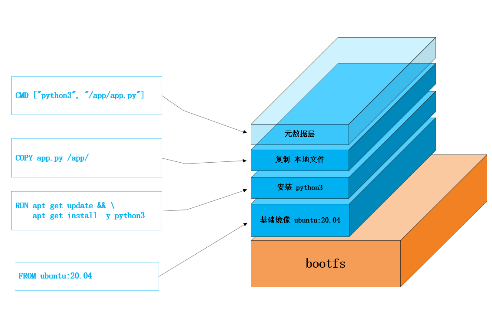

# Docker 镜像与容器核心概念

## 1. 镜像 (Image)

### 1.1 镜像概念
Docker 镜像是一个轻量级、可执行的独立软件包，包含运行某个软件所需的所有内容：代码、运行时、库、环境变量和配置文件。

### 1.2 镜像分层结构

#### 分层架构图示
```
+-------------------------------+
|        Container Layer        |  ← 可写层 (容器运行时创建)
|        (读写层)               |
+-------------------------------+
|          Image Layer 3        |  ← 应用层 (COPY/ADD 指令)
|        (应用文件)             |
+-------------------------------+
|          Image Layer 2        |  ← 依赖层 (RUN 指令)
|        (安装的依赖)           |
+-------------------------------+
|          Image Layer 1        |  ← 基础层 (FROM 指令)
|        (基础操作系统)         |
+-------------------------------+
```

#### 分层示例
假设有如下 Dockerfile：

```dockerfile
FROM ubuntu:20.04           # 层 1：拉取基础镜像层
RUN apt-get update && \     # 层 2：更新软件包列表
     apt-get install -y python3
COPY app.py /app/           # 层 3：复制应用文件
CMD ["python3", "/app/app.py"] # 层 4：设置启动命令（元数据层）
```

构建过程生成4个层级：
1. **基础层**：ubuntu:20.04 基础系统
2. **依赖层**：包含安装的 python3 等依赖文件
3. **应用层**：包含复制的 app.py 文件
4. **元数据层**：容器启动配置信息

#### 分层优势
- **资源共享**：多个镜像共享相同基础层，节省存储空间
- **构建缓存**：未变化的指令层可复用，加速构建过程
- **不可变性**：只读层保证镜像内容确定且安全



### 1.3 镜像操作命令

#### 镜像管理
```bash
# 拉取镜像
docker pull ubuntu:20.04

# 查看本地镜像
docker images
docker image ls

# 删除镜像
docker rmi ubuntu:20.04
docker image rm ubuntu:20.04

# 查看镜像详情
docker inspect ubuntu:20.04

# 导出/导入镜像
docker save -o ubuntu.tar ubuntu:20.04
docker load -i ubuntu.tar
```

#### 镜像构建与发布
```bash
# 构建镜像
docker build -t myapp:1.0 .

# 查看构建历史
docker history myapp:1.0

# 标记镜像
docker tag myapp:1.0 myregistry.com/myapp:1.0

# 推送镜像
docker push myregistry.com/myapp:1.0
```

### 1.4 Dockerfile 详解

#### 基础指令
```dockerfile
# 指定基础镜像
FROM ubuntu:20.04

# 维护者信息
LABEL maintainer="developer@example.com"

# 设置工作目录
WORKDIR /app

# 复制文件
COPY . .

# 添加文件（支持自动解压）
ADD https://example.com/file.tar.gz /tmp/

# 设置环境变量
ENV NODE_ENV=production PORT=3000

# 运行命令
RUN apt-get update && apt-get install -y curl

# 暴露端口
EXPOSE 3000

# 设置启动命令
CMD ["node", "app.js"]

# 设置入口点
ENTRYPOINT ["/bin/bash", "-c"]

# 健康检查
HEALTHCHECK --interval=30s --timeout=3s \
  CMD curl -f http://localhost:3000/health || exit 1
```

#### 多阶段构建示例
```dockerfile
# 构建阶段
FROM golang:1.18 AS builder
WORKDIR /app
COPY . .
RUN go build -o server .

# 运行阶段
FROM alpine:3.15
RUN apk add --no-cache libc6-compat
WORKDIR /app
COPY --from=builder /app/server .
COPY --from=builder /app/config.yaml .
EXPOSE 8080
USER nobody
CMD ["./server"]
```

## 2. 容器 (Container)

### 2.1 容器概念
容器是镜像的运行实例，与镜像的关系类似于面向对象编程中对象与类的关系。

### 2.2 容器生命周期
```
创建 → 运行 → 暂停 → 停止 → 删除
    ↖________重启________↗
```

### 2.3 容器操作命令

#### 容器管理
```bash
# 运行容器
docker run -d --name myapp -p 8080:80 nginx:alpine

# 查看容器
docker ps          # 运行中的容器
docker ps -a       # 所有容器（包括已停止的）

# 生命周期管理
docker stop myapp    # 停止容器
docker start myapp   # 启动容器
docker restart myapp # 重启容器
docker rm myapp      # 删除容器
docker rm -f myapp   # 强制删除运行中的容器
```

#### 容器交互
```bash
# 进入容器
docker exec -it myapp /bin/bash

# 执行命令
docker exec myapp ls -la

# 日志管理
docker logs myapp     # 查看日志
docker logs -f myapp  # 实时查看日志

# 资源监控
docker stats myapp    # 资源使用情况
docker top myapp      # 容器进程

# 文件操作
docker cp file.txt myapp:/tmp/    # 复制到容器
docker cp myapp:/tmp/file.txt ./  # 从容器复制
```

### 2.4 容器运行配置

#### 基础选项
```bash
# 运行模式
docker run -d nginx              # 后台运行
docker run -it ubuntu /bin/bash  # 交互式运行

# 容器标识
docker run --name web nginx      # 指定名称
docker run --rm ubuntu echo "hello" # 自动删除

# 环境配置
docker run -e ENV=production nginx      # 设置环境变量
docker run -e TZ=Asia/Shanghai nginx    # 设置时区
```

#### 资源限制
```bash
# CPU限制
docker run --cpus=0.5 nginx           # 限制CPU使用率
docker run --cpuset-cpus=0-2 nginx    # 绑定指定CPU核心

# 内存限制
docker run -m 512m nginx                 # 限制内存
docker run -m 512m --memory-swap=1g nginx # 限制内存+交换分区

# I/O限制
docker run --device-read-bps /dev/sda:1mb nginx  # 读速率限制
docker run --device-write-iops /dev/sda:100 nginx # 写IOPS限制
```

#### 网络配置
```bash
# 端口映射
docker run -p 8080:80 nginx              # 单端口映射
docker run -p 80:80 -p 443:443 nginx     # 多端口映射

# 网络模式
docker run --network host nginx     # 主机模式
docker run --network bridge nginx   # 桥接模式（默认）
docker run --network none nginx     # 无网络

# DNS配置
docker run --dns 8.8.8.8 nginx           # 自定义DNS
docker run --dns-search example.com nginx # DNS搜索域
```

#### 存储配置
```bash
# 数据卷挂载
docker run -v myvolume:/data nginx              # 挂载数据卷
docker run -v /host/path:/container/path nginx  # 挂载主机目录
docker run -v /host/path:/container/path:ro nginx # 只读挂载

# 临时文件系统
docker run --tmpfs /tmp nginx  # 使用tmpfs
```

### 2.5 容器状态管理

#### 状态查看
```bash
# 容器详情
docker inspect myapp

# 资源监控
docker stats myapp

# 文件变化
docker diff myapp
```

#### 监控命令
```bash
# 实时监控
watch -n 1 docker ps

# 事件查看
docker events

# 性能监控
docker stats --all --format "table {{.Name}}\t{{.CPUPerc}}\t{{.MemUsage}}"
```

## 3. 最佳实践

### 3.1 镜像构建最佳实践
1. **使用小型基础镜像**（alpine、distroless）
2. **多阶段构建**减少最终镜像大小
3. **合理排序指令**利用层缓存
4. **使用.dockerignore**避免不必要的文件
5. **固定版本标签**避免不可预期的更新

### 3.2 容器运行最佳实践
1. **使用非root用户**运行容器
2. **设置资源限制**防止资源耗尽
3. **配置健康检查**确保应用可用性
4. **使用只读文件系统**增强安全性
5. **合理配置日志驱动**便于日志管理

## 4. 故障排查

### 4.1 常见问题解决
```bash
# 容器启动失败
docker logs myapp

# 网络连通性
docker exec myapp ping 8.8.8.8

# 资源问题
docker stats myapp

# 进程查看
docker exec myapp ps aux

# 进入容器调试
docker exec -it myapp /bin/sh
```

### 4.2 调试技巧
```bash
# 临时调试容器
docker run --rm -it --entrypoint=/bin/bash nginx

# 网络诊断
docker exec myapp ip addr show
docker exec myapp nslookup google.com

# 挂载点检查
docker exec myapp mount
```

> **提示**：镜像和容器是 Docker 的核心概念，理解它们的关系和操作方式对于有效使用 Docker 至关重要。

!> **重要**：生产环境中，务必为容器设置适当的资源限制和安全配置，避免潜在的安全风险和性能问题。