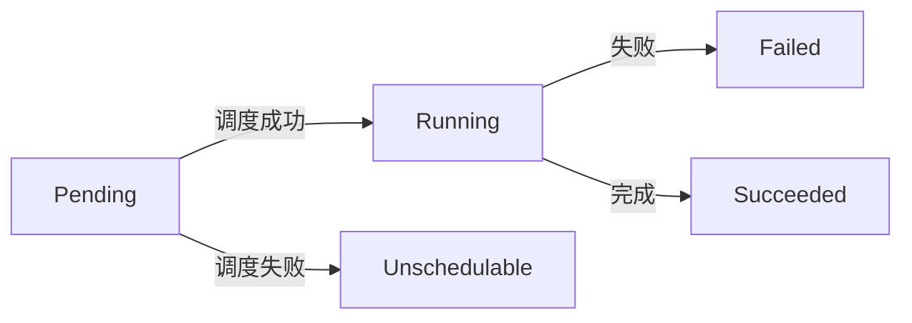

# Kubernetes 全面解析：从基础到进阶实践

Kubernetes (K8s) 是云原生时代的容器编排标准平台，以下是其技术体系的深度剖析：

## 1. 核心架构与组件

### 控制平面 (Control Plane)

```
API Server (kube-apiserver)
  ↑
Cluster Store (etcd)
  ↑
Controller Manager (kube-controller-manager)
  ↑
Scheduler (kube-scheduler)
```

### 工作节点 (Worker Node)

```
Container Runtime (containerd/docker)
  ↑
Kubelet (节点代理)
  ↑
Kube-proxy (网络代理)
```

## 2. 关键资源对象

### Pod 生命周期



### Deployment 滚动更新策略

```yaml
apiVersion: apps/v1
kind: Deployment
spec:
  strategy:
    rollingUpdate:
      maxSurge: 25%
      maxUnavailable: 0
    type: RollingUpdate
  template:
    spec:
      containers:
      - image: nginx:1.21.6 # 触发更新
```

## 3. 网络模型深入

### CNI 插件比较

| 插件 | 网络模型 | 性能 | 适用场景 |
|------|----------|------|----------|
| Calico | BGP路由 | 高 | 大规模集群 |
| Flannel | Overlay | 中 | 简单场景 |
| Cilium | eBPF | 极高 | 安全敏感 |
| Weave | Mesh | 中 | 多云网络 |

### 服务发现机制

```
CoreDNS 解析流程：
Pod → kube-dns → CoreDNS → 
外部域名(递归查询)
```

## 4. 存储体系详解

### PV/PVC 绑定关系

$$
\text{绑定成功率} = \frac{\text{匹配PV数}}{\text{PVC请求数}} \times 100\%
$$

### StorageClass 示例

```yaml
apiVersion: storage.k8s.io/v1
kind: StorageClass
metadata:
  name: fast-ssd
provisioner: ebs.csi.aws.com
parameters:
  type: gp3
  iops: "10000"
  throughput: "500"
reclaimPolicy: Retain
volumeBindingMode: WaitForFirstConsumer
```

## 5. 安全控制体系

### RBAC 权限模型

```yaml
apiVersion: rbac.authorization.k8s.io/v1
kind: RoleBinding
metadata:
  name: dev-reader
subjects:
- kind: User
  name: dev-user
  apiGroup: rbac.authorization.k8s.io
roleRef:
  kind: Role
  name: pod-reader
  apiGroup: rbac.authorization.k8s.io
```

### 安全上下文配置

```yaml
securityContext:
  runAsNonRoot: true
  runAsUser: 1000
  capabilities:
    drop:
    - ALL
  seccompProfile:
    type: RuntimeDefault
```

## 6. 调度机制进阶

### 节点亲和性示例

```yaml
affinity:
  nodeAffinity:
    requiredDuringSchedulingIgnoredDuringExecution:
      nodeSelectorTerms:
      - matchExpressions:
        - key: topology.kubernetes.io/zone
          operator: In
          values:
          - us-west-2a
    preferredDuringSchedulingIgnoredDuringExecution:
    - weight: 1
      preference:
        matchExpressions:
        - key: instance-type
          operator: In
          values:
          - t3.large
```

### 资源配额管理

```yaml
apiVersion: v1
kind: ResourceQuota
metadata:
  name: team-a
spec:
  hard:
    requests.cpu: "20"
    requests.memory: 100Gi
    limits.cpu: "40"
    limits.memory: 200Gi
    pods: "50"
```

## 7. 运维与监控

### 健康检查配置

```yaml
livenessProbe:
  httpGet:
    path: /healthz
    port: 8080
  initialDelaySeconds: 3
  periodSeconds: 5
readinessProbe:
  exec:
    command:
    - sh
    - -c
    - curl -I http://localhost:8080
  failureThreshold: 3
```

### 监控指标采集

```
kube-state-metrics → Prometheus → 
Grafana 可视化 → Alertmanager 告警
```

## 8. 扩展机制

### CRD 开发示例

```go
type CronTabSpec struct {
    CronSpec string `json:"cronSpec"`
    Image    string `json:"image"`
    Replicas int32  `json:"replicas"`
}

type CronTabStatus struct {
    LastScheduleTime metav1.Time `json:"lastScheduleTime"`
}
```

### Operator 工作流程

```
Reconcile Loop:
1. 获取当前状态
2. 对比期望状态
3. 执行调谐操作
4. 更新状态
```

## 9. 高可用部署

### 多控制平面架构

```
Load Balancer
  ↑
API Server 1 ↔ etcd Cluster
  ↑
API Server 2 ↔ etcd Cluster
  ↑
API Server 3 ↔ etcd Cluster
```

### 灾备恢复策略

```
定期etcd快照 → 对象存储备份 →
跨可用区部署 → 自动故障转移
```

## 10. 服务网格集成

### Istio 数据平面

```
Envoy Sidecar 注入流程：
1. 自动注入或手动注入
2. 流量劫持(iptables)
3. 策略执行(mTLS/限流)
```

## 11. 性能优化

### 资源请求建议

```yaml
resources:
  requests:
    cpu: "500m" # 0.5核
    memory: "512Mi"
  limits:
    cpu: "2"
    memory: "2Gi"
```

### 大集群调优参数

```yaml
# kube-apiserver 参数
--max-requests-inflight=1500
--max-mutating-requests-inflight=500
# etcd 参数
--max-watch-cache-size=1000
```

## 12. 新兴趋势

### Kubernetes 演进方向

```
Serverless (Knative) → 
边缘计算 (KubeEdge) → 
混合云 (Karmada) → 
WebAssembly (Wasm)
```

### GitOps 实践

```
FluxCD/ArgoCD 工作流：
Git提交 → CI流水线 → 
同步到集群 → 健康检查
```

Kubernetes 已成为云原生操作系统，掌握其核心原理和最佳实践对于现代基础设施管理至关重要。根据2023年CNCF调查：

- 生产环境K8s使用率达78%
- 平均集群规模增长45%
- Operator模式采用率提升至62%
- 服务网格集成率38%

建议学习路径：
1. 掌握核心资源对象(Pod/Deployment/Service)
2. 深入网络与存储方案
3. 学习安全最佳实践
4. 探索扩展机制(CRD/Operator)
5. 跟踪Serverless等前沿方向