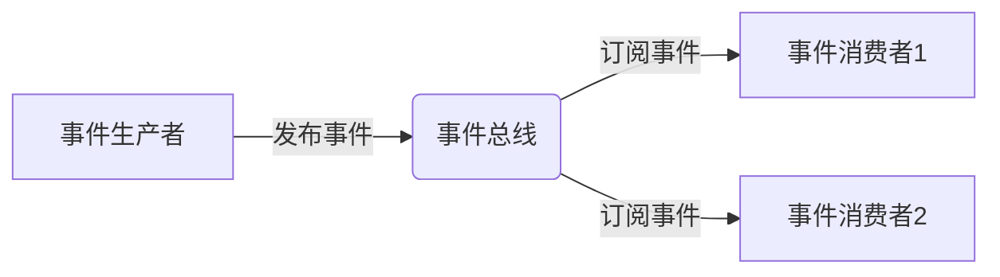
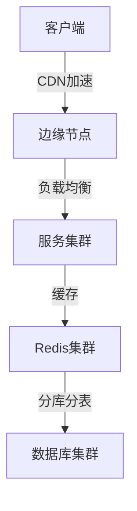

# 系统架构设计全景解析

系统架构是软件系统的骨架，决定了系统的质量属性、可维护性和扩展性。以下是现代系统架构设计的全面解析：

## 1. 架构演进历程

### 架构发展时间轴

```
单体架构 → 垂直分层 → SOA → 
微服务 → 服务网格 → 无服务架构
```

### 各阶段特性对比

| 架构类型 | 耦合度 | 部署粒度 | 典型技术 | 适用场景 |
|----------|--------|----------|----------|----------|
| 单体架构 | 高 | 整体 | Spring MVC | 小型应用 |
| 分层架构 | 中 | 模块 | Java EE | 企业应用 |
| SOA | 中低 | 服务 | ESB/WSDL | 异构系统集成 |
| 微服务 | 低 | 独立服务 | Docker/K8s | 云原生应用 |
| Serverless | 极低 | 函数 | AWS Lambda | 事件驱动 |

## 2. 核心架构模式

### 分层架构模式

```
表现层 (UI/API)
  ↑
业务逻辑层 (Domain)
  ↑
数据访问层 (DAO)
  ↑
数据存储层 (DB/File)
```

### 事件驱动架构



## 3. 现代架构风格

### 微服务架构要素

```
服务自治 ←→ API网关 ←→ 
分布式配置 ←→ 服务发现 ←→ 
熔断限流 ←→ 链路追踪
```

### 云原生架构原则

1. **服务化**：微服务拆分
2. **弹性**：自动扩缩容
3. **可观测**：指标/日志/追踪
4. **自动化**：CI/CD流水线
5. **容错**：混沌工程实践

## 4. 技术组件矩阵

### 架构技术选型参考

| 需求 | 可选方案 | 评估维度 |
|------|----------|----------|
| 服务通信 | gRPC/REST/MQ | 性能/兼容性 |
| 数据存储 | RDB/NoSQL/NewSQL | 一致性需求 |
| 缓存策略 | Redis/Memcached | 数据结构复杂度 |
| 消息队列 | Kafka/RabbitMQ | 吞吐量/可靠性 |
| 服务网格 | Istio/Linkerd | 语言无关性 |

## 5. 分布式系统设计

### CAP理论实践

$$
\text{分布式系统} = \begin{cases}
\text{一致性(C)} \\
\text{可用性(A)} \\
\text{分区容错(P)}
\end{cases}
$$

### 分布式事务方案

| 方案 | 原理 | 适用场景 | 实现框架 |
|------|------|----------|----------|
| 2PC | 两阶段提交 | 强一致 | XA协议 |
| TCC | 尝试-确认-取消 | 高并发 | Seata |
| SAGA | 长事务拆分 | 最终一致 | Axon |
| 本地消息表 | 异步确保 | 可靠性 | 自实现 |

## 6. 性能架构设计

### 高性能设计模式



### 缓存策略层级

```
客户端缓存 → 反向代理缓存 → 
应用缓存 → 分布式缓存 → 
数据库缓存
```

## 7. 安全架构设计

### 安全防御层次

```
┌─────────────────────┐
│ 应用安全 │ ← 输入验证/输出编码
├─────────────────────┤
│ 数据安全 │ ← 加密/脱敏
├─────────────────────┤
│ 通信安全 │ ← TLS/MTLS
├─────────────────────┤
│ 基础设施安全 │ ← 防火墙/WAF
└─────────────────────┘
```

### 零信任架构要素

```
持续验证 → 最小权限 → 
微隔离 → 端到端加密 → 
行为分析
```

## 8. 可扩展性设计

### 扩展立方体模型

```
X轴：水平复制
Y轴：功能分解
Z轴：数据分片
```

### 弹性伸缩策略

```yaml
# K8s HPA示例
apiVersion: autoscaling/v2
kind: HorizontalPodAutoscaler
metadata:
  name: myapp-hpa
spec:
  scaleTargetRef:
    apiVersion: apps/v1
    kind: Deployment
    name: myapp
  minReplicas: 2
  maxReplicas: 10
  metrics:
  - type: Resource
    resource:
      name: cpu
      target:
        type: Utilization
        averageUtilization: 70
```

## 9. 可靠性设计

### 容错模式

| 模式 | 实现方式 | 技术示例 |
|------|----------|----------|
| 重试 | 指数退避 | Spring Retry |
| 熔断 | 故障拦截 | Hystrix/Sentinel |
| 降级 | 备用逻辑 | 本地缓存 |
| 限流 | 流量控制 | Guava RateLimiter |

### 混沌工程实践

```bash
# 模拟网络延迟
tc qdisc add dev eth0 root netem delay 100ms

# 随机杀死Pod
kubectl delete pod --randomly
```

## 10. 架构评估方法

### ATAM评估矩阵

| 质量属性 | 敏感点 | 权衡点 | 风险点 |
|----------|--------|--------|--------|
| 性能 | 缓存命中率 | 一致性 vs 延迟 | 缓存雪崩 |
| 安全 | 加密强度 | 安全 vs 性能 | 密钥泄露 |
| 可用性 | 冗余度 | 成本 vs SLA | 脑裂问题 |

### 架构决策记录(ADR)

```markdown
# 1. 选择关系型数据库

## 状态
提议

## 决策
采用PostgreSQL而非MongoDB

## 原因
- 需要复杂事务支持
- 已有SQL技能储备
- 地理空间数据支持良好

## 后果
- 需要管理数据库schema变更
- 水平扩展较NoSQL更复杂
```

## 11. 前沿架构趋势

### 服务网格架构

```
数据平面(Envoy) ←→ 
控制平面(Istio) ←→ 
观测平面(Prometheus/Grafana)
```

### 无服务器模式

```
事件源 → 函数计算 → 
BaaS服务 → 前端集成
```

## 12. 架构师能力模型

### 核心能力维度

```
技术深度 ←→ 业务理解 ←→ 
权衡决策 ←→ 沟通协调 ←→ 
趋势洞察
```

根据IEEE的调查研究，现代系统架构设计呈现以下趋势：
1. 混合架构成为主流（微服务+Serverless）
2. 可观测性成为必备能力
3. 安全左移贯穿全生命周期
4. 云原生技术采纳率年增长40%
5. AI辅助架构设计工具兴起

架构设计建议原则：
1. 平衡短期交付与长期演进
2. 度量驱动架构优化
3. 标准化接口定义
4. 预留扩展点
5. 持续演进而非一步到位