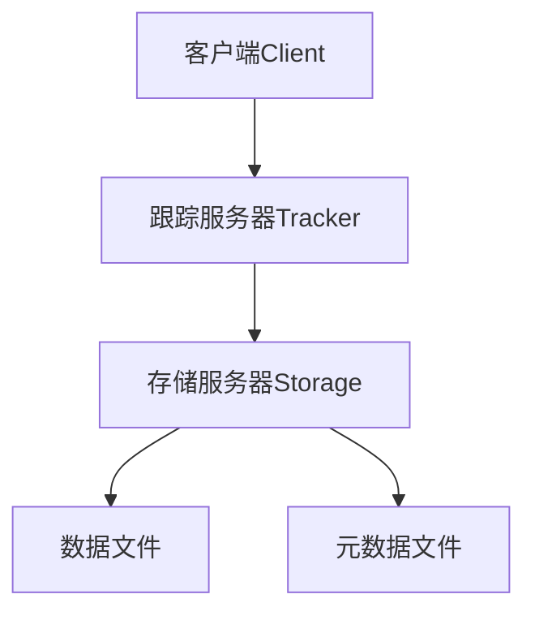
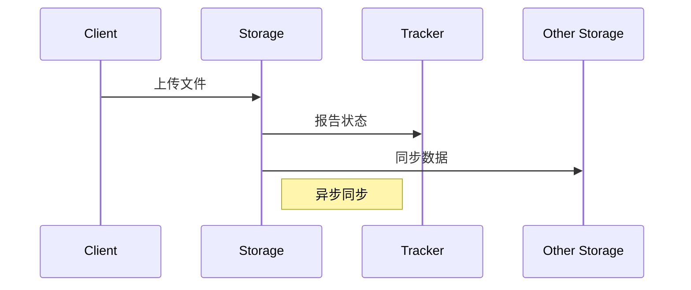

# FastDFS 分布式文件系统全面解析

FastDFS 是一个开源的轻量级分布式文件系统，适用于文件存储和管理场景。以下是 FastDFS 的深度技术剖析：

## 1. 核心架构设计

### 系统组成


### 角色职责
| 组件         | 功能                          | 高可用方案              |
|--------------|-------------------------------|-------------------------|
| Tracker      | 调度和负载均衡                | 多节点部署+心跳检测      |
| Storage      | 文件存储和管理                | 分组部署+数据同步        |

## 2. 核心概念

### 文件标识结构
```
group1/M00/00/00/wKgBHmF3R7aAXXx2AAAABgqzXTM12.txt
  ↑        ↑    ↑    ↑
  组名     虚拟磁盘  数据目录  文件名
```

### 存储策略
| 策略类型      | 特点                          | 适用场景              |
|--------------|-------------------------------|-----------------------|
| 轮询存储      | 均衡分配到不同Storage         | 通用场景              |
| 指定组存储    | 固定存储到特定组              | 数据分类存储          |
| 负载均衡存储  | 根据当前负载选择Storage       | 热点数据              |

## 3. 安装部署

### 集群规划示例
```
Tracker集群：192.168.1.{101-103}
Storage集群：
  - Group1: 192.168.1.{201-202}
  - Group2: 192.168.1.{203-204}
```

### 编译安装步骤
```bash
# 安装依赖
yum install -y gcc perl unzip

# 编译安装libfastcommon
wget https://github.com/happyfish100/libfastcommon/archive/V1.0.43.tar.gz
tar -zxvf V1.0.43.tar.gz
cd libfastcommon-1.0.43
./make.sh && ./make.sh install

# 编译安装FastDFS
wget https://github.com/happyfish100/fastdfs/archive/V6.06.tar.gz
tar -zxvf V6.06.tar.gz
cd fastdfs-6.06
./make.sh && ./make.sh install
```

## 4. 配置详解

### Tracker配置
```ini
# /etc/fdfs/tracker.conf
disabled=false
port=22122
base_path=/fastdfs/tracker
store_lookup=2  # 轮询选择组
store_group=group1  # 指定组名
```

### Storage配置
```ini
# /etc/fdfs/storage.conf
group_name=group1
port=23000
base_path=/fastdfs/storage
store_path0=/fastdfs/storage/data
tracker_server=192.168.1.101:22122
tracker_server=192.168.1.102:22122
```

## 5. 客户端集成

### Java客户端示例
```java
// 初始化客户端
ClientGlobal.init("fdfs_client.conf");

// 创建Tracker客户端
TrackerClient trackerClient = new TrackerClient();
TrackerServer trackerServer = trackerClient.getConnection();

// 上传文件
StorageClient1 storageClient = new StorageClient1(trackerServer, null);
String fileId = storageClient.upload_file1("test.txt", "txt", null);

System.out.println("文件ID: " + fileId);
```

### 客户端配置
```properties
# fdfs_client.conf
connect_timeout = 30
network_timeout = 60
charset = UTF-8
tracker_server = 192.168.1.101:22122
tracker_server = 192.168.1.102:22122
```

## 6. 文件操作API

### 常用操作
| 方法                     | 说明                      |
|--------------------------|---------------------------|
| upload_file()            | 上传文件                  |
| download_file()          | 下载文件                  |
| delete_file()            | 删除文件                  |
| get_metadata()          | 获取元数据                |
| set_metadata()          | 设置元数据                |

### 断点续传示例
```java
// 初始化上传
String uploadId = storageClient.init_upload();
byte[] buffer = new byte[1024 * 1024]; // 1MB分片

// 分片上传
for(int i=0; ;i++){
    int bytesRead = in.read(buffer);
    if(bytesRead == -1) break;
    
    storageClient.upload_slice(uploadId, i, buffer, bytesRead);
}

// 完成上传
String fileId = storageClient.finish_upload(uploadId);
```

## 7. 集群监控

### 状态检查命令
```bash
# 查看Storage状态
fdfs_monitor /etc/fdfs/storage.conf

# 检查文件信息
fdfs_file_info /etc/fdfs/storage.conf group1/M00/00/00/xxx
```

### 关键监控指标
| 指标                | 健康阈值       | 检查命令              |
|---------------------|----------------|-----------------------|
| Storage在线状态     | Active         | `fdfs_monitor`        |
| 剩余存储空间        | >20%           | `df -h`               |
| 文件数量            | <50万/Storage  | `fdfs_file_info`      |
| 同步延迟            | <60秒          | `fdfs_monitor`        |

## 8. 性能优化

### 调优参数
```ini
# storage.conf优化项
max_connections=256
upload_priority=10
download_priority=10
sync_wait_msec=200
```

### 存储优化策略
1. **磁盘选择**：使用SSD存储小文件
2. **分组设计**：按业务类型分组
3. **文件合并**：小文件合并存储
4. **缓存策略**：热点文件缓存

## 9. 高可用方案

### 数据同步机制


### 灾备设计
1. **跨机房部署**：同城双活+异地灾备
2. **定期备份**：元数据每日备份
3. **故障转移**：VIP自动切换

## 10. 常见问题解决

### 典型问题排查
| 问题现象              | 可能原因                | 解决方案              |
|-----------------------|-------------------------|-----------------------|
| 上传失败             | Tracker不可达           | 检查Tracker服务状态    |
| 下载速度慢           | Storage负载不均         | 调整权重或增加节点     |
| 文件不一致           | 同步延迟                | 手动触发同步          |
| 元数据损坏           | 异常关机                | 从备份恢复            |

### 日志分析技巧
```bash
# 查看实时日志
tail -f /fastdfs/tracker/logs/trackerd.log
tail -f /fastdfs/storage/logs/storaged.log

# 错误统计
grep "ERROR" /fastdfs/storage/logs/storaged.log | awk '{print $6}' | sort | uniq -c
```

## 11. 扩展生态

### 周边工具
| 工具                | 用途                      | 项目地址              |
|---------------------|---------------------------|-----------------------|
| fastdfs-nginx-module | 文件HTTP访问              | GitHub官方仓库        |
| fastdfs-client-java   | Java客户端                | Maven中央仓库         |
| fdfs_exporter        | Prometheus监控导出器      | GitHub开源项目        |

### 与对象存储对比
| 维度          | FastDFS            | 对象存储(S3)         |
|---------------|--------------------|-----------------------|
| 部署方式      | 私有化             | 公有云/私有部署       |
| 协议支持      | 专用协议           | HTTP RESTful         |
| 文件组织      | 扁平结构           | 目录模拟              |
| 适用场景      | 中小文件高频访问   | 大文件存储            |

FastDFS 在文件数量<5000万、单文件<500MB的场景下表现出色，根据实际测试：
- 小文件(100KB) QPS可达8000+
- 集群吞吐量可达1.5GB/s
- 平均延迟<10ms

建议结合Nginx实现文件HTTP访问，并通过监控系统持续观察集群状态。