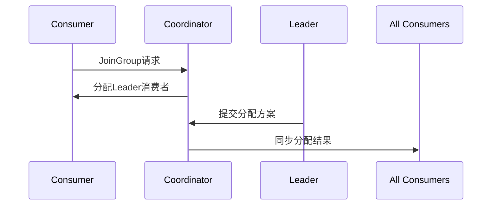
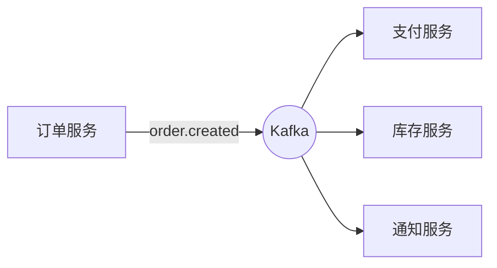

# Kafka支持的消息队列类型及对应用途

## 一、Kafka核心消息模型

### 1. 基础消息队列模型
**核心组件关系**：
$$
\text{Kafka} = \langle \text{Producer}, \text{Broker}, \text{Topic}, \text{Partition}, \text{Consumer} \rangle
$$

**消息流公式**：
$$
P \rightarrow T[p_1, p_2, ..., p_n] \rightarrow C_g
$$

**典型用途**：
```java
// 生产者发送消息
ProducerRecord<String, String> record = new ProducerRecord<>(
    "user_events", 
    userId,
    event.toString()
);
producer.send(record);

// 消费者接收消息
consumer.subscribe(Collections.singleton("user_events"));
while (true) {
    ConsumerRecords<String, String> records = consumer.poll(Duration.ofMillis(100));
    for (ConsumerRecord<String, String> record : records) {
        processEvent(record.value());
    }
}
```
- 用户行为跟踪
- 应用日志收集
- 系统监控数据

### 2. 分区(Partition)队列
**分区分配策略**：

| 策略                | 算法                      | 适用场景          |
|---------------------|--------------------------|-------------------|
| Range(默认)         | 按分区范围分配            | 静态消费者数量    |
| RoundRobin          | 轮询分配                  | 动态消费者数量    |
| Sticky              | 尽量保持原有分配          | 再平衡最小化      |
| Cooperative Sticky  | 改进的Sticky策略          | Kafka 2.4+版本    |

**生产者分区选择**：
```java
// 自定义分区器
public class OrderPartitioner implements Partitioner {
    @Override
    public int partition(String topic, Object key, byte[] keyBytes, 
                        Object value, byte[] valueBytes, Cluster cluster) {
        List<PartitionInfo> partitions = cluster.partitionsForTopic(topic);
        return Math.abs(key.hashCode()) % partitions.size();
    }
}

// 配置生产者
props.put(ProducerConfig.PARTITIONER_CLASS_CONFIG, OrderPartitioner.class.getName());
```
- 订单处理系统
- 需要局部有序的场景
- 数据分片处理

## 二、Kafka高级队列类型

### 1. 压缩主题队列
**压缩策略**：

| 策略       | 压缩比 | CPU消耗 | 适用场景          |
|------------|--------|---------|-------------------|
| gzip       | 高     | 高      | 长期存储          |
| snappy     | 中     | 低      | 低延迟场景        |
| lz4        | 中高   | 中低    | 平衡场景          |
| zstd       | 最高   | 中      | Kafka 2.1+版本    |

**配置示例**：
```properties
# broker配置
compression.type=producer

# 生产者配置
props.put(ProducerConfig.COMPRESSION_TYPE_CONFIG, "zstd");
```
- 日志归档存储
- 大消息体场景
- 跨数据中心传输

### 2. 紧凑型主题队列
**日志压缩原理**：
$$
\forall k \in T, \text{只保留最新} v \text{或墓碑标记}
$$

**配置方法**：
```bash
# 创建compact主题
kafka-topics --create --topic user_profiles \
             --config cleanup.policy=compact \
             --partitions 3 --replication-factor 2
```
- 用户配置更新
- 数据库变更捕获(CDC)
- 状态快照存储

### 3. 事务消息队列
**事务流程**：
```
1. initTransaction()
2. beginTransaction()
3. send()
4. commitTransaction()/abortTransaction()
```

**典型用途**：
```java
// 生产者初始化
producer.initTransactions();

try {
    producer.beginTransaction();
    
    // 发送业务消息
    producer.send(new ProducerRecord<>("orders", order));
    
    // 执行本地事务
    orderService.process(order);
    
    producer.commitTransaction();
} catch (Exception e) {
    producer.abortTransaction();
}
```
- 金融交易处理
- 订单支付流程
- 需要精确一次语义的场景

## 三、消费者组与队列模式

### 1. 消费者组模式
**分区分配公式**：

$$
P_i \rightarrow C_j \quad \text{where} \quad j = i \% N
$$

**Rebalance过程**：

- 分布式任务处理
- 水平扩展消费能力
- 负载均衡场景

### 2. 独立消费者模式
**特点**：
- 手动指定分区
- 不参与Rebalance
- 独立维护offset

**典型用途**：
```java
// 指定分区消费
TopicPartition partition = new TopicPartition("alerts", 0);
consumer.assign(Collections.singleton(partition));
consumer.seek(partition, readOffset);

while (true) {
    ConsumerRecords<String, String> records = consumer.poll(Duration.ofMillis(100));
    // 处理告警消息
}
```
- 关键告警处理
- 单分区的严格顺序消费
- 特殊业务处理

## 四、Kafka流处理队列

### 1. KTable状态队列
**特点**：
- 本地状态存储
- 变更日志主题
- 支持查询

**典型用途**：
```java
KTable<String, Long> counts = stream
    .groupBy((key, word) -> word)
    .count(Materialized.as("word-counts"));
```
- 实时聚合统计
- 状态快照
- 数据一致性保证

### 2. GlobalKTable全局队列
**特点**：
- 全量数据广播
- 无分区
- 适合维表关联

**典型用途**：
```java
KStream<String, Order> orders = ...;
GlobalKTable<String, Product> products = ...;

orders.leftJoin(products,
    (orderId, order) -> order.getProductId(),
    (order, product) -> new EnrichedOrder(order, product)
);
```
- 商品信息关联
- 配置数据查找
- 低变更频率数据

## 五、行业应用案例

### 1. 实时数据管道
**架构**：
```
[DB CDC] → Kafka → [流处理] → [数据仓库]
```

**配置示例**：
```properties
# Debezium连接器配置
"database.history.kafka.topic": "schema-changes",
"database.history.kafka.bootstrap.servers": "kafka:9092"
```

### 2. 事件溯源系统
**事件存储设计**：
```java
// 事件发布
Event event = new OrderCreatedEvent(orderId, amount);
producer.send(new ProducerRecord<>("order-events", 
    event.getAggregateId(), 
    event.serialize()));

// 事件重建
KTable<String, Order> orders = streams
    .groupByKey()
    .aggregate(Order::new, 
        (id, event, order) -> order.apply(event));
```

### 3. 微服务事件总线
**集成模式**：


## 六、性能优化指南

### 1. 分区数量公式
$$
\text{Partitions} = \max(\text{生产吞吐}, \text{消费吞吐}) \times \text{安全系数}
$$
其中安全系数建议1.2~1.5

### 2. 批量发送优化
**参数配置**：
```properties
linger.ms=20           # 等待批量时间
batch.size=16384       # 批量大小(字节)
compression.type=lz4    # 压缩算法
buffer.memory=33554432 # 生产者缓冲区
```

### 3. 消费者配置
**关键参数**：

| 参数                  | 推荐值       | 说明                     |
|-----------------------|-------------|--------------------------|
| fetch.min.bytes       | 1           | 最小抓取字节数           |
| fetch.max.wait.ms     | 500         | 最大等待时间             |
| max.poll.records      | 500         | 单次poll最大记录数       |
| max.partition.fetch.bytes | 1048576    | 分区最大抓取字节         |

### 4. 监控关键指标
| 指标                | 计算公式                     | 健康阈值          |
|---------------------|----------------------------|-------------------|
| 消息堆积量          | `log_end_offset - consumer_offset` | <1000(视业务而定) |
| 生产延迟            | `request-latency-avg`      | P99 < 500ms       |
| 网络吞吐            | `network-io-rate`          | <80% 带宽上限     |
| 磁盘IO              | `disk-io-utilization`      | <70%              |

Kafka的队列模型设计使其能够适应从传统消息队列到复杂事件流处理的各种场景。建议根据数据特征和业务需求选择合适的队列类型，并通过合理的分区设计和参数调优实现最佳性能。对于关键业务系统，建议启用事务和幂等性等高级特性保障数据可靠性。