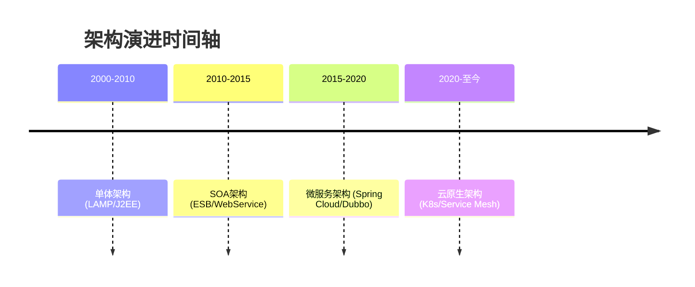

# 系统架构与中间件技术简介

## 🌐 系统架构演进全景

### 架构发展里程碑


### 现代架构核心特征
- **弹性计算**：基于Kubernetes的自动扩缩容
- **服务自治**：独立开发/部署/扩展的微服务单元
- **可观测性**：Metrics/Logging/Tracing三位一体
- **韧性设计**：熔断/降级/限流熔断机制

## 🧩 中间件技术矩阵

### 消息队列选型指南
| 特性          | Kafka             | RabbitMQ          | RocketMQ         |
|---------------|-------------------|-------------------|------------------|
| 吞吐量        | 100K+ TPS         | 10K TPS           | 50K TPS          |
| 消息可靠性    | At-least-once     | Exactly-once      | Exactly-once     |
| 延迟          | 毫秒级            | 微秒级            | 毫秒级           |
| 典型场景      | 日志收集          | 金融交易          | 订单处理         |

### 缓存技术对比

```diff
+ Redis优势：
  - 支持复杂数据结构（Hash/Set等）
  - 原生集群方案（Cluster模式）
  - 持久化能力（RDB/AOF）

- Memcached局限：
  * 仅支持简单KV
  * 无内置高可用方案
```

## ⚡ 核心设计原则

### CAP实践策略

$$
\begin{cases}
\text{CP系统（如Etcd）} & \text{强一致性优先} \\
\text{AP系统（如Cassandra）} & \text{高可用优先}
\end{cases}
$$

### 十二要素应用原则
1. **基准代码**：版本控制下的单一代码库
2. **依赖**：显式声明依赖关系
3. **配置**：环境变量存储配置
4. **后端服务**：视为附加资源
5. **构建/发布/运行**：严格分离阶段
6. **进程**：无状态进程模型
7. **端口绑定**：自我包含服务
8. **并发**：通过进程模型扩展
9. **易处理**：快速启动/优雅终止
10. **开发/生产环境等价**：保持环境一致
11. **日志**：作为事件流处理
12. **管理进程**：一次性任务与常驻进程隔离

## 🛠️ 技术决策框架

### 架构评估矩阵
| 维度         | 权重 | 候选方案A | 候选方案B |
|--------------|------|-----------|-----------|
| 开发效率      | 20%  | ⭐⭐⭐⭐     | ⭐⭐⭐       |
| 运维成本      | 30%  | ⭐⭐⭐       | ⭐⭐⭐⭐⭐    |
| 扩展性        | 25%  | ⭐⭐⭐⭐⭐     | ⭐⭐⭐⭐      |
| 社区生态      | 15%  | ⭐⭐⭐       | ⭐⭐⭐⭐⭐     |
| 安全合规      | 10%  | ⭐⭐⭐⭐      | ⭐⭐⭐        |

### 性能优化公式
$$
\text{系统吞吐量} = \frac{\text{并发数}}{\text{平均响应时间}}
$$

## 📚 文档使用指南

1. **架构设计** → 参考`系统架构/`下的设计模式文档
2. **中间件选型** → 查阅对应中间件的技术白皮书
3. **生产实践** → 学习`最佳实践/`中的场景案例
4. **问题排查** → 使用各中间件的`#Troubleshooting`章节
