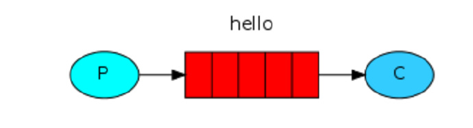

# RabbitMQ消息队列

> 原文参考：<https://www.cnblogs.com/cjaaron/p/9184594.html>

## 什么是RabbitMQ

RabbitMQ是一款基于AMQP协议的消息中间件，它能够在应用之间提供可靠的消息传输。在易用性，扩展性，高可用性上表现优秀。而且使用消息中间件利于应用之间的解耦，生产者（客户端）无需知道消费者（服务端）的存在。而且两端可以使用不同的语言编写，大大提供了灵活性。

## RabbitMQ基本概念

- `exchange`: **producer**只能将消息发送给**exchange**。而**exchange**负责将消息发送到**queues**。**Exchange**必须准确的知道怎么处理它接受到的消息，是被发送到一个特定的**queue**还是许多**quenes**,还是被抛弃，这些规则则是通过**exchange** type来定义。主要的type有**direct**,**topic**,**headers**,**fanout**。具体针对不同的场景使用不同的type。
- `queue`: 消息队列，消息的载体。接收来自**exchange**的消息，然后再由**consumer**取出。**exchange**和**queue**是可以一对多的，它们通过**routingKey**来绑定。
- `Producer`:生产者，消息的来源,消息必须发送给**exchange**。而不是直接给**queue**
- `Consumer`:消费者，直接从**queue**中获取消息进行消费，而不是从**exchange**。

从以上可以看出**RabbitMQ**工作原理大致就是**producer**把一条消息发送给**exchange**。**RabbitMQ**根据**routingKey**负责将消息从**exchange**发送到对应绑定的**queue**中去，这是由**RabbitMQ**负责做的。而**consumer**只需从**queue**获取消息即可。基本效果图如下： 


## 持久化问题

### 消息确认机制

这里就会有一个问题，如果**consumer**在执行任务时需要花费一些时间，这个时候如果突然挂了，消息还没有被完成，消息岂不是丢失了.

为了不让消息丢失，**RabbitMQ**提供了消息确认机制，**consumer**在接收到，执行完消息后会发送一个`ack`给**RabbitMQ**告诉它可以从**queue**中移除消息了。

如果没收到`ack`。**RabbitMQ**会重新发送此条消息，如果有其他的**consumer**在线，将会接收并消费这条消息。

消息确认机制是默认打开的。如果想关闭它只需要设置`no_ack`=`true`。在此处我们不需要设置。默认如下就行。

### 队列持久化

- 除了**consumer**之外我们还得确保**RabbitMQ**挂了之后消息不被丢失。这里我们就需要确保队列**queue**和消息***messages***都得是持久化的。
- 队列的持久话需要设置**durable**属性。

```py
channel.queue_declare(queue= task_queue, durable=True)
```

### 消息持久化

消息的持久话则是通过`delivery_mode`属性，设置值为2即可。

```py
channel.basic_publish(exchange='',
                      routing_key="task_queue",
                      body=message,
                      properties=pika.BasicProperties(
                         delivery_mode = 2, # make message persistent
                      ))
```

## 简单发送模型

在**RabbitMQ**里消息永远不能被直接发送到**queue**。这里我们通过提供一个空字符串来使用默认的**exchange**。这个**exchange**是特殊的，它可以根据**routingKey**把消息发送给指定的**queue**。所以我们的设计看起来如下所示：



> 发送端

```py
import pika
  
connection = pika.BlockingConnection(pika.ConnectionParameters(
               'localhost'))
channel = connection.channel()
  
#声明queue
channel.queue_declare(queue='hello')
  
#n RabbitMQ a message can never be sent directly to the queue, it always needs to go through an exchange.
channel.basic_publish(exchange='',
                      routing_key='hello',
                      body='Hello World!')
print(" [x] Sent 'Hello World!'")
connection.close()
```

> 接收端

```py
import pika
  
connection = pika.BlockingConnection(pika.ConnectionParameters(
               'localhost'))
channel = connection.channel()
  
  
#You may ask why we declare the queue again ‒ we have already declared it in our previous code.
# We could avoid that if we were sure that the queue already exists. For example if send.py program
#was run before. But we're not yet sure which program to run first. In such cases it's a good
# practice to repeat declaring the queue in both programs.
channel.queue_declare(queue='hello')
  
def callback(ch, method, properties, body):
    print(" [x] Received %r" % body)
  
channel.basic_consume(callback,
                      queue='hello',
                      no_ack=True)
  
print(' [*] Waiting for messages. To exit press CTRL+C')
channel.start_consuming()
```

## 工作队列模式

一个生产者发送消息到队列中，有多个消费者共享一个队列，每个消费者获取的消息是唯一的。

### 消息公平分发原则（类似负载均衡）

如果**RabbitMQ**只管按顺序把消息发到各个消费者身上，不考虑消费者负载的话，很可能出现，一个机器配置不高的消费者那里堆积了很多消息处理不完，同时配置高的消费者却一直很轻松。为解决此问题，**可以在各个消费者端，配置`perfetch`=`1`**，意思就是告诉**RabbitMQ**在我这个消费者当前消息还没处理完的时候就不要再给我发新消息了。


```py
channel.basic_qos(prefetch_count=1)
```

> 生产者端

```py
import pika
import sys
  
connection = pika.BlockingConnection(pika.ConnectionParameters(
        host='localhost'))
channel = connection.channel()
  
channel.queue_declare(queue='task_queue', durable=True)
  
message = ' '.join(sys.argv[1:]) or "Hello World!"
channel.basic_publish(exchange='',
                      routing_key='task_queue',
                      body=message,
                      properties=pika.BasicProperties(
                         delivery_mode = 2, # make message persistent
                      ))
print(" [x] Sent %r" % message)
connection.close()
```

> 消费者端

```py
import pika
import time
  
connection = pika.BlockingConnection(pika.ConnectionParameters(
        host='localhost'))
channel = connection.channel()
  
channel.queue_declare(queue='task_queue', durable=True)
print(' [*] Waiting for messages. To exit press CTRL+C')
  
def callback(ch, method, properties, body):
    print(" [x] Received %r" % body)
    time.sleep(body.count(b'.'))
    print(" [x] Done")
    ch.basic_ack(delivery_tag = method.delivery_tag)
  
channel.basic_qos(prefetch_count=1)
channel.basic_consume(callback,
                      queue='task_queue')
  
channel.start_consuming()
```

## Publish\Subscribe(消息发布\订阅)之广播模式

在前面2个示例我们都适用默认的**exchange**。这里我们将自己定义一个**exchange**。并设置type为fanout。它可以将消息广播给绑定的每一个**queue**。而不再是某一个**queue**。


> 生产者端

```py
import pika
import sys
  
connection = pika.BlockingConnection(pika.ConnectionParameters(
        host='localhost'))
channel = connection.channel()
  
channel.exchange_declare(exchange='logs',
                         type='fanout')
  
message = ' '.join(sys.argv[1:]) or "info: Hello World!"
channel.basic_publish(exchange='logs',
                      routing_key='',
                      body=message)
print(" [x] Sent %r" % message)
connection.close()
```

> 消费者端

```py
import pika
  
connection = pika.BlockingConnection(pika.ConnectionParameters(
        host='localhost'))
channel = connection.channel()
  
channel.exchange_declare(exchange='logs',
                         type='fanout')
#不指定queue名字,Rabbit会随机分配一个名字,exclusive=True会在使用此queue的消费者断开后,自动将queue删除
result = channel.queue_declare(exclusive=True)
queue_name = result.method.queue
  
channel.queue_bind(exchange='logs',
                   queue=queue_name)
  
print(' [*] Waiting for logs. To exit press CTRL+C')
  
def callback(ch, method, properties, body):
    print(" [x] %r" % body)
  
channel.basic_consume(callback,
                      queue=queue_name,
                      no_ack=True)
  
channel.start_consuming()
```

## Publish\Subscribe(消息发布\订阅)之direct模式

`RabbitMQ`还支持根据关键字发送，即：队列绑定关键字，发送者将数据根据关键字发送到消息`exchange`，`exchange`根据 关键字 判定应该将数据发送至指定队列。 


> 生产者端

```py
import pika
import sys
  
connection = pika.BlockingConnection(pika.ConnectionParameters(
        host='localhost'))
channel = connection.channel()
  
channel.exchange_declare(exchange='direct_logs',
                         type='direct')
  
severity = sys.argv[1] if len(sys.argv) > 1 else 'info'
message = ' '.join(sys.argv[2:]) or 'Hello World!'
channel.basic_publish(exchange='direct_logs',
                      routing_key=severity,
                      body=message)
print(" [x] Sent %r:%r" % (severity, message))
connection.close()
```

> 消费者端

```py
import pika
import sys
  
connection = pika.BlockingConnection(pika.ConnectionParameters(
        host='localhost'))
channel = connection.channel()
  
channel.exchange_declare(exchange='direct_logs',
                         type='direct')
  
result = channel.queue_declare(exclusive=True)
queue_name = result.method.queue
  
severities = sys.argv[1:]
if not severities:
    sys.stderr.write("Usage: %s [info] [warning] [error]\n" % sys.argv[0])
    sys.exit(1)
  
for severity in severities:
    channel.queue_bind(exchange='direct_logs',
                       queue=queue_name,
                       routing_key=severity)
  
print(' [*] Waiting for logs. To exit press CTRL+C')
  
def callback(ch, method, properties, body):
    print(" [x] %r:%r" % (method.routing_key, body))
  
channel.basic_consume(callback,
                      queue=queue_name,
                      no_ack=True)
  
channel.start_consuming()
```

> 运行结果

发送消息


只收到warning的消息


只收到error的消息


error和waring的都能收到


## Publish\Subscribe(消息发布\订阅)之Topic模式

这种模型是最灵活的，相比较于**direct**的完全匹配和**fanout**的广播。**Topic**可以用类似正则的手法更好的匹配来满足我们的应用。下面我们首先了解一下**topic**类型的**exchange**。

**topic**类型的**routing_key**不可以是随意的单词，它必须是一系列的单词组合，中间以点号隔开，譬如`quick.orange.rabbit`这个样子。发送消息的**routing_key**必须匹配上绑定到队列的**routing_key**。消息才会被发送。

此外还有个重要的地方要说明，在如下代码处绑定的**routing_key**种可以有`*`和`#`2种字符。它们代表的意义如下：

- **`*`(星号)** ：可以匹配任意一个单词
- **`#`(井号)** ：可以匹配0到多个单词


由图可知，*Q1*匹配3个单词中间为**orange**的**routing_key** ,而*Q2*可以匹配3个单词最后一个单词为`rabbit`和第一个单词为`lazy`后面可以有多个单词的**routing_key**。

> 生产者端

```py
import pika
import sys
  
connection = pika.BlockingConnection(pika.ConnectionParameters(
        host='localhost'))
channel = connection.channel()
  
channel.exchange_declare(exchange='topic_logs',
                         type='topic')
  
routing_key = sys.argv[1] if len(sys.argv) > 1 else 'anonymous.info'
message = ' '.join(sys.argv[2:]) or 'Hello World!'
channel.basic_publish(exchange='topic_logs',
                      routing_key=routing_key,
                      body=message)
print(" [x] Sent %r:%r" % (routing_key, message))
connection.close()
```

> 消费者端

```py
import pika
import sys
  
connection = pika.BlockingConnection(pika.ConnectionParameters(
        host='localhost'))
channel = connection.channel()
  
channel.exchange_declare(exchange='topic_logs',
                         type='topic')
  
result = channel.queue_declare(exclusive=True)
queue_name = result.method.queue
  
binding_keys = sys.argv[1:]
if not binding_keys:
    sys.stderr.write("Usage: %s [binding_key]...\n" % sys.argv[0])
    sys.exit(1)
  
for binding_key in binding_keys:
    channel.queue_bind(exchange='topic_logs',
                       queue=queue_name,
                       routing_key=binding_key)
  
print(' [*] Waiting for logs. To exit press CTRL+C')
  
def callback(ch, method, properties, body):
    print(" [x] %r:%r" % (method.routing_key, body))
  
channel.basic_consume(callback,
                      queue=queue_name,
                      no_ack=True)
  
channel.start_consuming()
```

##  RPC模式

当我们需要在远程服务器上执行一个方法并等待它的结果的时候，我们将这种模式称为**RPC**。

在**RabbitMQ**中为了能让**client**收到**server**端的**response message**。需要定义一个**callback queue**，不过现在有一个问题，就是每次请求都会创建一个**callback queue** .这样的效率是极其低下的。幸运的是我们可以通过**correlation_id**为每一个**client**创建一个单独的**callback queue**。通过指定**correlation_id**我们可以知道**callback queue**中的消息属于哪个**client**。要做到这样只需**client**每次发送请求时带上这唯一的**correlation_id**。然后当我们从**callback queue**中收到消息时，我们能基于 **correlation_id** 匹配上我们的消息。匹配不上的消息将被丢弃，看上去就像下图这样：


总结一下流程如下：

1. **client**发起请求，请求中带有2个参数**reply_to**和**correlation_id**
请求发往**rpc_queue**
2. **server**获取到**rpc_queue**中的消息，处理完毕后，将结果发往**reply_to**指定的**callback queue**
3. **client** 获取到**callback queue**中的消息，匹配**correlation_id**,如果匹配就获取，不匹配就丢弃.

> 生产者端

```py
import pika
import time
connection = pika.BlockingConnection(pika.ConnectionParameters(
        host='localhost'))
  
channel = connection.channel()
  
channel.queue_declare(queue='rpc_queue')
  
def fib(n):
    if n == 0:
        return 0
    elif n == 1:
        return 1
    else:
        return fib(n-1) + fib(n-2)
  
def on_request(ch, method, props, body):
    n = int(body)
  
    print(" [.] fib(%s)" % n)
    response = fib(n)
  
    ch.basic_publish(exchange='',
                     routing_key=props.reply_to,
                     properties=pika.BasicProperties(correlation_id = \
                                                         props.correlation_id),
                     body=str(response))
    ch.basic_ack(delivery_tag = method.delivery_tag)
  
channel.basic_qos(prefetch_count=1)
channel.basic_consume(on_request, queue='rpc_queue')
  
print(" [x] Awaiting RPC requests")
channel.start_consuming()
```

> 消费者端

```py
import pika
import uuid
  
class FibonacciRpcClient(object):
    def __init__(self):
        self.connection = pika.BlockingConnection(pika.ConnectionParameters(
                host='localhost'))
  
        self.channel = self.connection.channel()
  
        result = self.channel.queue_declare(exclusive=True)
        self.callback_queue = result.method.queue
  
        self.channel.basic_consume(self.on_response, no_ack=True,
                                   queue=self.callback_queue)
  
    def on_response(self, ch, method, props, body):
        if self.corr_id == props.correlation_id:
            self.response = body
  
    def call(self, n):
        self.response = None
        self.corr_id = str(uuid.uuid4())
        self.channel.basic_publish(exchange='',
                                   routing_key='rpc_queue',
                                   properties=pika.BasicProperties(
                                         reply_to = self.callback_queue,
                                         correlation_id = self.corr_id,
                                         ),
                                   body=str(n))
        while self.response is None:
            self.connection.process_data_events()
        return int(self.response)
  
fibonacci_rpc = FibonacciRpcClient()
  
print(" [x] Requesting fib(30)")
response = fibonacci_rpc.call(30)
print(" [.] Got %r" % response)
```
