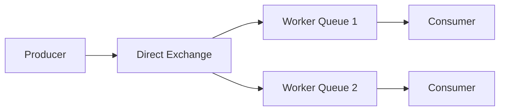
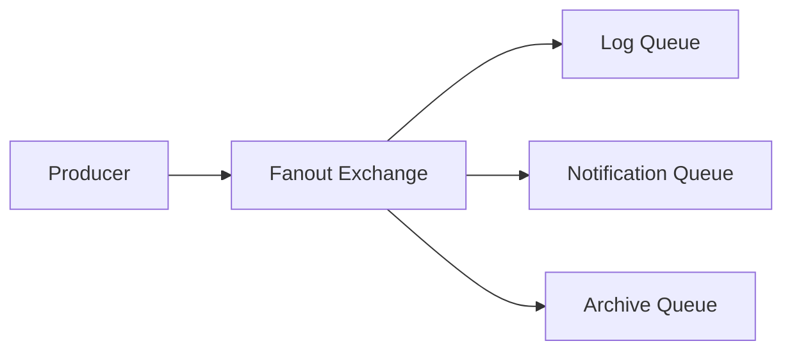
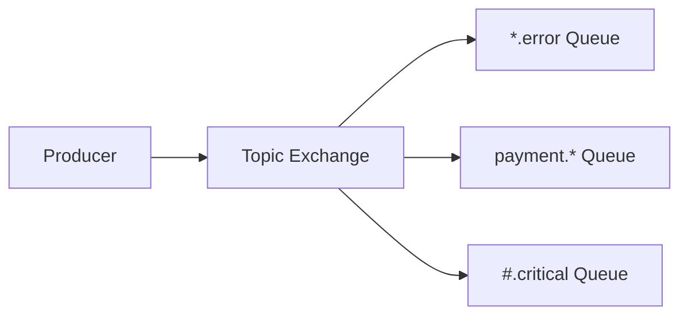

# RabbitMQ支持的消息队列类型及对应用途

## 一、RabbitMQ核心队列类型

### 1. 经典队列(Classic Queue)
**特性**：
- 内存优先的消息处理
- 高性能读写
- 默认队列类型

**数学表示**：
$$
Q_{classic} = \{m_1, m_2, ..., m_n\}
$$

**适用场景**：
```python
# 高吞吐订单处理
channel.queue_declare(
    queue='order.process',
    durable=True,
    arguments={
        'x-max-length': 10000  # 限制队列长度
    }
)
```
- 实时订单处理系统
- 高吞吐量消息缓冲
- 需要快速消费的场景

### 2. 惰性队列(Lazy Queue)
**特性**：
- 消息直接持久化到磁盘
- 减少内存使用
- 适合高堆积场景

**性能公式**：
$$
\text{Memory Usage} \approx \text{Constant}
$$

**适用场景**：
```python
# 日志收集系统
channel.queue_declare(
    queue='log.collect',
    arguments={
        'x-queue-mode': 'lazy'  # 启用惰性模式
    }
)
```
- 日志收集与分析
- 非实时数据处理
- 可能产生消息堆积的场景

## 二、特殊用途队列

### 1. 优先级队列(Priority Queue)
**特性**：
- 支持消息优先级(0-255)
- 高优先级消息优先消费

**优先级公式**：
$$
\text{Next Message} = \max\{m.priority | m \in Q\}
$$

**适用场景**：
```python
# 客服工单系统
channel.queue_declare(
    queue='support.tickets',
    arguments={
        'x-max-priority': 10  # 支持10个优先级
    }
)

# 发送高优先级工单
channel.basic_publish(
    exchange='',
    routing_key='support.tickets',
    body=json.dumps(ticket),
    properties=pika.BasicProperties(
        priority=9  # 紧急工单
    )
)
```
- 客服工单处理
- 紧急任务调度
- VIP用户请求优先处理

### 2. 死信队列(Dead Letter Queue)
**特性**：
- 处理失败消息的存储
- 支持消息重试机制

**路由规则**：
$$
m \rightarrow DLQ \iff \text{Condition}(m) = \text{True}
$$

**适用场景**：
```python
# 支付超时处理
channel.queue_declare(
    queue='payment.pending',
    arguments={
        'x-dead-letter-exchange': 'payment.dlx',
        'x-message-ttl': 1800000  # 30分钟超时
    }
)

# 死信队列处理
channel.basic_consume(
    queue='payment.dlq',
    on_message_callback=handle_failed_payment
)
```
- 订单超时取消
- 支付失败处理
- 异常消息重试机制

### 3. 临时队列(Temporary Queue)
**特性**：
- 自动删除(auto-delete)
- 独占(exclusive)
- 匿名(自动生成名称)

**生命周期**：
$$
\text{Lifetime} = \begin{cases}
\text{Connection Duration} & \text{exclusive} \\
\text{Last Consumer Closed} & \text{auto-delete}
\end{cases}
$$

**适用场景**：
```python
# RPC调用响应队列
result = channel.queue_declare(
    queue='',
    exclusive=True  # 临时队列
)
callback_queue = result.method.queue

channel.basic_publish(
    exchange='',
    routing_key='rpc.request',
    properties=pika.BasicProperties(
        reply_to=callback_queue
    ),
    body=request_body
)
```
- RPC调用响应
- 临时任务分发
- 一次性消息处理

## 三、队列参数与用途对照表

| 参数                  | 用途说明                     | 典型值示例           | 适用场景                  |
|-----------------------|----------------------------|---------------------|--------------------------|
| x-max-length          | 限制队列最大消息数           | 1000, 10000         | 防止队列无限增长          |
| x-message-ttl         | 消息存活时间(毫秒)           | 60000 (1分钟)       | 延迟任务、超时处理        |
| x-expires             | 队列自动删除时间(毫秒)       | 86400000 (24小时)   | 临时数据收集              |
| x-max-priority        | 支持的最大优先级级别         | 10                  | 优先级任务调度            |
| x-queue-mode          | 队列模式(lazy/classic)      | "lazy"              | 高堆积非实时数据          |
| x-dead-letter-exchange| 指定死信交换机              | "dlx.exchange"      | 异常消息处理              |
| x-ha-policy           | 镜像队列策略                | "all", "nodes"      | 高可用集群部署            |

## 四、交换机与队列组合模式

### 1. 工作队列模式(Work Queue)


**特点**：
- 负载均衡分发
- 消息竞争消费
- 典型配置：
  ```python
  channel.basic_qos(prefetch_count=1)  # 公平分发
  ```

**用途**：
- 任务分发系统
- 资源密集型处理
- 并行计算任务

### 2. 发布订阅模式(Publish/Subscribe)


**特点**：
- 消息广播
- 多消费者独立处理
- 典型配置：
  ```python
  channel.exchange_declare(exchange='logs', exchange_type='fanout')
  ```

**用途**：
- 系统日志收集
- 事件通知广播
- 数据多路复用

### 3. 路由选择模式(Routing)


**特点**：
- 灵活的路由键匹配
- 支持通配符(*, #)
- 典型配置：
  ```python
  channel.queue_bind(exchange='topic_logs',
                    queue='payment_errors',
                    routing_key='payment.error')
  ```

**用途**：
- 分类日志处理
- 多维度消息过滤
- 复杂事件路由

## 五、典型行业应用案例

### 1. 电商系统架构
```
[订单服务] --创建订单--> [订单队列] --> [库存服务]
                     --> [支付服务]
                     --> [物流服务]
```

**队列配置**：
```python
# 订单状态更新队列
channel.queue_declare(
    queue='order.status',
    arguments={
        'x-message-ttl': 86400000,  # 24小时
        'x-dead-letter-exchange': 'order.dlx'
    }
)

# 支付超时死信队列
channel.queue_declare(
    queue='order.payment.timeout',
    arguments={
        'x-message-ttl': 1800000,  # 30分钟
        'x-dead-letter-exchange': 'order.dlx'
    }
)
```

### 2. 金融交易系统
**关键要求**：
- 消息不丢失
- 严格顺序
- 事务支持

**解决方案**：
```python
# 启用发布确认
channel.confirm_delivery()

# 事务消息发送
with channel.tx():
    # 本地数据库操作
    db.execute("UPDATE accounts SET balance = balance - 100 WHERE id = 1")
    
    # 发送消息
    channel.basic_publish(
        exchange='txn',
        routing_key='transfer',
        body=json.dumps(txn),
        properties=pika.BasicProperties(
            delivery_mode=2  # 持久化
        )
    )
    
    # 提交事务
    channel.tx_commit()
```

### 3. 物联网数据处理
**架构特点**：
```
[设备] --MQTT--> [RabbitMQ] --AMQP--> [数据处理服务]
                         --STOMP--> [Web Dashboard]
```

**队列配置**：
```python
# 设备数据队列
channel.queue_declare(
    queue='iot.data.raw',
    arguments={
        'x-queue-mode': 'lazy',  # 高数据量
        'x-max-length': 100000
    }
)

# 告警队列
channel.queue_declare(
    queue='iot.alerts',
    arguments={
        'x-max-priority': 5,  # 5级告警级别
        'x-message-ttl': 3600000  # 1小时过期
    }
)
```

## 六、性能优化指南

### 1. 队列参数调优公式
**最优预取值计算**：
$$
\text{prefetch_count} = \lceil \frac{T_{process}}{T_{network}} \rceil + 1
$$

**内存控制参数**：
$$
\text{vm_memory_high_watermark} = \begin{cases}
0.4 \times \text{RAM} & \text{默认值} \\
<0.5 \times \text{RAM} & \text{生产推荐}
\end{cases}
$$

### 2. 集群部署建议
**镜像队列配置**：
```bash
# 设置镜像策略(所有节点)
rabbitmqctl set_policy ha-all "^ha\." '{"ha-mode":"all"}'

# 设置镜像策略(指定节点)
rabbitmqctl set_policy ha-nodes "^nodes\." \
  '{"ha-mode":"nodes","ha-params":["rabbit@node1","rabbit@node2"]}'
```

### 3. 监控关键指标
| 指标名称               | 计算公式                     | 健康阈值          |
|------------------------|----------------------------|-------------------|
| 消息堆积率             | $\frac{\text{messages_ready}}{\text{x-max-length}}$ | <0.7             |
| 消费者利用率           | $\frac{\text{deliver_rate}}{\text{ack_rate}}$     | >0.9             |
| 内存压力               | $\frac{\text{mem_used}}{\text{mem_limit}}$        | <0.6             |

RabbitMQ的队列类型和参数配置提供了极大的灵活性，可以根据不同业务场景的需求进行针对性优化。建议在实施前通过模拟真实流量进行性能测试，确保配置参数满足实际业务需求。