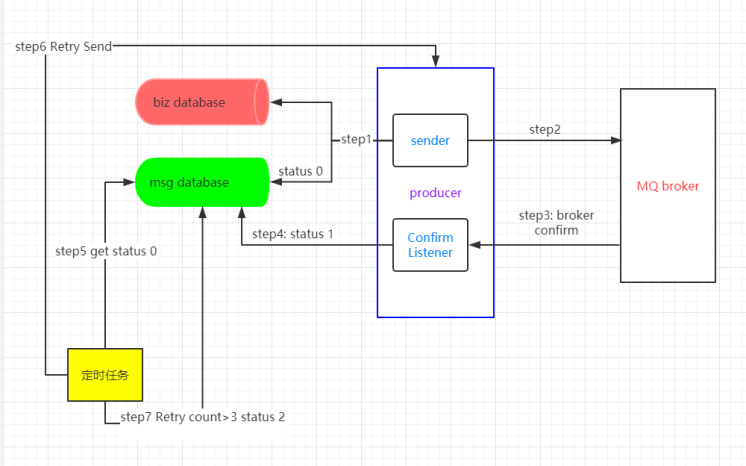
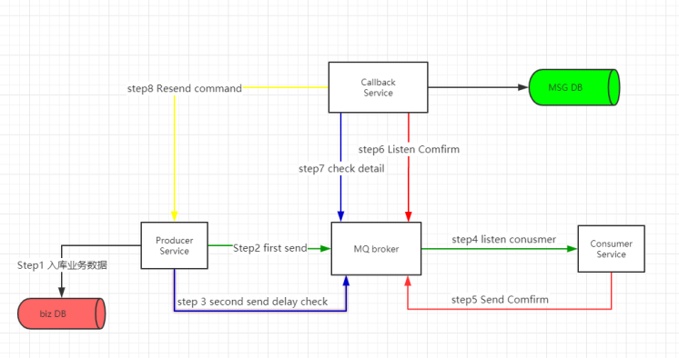

# RabbitMQ生产端保证消息100%投递成功

> 来源：<https://www.yuque.com/wyg0405/rabbitmq/tnkp4u>

## 什么是生产端的可靠性投递

- 保证消息成功发出
- 保证MQ节点的成功接收
- 发送端收到MQ节点(borker)的确认应答
- 完善的消息补偿机制

## 互联网大厂生产端可靠性投递方案

> 消息落库对消息状态进行打标

1. 生产者将业务数据和消息入库，并设置信息状态为0，即初始待投递
2. 生产者将消息发送至broker
3. broker向生产者发送确认
4. 生产者收到broker确认后修改消息状态为1，即消息投递成功
5. 系统定时任务扫描未投递成功的消息
6. 生产者将为成功投递的消息重发给broker，并记录重发次数
7. 当重发次数大于3时，此时修改消息状态为2，即投递失败。对于投递失败的消息启用补偿机制或人工去处理失败消息

**存在问题**

*在高并发场景下，每次要对业务数据和消息数据入库，数据库会遇到瓶颈。  
故采用下面的消息的延迟投递，做二次检查，回调确认的方案。*

### 消息的延迟投递，做二次检查，回调确认

1. 先将业务数据入库
2. 生产者第一次向broker发送消息
3. 生产者第二次向broker发送check延迟消息，一般按自己业务设为2min-5min.
4. Consumer从messageQueue获取消息
5. Consumer成功消费消息后，向broker发送确认消息(设其队列名为ConsumerQueueConfirm)
6. CallbackService监听ConsumerQueueConfirm，并将成功消费的消息入库MSG DB
7. 同时CallbackService监听checkdetailQueue,并去MSG DB查询该消息是否被成功消费
8. 若查询不到check message，则CallbackService向ProducerService发送RPC请求，让其重发消息，设置重发次数，达到重发次数后，设置其为消费失败
9. 人工处理因网络闪断或者业务问题产生的未成功消费消息，系统消息投递几乎达到100%

**注意**

*互联网大厂一般不会考虑分布式事务，都用补偿机制。  
在高并发下，少做一次数据库持久操作，提高系统处理能力，故将业务和消息的持久化拆开。*