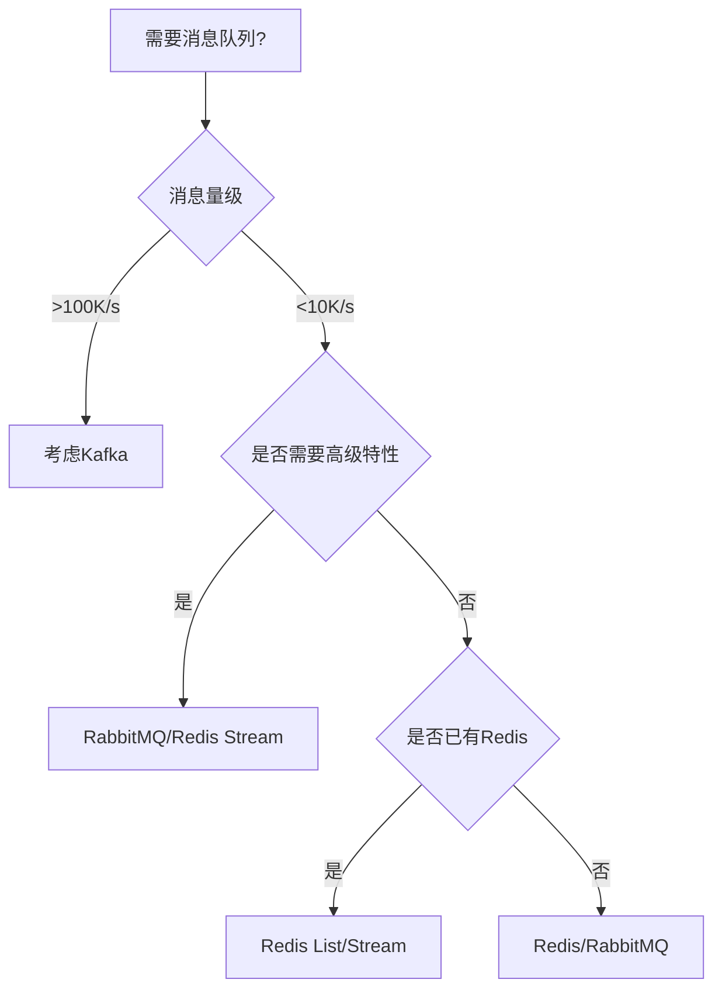

# Redis支持的消息队列类型及对应用途

## 一、Redis原生消息队列实现

### 1. List类型队列
**基本操作**：
- 生产者：`LPUSH`/`RPUSH`
- 消费者：`BRPOP`/`BLPOP`（阻塞式）

**特性公式**：
$$
\text{List Queue} = [v_1, v_2, ..., v_n]
$$

**典型用途**：
```python
# 简单任务队列实现
def producer():
    redis.lpush('workqueue', json.dumps(task))

def consumer():
    while True:
        # 阻塞式获取，超时5秒
        _, task_json = redis.brpop('workqueue', timeout=5)
        if task_json:
            process_task(json.loads(task_json))
```
- 异步任务处理
- 简单的生产者-消费者模式
- 轻量级消息缓冲

**优缺点**：
```
优点：
✓ 实现简单
✓ 内存效率高
✓ 支持阻塞操作

缺点：
× 无消息确认机制
× 无优先级支持
× 无严格顺序保证
```

### 2. Pub/Sub模式
**消息流模型**：
$$
P \rightarrow \text{Channel} \rightarrow \{S_1, S_2, ..., S_n\}
$$

**典型用途**：
```python
# 事件发布
redis.publish('order_created', order_json)

# 事件订阅
pubsub = redis.pubsub()
pubsub.subscribe('order_created')

for message in pubsub.listen():
    handle_order(message['data'])
```
- 实时事件通知
- 系统状态广播
- 即时通讯应用

**特点对比**：

| 特性            | List队列        | Pub/Sub          |
|----------------|----------------|------------------|
| 消息持久化      | 是             | 否               |
| 消费者模型      | 竞争消费       | 广播消费         |
| 阻塞支持        | 是             | 是               |
| 历史消息        | 可保留         | 实时消息         |

## 二、Redis Stream类型（5.0+）

### 1. 基本消息队列
**核心命令**：
- `XADD`：添加消息
- `XREAD`：消费消息
- `XACK`：确认消息

**数据结构**：
$$
\text{Stream} = [(ID_1, \{k:v\}), (ID_2, \{k:v\}), ...]
$$

**典型用途**：
```java
// Java Jedis示例
// 生产者
String id = jedis.xadd("order_stream", StreamEntryID.NEW_ENTRY, orderMap);

// 消费者
List<Map.Entry<String, List<StreamEntry>>> streams = 
    jedis.xread(COUNT, BLOCK_TIME, 
        new XReadParams().block(BLOCK_TIME).count(COUNT),
        Collections.singletonMap("order_stream", StreamEntryID.LAST_ENTRY));

// 消息确认
jedis.xack("order_stream", "consumer_group", id);
```
- 金融交易处理
- 需要消息确认的场景
- 严格顺序要求的业务

### 2. 消费者组模式
**架构模型**：
```
Producer → Stream → Consumer Group → {Consumer1, Consumer2}
```

**关键特性**：
- 消息负载均衡
- 消费进度跟踪
- 消息重处理能力

**典型配置**：
```bash
# 创建消费者组
XGROUP CREATE order_stream order_group $ MKSTREAM

# 消费者读取
XREADGROUP GROUP order_group consumer1 COUNT 1 STREAMS order_stream >
```

**适用场景**：
- 分布式任务处理
- 多消费者协作
- 需要断点续传的场景

## 三、Redis作为消息队列的进阶用法

### 1. 延迟队列实现
**实现方案**：
1. 有序集合(ZSET)存储 + 定时轮询
2. Redis 5.0+的Stream特性

**ZSET方案代码**：
```python
def add_delayed_task(task, delay):
    # 计算执行时间戳
    execute_at = time.time() + delay
    redis.zadd("delayed_queue", {json.dumps(task): execute_at})

def process_delayed_tasks():
    while True:
        # 获取到期任务
        tasks = redis.zrangebyscore("delayed_queue", 0, time.time(), start=0, num=1)
        if tasks:
            task = json.loads(tasks[0])
            process_task(task)
            redis.zrem("delayed_queue", tasks[0])
        time.sleep(0.1)  # 避免CPU空转
```
- 订单超时取消
- 定时任务调度
- 延迟通知发送

### 2. 优先级队列
**实现方案**：
```python
def add_priority_task(task, priority):
    redis.zadd("priority_queue", {json.dumps(task): priority})

def get_highest_priority_task():
    # 获取最高优先级任务
    tasks = redis.zrevrange("priority_queue", 0, 0)
    if tasks:
        task = json.loads(tasks[0])
        redis.zrem("priority_queue", tasks[0])
        return task
    return None
```
- 紧急任务处理
- VIP客户请求优先
- 告警分级处理

## 四、Redis与其他消息队列对比

### 1. 特性对比矩阵
| 特性                | Redis List | Redis Stream | RabbitMQ | Kafka |
|---------------------|------------|--------------|----------|-------|
| 持久化              | ✓          | ✓            | ✓        | ✓     |
| 消息确认            | ×          | ✓            | ✓        | ✓     |
| 消费者组            | ×          | ✓            | ✓        | ✓     |
| 严格顺序            | 部分       | ✓            | ✓        | ✓     |
| 延迟消息            | 需实现     | 需实现       | ✓        | ×     |
| 吞吐量              | 高         | 中高         | 中       | 极高  |
| 集群支持            | ✓          | ✓            | ✓        | ✓     |

### 2. 选型决策树


## 五、Redis消息队列最佳实践

### 1. 生产环境配置建议
```redis
# redis.conf 关键参数
maxmemory 8gb
maxmemory-policy volatile-lru
notify-keyspace-events Ex
client-output-buffer-limit pubsub 256mb 128mb 60
```

### 2. 监控关键指标
| 指标                | 计算公式                     | 告警阈值        |
|---------------------|----------------------------|-----------------|
| 消息堆积量          | `LLEN queue_name`          | >10,000         |
| 内存使用率          | `used_memory/maxmemory`    | >0.8            |
| 消费者延迟          | `XINFO GROUPS stream_name` | pending >1000   |
| 连接数              | `connected_clients`        | >5000           |

### 3. 典型异常处理

**消息丢失防护**：
```python
# 生产端确认模式
def safe_publish(redis, queue, message):
    try:
        if redis.rpush(queue, message) > 0:
            return True
    except Exception as e:
        log_error(e)
        save_to_local_storage(message)  # 降级存储
    return False
```

**消费者幂等处理**：
```java
// Java示例：使用Redis原子操作实现幂等
public boolean isProcessed(String messageId) {
    String key = "msg:" + messageId;
    return jedis.setnx(key, "1") == 0 ? true : false;
}
```

## 六、行业应用案例

### 1. 电商秒杀系统
**架构**：
```
[用户请求] → [Redis List] → [秒杀处理器] → [订单系统]
```

**关键实现**：
```python
def handle_seckill(user_id, item_id):
    # 使用LPUSH加入秒杀队列
    redis.lpush("seckill_queue", f"{user_id}:{item_id}")
    
    # 使用INCR防止超卖
    inventory_key = f"inventory:{item_id}"
    if redis.incr(inventory_key) > MAX_INVENTORY:
        redis.decr(inventory_key)
        return False
    return True
```

### 2. 实时日志处理
**架构**：
```
[应用节点] → [Redis Stream] → [日志处理器集群] → [ES/数据库]
```

**配置示例**：
```bash
# 创建日志消费者组
XGROUP CREATE log_stream log_consumer_group $ MKSTREAM
```

### 3. IoT设备控制
**消息流**：
```
[设备] → [MQTT Broker] → [Redis Stream] → [控制服务]
```

**设备指令示例**：
```json
{
  "device_id": "thermostat-001",
  "command": "set_temperature",
  "value": 24.5,
  "timestamp": 1630000000
}
```

Redis作为消息队列虽然功能不如专业MQ全面，但在适当场景下能提供极高的性能和简洁的实现方案。建议在以下场景优先考虑Redis：
1. 已有Redis基础设施
2. 消息量中等(<10K/s)
3. 需要极低延迟
4. 与其他Redis数据结构的协同操作

对于需要严格消息顺序、高可靠性和复杂路由的场景，建议评估RabbitMQ或Kafka等专业消息中间件。