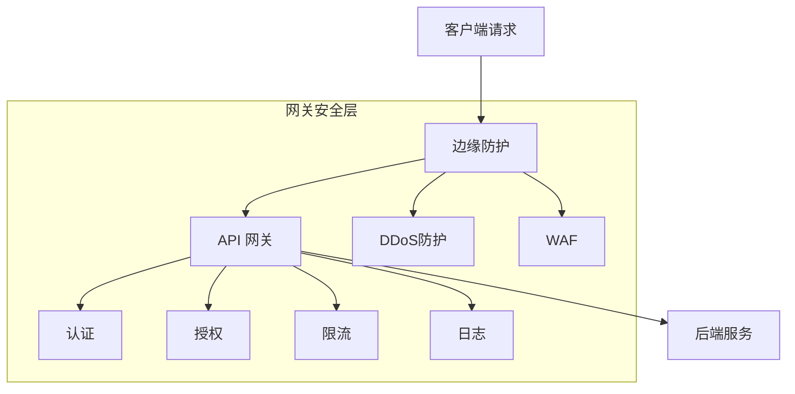

# API 网关安全指南

## 概述

API 网关作为所有 API 流量的统一入口点，是实施安全控制的理想位置。正确的网关安全配置可以保护后端服务免受各种攻击，同时提供统一的认证、授权和监控能力。

## 安全架构

### 防御纵深架构


## 核心安全功能

### 1. 认证 (Authentication)
**验证客户端身份**

#### JWT 验证
```yaml
# Kong 网关 JWT 配置
apiVersion: configuration.konghq.com/v1
kind: KongPlugin
metadata:
  name: jwt-auth
plugin: jwt
config:
  uri_param_names:
    - token
  cookie_names:
    - auth_token
  claims_to_verify:
    - exp
    - nbf
```

#### OAuth2.0 认证
```yaml
# Spring Cloud Gateway OAuth2 配置
spring:
  security:
    oauth2:
      resourceserver:
        jwt:
          issuer-uri: https://auth.example.com
          jwk-set-uri: https://auth.example.com/.well-known/jwks.json
```

### 2. 授权 (Authorization)
**控制访问权限**

#### 基于角色的访问控制
```yaml
# Apache APISIX 授权配置
plugins:
  - name: authz-keycloak
    enable: true
    config:
      token_endpoint: https://auth.example.com/auth/realms/master/protocol/openid-connect/token
      permissions:
        - path: /api/admin/*
          methods: ["GET", "POST", "PUT", "DELETE"]
          roles: ["admin"]
        - path: /api/users/*
          methods: ["GET", "POST"]
          roles: ["user", "admin"]
```

#### API 权限验证
```javascript
// 自定义授权中间件
const authorize = (requiredPermissions) => {
  return (req, res, next) => {
    const userPermissions = req.user?.permissions || [];
    const hasPermission = requiredPermissions.some(perm => 
      userPermissions.includes(perm)
    );
    
    if (!hasPermission) {
      return res.status(403).json({ error: 'Insufficient permissions' });
    }
    next();
  };
};

// 使用示例
app.get('/api/admin', authorize(['admin:read']), adminController);
```

### 3. 输入验证
**防止恶意输入**

#### Schema 验证
```yaml
# JSON Schema 验证配置
plugins:
  - name: request-validation
    config:
      body_schema:
        type: object
        required: [username, email]
        properties:
          username:
            type: string
            minLength: 3
            maxLength: 20
          email:
            type: string
            format: email
          age:
            type: integer
            minimum: 0
            maximum: 120
```

#### SQL 注入防护
```javascript
// 输入清理中间件
const sanitizeInput = (req, res, next) => {
  const sanitize = (obj) => {
    for (let key in obj) {
      if (typeof obj[key] === 'string') {
        obj[key] = obj[key].replace(/['";\\]/g, '');
      } else if (typeof obj[key] === 'object') {
        sanitize(obj[key]);
      }
    }
  };
  
  sanitize(req.body);
  sanitize(req.query);
  sanitize(req.params);
  next();
};

app.use(sanitizeInput);
```

### 4. 速率限制
**防止滥用和DDoS攻击**

#### 全局限流
```yaml
# Nginx 限流配置
http {
  limit_req_zone $binary_remote_addr zone=api_limit:10m rate=10r/s;
  
  server {
    location /api/ {
      limit_req zone=api_limit burst=20 nodelay;
      proxy_pass http://backend;
    }
  }
}
```

#### 基于用户的限流
```javascript
// Redis 实现的用户限流
const rateLimit = require('express-rate-limit');
const RedisStore = require('rate-limit-redis');

const userLimiter = rateLimit({
  store: new RedisStore({
    expiry: 60,
    prefix: 'rate_limit:'
  }),
  windowMs: 60 * 1000, // 1分钟
  max: async (req) => {
    const userTier = req.user?.tier || 'free';
    return userTier === 'premium' ? 100 : 10;
  },
  message: 'Too many requests from this user'
});
```

### 5. SSL/TLS 配置
**加密通信通道**

#### 强密码套件配置
```nginx
# Nginx SSL 配置
server {
  listen 443 ssl http2;
  ssl_protocols TLSv1.2 TLSv1.3;
  ssl_ciphers ECDHE-ECDSA-AES256-GCM-SHA384:ECDHE-RSA-AES256-GCM-SHA384;
  ssl_prefer_server_ciphers off;
  ssl_session_timeout 1d;
  ssl_session_cache shared:SSL:50m;
  ssl_session_tickets off;
  
  # HSTS 头部
  add_header Strict-Transport-Security "max-age=63072000" always;
}
```

## 高级安全特性

### 1. API 密钥管理
```yaml
# Kong API 密钥配置
consumers:
  - username: mobile-app
    keyauth_credentials:
      - key: abc123def456ghi789
plugins:
  - name: key-auth
    config:
      key_names: ["X-API-Key"]
      hide_credentials: true
```

### 2. 机器人检测
```javascript
// 机器人行为检测
const detectBot = (req) => {
  const userAgent = req.get('User-Agent') || '';
  const botPatterns = [
    /bot/, /crawl/, /spider/, /slurp/, 
    /search/, /archiver/, /discord/, /twitter/
  ];
  
  return botPatterns.some(pattern => pattern.test(userAgent.toLowerCase()));
};

app.use((req, res, next) => {
  if (detectBot(req)) {
    req.isBot = true;
    // 应用更严格的限流规则
  }
  next();
});
```

### 3. 请求重放保护
```javascript
// 重放攻击防护
const replayProtection = (req, res, next) => {
  const nonce = req.get('X-Nonce');
  const timestamp = req.get('X-Timestamp');
  
  if (!nonce || !timestamp) {
    return res.status(400).json({ error: 'Missing security headers' });
  }
  
  const currentTime = Date.now();
  const requestTime = parseInt(timestamp);
  
  // 检查时间窗口（5分钟）
  if (Math.abs(currentTime - requestTime) > 5 * 60 * 1000) {
    return res.status(400).json({ error: 'Request timestamp expired' });
  }
  
  // 检查nonce是否已使用
  const nonceKey = `nonce:${nonce}`;
  if (redisClient.get(nonceKey)) {
    return res.status(400).json({ error: 'Request already processed' });
  }
  
  // 存储nonce，设置5分钟过期
  redisClient.setex(nonceKey, 300, 'used');
  next();
};
```

### 4. 敏感数据过滤
```yaml
# 响应数据过滤配置
plugins:
  - name: response-transformer
    config:
      remove:
        json:
          - $.password
          - $.credit_card
          - $.ssn
          - $.api_key
      rename:
        headers:
          - from: X-Server-Version
            to: X-Backend-Version
```

## 监控与审计

### 安全日志记录
```yaml
# 结构化日志配置
logging:
  format: json
  fields:
    timestamp: true
    client_ip: true
    user_agent: true
    user_id: true
    request_id: true
  level: info
```

### 实时监控告警
```yaml
# Prometheus 监控配置
metrics:
  enabled: true
  port: 9090
  path: /metrics
  rules:
    - alert: HighErrorRate
      expr: rate(http_requests_total{status=~"5.."}[5m]) / rate(http_requests_total[5m]) > 0.1
      for: 5m
      labels:
        severity: warning
      annotations:
        summary: "High error rate on API gateway"
```

## 网络层安全

### Web 应用防火墙 (WAF)
```yaml
# ModSecurity WAF 规则
SecRuleEngine On
SecRule REQUEST_HEADERS:User-Agent "@pm sqlmap nikta" "id:1001,deny,status:403"
SecRule ARGS "@detectSQLi" "id:1002,deny,status:403"
SecRule ARGS "@detectXSS" "id:1003,deny,status:403"
```

### DDoS 防护
```nginx
# Nginx DDoS 防护
limit_conn_zone $binary_remote_addr zone=perip:10m;
limit_conn_zone $server_name zone=perserver:10m;

server {
  limit_conn perip 10;
  limit_conn perserver 100;
  
  # 慢连接防护
  client_body_timeout 5s;
  client_header_timeout 5s;
}
```

## 密钥管理

### 安全密钥存储
```yaml
# Kubernetes Secret 管理
apiVersion: v1
kind: Secret
metadata:
  name: api-gateway-secrets
type: Opaque
data:
  jwt-secret: base64EncodedValue
  api-keys: base64EncodedValue
  database-url: base64EncodedValue
```

### 密钥轮换策略
```bash
#!/bin/bash
# 自动密钥轮换脚本
rotate_secrets() {
  # 生成新密钥
  new_jwt_secret=$(openssl rand -base64 32)
  new_api_key=$(uuidgen | tr -d '-')
  
  # 更新 Kubernetes Secret
  kubectl create secret generic api-gateway-secrets-new \
    --from-literal=jwt-secret=$new_jwt_secret \
    --from-literal=api-keys=$new_api_key \
    --dry-run=client -o yaml | kubectl apply -f -
  
  # 逐步切换
  kubectl rollout restart deployment/api-gateway
  sleep 30
  kubectl delete secret api-gateway-secrets-old
}
```

## 安全头部配置

### HTTP 安全头部
```nginx
# 安全头部配置
server {
  add_header X-Frame-Options "SAMEORIGIN" always;
  add_header X-Content-Type-Options "nosniff" always;
  add_header X-XSS-Protection "1; mode=block" always;
  add_header Referrer-Policy "strict-origin-when-cross-origin" always;
  add_header Content-Security-Policy "default-src 'self'" always;
  
  # CORS 配置
  add_header Access-Control-Allow-Origin "https://trusted-domain.com" always;
  add_header Access-Control-Allow-Methods "GET, POST, OPTIONS" always;
  add_header Access-Control-Allow-Headers "Authorization, Content-Type" always;
  add_header Access-Control-Allow-Credentials "true" always;
}
```

## 漏洞防护

### 常见漏洞防护

#### SQL 注入防护
```javascript
// 参数化查询强制
const enforceParameterizedQueries = (req, res, next) => {
  const suspiciousPatterns = [
    /union.*select/i,
    /insert.*into/i,
    /delete.*from/i,
    /drop.*table/i,
    /--|#/,
    /;/,
    /\/\*.*\*\//
  ];
  
  const checkValue = (value) => {
    if (typeof value === 'string') {
      return suspiciousPatterns.some(pattern => pattern.test(value));
    }
    return false;
  };
  
  const hasInjection = Object.values(req.query).some(checkValue) ||
                      Object.values(req.body).some(checkValue);
  
  if (hasInjection) {
    return res.status(400).json({ error: 'Invalid input detected' });
  }
  
  next();
};
```

#### XSS 防护
```javascript
// XSS 防护中间件
const xssProtection = (req, res, next) => {
  const sanitize = (obj) => {
    for (let key in obj) {
      if (typeof obj[key] === 'string') {
        obj[key] = obj[key]
          .replace(/</g, '&lt;')
          .replace(/>/g, '&gt;')
          .replace(/"/g, '&quot;')
          .replace(/'/g, '&#x27;');
      } else if (typeof obj[key] === 'object') {
        sanitize(obj[key]);
      }
    }
  };
  
  sanitize(req.body);
  sanitize(req.query);
  next();
};
```

## 灾难恢复

### 备份策略
```yaml
# 网关配置备份
backup:
  schedule: "0 2 * * *"  # 每天凌晨2点
  retention: 30d
  storage:
    type: s3
    bucket: api-gateway-backups
    path: /config-backups
```

### 故障转移配置
```yaml
# HAProxy 故障转移
backend api_gateway
  mode http
  balance roundrobin
  option httpchk GET /health
  server gateway1 192.168.1.10:80 check
  server gateway2 192.168.1.11:80 check backup
```

## 合规性要求

### GDPR 合规
```yaml
# 数据保护配置
data_protection:
  enabled: true
  rules:
    - pattern: "/api/users/*"
      actions:
        - mask_fields: ["email", "phone"]
        - log_redaction: true
    - pattern: "/api/payments/*"
      actions:
        - encrypt_fields: ["credit_card", "cvv"]
```

### PCI DSS 合规
```yaml
# 支付卡数据安全
pci_compliance:
  enabled: true
  rules:
    - no_storage: true
    - encryption: required
    - access_logging: required
    - regular_scanning: true
```

## 最佳实践总结

### 安全配置清单
```markdown
- [ ] 启用HTTPS并配置强密码套件
- [ ] 实施严格的认证和授权
- [ ] 配置适当的速率限制
- [ ] 启用请求和响应验证
- [ ] 设置安全HTTP头部
- [ ] 实施完整的日志记录和监控
- [ ] 定期进行安全扫描和渗透测试
- [ ] 建立密钥管理策略
- [ ] 配置灾难恢复和备份
- [ ] 保持网关软件更新
```

### 定期安全审计
```bash
# 安全审计脚本
#!/bin/bash
audit_api_gateway() {
  echo "正在执行API网关安全审计..."
  
  # 检查SSL配置
  openssl s_client -connect gateway.example.com:443 | grep "SSL-Session"
  
  # 检查安全头部
  curl -I https://gateway.example.com | grep -i "x-"
  
  # 检查端口暴露
  nmap -sS gateway.example.com
  
  # 检查日志配置
  check_logging_config
  
  echo "审计完成"
}
```

## 总结

API 网关安全是一个多层次、多维度的综合体系。通过实施上述安全措施，可以构建一个坚固的API防护体系：

**核心防护层：**
1. **网络层**: WAF、DDoS防护、防火墙
2. **传输层**: TLS加密、证书管理
3. **应用层**: 认证、授权、输入验证
4. **数据层**: 敏感数据保护、加密

**运营安全：**
1. **监控**: 实时监控和告警
2. **审计**: 日志记录和分析
3. **合规**: 满足法规要求
4. **响应**: 应急响应流程

> 重要：安全是一个持续的过程，需要定期评估和更新安全策略以应对新的威胁。

***
*相关阅读：./microservice-security.md | ./zero-trust-architecture.md | ./api-security-monitoring.md*