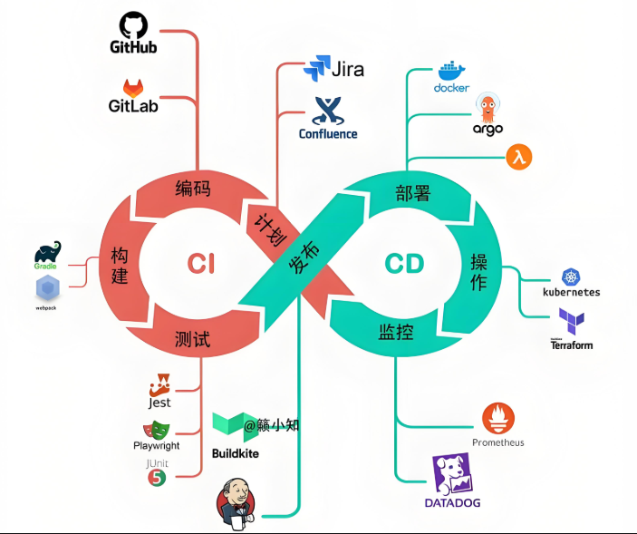

# CI/CD 流水线指南

## 概述

CI/CD（持续集成/持续部署）是现代软件开发的基石，通过自动化构建、测试和部署流程，实现快速、可靠的软件交付。完整的CI/CD流水线涵盖代码提交到生产部署的全生命周期。

## 流水线架构

### 完整CI/CD流程



## 主流CI/CD平台

### 1. Jenkins Pipeline
**最流行的自托管CI/CD工具**

```groovy
// Jenkinsfile
pipeline {
    agent any
    tools {
        maven 'Maven-3.8.4'
        jdk 'JDK-17'
    }
    
    environment {
        DOCKER_REGISTRY = 'registry.example.com'
        PROJECT_NAME = 'user-service'
        VERSION = "${env.BUILD_ID}"
    }
    
    stages {
        stage('代码检查') {
            steps {
                sh 'mvn checkstyle:check'
                sh 'mvn spotbugs:check'
            }
        }
        
        stage('单元测试') {
            steps {
                sh 'mvn test -DskipTests=false'
            }
            post {
                always {
                    junit 'target/surefire-reports/*.xml'
                }
            }
        }
        
        stage('构建镜像') {
            steps {
                script {
                    docker.build("${DOCKER_REGISTRY}/${PROJECT_NAME}:${VERSION}")
                }
            }
        }
        
        stage('安全扫描') {
            steps {
                sh 'trivy image ${DOCKER_REGISTRY}/${PROJECT_NAME}:${VERSION}'
                sh 'docker scout quickview ${DOCKER_REGISTRY}/${PROJECT_NAME}:${VERSION}'
            }
        }
        
        stage('推送镜像') {
            steps {
                script {
                    docker.withRegistry('https://${DOCKER_REGISTRY}', 'docker-credentials') {
                        docker.image("${DOCKER_REGISTRY}/${PROJECT_NAME}:${VERSION}").push()
                    }
                }
            }
        }
        
        stage('部署测试环境') {
            steps {
                sh 'kubectl apply -f k8s/test-deployment.yaml'
                sh 'kubectl rollout status deployment/user-service-test'
            }
        }
        
        stage('集成测试') {
            steps {
                sh 'mvn verify -Pintegration-test'
            }
        }
        
        stage('部署生产') {
            when {
                branch 'main'
            }
            steps {
                sh 'kubectl apply -f k8s/prod-deployment.yaml'
                sh 'kubectl rollout status deployment/user-service-prod'
            }
        }
    }
    
    post {
        always {
            cleanWs()
            emailext (
                subject: "构建结果: ${currentBuild.currentResult} - ${env.JOB_NAME}",
                body: "构建详情: ${env.BUILD_URL}",
                recipientProviders: [[$class: 'DevelopersRecipientProvider']]
            )
        }
    }
}
```

### 2. GitHub Actions
**GitHub原生CI/CD解决方案**

```yaml
# .github/workflows/ci-cd.yml
name: CI/CD Pipeline

on:
  push:
    branches: [ main, develop ]
  pull_request:
    branches: [ main ]

env:
  REGISTRY: ghcr.io
  IMAGE_NAME: ${{ github.repository }}
  VERSION: ${{ github.sha }}

jobs:
  test:
    runs-on: ubuntu-latest
    steps:
    - uses: actions/checkout@v4
    
    - name: Setup Java
      uses: actions/setup-java@v3
      with:
        java-version: '17'
        distribution: 'temurin'
        cache: 'maven'
        
    - name: Run tests
      run: mvn test -DskipTests=false
      
    - name: Upload test results
      uses: actions/upload-artifact@v3
      with:
        name: test-results
        path: target/surefire-reports/

  build:
    runs-on: ubuntu-latest
    needs: test
    if: github.event_name == 'push'
    
    steps:
    - uses: actions/checkout@v4
    
    - name: Setup Docker Buildx
      uses: docker/setup-buildx-action@v2
      
    - name: Login to GitHub Container Registry
      uses: docker/login-action@v2
      with:
        registry: ${{ env.REGISTRY }}
        username: ${{ github.actor }}
        password: ${{ secrets.GITHUB_TOKEN }}
        
    - name: Build and push Docker image
      uses: docker/build-push-action@v4
      with:
        context: .
        push: true
        tags: |
          ${{ env.REGISTRY }}/${{ env.IMAGE_NAME }}:latest
          ${{ env.REGISTRY }}/${{ env.IMAGE_NAME }}:${{ env.VERSION }}
        cache-from: type=gha
        cache-to: type=gha,mode=max
        
    - name: Scan for vulnerabilities
      run: |
        docker run --rm -v /var/run/docker.sock:/var/run/docker.sock \
          aquasec/trivy:latest image \
          ${{ env.REGISTRY }}/${{ env.IMAGE_NAME }}:${{ env.VERSION }}

  deploy-test:
    runs-on: ubuntu-latest
    needs: build
    environment: test
    if: github.ref == 'refs/heads/develop'
    
    steps:
    - uses: actions/checkout@v4
    
    - name: Setup Kubernetes
      uses: azure/setup-kubectl@v3
      
    - name: Deploy to test
      run: |
        kubectl config use-context test-cluster
        kubectl apply -f k8s/test-deployment.yaml
        kubectl rollout status deployment/user-service-test
      env:
        KUBECONFIG: ${{ secrets.KUBECONFIG_TEST }}

  deploy-prod:
    runs-on: ubuntu-latest
    needs: [build, deploy-test]
    environment: production
    if: github.ref == 'refs/heads/main'
    
    steps:
    - uses: actions/checkout@v4
    
    - name: Setup Kubernetes
      uses: azure/setup-kubectl@v3
      
    - name: Deploy to production
      run: |
        kubectl config use-context prod-cluster
        kubectl apply -f k8s/prod-deployment.yaml
        kubectl rollout status deployment/user-service-prod
      env:
        KUBECONFIG: ${{ secrets.KUBECONFIG_PROD }}
        
    - name: Run smoke tests
      run: |
        ./scripts/smoke-test.sh
        
    - name: Notify success
      if: success()
      uses: actions/slack@v1
      with:
        args: 'Deployment to production completed successfully!'
      env:
        SLACK_WEBHOOK: ${{ secrets.SLACK_WEBHOOK }}
```

### 3. GitLab CI
**一体化的DevOps平台**

```yaml
# .gitlab-ci.yml
image: maven:3.8.4-openjdk-17

variables:
  DOCKER_REGISTRY: registry.gitlab.com
  PROJECT_PATH: $CI_PROJECT_NAMESPACE/$CI_PROJECT_NAME
  VERSION: $CI_COMMIT_SHORT_SHA

stages:
  - test
  - build
  - security
  - deploy-test
  - deploy-prod

test:
  stage: test
  script:
    - mvn test -DskipTests=false
  artifacts:
    reports:
      junit: target/surefire-reports/*.xml

build:
  stage: build
  script:
    - docker build -t $DOCKER_REGISTRY/$PROJECT_PATH:$VERSION .
    - docker push $DOCKER_REGISTRY/$PROJECT_PATH:$VERSION
  only:
    - main
    - develop

security-scan:
  stage: security
  image: aquasec/trivy:latest
  script:
    - trivy image $DOCKER_REGISTRY/$PROJECT_PATH:$VERSION
  allow_failure: true
  only:
    - main
    - develop

deploy-test:
  stage: deploy-test
  image: bitnami/kubectl:latest
  script:
    - kubectl config use-context test-cluster
    - kubectl apply -f k8s/test-deployment.yaml
    - kubectl rollout status deployment/user-service-test
  environment:
    name: test
    url: https://test.example.com
  only:
    - develop

deploy-prod:
  stage: deploy-prod
  image: bitnami/kubectl:latest
  script:
    - kubectl config use-context prod-cluster
    - kubectl apply -f k8s/prod-deployment.yaml
    - kubectl rollout status deployment/user-service-prod
    - ./scripts/smoke-test.sh
  environment:
    name: production
    url: https://api.example.com
  only:
    - main
  when: manual
```

## 流水线阶段详解

### 1. 代码质量检查
```yaml
# 代码质量阶段
code-quality:
  stage: test
  script:
    # 静态代码分析
    - mvn checkstyle:check
    - mvn pmd:check
    - mvn spotbugs:check
    
    # 代码覆盖率
    - mvn jacoco:check
    
    # 依赖检查
    - mvn dependency:check
    - mvn org.owasp:dependency-check-maven:check
    
    # 代码重复度检查
    - mvn pmd:cpd-check
  artifacts:
    reports:
      coverage_report:
        coverage_format: cobertura
        path: target/site/jacoco/jacoco.xml
```

### 2. 安全扫描
```yaml
security-scan:
  stage: security
  script:
    # 容器安全扫描
    - docker scan $IMAGE_NAME:$VERSION
    - trivy image $IMAGE_NAME:$VERSION --severity HIGH,CRITICAL
    - docker scout quickview $IMAGE_NAME:$VERSION
    
    # SAST静态应用安全测试
    - mvn org.owasp:dependency-check-maven:check
    - semgrep --config=p/ci .
    
    # SCA软件成分分析
    - scancode --license --copyright --package .
  allow_failure: false
```

### 3. 性能测试
```yaml
performance-test:
  stage: test
  script:
    # 启动测试环境
    - docker-compose -f docker-compose.test.yml up -d
    
    # 运行性能测试
    - mvn gatling:test -Dgatling.simulationClass=LoadSimulation
    
    # 生成性能报告
    - ./scripts/analyze-performance.sh
  artifacts:
    paths:
      - target/gatling/
    reports:
      junit: target/gatling/**/*.xml
```

## 环境配置管理

### 多环境部署配置
```yaml
# config-map.yaml
apiVersion: v1
kind: ConfigMap
metadata:
  name: app-config
data:
  application-test.yml: |
    server:
      port: 8080
    spring:
      datasource:
        url: jdbc:mysql://mysql-test:3306/app
      redis:
        host: redis-test
        port: 6379
    logging:
      level:
        com.example: DEBUG

  application-prod.yml: |
    server:
      port: 8080
    spring:
      datasource:
        url: jdbc:mysql://mysql-prod:3306/app
      redis:
        host: redis-prod
        port: 6379
    logging:
      level:
        com.example: INFO
```

### 环境变量管理
```bash
# 环境特定配置
#!/bin/bash
# set-environment.sh

ENVIRONMENT=$1

case $ENVIRONMENT in
  "test")
    export DB_HOST="mysql-test"
    export REDIS_HOST="redis-test"
    export LOG_LEVEL="DEBUG"
    ;;
  "staging")
    export DB_HOST="mysql-staging"
    export REDIS_HOST="redis-staging"
    export LOG_LEVEL="INFO"
    ;;
  "production")
    export DB_HOST="mysql-prod"
    export REDIS_HOST="redis-prod"
    export LOG_LEVEL="WARN"
    ;;
esac
```

## 部署策略

### 蓝绿部署
```yaml
# blue-green-deployment.yaml
apiVersion: v1
kind: Service
metadata:
  name: user-service
spec:
  selector:
    app: user-service
    version: blue
  ports:
  - port: 80
    targetPort: 8080
---
apiVersion: apps/v1
kind: Deployment
metadata:
  name: user-service-blue
spec:
  replicas: 3
  selector:
    matchLabels:
      app: user-service
      version: blue
  template:
    metadata:
      labels:
        app: user-service
        version: blue
    spec:
      containers:
      - name: user-service
        image: user-service:v1.0.0
        ports:
        - containerPort: 8080
---
apiVersion: apps/v1
kind: Deployment
metadata:
  name: user-service-green
spec:
  replicas: 3
  selector:
    matchLabels:
      app: user-service
      version: green
  template:
    metadata:
      labels:
        app: user-service
        version: green
    spec:
      containers:
      - name: user-service
        image: user-service:v2.0.0
        ports:
        - containerPort: 8080
```

### 金丝雀发布
```yaml
# canary-deployment.yaml
apiVersion: apps/v1
kind: Deployment
metadata:
  name: user-service-canary
spec:
  replicas: 1
  selector:
    matchLabels:
      app: user-service
      track: canary
  template:
    metadata:
      labels:
        app: user-service
        track: canary
    spec:
      containers:
      - name: user-service
        image: user-service:v2.0.0
        ports:
        - containerPort: 8080
---
apiVersion: v1
kind: Service
metadata:
  name: user-service
spec:
  selector:
    app: user-service
  ports:
  - port: 80
    targetPort: 8080
```

## 监控与回滚

### 部署监控
```yaml
# 部署验证脚本
deploy-verify:
  stage: deploy
  script:
    # 检查部署状态
    - kubectl rollout status deployment/user-service --timeout=300s
    
    # 运行冒烟测试
    - ./scripts/smoke-test.sh
    
    # 检查监控指标
    - ./scripts/check-metrics.sh
    
    # 验证日志输出
    - kubectl logs -l app=user-service --tail=100 | grep -i "error"
  timeout: 10 minutes
```

### 自动回滚机制
```yaml
# 回滚配置
auto-rollback:
  stage: deploy
  script:
    # 检查部署状态
    - if kubectl rollout status deployment/user-service --timeout=300s; then
        echo "Deployment successful"
      else
        echo "Deployment failed, rolling back"
        kubectl rollout undo deployment/user-service
        exit 1
      fi
      
    # 监控关键指标
    - if ./scripts/check-error-rate.sh --threshold 5; then
        echo "Error rate too high, rolling back"
        kubectl rollout undo deployment/user-service
        exit 1
      fi
```

## 安全最佳实践

### 密钥管理
```yaml
# 密钥管理配置
secrets-management:
  stage: pre-deploy
  script:
    # 使用Vault获取密钥
    - export DB_PASSWORD=$(vault read -field=password database/creds/app)
    - export API_KEY=$(vault read -field=key secrets/api-keys)
    
    # 创建Kubernetes Secret
    - kubectl create secret generic app-secrets \
        --from-literal=db-password=$DB_PASSWORD \
        --from-literal=api-key=$API_KEY \
        --dry-run=client -o yaml | kubectl apply -f -
```

### 安全合规检查
```yaml
compliance-check:
  stage: security
  script:
    # CIS基准检查
    - kube-bench run --targets master,node
    
    # 网络策略检查
    - kubectl audit networkpolicies
    
    # RBAC权限检查
    - kubectl auth can-i --list
    - rbac-tool audit
    
    # 镜像来源验证
    - cosign verify $IMAGE_NAME:$VERSION
    - notary verify $IMAGE_NAME:$VERSION
```

## 优化策略

### 缓存优化
```yaml
# 缓存配置
cache-config:
  before_script:
    # Maven依赖缓存
    - mvn dependency:go-offline
    
    # Docker构建缓存
    - docker pull $IMAGE_NAME:latest || true
  cache:
    key: $CI_COMMIT_REF_SLUG
    paths:
      - .m2/repository
      - target/
      - ~/.cache/docker
```

### 并行执行
```yaml
# 并行测试执行
parallel-test:
  stage: test
  parallel: 4
  script:
    - mvn test -Dtest=TestSuite$CI_NODE_INDEX -DskipTests=false
  artifacts:
    reports:
      junit: target/surefire-reports/*.xml
```

## 故障排查

### 流水线调试
```bash
# 查看流水线状态
jenkins console # Jenkins
gh run watch    # GitHub Actions
gitlab-ci-trace # GitLab CI

# 日志分析
kubectl logs -l app=user-service --tail=100
docker logs user-service-container

# 性能分析
kubectl top pods
docker stats

# 网络诊断
kubectl run debug --image=nicolaka/netshoot --rm -it
```

### 常见问题解决
```markdown
1. **构建失败**
   - 检查依赖配置
   - 验证环境变量
   - 查看构建日志

2. **部署超时**
   - 检查资源配额
   - 验证网络连通性
   - 调整超时时间

3. **测试失败**
   - 分析测试报告
   - 检查环境差异
   - 验证测试数据

4. **性能下降**
   - 监控资源使用
   - 分析性能指标
   - 优化配置参数
```

## 总结

CI/CD流水线是现代软件交付的核心，正确实施可以：

**核心价值：**
- 自动化软件交付流程
- 快速反馈和问题发现
- 一致的部署环境
- 可靠的发布过程

**实施要点：**
- 完善的测试策略
- 严格的安全检查
- 智能的部署策略
- 全面的监控告警

> 提示：CI/CD流水线应该根据团队规模、技术栈和业务需求进行定制化设计。

***
*相关阅读：./docker-containerization.md | ./kubernetes-orchestration.md | ./devops-culture.md*