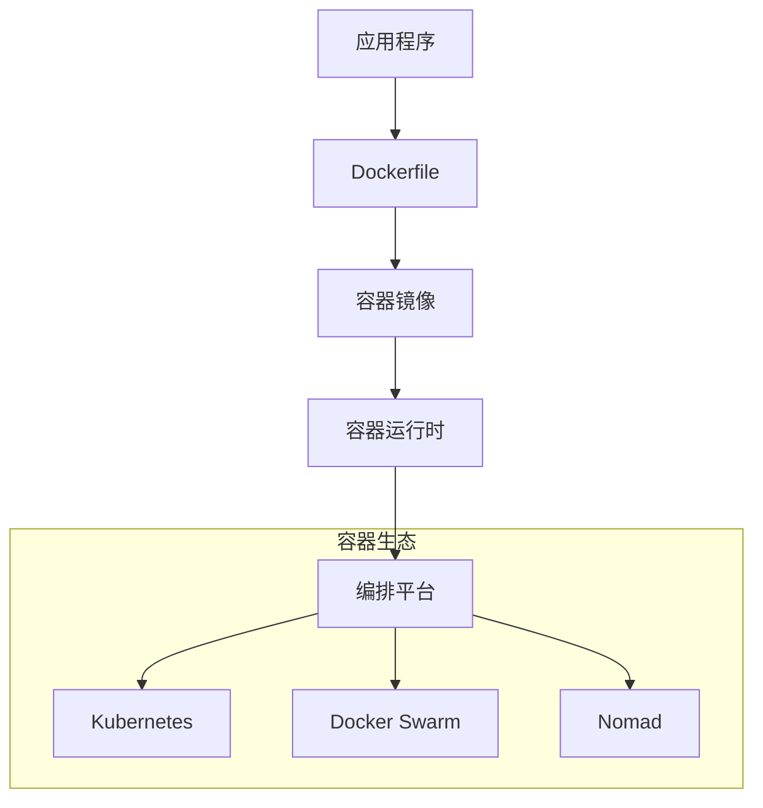

# Docker 容器化部署指南

## 概述

Docker 容器化部署是将应用程序及其依赖项打包到标准化单元（容器）中的过程，实现环境一致性、快速部署和弹性扩展。容器化是现代云原生应用的基础。

## 核心概念

### 容器化架构


## Dockerfile 最佳实践

### 多阶段构建示例
```dockerfile
# 构建阶段
FROM maven:3.8.4-openjdk-17 AS builder
WORKDIR /app
COPY pom.xml .
RUN mvn dependency:go-offline

COPY src ./src
RUN mvn package -DskipTests

# 运行阶段
FROM openjdk:17-jre-slim

# 安装必要的工具
RUN apt-get update && apt-get install -y \
    curl \
    tini \
    && rm -rf /var/lib/apt/lists/*

# 创建非root用户
RUN groupadd -r appuser && useradd -r -g appuser appuser
USER appuser

# 设置工作目录
WORKDIR /app

# 复制构建产物
COPY --from=builder --chown=appuser:appuser /app/target/*.jar app.jar

# 设置JVM参数
ENV JAVA_OPTS="-Xms512m -Xmx1024m -XX:+UseG1GC -XX:+ExitOnOutOfMemoryError"

# 使用tini作为init进程
ENTRYPOINT ["/usr/bin/tini", "--"]

# 启动应用
CMD java $JAVA_OPTS -jar app.jar
```

### 安全加固配置
```dockerfile
# 安全加固的Dockerfile
FROM openjdk:17-jre-slim

# 设置非特权用户
RUN addgroup --system --gid 1000 appuser && \
    adduser --system --uid 1000 --ingroup appuser appuser

# 安装安全更新
RUN apt-get update && \
    apt-get upgrade -y && \
    rm -rf /var/lib/apt/lists/*

# 设置容器时区
ENV TZ=Asia/Shanghai
RUN ln -snf /usr/share/zoneinfo/$TZ /etc/localtime && echo $TZ > /etc/timezone

# 创建应用目录
RUN mkdir -p /app && chown appuser:appuser /app
WORKDIR /app

# 复制应用文件
COPY --chown=appuser:appuser target/*.jar app.jar

# 安全相关的JVM参数
ENV JAVA_OPTS="\
  -XX:+UseContainerSupport \
  -XX:MaxRAMPercentage=75.0 \
  -XX:+ExitOnOutOfMemoryError \
  -Djava.security.egd=file:/dev/./urandom \
  -Dfile.encoding=UTF-8"

# 切换到非root用户
USER appuser

# 健康检查
HEALTHCHECK --interval=30s --timeout=3s --start-period=60s --retries=3 \
  CMD curl -f http://localhost:8080/actuator/health || exit 1

EXPOSE 8080

ENTRYPOINT ["java", "-jar", "app.jar"]
```

## Docker Compose 部署

### 多服务编排示例
```yaml
version: '3.8'

services:
  # 应用服务
  app:
    build:
      context: .
      dockerfile: Dockerfile
    image: user-service:1.0.0
    container_name: user-service
    environment:
      - SPRING_PROFILES_ACTIVE=prod
      - JAVA_OPTS=-Xms512m -Xmx1024m
      - DB_URL=jdbc:mysql://mysql:3306/users
      - REDIS_HOST=redis
    ports:
      - "8080:8080"
    depends_on:
      - mysql
      - redis
    networks:
      - app-network
    restart: unless-stopped
    healthcheck:
      test: ["CMD", "curl", "-f", "http://localhost:8080/actuator/health"]
      interval: 30s
      timeout: 10s
      retries: 3
      start_period: 40s

  # MySQL数据库
  mysql:
    image: mysql:8.0
    container_name: mysql
    environment:
      MYSQL_ROOT_PASSWORD: rootpassword
      MYSQL_DATABASE: users
      MYSQL_USER: appuser
      MYSQL_PASSWORD: apppassword
    volumes:
      - mysql-data:/var/lib/mysql
      - ./config/mysql.cnf:/etc/mysql/conf.d/custom.cnf
    ports:
      - "3306:3306"
    networks:
      - app-network
    restart: unless-stopped
    healthcheck:
      test: ["CMD", "mysqladmin", "ping", "-h", "localhost", "-uroot", "-p$$MYSQL_ROOT_PASSWORD"]
      interval: 30s
      timeout: 10s
      retries: 3

  # Redis缓存
  redis:
    image: redis:6.2-alpine
    container_name: redis
    command: redis-server --appendonly yes
    volumes:
      - redis-data:/data
    ports:
      - "6379:6379"
    networks:
      - app-network
    restart: unless-stopped
    healthcheck:
      test: ["CMD", "redis-cli", "ping"]
      interval: 30s
      timeout: 5s
      retries: 3

volumes:
  mysql-data:
    driver: local
  redis-data:
    driver: local

networks:
  app-network:
    driver: bridge
    ipam:
      config:
        - subnet: 172.20.0.0/16
```

## 生产环境配置

### 资源限制配置
```yaml
# 生产环境Docker Compose
services:
  app:
    deploy:
      resources:
        limits:
          cpus: '2'
          memory: 2G
        reservations:
          cpus: '0.5'
          memory: 512M
    logging:
      driver: "json-file"
      options:
        max-size: "10m"
        max-file: "3"
    security_opt:
      - "no-new-privileges:true"
    read_only: true
    tmpfs:
      - /tmp:rw,noexec,nosuid,size=64M
```

### 环境变量管理
```bash
# 环境变量文件 .env
APP_VERSION=1.0.0
JAVA_OPTS=-Xms512m -Xmx1024m -XX:+UseG1GC
DB_URL=jdbc:mysql://mysql:3306/appdb
DB_USERNAME=appuser
DB_PASSWORD=secretpassword
REDIS_HOST=redis
REDIS_PASSWORD=redispass

# Docker Compose使用环境变量
services:
  app:
    environment:
      - JAVA_OPTS=${JAVA_OPTS}
      - DB_URL=${DB_URL}
      - DB_USERNAME=${DB_USERNAME}
      - DB_PASSWORD=${DB_PASSWORD}
```

## 容器优化策略

### 镜像大小优化
```dockerfile
# 最小化镜像示例
FROM openjdk:17-jre-slim as runtime

# 安装最小依赖
RUN apt-get update && \
    apt-get install -y --no-install-recommends \
    ca-certificates \
    && rm -rf /var/lib/apt/lists/*

# 使用jlink创建最小JRE
FROM debian:buster-slim as jre-builder
COPY --from=openjdk:17-jdk-slim /usr/local/openjdk-17 /opt/jdk
RUN /opt/jdk/bin/jlink \
    --add-modules java.base,java.logging,java.xml,java.sql,java.naming,java.management \
    --strip-debug \
    --no-man-pages \
    --no-header-files \
    --compress=2 \
    --output /opt/jre-minimal

# 最终镜像
FROM debian:buster-slim
COPY --from=jre-builder /opt/jre-minimal /opt/jre-minimal
ENV JAVA_HOME=/opt/jre-minimal
ENV PATH="$JAVA_HOME/bin:$PATH"

WORKDIR /app
COPY --chown=1000:1000 target/*.jar app.jar
USER 1000

ENTRYPOINT ["java", "-jar", "app.jar"]
```

### 构建缓存优化
```dockerfile
# 优化构建缓存的Dockerfile
FROM maven:3.8.4-openjdk-17 AS builder

# 首先只复制pom文件，利用缓存下载依赖
WORKDIR /app
COPY pom.xml .
RUN mvn dependency:go-offline -B

# 然后复制源代码进行编译
COPY src ./src
RUN mvn package -DskipTests

# 运行阶段
FROM openjdk:17-jre-slim
# ... 其余配置
```

## 监控与日志

### 容器监控配置
```yaml
# 监控相关配置
services:
  app:
    labels:
      - "prometheus.scrape=true"
      - "prometheus.port=8080"
      - "prometheus.path=/actuator/prometheus"
    logging:
      driver: "json-file"
      options:
        max-size: "10m"
        max-file: "3"
        tag: "{{.Name}}/{{.ID}}"
```

### 日志收集配置
```yaml
# 日志收集配置
logging:
  driver: "fluentd"
  options:
    fluentd-address: "fluentd:24224"
    tag: "app.{{.Name}}"
    labels: "environment=production"
```

## 安全实践

### 安全扫描与加固
```bash
# 使用Trivy扫描镜像漏洞
trivy image user-service:1.0.0

# 使用Docker Scout检查镜像
docker scout quickview user-service:1.0.0

# 使用Hadolint检查Dockerfile
hadolint Dockerfile
```

### 安全运行时配置
```yaml
# 安全运行时配置
services:
  app:
    security_opt:
      - "no-new-privileges:true"
    cap_drop:
      - ALL
    cap_add:
      - NET_BIND_SERVICE
    read_only: true
    tmpfs:
      - /tmp:rw,noexec,nosuid,size=64M
    user: "1000:1000"
```

## CI/CD 集成

### GitHub Actions 流水线
```yaml
name: Docker Build and Push

on:
  push:
    branches: [main]
    tags: ['v*']

jobs:
  build:
    runs-on: ubuntu-latest
    steps:
    - uses: actions/checkout@v3
    
    - name: Set up Docker Buildx
      uses: docker/setup-buildx-action@v2
      
    - name: Login to DockerHub
      uses: docker/login-action@v2
      with:
        username: ${{ secrets.DOCKERHUB_USERNAME }}
        password: ${{ secrets.DOCKERHUB_TOKEN }}
        
    - name: Build and push
      uses: docker/build-push-action@v4
      with:
        context: .
        push: ${{ github.event_name != 'pull_request' }}
        tags: |
          ${{ secrets.DOCKERHUB_USERNAME }}/user-service:latest
          ${{ secrets.DOCKERHUB_USERNAME }}/user-service:${{ github.sha }}
        cache-from: type=gha
        cache-to: type=gha,mode=max
        
    - name: Scan for vulnerabilities
      run: |
        docker run --rm -v /var/run/docker.sock:/var/run/docker.sock \
          aquasec/trivy:latest image \
          ${{ secrets.DOCKERHUB_USERNAME }}/user-service:${{ github.sha }}
```

## 故障排查

### 容器调试命令
```bash
# 查看容器日志
docker logs -f user-service

# 进入容器调试
docker exec -it user-service /bin/sh

# 查看容器资源使用
docker stats user-service

# 检查容器元数据
docker inspect user-service

# 查看容器进程
docker top user-service

# 网络诊断
docker network inspect app-network
```

### 健康检查脚本
```bash
#!/bin/bash
# 容器健康检查脚本

# 检查应用健康端点
if ! curl -f http://localhost:8080/actuator/health; then
    echo "Health check failed"
    exit 1
fi

# 检查磁盘空间
if [ $(df / | awk 'NR==2 {print $5}' | sed 's/%//') -gt 90 ]; then
    echo "Disk space critical"
    exit 1
fi

# 检查内存使用
memory_usage=$(free | awk '/Mem:/ {printf("%.0f"), $3/$2 * 100}')
if [ $memory_usage -gt 85 ]; then
    echo "Memory usage high: $memory_usage%"
    exit 1
fi

echo "All checks passed"
exit 0
```

## 最佳实践总结

### 容器化最佳实践
```markdown
1. **镜像优化**
   - 使用多阶段构建
   - 选择合适的基础镜像
   - 最小化镜像层数
   - 清理构建缓存

2. **安全加固**
   - 使用非root用户
   - 限制容器权限
   - 定期安全扫描
   - 更新基础镜像

3. **资源管理**
   - 设置资源限制
   - 配置健康检查
   - 优化JVM参数
   - 监控资源使用

4. **可观测性**
   - 标准化日志格式
   - 暴露监控指标
   - 配置就绪/存活检查
   - 实现分布式追踪
```

### 部署检查清单
```yaml
deployment_checklist:
  - image_size_optimized: true
  - non_root_user: true
  - health_checks_configured: true
  - resource_limits_set: true
  - security_scan_passed: true
  - environment_variables_secured: true
  - logging_configured: true
  - monitoring_enabled: true
```

## 总结

Docker 容器化部署为现代应用提供了标准化、可移植的运行环境。正确实施容器化可以：

**核心价值：**
- 环境一致性和可重复性
- 快速部署和扩展
- 资源隔离和利用率提升
-  DevOps 流程自动化

**实施要点：**
- 优化的Dockerfile设计
- 完善的安全加固措施
- 全面的监控和日志
- 自动化的CI/CD流程

> 提示：容器化应该与编排平台（如Kubernetes）结合使用，实现完整的云原生部署体系。

***
*相关阅读：./kubernetes-deployment.md | ./container-security.md | ./ci-cd-pipeline.md*