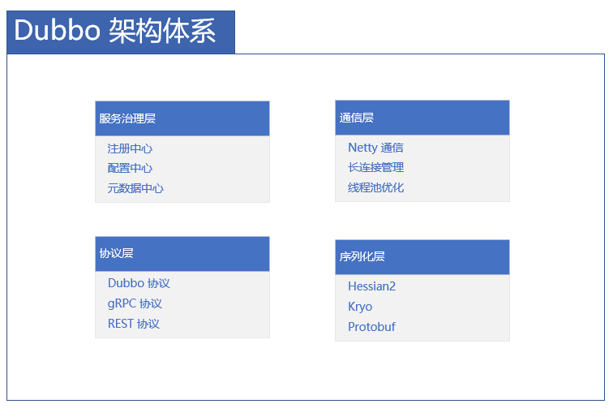

# Dubbo 微服务框架使用指南

## 概述

Apache Dubbo 是一款高性能的 Java RPC 框架，专门为微服务架构设计。它提供了服务注册发现、负载均衡、容错、监控等完整的微服务治理能力。

## Dubbo 架构体系

### 核心架构概览



## 快速开始

### 1. 添加依赖配置
```xml
<!-- pom.xml -->
<dependencies>
    <!-- Dubbo Spring Boot Starter -->
    <dependency>
        <groupId>org.apache.dubbo</groupId>
        <artifactId>dubbo-spring-boot-starter</artifactId>
        <version>3.0.9</version>
    </dependency>

    <!-- 注册中心依赖 -->
    <dependency>
        <groupId>org.apache.dubbo</groupId>
        <artifactId>dubbo-registry-nacos</artifactId>
        <version>3.0.9</version>
    </dependency>

    <!-- 序列化优化 -->
    <dependency>
        <groupId>org.apache.dubbo</groupId>
        <artifactId>dubbo-serialization-kryo</artifactId>
        <version>3.0.9</version>
    </dependency>

    <!-- 监控中心 -->
    <dependency>
        <groupId>org.apache.dubbo</groupId>
        <artifactId>dubbo-monitor-simple</artifactId>
        <version>3.0.9</version>
    </dependency>
</dependencies>
```

### 2. 基础配置
```yaml
# application.yml
dubbo:
  application:
    name: user-service
    version: 1.0.0
    qos-enable: true
    qos-port: 22222
  
  registry:
    address: nacos://localhost:8848
    parameters:
      namespace: dev
      group: DUBBO_GROUP
  
  protocol:
    name: dubbo
    port: 20880
    serialization: kryo
    threadpool: fixed
    threads: 200
  
  provider:
    filter: -exception
    retries: 2
    timeout: 3000
    loadbalance: leastactive
  
  consumer:
    check: false
    lazy: true
    timeout: 3000
```

## 服务定义与暴露

### 1. 服务接口定义
```java
// 服务接口
public interface UserService {
    
    @Method(name = "getUserById", retries = 2, timeout = 1000)
    UserDTO getUserById(@Param(key = "id") Long userId);
    
    @Method(name = "createUser", retries = 0)
    Long createUser(UserDTO user);
    
    @Method(name = "queryUsers", loadbalance = "roundrobin")
    List<UserDTO> queryUsers(UserQuery query);
    
    // 异步调用
    CompletableFuture<UserDTO> getUserAsync(Long userId);
}

// DTO对象
public class UserDTO implements Serializable {
    private Long id;
    private String name;
    private Integer age;
    private String email;
    
    // 使用Kryo序列化需要无参构造器
    public UserDTO() {}
    
    // getters and setters
}
```

### 2. 服务提供者实现
```java
@Service
@DubboService(
    interfaceClass = UserService.class,
    version = "1.0.0",
    group = "user",
    timeout = 3000,
    retries = 2,
    loadbalance = "leastactive",
    filter = {"tracing", "metrics"}
)
public class UserServiceImpl implements UserService {
    
    @Override
    public UserDTO getUserById(Long userId) {
        // 业务逻辑实现
        return userRepository.findById(userId)
            .orElseThrow(() -> new UserNotFoundException("User not found"));
    }
    
    @Override
    public Long createUser(UserDTO user) {
        validateUser(user);
        return userRepository.save(user);
    }
    
    @Override
    public List<UserDTO> queryUsers(UserQuery query) {
        return userRepository.findByQuery(query);
    }
    
    @Override
    public CompletableFuture<UserDTO> getUserAsync(Long userId) {
        return CompletableFuture.supplyAsync(() -> getUserById(userId));
    }
    
    private void validateUser(UserDTO user) {
        // 验证逻辑
        if (user.getName() == null) {
            throw new ValidationException("User name cannot be null");
        }
    }
}
```

### 3. 服务消费者配置
```java
@RestController
public class UserController {
    
    @DubboReference(
        version = "1.0.0",
        group = "user",
        timeout = 2000,
        retries = 1,
        check = false,
        lazy = true,
        loadbalance = "roundrobin",
        cluster = "failfast",
        filter = {"tracing", "metrics"}
    )
    private UserService userService;
    
    @GetMapping("/users/{id}")
    public ResponseEntity<UserDTO> getUser(@PathVariable Long id) {
        try {
            UserDTO user = userService.getUserById(id);
            return ResponseEntity.ok(user);
        } catch (UserNotFoundException e) {
            return ResponseEntity.notFound().build();
        }
    }
    
    @PostMapping("/users")
    public ResponseEntity<Long> createUser(@RequestBody UserDTO user) {
        Long userId = userService.createUser(user);
        return ResponseEntity.ok(userId);
    }
    
    @GetMapping("/users/async/{id}")
    public CompletableFuture<ResponseEntity<UserDTO>> getUserAsync(@PathVariable Long id) {
        return userService.getUserAsync(id)
            .thenApply(ResponseEntity::ok)
            .exceptionally(e -> ResponseEntity.status(HttpStatus.INTERNAL_SERVER_ERROR).build());
    }
}
```

## 高级配置

### 1. 注册中心配置
```yaml
# 多注册中心配置
dubbo:
  registries:
    nacos-registry:
      address: nacos://localhost:8848
      parameters:
        namespace: dev
        group: DUBBO_GROUP
      timeout: 3000
      check: false
    
    zookeeper-registry:
      address: zookeeper://localhost:2181
      timeout: 5000
      check: true
  
  # 服务多注册
  provider:
    registries: nacos-registry,zookeeper-registry
  
  consumer:
    registries: nacos-registry
```

### 2. 协议配置优化
```yaml
# 多协议配置
dubbo:
  protocols:
    dubbo-protocol:
      name: dubbo
      port: 20880
      serialization: kryo
      threadpool: fixed
      threads: 200
      iothreads: 8
      queues: 0
      accepts: 1000
    
    rest-protocol:
      name: rest
      port: 8080
      server: netty
      contextpath: /api
      threads: 500
  
  # 服务协议指定
  provider:
    protocols: dubbo-protocol,rest-protocol
```

### 3. 线程池配置
```yaml
# 线程池优化
dubbo:
  protocol:
    threadpool: eager
    threads: 500
    corethreads: 50
    queues: 0
    alive: 60000
  
  provider:
    threadpool: fixed
    dispatcher: message
    threadname: dubbo-server
```

## 容错与负载均衡

### 1. 集群容错策略
```java
public class UserServiceConsumer {
    
    // Failover 策略
    @DubboReference(cluster = "failover", retries = 3)
    private UserService userService;
    
    // Failfast 策略
    @DubboReference(cluster = "failfast")
    private OrderService orderService;
    
    // Failsafe 策略
    @DubboReference(cluster = "failsafe")
    private LogService logService;
    
    // Failback 策略
    @DubboReference(cluster = "failback")
    private NotificationService notificationService;
    
    // Forking 策略
    @DubboReference(cluster = "forking", forks = 2)
    private CriticalService criticalService;
}

// 自定义容错策略
public class CustomCluster implements Cluster {
    
    @Override
    public <T> Invoker<T> join(Directory<T> directory) throws RpcException {
        return new CustomClusterInvoker<>(directory);
    }
}

public class CustomClusterInvoker<T> extends AbstractClusterInvoker<T> {
    
    @Override
    protected Result doInvoke(Invocation invocation, List<Invoker<T>> invokers, LoadBalance loadbalance) throws RpcException {
        // 自定义容错逻辑
        for (Invoker<T> invoker : invokers) {
            try {
                return invoker.invoke(invocation);
            } catch (RpcException e) {
                // 记录日志，继续尝试下一个
                log.warn("Invocation failed for invoker: {}", invoker, e);
            }
        }
        throw new RpcException("All invokers failed");
    }
}
```

### 2. 负载均衡策略
```java
public class UserServiceConsumer {
    
    // 随机负载均衡
    @DubboReference(loadbalance = "random")
    private UserService userServiceRandom;
    
    // 轮询负载均衡
    @DubboReference(loadbalance = "roundrobin")
    private UserService userServiceRoundRobin;
    
    // 最少活跃调用
    @DubboReference(loadbalance = "leastactive")
    private UserService userServiceLeastActive;
    
    // 一致性哈希
    @DubboReference(loadbalance = "consistenthash")
    private UserService userServiceConsistentHash;
    
    // 自定义负载均衡
    @DubboReference(loadbalance = "custom")
    private UserService userServiceCustom;
}

// 自定义负载均衡器
public class CustomLoadBalance extends AbstractLoadBalance {
    
    @Override
    protected <T> Invoker<T> doSelect(List<Invoker<T>> invokers, URL url, Invocation invocation) {
        // 自定义选择逻辑
        String clientIp = RpcContext.getContext().getRemoteHost();
        int hash = Math.abs(clientIp.hashCode());
        return invokers.get(hash % invokers.size());
    }
}
```

## 高级特性

### 1. 异步编程支持
```java
public class AsyncUserService {
    
    @DubboReference(async = true)
    private UserService userService;
    
    public CompletableFuture<UserDTO> getUserWithTimeout(Long userId, long timeout) {
        CompletableFuture<UserDTO> future = userService.getUserAsync(userId);
        
        // 添加超时控制
        return future.orTimeout(timeout, TimeUnit.MILLISECONDS)
            .exceptionally(ex -> {
                log.warn("Get user timeout or error", ex);
                return createFallbackUser(userId);
            });
    }
    
    // 批量异步调用
    public CompletableFuture<List<UserDTO>> getUsersBatch(List<Long> userIds) {
        List<CompletableFuture<UserDTO>> futures = userIds.stream()
            .map(userService::getUserAsync)
            .collect(Collectors.toList());
        
        return CompletableFuture.allOf(futures.toArray(new CompletableFuture[0]))
            .thenApply(v -> futures.stream()
                .map(CompletableFuture::join)
                .collect(Collectors.toList()));
    }
}
```

### 2. 泛化调用
```java
public class GenericInvocationService {
    
    @Autowired
    private GenericService genericService;
    
    public Object invokeGeneric(String serviceName, String methodName, 
                              String[] parameterTypes, Object[] args) {
        return genericService.$invoke(methodName, parameterTypes, args);
    }
    
    // 配置泛化引用
    @Bean
    public GenericService genericService() {
        ReferenceConfig<GenericService> reference = new ReferenceConfig<>();
        reference.setInterface("com.example.UserService");
        reference.setVersion("1.0.0");
        reference.setGeneric(true);
        return reference.get();
    }
}
```

### 3. 参数回调
```java
public class CallbackUserService {
    
    public interface UserCallback {
        void onSuccess(UserDTO user);
        void onError(Throwable throwable);
    }
    
    @DubboService
    public class UserServiceImpl implements UserService {
        
        @Override
        public UserDTO getUserById(Long userId) {
            // 正常实现
        }
        
        public void getUserWithCallback(Long userId, UserCallback callback) {
            try {
                UserDTO user = getUserById(userId);
                callback.onSuccess(user);
            } catch (Exception e) {
                callback.onError(e);
            }
        }
    }
}
```

## 监控与治理

### 1. QOS 运维管理
```bash
# 通过telnet管理服务
telnet localhost 22222

# 查看服务状态
dubbo> ls
dubbo> status

# 查看服务详情
dubbo> count UserService getUserById

# 动态修改日志级别
dubbo> logger debug

# 查看线程池状态
dubbo> threadpool
```

### 2. 监控配置
```yaml
# 监控中心配置
dubbo:
  monitor:
    protocol: registry
    address: monitor://localhost:8080
    interval: 60000
    username: admin
    password: password
  
  metrics:
    enable: true
    port: 9090
    protocol: prometheus
    export:
      enabled: true
      step: 10s
      address: localhost:9091
  
  tracing:
    enable: true
    type: zipkin
    endpoint: http://localhost:9411
    samplerate: 0.5
```

### 3. 过滤器链配置
```java
// 自定义过滤器
@Activate(group = {Constants.PROVIDER, Constants.CONSUMER})
public class CustomFilter implements Filter {
    
    @Override
    public Result invoke(Invoker<?> invoker, Invocation invocation) throws RpcException {
        long start = System.currentTimeMillis();
        
        try {
            // 前置处理
            log.info("Before invocation: {}", invocation.getMethodName());
            
            Result result = invoker.invoke(invocation);
            
            // 后置处理
            long duration = System.currentTimeMillis() - start;
            log.info("After invocation: {}ms", duration);
            
            return result;
        } catch (RpcException e) {
            // 异常处理
            log.error("Invocation failed: {}", e.getMessage());
            throw e;
        }
    }
}

// 配置过滤器
@Configuration
public class FilterConfig {
    
    @Bean
    public Filter customFilter() {
        return new CustomFilter();
    }
    
    @Bean
    public Filter tracingFilter() {
        return new TracingFilter();
    }
    
    @Bean
    public Filter metricsFilter() {
        return new MetricsFilter();
    }
}
```

## 性能优化

### 1. 序列化优化
```yaml
# 序列化配置
dubbo:
  protocol:
    serialization: kryo
    optimize-serializer: true
  
  provider:
    serialization: kryo
    optimize-serializer: true
  
  consumer:
    serialization: kryo

# Kryo配置
kryo:
  registration-required: false
  references: true
  auto-reset: true
  max-depth: 256
```

### 2. 连接池优化
```yaml
# 连接池配置
dubbo:
  protocol:
    connections: 100
    acquirement-timeout: 3000
    keep-alive: true
    heartbeat: 60000
  
  consumer:
    connections: 50
    actives: 100
    accepts: 1000
```

### 3. 线程模型优化
```yaml
# 线程模型配置
dubbo:
  protocol:
    dispatcher: message
    threadpool: eager
    threads: 500
    corethreads: 50
    queues: 0
    alive: 60000
  
  provider:
    iothreads: 8
    business-threads: 200
```

## 最佳实践

### 1. 服务治理规范
```yaml
# 服务治理配置
dubbo:
  application:
    name: ${spring.application.name}
    version: 1.0.0
    owner: user-team
    organization: example-inc
    environment: ${spring.profiles.active}
  
  provider:
    group: ${dubbo.application.name}
    version: 1.0.0
    filter: tracing,metrics,validation
    delay: -1
    deprecated: false
    dynamic: true
    accesslog: true
  
  consumer:
    group: ${dubbo.application.name}
    version: 1.0.0
    filter: tracing,metrics
    check: false
    lazy: true
    sticky: false
```

### 2. 故障处理规范
```java
public class FaultToleranceConfig {
    
    // 全局超时配置
    @Bean
    public Configurer configurer() {
        return referenceConfig -> {
            referenceConfig.setTimeout(3000);
            referenceConfig.setRetries(2);
            referenceConfig.setCluster("failover");
            referenceConfig.setLoadbalance("roundrobin");
        };
    }
    
    // 异常处理
    @ControllerAdvice
    public class DubboExceptionHandler {
        
        @ExceptionHandler(RpcException.class)
        public ResponseEntity<String> handleRpcException(RpcException e) {
            log.error("RPC调用异常", e);
            return ResponseEntity.status(HttpStatus.INTERNAL_SERVER_ERROR)
                .body("Service temporarily unavailable");
        }
        
        @ExceptionHandler(TimeoutException.class)
        public ResponseEntity<String> handleTimeoutException(TimeoutException e) {
            log.warn("调用超时", e);
            return ResponseEntity.status(HttpStatus.REQUEST_TIMEOUT)
                .body("Request timeout");
        }
    }
}
```

## 总结

Dubbo 作为一款成熟的微服务框架，提供了：

**核心优势：**
- 高性能的 RPC 通信
- 丰富的服务治理能力
- 灵活的扩展机制
- 强大的生态系统

**实施建议：**
- 根据业务需求选择合适的注册中心
- 配置合适的序列化和线程模型
- 实施完善的监控和告警
- 遵循服务治理最佳实践

> 提示：Dubbo 3.0 提供了更好的云原生支持，建议在新项目中直接使用 3.0+ 版本。

***
*相关阅读：./microservice-architecture.md | ./service-governance.md | ./performance-optimization.md*