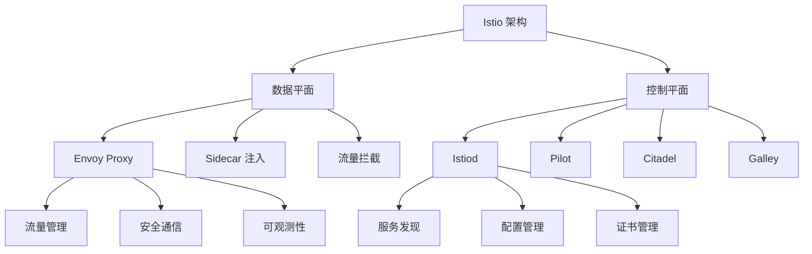

# Istio 服务网格指南

## 概述

Istio 是一个开源的服务网格（Service Mesh），为微服务提供了流量管理、安全性、可观测性和策略 enforcement 等能力。它通过 sidecar 代理（Envoy）来实现这些功能，无需修改应用程序代码。

## Istio 架构体系

### 核心架构概览


## 安装与配置

### 1. Istio 安装
```bash
# 下载 Istio
curl -L https://istio.io/downloadIstio | sh -
cd istio-1.16.1

# 添加到 PATH
export PATH=$PWD/bin:$PATH

# 安装 Istio（使用 demo 配置）
istioctl install --set profile=demo -y

# 验证安装
istioctl verify-install

# 查看已安装组件
kubectl get pods -n istio-system

# 启用自动 sidecar 注入
kubectl label namespace default istio-injection=enabled
```

### 2. 部署示例应用
```yaml
# sample-application.yaml
apiVersion: v1
kind: Namespace
metadata:
  name: bookinfo
  labels:
    istio-injection: enabled
---
apiVersion: apps/v1
kind: Deployment
metadata:
  name: productpage-v1
  namespace: bookinfo
spec:
  replicas: 1
  selector:
    matchLabels:
      app: productpage
      version: v1
  template:
    metadata:
      labels:
        app: productpage
        version: v1
    spec:
      containers:
      - name: productpage
        image: docker.io/istio/examples-bookinfo-productpage-v1:1.16.2
        ports:
        - containerPort: 9080
---
apiVersion: v1
kind: Service
metadata:
  name: productpage
  namespace: bookinfo
spec:
  ports:
  - port: 9080
    name: http
  selector:
    app: productpage
```

## 流量管理

### 1. 虚拟服务 (VirtualService)
```yaml
# virtual-service.yaml
apiVersion: networking.istio.io/v1beta1
kind: VirtualService
metadata:
  name: productpage
  namespace: bookinfo
spec:
  hosts:
  - productpage
  - productpage.bookinfo.svc.cluster.local
  gateways:
  - bookinfo-gateway
  http:
  - match:
    - uri:
        exact: /productpage
    - uri:
        prefix: /static
    - uri:
        exact: /login
    - uri:
        exact: /logout
    - uri:
        prefix: /api/v1/products
    route:
    - destination:
        host: productpage
        port:
          number: 9080
```

### 2. 目标规则 (DestinationRule)
```yaml
# destination-rule.yaml
apiVersion: networking.istio.io/v1beta1
kind: DestinationRule
metadata:
  name: productpage
  namespace: bookinfo
spec:
  host: productpage
  subsets:
  - name: v1
    labels:
      version: v1
  - name: v2
    labels:
      version: v2
  trafficPolicy:
    loadBalancer:
      simple: ROUND_ROBIN
    connectionPool:
      tcp:
        maxConnections: 100
      http:
        http1MaxPendingRequests: 1000
        maxRequestsPerConnection: 10
    outlierDetection:
      consecutive5xxErrors: 5
      interval: 30s
      baseEjectionTime: 30s
      maxEjectionPercent: 50
```

### 3. 网关配置 (Gateway)
```yaml
# gateway.yaml
apiVersion: networking.istio.io/v1beta1
kind: Gateway
metadata:
  name: bookinfo-gateway
  namespace: bookinfo
spec:
  selector:
    istio: ingressgateway
  servers:
  - port:
      number: 80
      name: http
      protocol: HTTP
    hosts:
    - "*"
    tls:
      httpsRedirect: true
  - port:
      number: 443
      name: https
      protocol: HTTPS
    hosts:
    - "*"
    tls:
      mode: SIMPLE
      credentialName: bookinfo-tls
```

## 高级流量管理

### 1. 金丝雀发布
```yaml
# canary-release.yaml
apiVersion: networking.istio.io/v1beta1
kind: VirtualService
metadata:
  name: reviews
  namespace: bookinfo
spec:
  hosts:
  - reviews
  http:
  - route:
    - destination:
        host: reviews
        subset: v1
      weight: 90
    - destination:
        host: reviews
        subset: v2
      weight: 10
---
apiVersion: networking.istio.io/v1beta1
kind: DestinationRule
metadata:
  name: reviews
  namespace: bookinfo
spec:
  host: reviews
  subsets:
  - name: v1
    labels:
      version: v1
  - name: v2
    labels:
      version: v2
```

### 2. 故障注入
```yaml
# fault-injection.yaml
apiVersion: networking.istio.io/v1beta1
kind: VirtualService
metadata:
  name: ratings
  namespace: bookinfo
spec:
  hosts:
  - ratings
  http:
  - fault:
      delay:
        percentage:
          value: 10.0
        fixedDelay: 5s
      abort:
        percentage:
          value: 10.0
        httpStatus: 500
    route:
    - destination:
        host: ratings
        subset: v1
```

### 3. 流量镜像
```yaml
# traffic-mirroring.yaml
apiVersion: networking.istio.io/v1beta1
kind: VirtualService
metadata:
  name: productpage
  namespace: bookinfo
spec:
  hosts:
  - productpage
  http:
  - route:
    - destination:
        host: productpage
        subset: v1
      weight: 100
    mirror:
      host: productpage
      subset: v2
    mirrorPercentage:
      value: 100.0
```

## 安全配置

### 1. mTLS 配置
```yaml
# peer-authentication.yaml
apiVersion: security.istio.io/v1beta1
kind: PeerAuthentication
metadata:
  name: default
  namespace: istio-system
spec:
  mtls:
    mode: STRICT
---
# 命名空间级别配置
apiVersion: security.istio.io/v1beta1
kind: PeerAuthentication
metadata:
  name: bookinfo-mtls
  namespace: bookinfo
spec:
  mtls:
    mode: STRICT
```

### 2. 授权策略
```yaml
# authorization-policy.yaml
apiVersion: security.istio.io/v1beta1
kind: AuthorizationPolicy
metadata:
  name: productpage-policy
  namespace: bookinfo
spec:
  selector:
    matchLabels:
      app: productpage
  action: ALLOW
  rules:
  - from:
    - source:
        principals: ["cluster.local/ns/bookinfo/sa/reviews"]
    to:
    - operation:
        methods: ["GET"]
        paths: ["/productpage"]
  - from:
    - source:
        namespaces: ["istio-system"]
    to:
    - operation:
        methods: ["GET"]
        paths: ["/healthz"]
```

### 3. 请求认证
```yaml
# request-authentication.yaml
apiVersion: security.istio.io/v1beta1
kind: RequestAuthentication
metadata:
  name: jwt-auth
  namespace: bookinfo
spec:
  selector:
    matchLabels:
      app: productpage
  jwtRules:
  - issuer: "testing@secure.istio.io"
    jwksUri: "https://raw.githubusercontent.com/istio/istio/release-1.16/security/tools/jwt/samples/jwks.json"
```

## 可观测性

### 1. 监控指标
```yaml
# telemetry.yaml
apiVersion: telemetry.istio.io/v1alpha1
kind: Telemetry
metadata:
  name: mesh-default
  namespace: istio-system
spec:
  accessLogging:
  - providers:
    - name: envoy
  metrics:
  - providers:
    - name: prometheus
    overrides:
    - match:
        mode: CLIENT_AND_SERVER
      disabled: false
      tagOverrides:
        request_size:
          value: "%REQUEST_SIZE%"
        response_size:
          value: "%RESPONSE_SIZE%"
```

### 2. 分布式追踪
```yaml
# tracing.yaml
apiVersion: telemetry.istio.io/v1alpha1
kind: Telemetry
metadata:
  name: tracing
  namespace: istio-system
spec:
  tracing:
  - providers:
    - name: zipkin
    randomSamplingPercentage: 100.0
    customTags:
      version:
        literal:
          value: "v1"
      cluster:
        environment:
          name: CLUSTER_NAME
          defaultValue: "production"
```

### 3. 访问日志
```yaml
# access-log.yaml
apiVersion: telemetry.istio.io/v1alpha1
kind: Telemetry
metadata:
  name: access-logging
  namespace: istio-system
spec:
  accessLogging:
  - providers:
    - name: envoy
    disabled: false
    match:
      mode: SERVER
    filter:
      expression: 'response.code >= 400'
```

## 策略执行

### 1. 限流策略
```yaml
# rate-limit.yaml
apiVersion: networking.istio.io/v1alpha3
kind: EnvoyFilter
metadata:
  name: filter-ratelimit
  namespace: istio-system
spec:
  workloadSelector:
    labels:
      istio: ingressgateway
  configPatches:
  - applyTo: HTTP_FILTER
    match:
      context: GATEWAY
      listener:
        filterChain:
          filter:
            name: "envoy.filters.network.http_connection_manager"
    patch:
      operation: INSERT_BEFORE
      value:
        name: envoy.filters.http.ratelimit
        typed_config:
          "@type": type.googleapis.com/envoy.extensions.filters.http.ratelimit.v3.RateLimit
          domain: productpage-ratelimit
          failure_mode_deny: true
          timeout: 0.25s
          rate_limit_service:
            grpc_service:
              envoy_grpc:
                cluster_name: rate_limit_service
            transport_api_version: V3
```

### 2. 重试策略
```yaml
# retry-policy.yaml
apiVersion: networking.istio.io/v1beta1
kind: VirtualService
metadata:
  name: productpage-retry
  namespace: bookinfo
spec:
  hosts:
  - productpage
  http:
  - route:
    - destination:
        host: productpage
        subset: v1
    retries:
      attempts: 3
      perTryTimeout: 2s
      retryOn: gateway-error,connect-failure,refused-stream
```

## 运维与管理

### 1. Sidecar 配置
```yaml
# sidecar.yaml
apiVersion: networking.istio.io/v1beta1
kind: Sidecar
metadata:
  name: default
  namespace: bookinfo
spec:
  egress:
  - hosts:
    - "./*"
    - "istio-system/*"
  ingress:
  - defaultEndpoint: 127.0.0.1:9080
    port:
      number: 9080
      protocol: HTTP
      name: http
  workloadSelector:
    labels:
      app: productpage
```

### 2. 服务入口
```yaml
# service-entry.yaml
apiVersion: networking.istio.io/v1beta1
kind: ServiceEntry
metadata:
  name: external-api
  namespace: bookinfo
spec:
  hosts:
  - api.external.com
  location: MESH_EXTERNAL
  ports:
  - number: 443
    name: https
    protocol: HTTPS
  resolution: DNS
```

### 3. 工作负载组
```yaml
# workload-group.yaml
apiVersion: networking.istio.io/v1alpha3
kind: WorkloadGroup
metadata:
  name: productpage
  namespace: bookinfo
spec:
  metadata:
    labels:
      app: productpage
      version: v1
  template:
    ports:
      http: 9080
    serviceAccount: bookinfo-productpage
```

## 故障排查

### 1. 诊断工具
```bash
# 检查代理状态
istioctl proxy-status

# 查看代理配置
istioctl proxy-config all productpage-v1-xxxxx -n bookinfo

# 检查网络策略
istioctl analyze -n bookinfo

# 注入测试流量
istioctl experimental inject --meshConfigMapName=istio mesh-config

# 查看访问日志
kubectl logs -l app=productpage -c istio-proxy -n bookinfo

# 检查证书状态
istioctl authn tls-check productpage-v1-xxxxx -n bookinfo
```

### 2. 性能调优
```yaml
# performance-tuning.yaml
apiVersion: networking.istio.io/v1alpha3
kind: EnvoyFilter
metadata:
  name: performance-tuning
  namespace: istio-system
spec:
  configPatches:
  - applyTo: NETWORK_FILTER
    match:
      context: ANY
      listener:
        filterChain:
          filter:
            name: "envoy.filters.network.http_connection_manager"
    patch:
      operation: MERGE
      value:
        typed_config:
          "@type": "type.googleapis.com/envoy.extensions.filters.network.http_connection_manager.v3.HttpConnectionManager"
          common_http_protocol_options:
            idle_timeout: 300s
            max_connection_duration: 3600s
            max_requests_per_connection: 1000
          http2_protocol_options:
            max_concurrent_streams: 100
            initial_stream_window_size: 65536
            initial_connection_window_size: 1048576
```

## 最佳实践

### 1. 生产环境配置
```yaml
# production-values.yaml
# Istio 生产环境配置
global:
  proxy:
    accessLogFile: /dev/stdout
    accessLogEncoding: JSON
    logLevel: warning
    componentLogLevel: "misc:error"
    holdApplicationUntilProxyStarts: true
  
  controlPlaneSecurityEnabled: true
  mtls:
    enabled: true
  
  # 资源限制
  resources:
    requests:
      cpu: 100m
      memory: 128Mi
    limits:
      cpu: 2000m
      memory: 1024Mi

# Pilot 配置
pilot:
  traceSampling: 1.0
  env:
    PILOT_ENABLE_PROTOCOL_SNIFFING: "false"
  
  # 自动缩放配置
  autoscaleEnabled: true
  autoscaleMin: 2
  autoscaleMax: 10

# Gateway 配置
gateways:
  istio-ingressgateway:
    autoscaleEnabled: true
    autoscaleMin: 2
    autoscaleMax: 10
    resources:
      requests:
        cpu: 100m
        memory: 128Mi
      limits:
        cpu: 2000m
        memory: 1024Mi
```

### 2. 安全最佳实践
```yaml
# security-best-practices.yaml
apiVersion: security.istio.io/v1beta1
kind: PeerAuthentication
metadata:
  name: strict-mtls
  namespace: istio-system
spec:
  mtls:
    mode: STRICT
---
apiVersion: security.istio.io/v1beta1
kind: AuthorizationPolicy
metadata:
  name: deny-all
  namespace: istio-system
spec:
  action: DENY
  rules:
  - to:
    - operation:
        methods: ["*"]
        paths: ["*"]
---
apiVersion: security.istio.io/v1beta1
kind: AuthorizationPolicy
metadata:
  name: allow-ingress
  namespace: istio-system
spec:
  action: ALLOW
  rules:
  - from:
    - source:
        namespaces: ["istio-system"]
    to:
    - operation:
        ports: [80, 443]
```

## 总结

Istio 服务网格提供了强大的微服务治理能力：

**核心优势：**
- 非侵入式的服务治理
- 强大的流量管理能力
- 完善的安全机制
- 丰富的可观测性功能

**实施建议：**
- 从简单的配置开始，逐步启用高级功能
- 实施严格的安全策略（mTLS、授权策略）
- 建立完善的监控和告警体系
- 定期进行性能优化和版本升级

> 提示：Istio 的学习曲线相对陡峭，建议在生产环境使用前进行充分的测试和验证。

***
*相关阅读：./service-mesh-architecture.md | ./cloud-native-practices.md | ./kubernetes-networking.md*