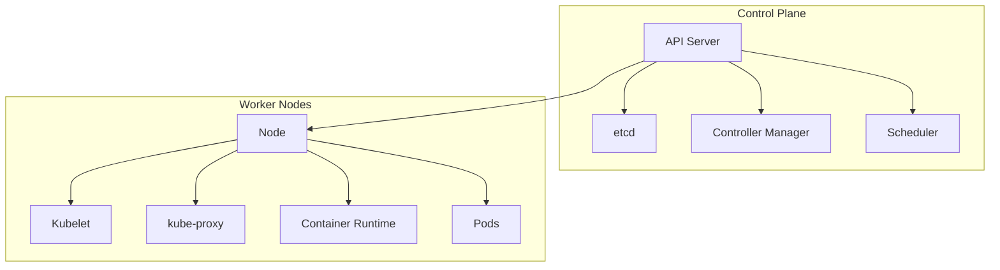

# Kubernetes 编排指南

## 概述

Kubernetes 是云原生时代的容器编排标准，提供自动化部署、扩展和管理容器化应用的能力。它通过声明式配置和强大的API管理复杂的分布式系统。

## 核心概念

### Kubernetes 架构


## 基础资源对象

### Pod 配置
```yaml
apiVersion: v1
kind: Pod
metadata:
  name: user-service
  labels:
    app: user-service
    environment: production
  annotations:
    prometheus.io/scrape: "true"
    prometheus.io/port: "8080"
spec:
  containers:
  - name: user-service
    image: user-service:1.0.0
    imagePullPolicy: IfNotPresent
    ports:
    - containerPort: 8080
      protocol: TCP
    env:
    - name: JAVA_OPTS
      value: "-Xms512m -Xmx1024m"
    - name: DB_URL
      valueFrom:
        secretKeyRef:
          name: db-secret
          key: connection-string
    resources:
      requests:
        memory: "512Mi"
        cpu: "250m"
      limits:
        memory: "1Gi"
        cpu: "500m"
    livenessProbe:
      httpGet:
        path: /actuator/health/liveness
        port: 8080
      initialDelaySeconds: 30
      periodSeconds: 10
    readinessProbe:
      httpGet:
        path: /actuator/health/readiness
        port: 8080
      initialDelaySeconds: 5
      periodSeconds: 5
    startupProbe:
      httpGet:
        path: /actuator/health/startup
        port: 8080
      failureThreshold: 30
      periodSeconds: 10
  restartPolicy: Always
  terminationGracePeriodSeconds: 30
```

### Deployment 配置
```yaml
apiVersion: apps/v1
kind: Deployment
metadata:
  name: user-service
  labels:
    app: user-service
    tier: backend
spec:
  replicas: 3
  revisionHistoryLimit: 3
  strategy:
    type: RollingUpdate
    rollingUpdate:
      maxSurge: 1
      maxUnavailable: 0
  selector:
    matchLabels:
      app: user-service
  template:
    metadata:
      labels:
        app: user-service
        version: v1.0.0
    spec:
      affinity:
        podAntiAffinity:
          preferredDuringSchedulingIgnoredDuringExecution:
          - weight: 100
            podAffinityTerm:
              labelSelector:
                matchExpressions:
                - key: app
                  operator: In
                  values:
                  - user-service
              topologyKey: kubernetes.io/hostname
      containers:
      - name: user-service
        image: user-service:1.0.0
        imagePullPolicy: IfNotPresent
        ports:
        - containerPort: 8080
        envFrom:
        - configMapRef:
            name: user-service-config
        - secretRef:
            name: user-service-secrets
        resources:
          requests:
            cpu: "250m"
            memory: "512Mi"
          limits:
            cpu: "500m"
            memory: "1Gi"
        livenessProbe:
          httpGet:
            path: /actuator/health
            port: 8080
          initialDelaySeconds: 30
          periodSeconds: 10
        readinessProbe:
          httpGet:
            path: /actuator/health
            port: 8080
          initialDelaySeconds: 5
          periodSeconds: 5
```

### Service 配置
```yaml
apiVersion: v1
kind: Service
metadata:
  name: user-service
  annotations:
    # 负载均衡器配置
    service.beta.kubernetes.io/aws-load-balancer-type: "nlb"
    service.beta.kubernetes.io/aws-load-balancer-internal: "true"
spec:
  selector:
    app: user-service
  ports:
  - name: http
    port: 80
    targetPort: 8080
    protocol: TCP
  - name: metrics
    port: 9090
    targetPort: 9090
    protocol: TCP
  type: ClusterIP
  # 或者使用 LoadBalancer/NodePort
  # type: LoadBalancer
```

### Ingress 配置
```yaml
apiVersion: networking.k8s.io/v1
kind: Ingress
metadata:
  name: user-service-ingress
  annotations:
    nginx.ingress.kubernetes.io/rewrite-target: /
    nginx.ingress.kubernetes.io/ssl-redirect: "true"
    cert-manager.io/cluster-issuer: "letsencrypt-prod"
spec:
  ingressClassName: nginx
  tls:
  - hosts:
    - api.example.com
    secretName: user-service-tls
  rules:
  - host: api.example.com
    http:
      paths:
      - path: /api/users
        pathType: Prefix
        backend:
          service:
            name: user-service
            port:
              number: 80
      - path: /api/orders
        pathType: Prefix
        backend:
          service:
            name: order-service
            port:
              number: 80
```

## 高级配置模式

### ConfigMap 和 Secret
```yaml
# ConfigMap
apiVersion: v1
kind: ConfigMap
metadata:
  name: user-service-config
data:
  application.yml: |
    server:
      port: 8080
    spring:
      datasource:
        url: jdbc:mysql://mysql:3306/users
      redis:
        host: redis
        port: 6379
  logback.xml: |
    <configuration>
      <appender name="CONSOLE" class="ch.qos.logback.core.ConsoleAppender">
        <encoder>
          <pattern>%d{yyyy-MM-dd HH:mm:ss} [%thread] %-5level %logger{36} - %msg%n</pattern>
        </encoder>
      </appender>
      <root level="INFO">
        <appender-ref ref="CONSOLE" />
      </root>
    </configuration>

# Secret
apiVersion: v1
kind: Secret
metadata:
  name: user-service-secrets
type: Opaque
data:
  db-password: dXNlcnBhc3N3b3Jk # base64 encoded
  redis-password: cmVkaXNwYXNzd29yZA==
  api-key: YXBpa2V5MTIzNDU2
```

### Horizontal Pod Autoscaler
```yaml
apiVersion: autoscaling/v2
kind: HorizontalPodAutoscaler
metadata:
  name: user-service-hpa
spec:
  scaleTargetRef:
    apiVersion: apps/v1
    kind: Deployment
    name: user-service
  minReplicas: 2
  maxReplicas: 10
  metrics:
  - type: Resource
    resource:
      name: cpu
      target:
        type: Utilization
        averageUtilization: 70
  - type: Resource
    resource:
      name: memory
      target:
        type: Utilization
        averageUtilization: 80
  - type: Pods
    pods:
      metric:
        name: http_requests_per_second
      target:
        type: AverageValue
        averageValue: 100
  behavior:
    scaleUp:
      stabilizationWindowSeconds: 60
      policies:
      - type: Pods
        value: 2
        periodSeconds: 60
    scaleDown:
      stabilizationWindowSeconds: 300
      policies:
      - type: Pods
        value: 1
        periodSeconds: 60
```

### PodDisruptionBudget
```yaml
apiVersion: policy/v1
kind: PodDisruptionBudget
metadata:
  name: user-service-pdb
spec:
  minAvailable: 2
  selector:
    matchLabels:
      app: user-service
```

## 存储配置

### PersistentVolumeClaim
```yaml
apiVersion: v1
kind: PersistentVolumeClaim
metadata:
  name: user-service-storage
spec:
  accessModes:
  - ReadWriteOnce
  resources:
    requests:
      storage: 10Gi
  storageClassName: gp2
  # volumeName: pv-name # 可选，指定具体的PV
```

### StatefulSet 有状态应用
```yaml
apiVersion: apps/v1
kind: StatefulSet
metadata:
  name: mysql
spec:
  serviceName: "mysql"
  replicas: 3
  selector:
    matchLabels:
      app: mysql
  template:
    metadata:
      labels:
        app: mysql
    spec:
      containers:
      - name: mysql
        image: mysql:8.0
        ports:
        - containerPort: 3306
        volumeMounts:
        - name: mysql-data
          mountPath: /var/lib/mysql
        env:
        - name: MYSQL_ROOT_PASSWORD
          valueFrom:
            secretKeyRef:
              name: mysql-secrets
              key: root-password
  volumeClaimTemplates:
  - metadata:
      name: mysql-data
    spec:
      accessModes: ["ReadWriteOnce"]
      resources:
        requests:
          storage: 20Gi
      storageClassName: gp2
```

## 网络策略

### NetworkPolicy
```yaml
apiVersion: networking.k8s.io/v1
kind: NetworkPolicy
metadata:
  name: user-service-policy
spec:
  podSelector:
    matchLabels:
      app: user-service
  policyTypes:
  - Ingress
  - Egress
  ingress:
  - from:
    - podSelector:
        matchLabels:
          app: api-gateway
    - namespaceSelector:
        matchLabels:
          name: monitoring
    ports:
    - protocol: TCP
      port: 8080
  egress:
  - to:
    - podSelector:
        matchLabels:
          app: mysql
    ports:
    - protocol: TCP
      port: 3306
  - to:
    - podSelector:
        matchLabels:
          app: redis
    ports:
    - protocol: TCP
      port: 6379
  - to:
    - ipBlock:
        cidr: 169.254.169.254/32 # AWS元数据服务
    ports:
    - protocol: TCP
      port: 80
```

## 监控与日志

### ServiceMonitor (Prometheus)
```yaml
apiVersion: monitoring.coreos.com/v1
kind: ServiceMonitor
metadata:
  name: user-service-monitor
  labels:
    release: prometheus
spec:
  selector:
    matchLabels:
      app: user-service
  endpoints:
  - port: metrics
    interval: 30s
    scrapeTimeout: 10s
    path: /actuator/prometheus
    metricRelabelings:
    - sourceLabels: [__name__]
      regex: '(http_request_duration_seconds_.*)'
      action: keep
  namespaceSelector:
    matchNames:
    - production
```

### Pod 监控注解
```yaml
apiVersion: v1
kind: Pod
metadata:
  annotations:
    prometheus.io/scrape: "true"
    prometheus.io/port: "8080"
    prometheus.io/path: "/actuator/prometheus"
    prometheus.io/scheme: "http"
```

## 安全配置

### ServiceAccount 和 RBAC
```yaml
# ServiceAccount
apiVersion: v1
kind: ServiceAccount
metadata:
  name: user-service-account
  annotations:
    eks.amazonaws.com/role-arn: arn:aws:iam::123456789012:role/user-service-role

# Role
apiVersion: rbac.authorization.k8s.io/v1
kind: Role
metadata:
  name: user-service-role
rules:
- apiGroups: [""]
  resources: ["pods", "services"]
  verbs: ["get", "list", "watch"]
- apiGroups: ["apps"]
  resources: ["deployments"]
  verbs: ["get", "list", "patch"]

# RoleBinding
apiVersion: rbac.authorization.k8s.io/v1
kind: RoleBinding
metadata:
  name: user-service-binding
subjects:
- kind: ServiceAccount
  name: user-service-account
  namespace: production
roleRef:
  kind: Role
  name: user-service-role
  apiGroup: rbac.authorization.k8s.io
```

### SecurityContext
```yaml
securityContext:
  runAsUser: 1000
  runAsGroup: 1000
  runAsNonRoot: true
  readOnlyRootFilesystem: true
  allowPrivilegeEscalation: false
  capabilities:
    drop:
    - ALL
    add:
    - NET_BIND_SERVICE
  seccompProfile:
    type: RuntimeDefault
```

## 运维工具

### Helm Chart 示例
```yaml
# Chart.yaml
apiVersion: v2
name: user-service
description: User Service Helm Chart
version: 1.0.0
appVersion: "1.0.0"

# values.yaml
replicaCount: 3
image:
  repository: user-service
  tag: latest
  pullPolicy: IfNotPresent
service:
  type: ClusterIP
  port: 80
  targetPort: 8080
ingress:
  enabled: true
  className: nginx
  hosts:
    - host: api.example.com
      paths:
        - path: /api/users
          pathType: Prefix
resources:
  requests:
    cpu: 250m
    memory: 512Mi
  limits:
    cpu: 500m
    memory: 1Gi
autoscaling:
  enabled: true
  minReplicas: 2
  maxReplicas: 10
  targetCPUUtilizationPercentage: 70
  targetMemoryUtilizationPercentage: 80
```

### Kustomize 配置
```yaml
# kustomization.yaml
apiVersion: kustomize.config.k8s.io/v1beta1
kind: Kustomization
namespace: production
resources:
- deployment.yaml
- service.yaml
- ingress.yaml
configMapGenerator:
- name: user-service-config
  files:
  - config/application.yml
secretGenerator:
- name: user-service-secrets
  literals:
  - db-password=secretpassword
  - redis-password=redispass
images:
- name: user-service
  newName: registry.example.com/user-service
  newTag: v1.0.0
```

## 故障排查

### 诊断命令
```bash
# 查看Pod状态
kubectl get pods -n production
kubectl describe pod user-service-abc123 -n production

# 查看日志
kubectl logs -f user-service-abc123 -n production
kubectl logs -f user-service-abc123 -c user-service -n production

# 进入Pod调试
kubectl exec -it user-service-abc123 -n production -- /bin/sh

# 查看事件
kubectl get events -n production --sort-by=.metadata.creationTimestamp

# 资源使用情况
kubectl top pods -n production
kubectl top nodes

# 网络诊断
kubectl run debug --rm -i --tty --image=nicolaka/netshoot -- /bin/bash
```

### 健康检查脚本
```bash
#!/bin/bash
# Kubernetes健康检查脚本

# 检查Pod状态
POD_STATUS=$(kubectl get pod user-service -o jsonpath='{.status.phase}')
if [ "$POD_STATUS" != "Running" ]; then
    echo "Pod is not running: $POD_STATUS"
    exit 1
fi

# 检查就绪状态
READY=$(kubectl get pod user-service -o jsonpath='{.status.containerStatuses[0].ready}')
if [ "$READY" != "true" ]; then
    echo "Container is not ready"
    exit 1
fi

# 检查端点
ENDPOINTS=$(kubectl get endpoints user-service -o jsonpath='{.subsets[0].addresses[*].ip}')
if [ -z "$ENDPOINTS" ]; then
    echo "No endpoints available"
    exit 1
fi

echo "All checks passed"
exit 0
```

## 最佳实践

### 部署策略
```yaml
# 蓝绿部署
strategy:
  type: RollingUpdate
  rollingUpdate:
    maxSurge: 100%
    maxUnavailable: 0%

# 金丝雀发布
apiVersion: flagger.app/v1beta1
kind: Canary
metadata:
  name: user-service
spec:
  targetRef:
    apiVersion: apps/v1
    kind: Deployment
    name: user-service
  service:
    port: 8080
  analysis:
    interval: 1m
    threshold: 5
    maxWeight: 50
    stepWeight: 10
    metrics:
    - name: request-success-rate
      threshold: 99
    - name: request-duration
      threshold: 500
      interval: 1m
```

### 资源管理
```yaml
# 资源配额
apiVersion: v1
kind: ResourceQuota
metadata:
  name: production-quota
spec:
  hard:
    requests.cpu: "20"
    requests.memory: 40Gi
    limits.cpu: "40"
    limits.memory: 80Gi
    pods: "100"
    services: "50"

# 限制范围
apiVersion: v1
kind: LimitRange
metadata:
  name: production-limits
spec:
  limits:
  - default:
      cpu: "500m"
      memory: "1Gi"
    defaultRequest:
      cpu: "250m"
      memory: "512Mi"
    type: Container
```

## 总结

Kubernetes 提供了强大的容器编排能力，正确实施可以：

**核心价值：**
- 自动化部署和扩展
- 高可用性和容错性
- 资源优化利用
- 标准化运维流程

**实施要点：**
- 声明式资源配置管理
- 完善的监控和日志
- 安全加固和网络策略
- 自动化的运维流程

> 提示：Kubernetes 生态丰富，需要根据具体业务需求选择合适的工具和模式。

***
*相关阅读：./helm-package-management.md | ./service-mesh-integration.md | ./kubernetes-security.md*