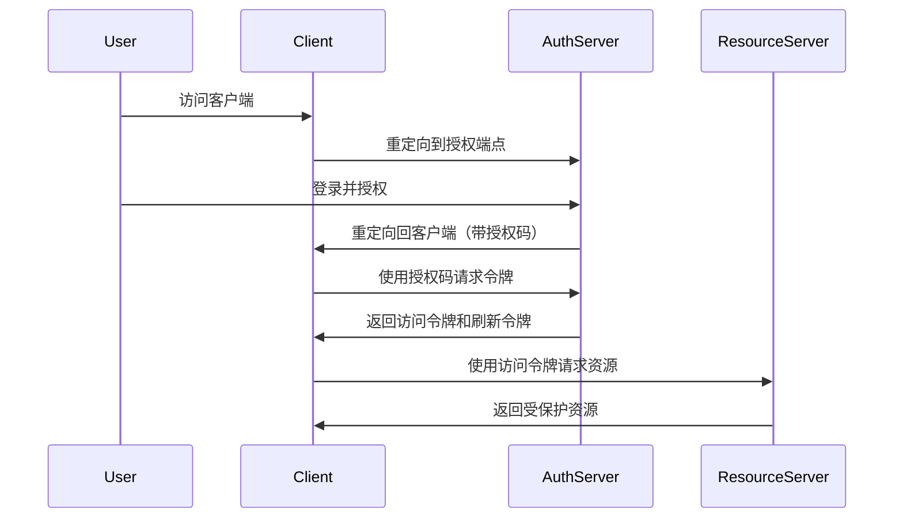

# OAuth 2.0 授权框架

## 概述

OAuth 2.0 是一个行业标准的授权协议，允许用户在不暴露密码的情况下，授权第三方应用访问其在其他服务提供者存储的特定资源。它专注于客户端开发者的简易性，为 Web 应用、桌面应用、移动设备等提供特定的授权流程。

## 核心角色

### 四个主要参与者
```markdown
1. **资源所有者 (Resource Owner)**: 用户，拥有受保护资源的所有权
2. **客户端 (Client)**: 第三方应用，请求访问用户资源
3. **授权服务器 (Authorization Server)**: 验证用户身份并颁发访问令牌
4. **资源服务器 (Resource Server)**: 存储用户资源的服务器，接受并验证访问令牌
```

## 授权类型（Grant Types）

### 1. 授权码模式 (Authorization Code)
**最安全且最常用的流程，适用于 Web 服务器应用**



#### 授权请求示例
```http
GET /authorize?response_type=code
  &client_id=CLIENT_ID
  &redirect_uri=https://client.com/callback
  &scope=read%20write
  &state=xyz123 HTTP/1.1
Host: auth.server.com
```

#### 令牌请求示例
```http
POST /token HTTP/1.1
Host: auth.server.com
Content-Type: application/x-www-form-urlencoded

grant_type=authorization_code
&code=AUTHORIZATION_CODE
&redirect_uri=https://client.com/callback
&client_id=CLIENT_ID
&client_secret=CLIENT_SECRET
```

### 2. 隐式模式 (Implicit)
**适用于纯前端应用，不再推荐使用**

```http
GET /authorize?response_type=token
  &client_id=CLIENT_ID
  &redirect_uri=https://client.com/callback
  &scope=read HTTP/1.1
Host: auth.server.com
```

### 3. 密码模式 (Resource Owner Password Credentials)
**用户直接提供凭据，仅适用于高度信任的客户端**

```http
POST /token HTTP/1.1
Host: auth.server.com
Content-Type: application/x-www-form-urlencoded

grant_type=password
&username=USERNAME
&password=PASSWORD
&client_id=CLIENT_ID
&scope=read
```

### 4. 客户端模式 (Client Credentials)
**客户端以自己的名义而非用户名义访问资源**

```http
POST /token HTTP/1.1
Host: auth.server.com
Content-Type: application/x-www-form-urlencoded

grant_type=client_credentials
&client_id=CLIENT_ID
&client_secret=CLIENT_SECRET
&scope=read
```

### 5. 刷新令牌模式 (Refresh Token)
**使用刷新令牌获取新的访问令牌**

```http
POST /token HTTP/1.1
Host: auth.server.com
Content-Type: application/x-www-form-urlencoded

grant_type=refresh_token
&refresh_token=REFRESH_TOKEN
&client_id=CLIENT_ID
&client_secret=CLIENT_SECRET
```

## 令牌类型

### 访问令牌 (Access Token)
```json
{
  "access_token": "eyJhbGciOiJIUzI1NiIsInR5cCI6IkpXVCJ9...",
  "token_type": "Bearer",
  "expires_in": 3600,
  "refresh_token": "def50200de34a5e5c9c2b...",
  "scope": "read write"
}
```

### JWT 令牌结构
```json
{
  "header": {
    "alg": "HS256",
    "typ": "JWT"
  },
  "payload": {
    "iss": "auth.server.com",
    "sub": "1234567890",
    "aud": "api.server.com",
    "exp": 1717046022,
    "iat": 1717042422,
    "scope": "read write",
    "client_id": "CLIENT_ID"
  },
  "signature": "SflKxwRJSMeKKF2QT4fwpMeJf36POk6yJV_adQssw5c"
}
```

## 安全实践

### PKCE (Proof Key for Code Exchange)
**防止授权码拦截攻击**

```javascript
// 生成 code_verifier 和 code_challenge
const crypto = require('crypto');

function generatePKCE() {
  const codeVerifier = crypto.randomBytes(32).toString('base64url');
  const codeChallenge = crypto
    .createHash('sha256')
    .update(codeVerifier)
    .digest('base64url');
  
  return { codeVerifier, codeChallenge };
}
```

### 令牌安全
```markdown
1. **使用HTTPS**: 所有通信必须加密
2. **短期访问令牌**: 设置合理的过期时间（1-2小时）
3. **安全存储令牌**: 客户端妥善保管令牌
4. **令牌轮换**: 定期刷新访问令牌
5. **令牌撤销**: 提供令牌撤销机制
```

## 实现示例

### Spring Security OAuth2 配置
```java
@Configuration
@EnableAuthorizationServer
public class AuthorizationServerConfig extends AuthorizationServerConfigurerAdapter {
    
    @Override
    public void configure(ClientDetailsServiceConfigurer clients) throws Exception {
        clients.inMemory()
            .withClient("client-app")
            .secret(passwordEncoder().encode("secret"))
            .authorizedGrantTypes("authorization_code", "refresh_token")
            .scopes("read", "write")
            .redirectUris("http://localhost:8080/callback")
            .accessTokenValiditySeconds(3600)
            .refreshTokenValiditySeconds(86400);
    }
    
    @Override
    public void configure(AuthorizationServerEndpointsConfigurer endpoints) {
        endpoints.authenticationManager(authenticationManager)
                .tokenStore(tokenStore())
                .accessTokenConverter(accessTokenConverter());
    }
    
    @Bean
    public JwtAccessTokenConverter accessTokenConverter() {
        JwtAccessTokenConverter converter = new JwtAccessTokenConverter();
        converter.setSigningKey("secret-key");
        return converter;
    }
}
```

### Node.js Express 实现
```javascript
const express = require('express');
const jwt = require('jsonwebtoken');
const crypto = require('crypto');

const app = express();
app.use(express.json());

// 存储授权码和令牌
const authCodes = new Map();
const accessTokens = new Map();

// 授权端点
app.get('/authorize', (req, res) => {
  const { response_type, client_id, redirect_uri, scope, state } = req.query;
  
  // 验证客户端
  if (client_id !== 'client-app') {
    return res.status(400).json({ error: 'invalid_client' });
  }
  
  // 生成授权码
  const authCode = crypto.randomBytes(16).toString('hex');
  authCodes.set(authCode, {
    client_id,
    redirect_uri,
    scope,
    expires: Date.now() + 10 * 60 * 1000 // 10分钟过期
  });
  
  // 重定向回客户端
  res.redirect(`${redirect_uri}?code=${authCode}&state=${state}`);
});

// 令牌端点
app.post('/token', (req, res) => {
  const { grant_type, code, redirect_uri, client_id, client_secret } = req.body;
  
  if (grant_type === 'authorization_code') {
    const authCode = authCodes.get(code);
    if (!authCode || authCode.expires < Date.now()) {
      return res.status(400).json({ error: 'invalid_grant' });
    }
    
    // 生成访问令牌
    const accessToken = jwt.sign(
      { client_id, scope: authCode.scope },
      'secret-key',
      { expiresIn: '1h' }
    );
    
    const refreshToken = crypto.randomBytes(32).toString('hex');
    
    res.json({
      access_token: accessToken,
      token_type: 'Bearer',
      expires_in: 3600,
      refresh_token: refreshToken,
      scope: authCode.scope
    });
  }
});
```

### 资源服务器中间件
```javascript
function authenticateToken(req, res, next) {
  const authHeader = req.headers['authorization'];
  const token = authHeader && authHeader.split(' ')[1];
  
  if (!token) {
    return res.status(401).json({ error: 'access_denied' });
  }
  
  jwt.verify(token, 'secret-key', (err, decoded) => {
    if (err) {
      return res.status(403).json({ error: 'invalid_token' });
    }
    req.user = decoded;
    next();
  });
}

app.get('/api/protected', authenticateToken, (req, res) => {
  res.json({ message: 'Protected data', user: req.user });
});
```

## 客户端实现

### React 前端应用
```javascript
import { useEffect, useState } from 'react';

function LoginButton() {
  const [user, setUser] = useState(null);
  
  const handleLogin = () => {
    const clientId = 'client-app';
    const redirectUri = encodeURIComponent('http://localhost:3000/callback');
    const scope = encodeURIComponent('read write');
    const state = Math.random().toString(36).substring(2);
    
    const authUrl = `http://auth.server.com/authorize?response_type=code&client_id=${clientId}&redirect_uri=${redirectUri}&scope=${scope}&state=${state}`;
    
    // 存储state用于验证
    localStorage.setItem('oauth_state', state);
    window.location.href = authUrl;
  };
  
  // 处理回调
  useEffect(() => {
    const urlParams = new URLSearchParams(window.location.search);
    const code = urlParams.get('code');
    const state = urlParams.get('state');
    
    if (code && state) {
      const savedState = localStorage.getItem('oauth_state');
      if (state === savedState) {
        exchangeCodeForToken(code);
      }
    }
  }, []);
  
  const exchangeCodeForToken = async (code) => {
    const response = await fetch('http://auth.server.com/token', {
      method: 'POST',
      headers: { 'Content-Type': 'application/x-www-form-urlencoded' },
      body: new URLSearchParams({
        grant_type: 'authorization_code',
        code,
        redirect_uri: 'http://localhost:3000/callback',
        client_id: 'client-app',
        client_secret: 'client-secret'
      })
    });
    
    const tokens = await response.json();
    localStorage.setItem('access_token', tokens.access_token);
    localStorage.setItem('refresh_token', tokens.refresh_token);
    setUser(tokens);
  };
  
  return (
    <div>
      {user ? (
        <div>Welcome, user!</div>
      ) : (
        <button onClick={handleLogin}>Login with OAuth</button>
      )}
    </div>
  );
}
```

## 最佳实践

### 安全配置
```yaml
# 安全配置示例
security:
  oauth2:
    client:
      registration:
        my-client:
          client-id: client-app
          client-secret: ${CLIENT_SECRET}
          scope: read,write
          authorization-grant-type: authorization_code
          redirect-uri: "{baseUrl}/login/oauth2/code/{registrationId}"
      provider:
        my-provider:
          authorization-uri: https://auth.server.com/authorize
          token-uri: https://auth.server.com/token
          user-info-uri: https://api.server.com/userinfo
```

### 令牌管理
```javascript
class TokenManager {
  constructor() {
    this.accessToken = localStorage.getItem('access_token');
    this.refreshToken = localStorage.getItem('refresh_token');
  }
  
  async getValidToken() {
    if (!this.accessToken) {
      await this.refreshAccessToken();
    }
    
    try {
      // 验证令牌是否过期
      const payload = JSON.parse(atob(this.accessToken.split('.')[1]));
      if (payload.exp * 1000 < Date.now()) {
        await this.refreshAccessToken();
      }
    } catch (error) {
      await this.refreshAccessToken();
    }
    
    return this.accessToken;
  }
  
  async refreshAccessToken() {
    const response = await fetch('/token', {
      method: 'POST',
      headers: { 'Content-Type': 'application/x-www-form-urlencoded' },
      body: new URLSearchParams({
        grant_type: 'refresh_token',
        refresh_token: this.refreshToken,
        client_id: 'client-app'
      })
    });
    
    const tokens = await response.json();
    this.accessToken = tokens.access_token;
    this.refreshToken = tokens.refresh_token;
    
    localStorage.setItem('access_token', this.accessToken);
    localStorage.setItem('refresh_token', this.refreshToken);
  }
}
```

## 常见攻击与防护

### 1. CSRF 攻击防护
```javascript
// 使用state参数防止CSRF
const generateState = () => {
  return crypto.randomBytes(16).toString('hex');
};

// 验证state参数
const validateState = (receivedState, expectedState) => {
  return receivedState === expectedState;
};
```

### 2. 令牌劫持防护
```markdown
防护措施：
- 使用HTTPS加密通信
- 设置适当的CORS策略
- 使用HttpOnly和Secure cookie标志
- 实施令牌绑定（Token Binding）
```

### 3. 重定向URI验证
```java
public boolean validateRedirectUri(String clientId, String redirectUri) {
    Client client = clientRepository.findByClientId(clientId);
    return client.getRedirectUris().contains(redirectUri);
}
```

## 监控与日志

### 审计日志
```java
@Aspect
@Component
public class OAuthAuditAspect {
    
    @AfterReturning(
        pointcut = "execution(* org.springframework.security.oauth2.provider.endpoint.*.*(..))",
        returning = "result"
    )
    public void auditEndpoint(JoinPoint joinPoint, Object result) {
        String methodName = joinPoint.getSignature().getName();
        HttpServletRequest request = ((ServletRequestAttributes) 
            RequestContextHolder.currentRequestAttributes()).getRequest();
        
        log.info("OAuth operation: {} from IP: {} with params: {}",
                 methodName,
                 request.getRemoteAddr(),
                 request.getParameterMap());
    }
}
```

### 监控指标
```prometheus
# OAuth2.0 监控指标
oauth2_authorization_requests_total{client="client-app",status="success"}
oauth2_token_requests_total{grant_type="authorization_code",status="success"}
oauth2_token_expirations_total{type="access_token"}
oauth2_errors_total{error_type="invalid_client"}
```

## 故障排查

### 常见错误代码
```markdown
- **invalid_request**: 请求缺少必需参数
- **invalid_client**: 客户端认证失败
- **invalid_grant**: 授权码或刷新令牌无效
- **unauthorized_client**: 客户端无权使用此授权类型
- **unsupported_grant_type**: 不支持的授权类型
- **invalid_scope**: 请求的scope无效或越权
```

### 调试技巧
```bash
# 使用curl测试令牌端点
curl -X POST https://auth.server.com/token \
  -H "Content-Type: application/x-www-form-urlencoded" \
  -d "grant_type=client_credentials&client_id=CLIENT_ID&client_secret=CLIENT_SECRET"

# 解码JWT令牌
echo "eyJhbGciOiJIUzI1NiIsInR5cCI6IkpXVCJ9..." | cut -d '.' -f 2 | base64 -d
```

## 总结

OAuth 2.0 提供了一个强大的框架来实现安全的授权流程。正确实施时需要注意：

**关键最佳实践：**
1. 始终使用授权码模式（带PKCE）
2. 验证所有重定向URI
3. 使用短期访问令牌和安全的刷新令牌
4. 实施适当的scope验证
5. 记录和监控所有授权活动

**安全考虑：**
- 防止CSRF攻击（使用state参数）
- 防止令牌泄露（使用HTTPS，安全存储）
- 定期轮换客户端密钥
- 实施令牌撤销机制

> 提示：OAuth 2.0 是授权协议，不是认证协议。对于用户认证，建议结合OpenID Connect（OIDC）使用。

***
*相关阅读：./oidc-deep-dive.md | ./jwt-security.md | ./api-security-architecture.md*