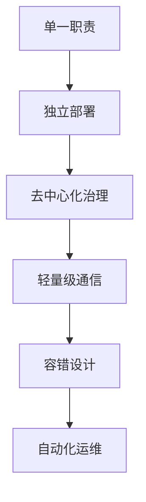
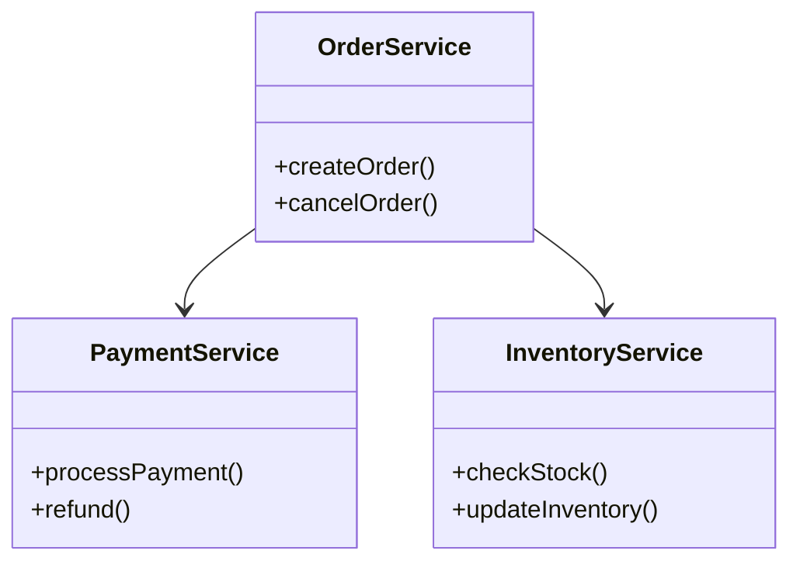

# 微服务架构深度解析

微服务架构是一种将单一应用程序划分为一组小型服务的架构风格，每个服务运行在独立的进程中，服务之间通过轻量级机制（通常是HTTP API）进行通信。以下是微服务架构的全面解析：

## 1. 核心特征

### 微服务架构原则



### 与传统架构对比

| 维度         | 单体架构               | 微服务架构               |
|--------------|------------------------|--------------------------|
| 开发效率      | 初期高                 | 长期维护高               |
| 部署粒度      | 整体部署               | 独立服务部署             |
| 技术栈        | 统一技术栈             | 多语言混合               |
| 扩展性        | 垂直扩展               | 水平扩展                 |
| 故障隔离      | 单点故障影响全局       | 故障局部化               |

## 2. 技术组件体系

### 微服务技术栈

```
服务治理 ←→ 配置中心 ←→ 服务网关
  ↑           ↑           ↑
服务注册发现   动态配置     流量管理
  ↓           ↓           ↓
熔断限流 ←→ 链路追踪 ←→ 监控告警
```

### 典型技术选型

| 组件类型       | 流行方案               |
|----------------|------------------------|
| 服务框架       | Spring Cloud, Dubbo    |
| 服务注册中心   | Nacos, Eureka, Consul  |
| 配置中心       | Apollo, Nacos          |
| API网关        | Spring Cloud Gateway   |
| 熔断降级       | Sentinel, Hystrix      |
| 链路追踪       | SkyWalking, Zipkin     |

## 3. 服务拆分策略

### 领域驱动设计(DDD)



### 拆分评估矩阵

| 拆分维度     | 评估标准                          | 示例              |
|--------------|-----------------------------------|-------------------|
| 业务能力     | 是否代表独立业务能力              | 支付服务          |
| 变更频率     | 变更是否独立发生                  | 用户信息服务      |
| 数据隔离     | 是否需要独立数据存储              | 日志服务          |
| 性能需求     | 是否需要独立扩展                  | 报表生成服务      |

## 4. 通信机制

### 通信模式对比

| 模式         | 协议        | 适用场景          | 性能影响        |
|--------------|-------------|-------------------|-----------------|
| 同步调用     | HTTP/gRPC   | 实时性要求高       | 高延迟依赖      |
| 异步消息     | Kafka/Rabbit| 最终一致性场景     | 低耦合          |
| 事件驱动     | WebSocket   | 实时通知类业务     | 资源消耗较高    |

### RESTful设计规范

```java
// 订单服务API示例
@RestController
@RequestMapping("/orders")
public class OrderController {
    
    @PostMapping
    public ResponseEntity<Order> createOrder(@RequestBody OrderDTO dto) {
        // ...
    }
    
    @GetMapping("/{id}")
    public Order getOrder(@PathVariable String id) {
        // ...
    }
    
    @PutMapping("/{id}/status")
    public void updateStatus(@PathVariable String id, 
                            @RequestParam String status) {
        // ...
    }
}
```

## 5. 数据管理

### 数据一致性方案

```
最终一致性 → Saga模式 → 
  ↑                     ↓
事件溯源 ←── 补偿事务 ←── TCC
```

### 分布式事务对比

| 方案       | 一致性级别 | 性能影响 | 实现复杂度 |
|------------|------------|----------|------------|
| 2PC       | 强一致      | 高       | 中         |
| TCC       | 最终一致    | 中       | 高         |
| Saga      | 最终一致    | 低       | 中         |
| 本地消息表 | 最终一致    | 低       | 低         |

## 6. 运维体系

### 监控指标维度

```math
\text{服务健康度} = \alpha \cdot \text{可用率} + \beta \cdot \text{成功率} + \gamma \cdot \text{延迟}
```

### 告警规则示例

```yaml
# Prometheus告警规则
groups:
- name: service-errors
  rules:
  - alert: HighErrorRate
    expr: rate(http_requests_total{status=~"5.."}[5m]) > 0.1
    for: 10m
    labels:
      severity: critical
    annotations:
      summary: "High error rate on {{ $labels.service }}"
```

## 7. 常见挑战与对策

### 典型问题矩阵

| 挑战              | 解决方案                      | 技术实现                  |
|-------------------|-------------------------------|---------------------------|
| 服务雪崩          | 熔断+降级+限流               | Sentinel熔断规则          |
| 链路追踪困难      | 全链路ID传递                 | Sleuth+Zipkin集成         |
| 配置管理复杂      | 统一配置中心                 | Nacos动态配置             |
| 测试环境治理      | 服务契约测试                 | Pact契约测试              |
| 部署效率低下      | CI/CD流水线                  | Jenkins+ArgoCD            |

## 8. 演进路线

### 微服务成熟度模型

```
Level 0: 服务拆分
Level 1: 基础治理(注册/发现/配置)
Level 2: 高级治理(熔断/限流/降级)
Level 3: 服务网格(边车代理)
Level 4: 服务自治(AI运维)
```

## 9. 行业实践案例

### 电商系统微服务化

```
用户服务 → 订单服务 → 支付服务
  ↑           ↑           ↑
商品服务 ←─ 库存服务 ←─ 物流服务
```

### 关键设计决策：
1. 采用Saga管理订单流程
2. 使用Redis集群缓存商品数据
3. 通过Kafka实现库存扣减事件驱动
4. API网关统一鉴权和路由

## 10. 未来趋势

### 微服务2.0方向
```
服务粒度优化 → 单体适中服务(Microservice++)
云原生深度融合 → Serverless微服务
智能运维 → AIOps驱动自治
多运行时架构 → Dapr等抽象层
```

微服务架构的实施需要权衡：
- 团队技术能力与架构复杂度
- 业务需求与治理成本
- 短期投入与长期收益

建议采用渐进式演进策略，从"小而美"的核心服务开始，逐步完善基础设施和治理体系。