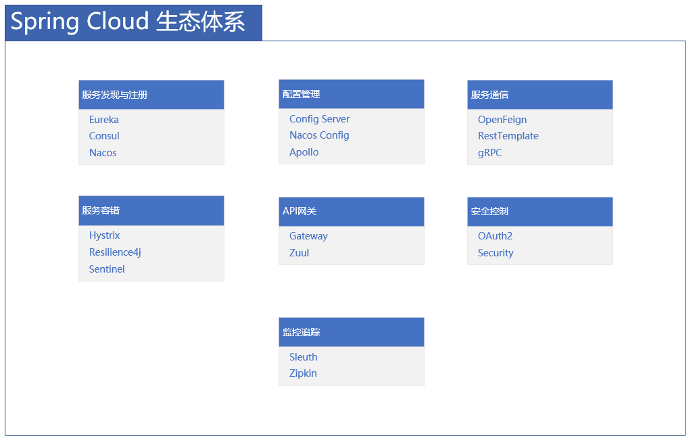

# Spring Cloud 微服务生态指南

## 概述

Spring Cloud 为微服务架构提供了一套完整的解决方案，涵盖了服务发现、配置管理、负载均衡、熔断器、网关等核心组件。它基于 Spring Boot 的开发便利性，让开发者能够快速构建分布式系统。

## Spring Cloud 生态体系

### 核心组件架构



## 服务发现与注册

### Eureka 服务注册中心
```yaml
# application.yml - Eureka Server配置
server:
  port: 8761

eureka:
  client:
    register-with-eureka: false
    fetch-registry: false
    service-url:
      defaultZone: http://localhost:8761/eureka/
  server:
    enable-self-preservation: false
    eviction-interval-timer-in-ms: 30000

# Eureka Client配置
eureka:
  client:
    service-url:
      defaultZone: http://eureka-server:8761/eureka/
  instance:
    instance-id: ${spring.application.name}:${server.port}
    prefer-ip-address: true
    lease-renewal-interval-in-seconds: 5
    lease-expiration-duration-in-seconds: 10
```

### Nacos 服务发现
```yaml
# Nacos配置
spring:
  cloud:
    nacos:
      discovery:
        server-addr: localhost:8848
        namespace: dev
        group: DEFAULT_GROUP
        cluster-name: CLUSTER_A
        metadata:
          version: 1.0.0
```

## 配置管理

### Config Server 配置中心
```java
@SpringBootApplication
@EnableConfigServer
public class ConfigServerApplication {
    public static void main(String[] args) {
        SpringApplication.run(ConfigServerApplication.class, args);
    }
}

# bootstrap.yml - Config Client
spring:
  application:
    name: user-service
  cloud:
    config:
      uri: http://config-server:8888
      label: main
      profile: dev
      fail-fast: true
      retry:
        initial-interval: 1000
        max-interval: 2000
        max-attempts: 6
```

### Nacos 配置管理
```yaml
spring:
  cloud:
    nacos:
      config:
        server-addr: localhost:8848
        file-extension: yaml
        namespace: dev
        group: DEFAULT_GROUP
        refresh-enabled: true
        shared-configs:
          - data-id: common.yaml
            group: COMMON_GROUP
            refresh: true
        extension-configs:
          - data-id: ext.yaml
            group: EXT_GROUP
            refresh: true
```

## 服务通信

### OpenFeign 声明式HTTP客户端
```java
@FeignClient(
    name = "order-service",
    url = "${feign.client.order-service.url}",
    configuration = OrderFeignConfig.class,
    fallback = OrderServiceFallback.class
)
public interface OrderServiceClient {
    
    @GetMapping("/orders/{orderId}")
    Order getOrder(@PathVariable("orderId") Long orderId);
    
    @PostMapping("/orders")
    Order createOrder(@RequestBody Order order);
    
    @GetMapping("/orders/user/{userId}")
    List<Order> getUserOrders(@PathVariable("userId") Long userId);
}

// Feign配置类
public class OrderFeignConfig {
    
    @Bean
    public Logger.Level feignLoggerLevel() {
        return Logger.Level.FULL;
    }
    
    @Bean
    public Retryer feignRetryer() {
        return new Retryer.Default(100, 1000, 3);
    }
    
    @Bean
    public RequestInterceptor authInterceptor() {
        return template -> {
            template.header("Authorization", "Bearer " + getAuthToken());
        };
    }
}

// 降级实现
@Component
public class OrderServiceFallback implements OrderServiceClient {
    
    @Override
    public Order getOrder(Long orderId) {
        return Order.createDefaultOrder(orderId);
    }
    
    @Override
    public Order createOrder(Order order) {
        throw new ServiceUnavailableException("Order service is unavailable");
    }
    
    @Override
    public List<Order> getUserOrders(Long userId) {
        return Collections.emptyList();
    }
}
```

### RestTemplate 负载均衡
```java
@Configuration
public class RestTemplateConfig {
    
    @Bean
    @LoadBalanced
    public RestTemplate loadBalancedRestTemplate() {
        return new RestTemplateBuilder()
            .setConnectTimeout(Duration.ofSeconds(3))
            .setReadTimeout(Duration.ofSeconds(5))
            .additionalInterceptors(
                new LoadBalancerInterceptor(loadBalancerClient)
            )
            .build();
    }
    
    @Bean
    public RestTemplate normalRestTemplate() {
        return new RestTemplate();
    }
}

@Service
public class UserService {
    
    @Autowired
    @LoadBalanced
    private RestTemplate restTemplate;
    
    public User getUserWithOrders(Long userId) {
        // 使用服务名进行调用
        User user = restTemplate.getForObject(
            "http://user-service/users/{userId}", User.class, userId);
        
        List<Order> orders = restTemplate.getForObject(
            "http://order-service/orders/user/{userId}", List.class, userId);
        
        user.setOrders(orders);
        return user;
    }
}
```

## 服务容错

### Resilience4j 熔断器
```java
@Configuration
public class ResilienceConfig {
    
    @Bean
    public CircuitBreakerConfig circuitBreakerConfig() {
        return CircuitBreakerConfig.custom()
            .failureRateThreshold(50)
            .waitDurationInOpenState(Duration.ofMillis(1000))
            .slidingWindowType(SlidingWindowType.COUNT_BASED)
            .slidingWindowSize(10)
            .minimumNumberOfCalls(5)
            .permittedNumberOfCallsInHalfOpenState(3)
            .build();
    }
    
    @Bean
    public RetryConfig retryConfig() {
        return RetryConfig.custom()
            .maxAttempts(3)
            .waitDuration(Duration.ofMillis(100))
            .intervalFunction(IntervalFunction.ofExponentialBackoff())
            .retryOnException(e -> e instanceof RuntimeException)
            .build();
    }
    
    @Bean
    public TimeoutConfig timeoutConfig() {
        return TimeoutConfig.custom()
            .timeoutDuration(Duration.ofSeconds(2))
            .build();
    }
}

@Service
public class OrderService {
    
    private final CircuitBreaker circuitBreaker;
    private final Retry retry;
    private final Timeout timeout;
    
    public OrderService(CircuitBreakerRegistry circuitBreakerRegistry,
                       RetryRegistry retryRegistry,
                       TimeoutRegistry timeoutRegistry) {
        this.circuitBreaker = circuitBreakerRegistry.circuitBreaker("orderService");
        this.retry = retryRegistry.retry("orderService");
        this.timeout = timeoutRegistry.timeout("orderService");
    }
    
    @CircuitBreaker(name = "orderService", fallbackMethod = "getOrderFallback")
    @Retry(name = "orderService", fallbackMethod = "getOrderFallback")
    @Timeout(name = "orderService", fallbackMethod = "getOrderFallback")
    public Order getOrder(Long orderId) {
        return orderRepository.findById(orderId)
            .orElseThrow(() -> new OrderNotFoundException("Order not found"));
    }
    
    public Order getOrderFallback(Long orderId, Exception e) {
        log.warn("Fallback triggered for order: {}", orderId, e);
        return Order.createDefaultOrder(orderId);
    }
}
```

### Sentinel 流量控制
```java
@Configuration
public class SentinelConfig {
    
    @PostConstruct
    public void init() {
        // 配置流量控制规则
        List<FlowRule> rules = new ArrayList<>();
        
        FlowRule rule = new FlowRule();
        rule.setResource("getOrder");
        rule.setGrade(RuleConstant.FLOW_GRADE_QPS);
        rule.setCount(100); // 每秒最大QPS
        rule.setControlBehavior(RuleConstant.CONTROL_BEHAVIOR_WARM_UP);
        rule.setWarmUpPeriodSec(10);
        
        rules.add(rule);
        FlowRuleManager.loadRules(rules);
        
        // 配置降级规则
        List<DegradeRule> degradeRules = new ArrayList<>();
        
        DegradeRule degradeRule = new DegradeRule();
        degradeRule.setResource("getOrder");
        degradeRule.setGrade(RuleConstant.DEGRADE_GRADE_EXCEPTION_COUNT);
        degradeRule.setCount(5); // 5个异常触发降级
        degradeRule.setTimeWindow(10); // 降级10秒
        
        degradeRules.add(degradeRule);
        DegradeRuleManager.loadRules(degradeRules);
    }
}

@Service
public class OrderService {
    
    @SentinelResource(
        value = "getOrder",
        blockHandler = "handleBlock",
        fallback = "getOrderFallback"
    )
    public Order getOrder(Long orderId) {
        return orderRepository.findById(orderId)
            .orElseThrow(() -> new OrderNotFoundException("Order not found"));
    }
    
    public Order handleBlock(Long orderId, BlockException ex) {
        log.warn("Blocked by Sentinel: {}", ex.getMessage());
        return Order.createLimitedOrder(orderId);
    }
    
    public Order getOrderFallback(Long orderId, Throwable t) {
        log.warn("Fallback triggered: {}", t.getMessage());
        return Order.createDefaultOrder(orderId);
    }
}
```

## API 网关

### Spring Cloud Gateway
```yaml
spring:
  cloud:
    gateway:
      routes:
        - id: user-service
          uri: lb://user-service
          predicates:
            - Path=/api/users/**
          filters:
            - StripPrefix=1
            - name: RequestRateLimiter
              args:
                redis-rate-limiter.replenishRate: 10
                redis-rate-limiter.burstCapacity: 20
            - name: CircuitBreaker
              args:
                name: userService
                fallbackUri: forward:/fallback/user
        
        - id: order-service
          uri: lb://order-service
          predicates:
            - Path=/api/orders/**
          filters:
            - StripPrefix=1
            - AddRequestHeader=X-User-Id,{userId}
            - RewritePath=/api/orders/(?<segment>.*), /$\{segment}
      
      default-filters:
        - name: RequestLogging
        - name: Authentication
      
      discovery:
        locator:
          enabled: true
          lower-case-service-id: true
```

### 网关过滤器配置
```java
@Configuration
public class GatewayConfig {
    
    @Bean
    public RouteLocator customRouteLocator(RouteLocatorBuilder builder) {
        return builder.routes()
            .route("auth-service", r -> r.path("/auth/**")
                .filters(f -> f
                    .rewritePath("/auth/(?<segment>.*)", "/${segment}")
                    .addRequestHeader("X-Auth-Service", "true")
                    .circuitBreaker(config -> config
                        .setName("authCircuitBreaker")
                        .setFallbackUri("forward:/fallback/auth"))
                )
                .uri("lb://auth-service"))
            
            .route("product-service", r -> r.path("/products/**")
                .filters(f -> f
                    .stripPrefix(1)
                    .requestRateLimiter(config -> config
                        .setRateLimiter(redisRateLimiter())
                        .setKeyResolver(userKeyResolver()))
                    .addResponseHeader("Cache-Control", "max-age=3600")
                )
                .uri("lb://product-service"))
            .build();
    }
    
    @Bean
    public RedisRateLimiter redisRateLimiter() {
        return new RedisRateLimiter(10, 20);
    }
    
    @Bean
    public KeyResolver userKeyResolver() {
        return exchange -> Mono.just(
            exchange.getRequest().getHeaders().getFirst("X-User-Id")
        );
    }
}
```

## 安全控制

### OAuth2 安全配置
```java
@Configuration
@EnableAuthorizationServer
public class AuthorizationServerConfig extends AuthorizationServerConfigurerAdapter {
    
    @Override
    public void configure(ClientDetailsServiceConfigurer clients) throws Exception {
        clients.inMemory()
            .withClient("web-app")
            .secret(passwordEncoder.encode("secret"))
            .authorizedGrantTypes("password", "refresh_token")
            .scopes("read", "write")
            .accessTokenValiditySeconds(3600)
            .refreshTokenValiditySeconds(86400);
    }
    
    @Override
    public void configure(AuthorizationServerEndpointsConfigurer endpoints) {
        endpoints
            .tokenStore(tokenStore())
            .accessTokenConverter(accessTokenConverter())
            .authenticationManager(authenticationManager);
    }
}

@Configuration
@EnableResourceServer
public class ResourceServerConfig extends ResourceServerConfigurerAdapter {
    
    @Override
    public void configure(HttpSecurity http) throws Exception {
        http
            .authorizeRequests()
            .antMatchers("/api/public/**").permitAll()
            .antMatchers("/api/users/**").hasRole("USER")
            .antMatchers("/api/admin/**").hasRole("ADMIN")
            .anyRequest().authenticated();
    }
}
```

### JWT Token 配置
```java
@Configuration
public class JwtConfig {
    
    @Bean
    public JwtAccessTokenConverter accessTokenConverter() {
        JwtAccessTokenConverter converter = new JwtAccessTokenConverter();
        converter.setSigningKey("signing-key");
        converter.setVerifierKey("verification-key");
        return converter;
    }
    
    @Bean
    public TokenStore tokenStore() {
        return new JwtTokenStore(accessTokenConverter());
    }
    
    @Bean
    public DefaultTokenServices tokenServices() {
        DefaultTokenServices services = new DefaultTokenServices();
        services.setTokenStore(tokenStore());
        services.setSupportRefreshToken(true);
        services.setReuseRefreshToken(false);
        return services;
    }
}
```

## 监控追踪

### Spring Cloud Sleuth + Zipkin
```yaml
spring:
  zipkin:
    base-url: http://zipkin:9411
    sender.type: web
  sleuth:
    sampler:
      probability: 1.0
    web:
      client:
        enabled: true
    redis:
      enabled: true
    rpc:
      enabled: true

# 自定义Sleuth配置
management:
  tracing:
    sampling:
      probability: 0.5
  zipkin:
    tracing:
      endpoint: http://zipkin:9411/api/v2/spans
```

### 分布式追踪配置
```java
@Configuration
public class TracingConfig {
    
    @Bean
    public Sampler alwaysSampler() {
        return Sampler.ALWAYS_SAMPLE;
    }
    
    @Bean
    public CurrentTraceContext.ScopeDecorator mdcScopeDecorator() {
        return MDCScopeDecorator.newBuilder().build();
    }
    
    @Bean
    public BaggagePropagation.FactoryBuilder baggagePropagation() {
        return BaggagePropagation.newFactoryBuilder(B3Propagation.FACTORY);
    }
}

// 自定义追踪过滤器
@Component
public class CustomTraceFilter implements Filter {
    
    private final Tracer tracer;
    
    public CustomTraceFilter(Tracer tracer) {
        this.tracer = tracer;
    }
    
    @Override
    public void doFilter(ServletRequest request, ServletResponse response, FilterChain chain) {
        Span span = tracer.nextSpan().name("custom-filter").start();
        
        try (Tracer.SpanInScope ws = tracer.withSpanInScope(span)) {
            // 添加自定义标签
            span.tag("http.method", ((HttpServletRequest) request).getMethod());
            span.tag("http.path", ((HttpServletRequest) request).getRequestURI());
            
            chain.doFilter(request, response);
        } catch (Exception e) {
            span.error(e);
            throw e;
        } finally {
            span.finish();
        }
    }
}
```

## 部署与运维

### Docker 容器化配置
```dockerfile
# Dockerfile
FROM openjdk:17-jre-slim

# 安装必要的工具
RUN apt-get update && apt-get install -y \
    curl \
    tini \
    && rm -rf /var/lib/apt/lists/*

# 创建非root用户
RUN groupadd -r spring && useradd -r -g spring spring
USER spring

# 设置工作目录
WORKDIR /app

# 复制JAR文件
COPY target/*.jar app.jar

# 使用tini作为init进程
ENTRYPOINT ["/usr/bin/tini", "--"]

# 启动应用
CMD java ${JAVA_OPTS} -jar app.jar
```

### Kubernetes 部署配置
```yaml
# deployment.yaml
apiVersion: apps/v1
kind: Deployment
metadata:
  name: user-service
spec:
  replicas: 3
  selector:
    matchLabels:
      app: user-service
  template:
    metadata:
      labels:
        app: user-service
      annotations:
        prometheus.io/scrape: "true"
        prometheus.io/port: "8080"
    spec:
      containers:
      - name: user-service
        image: user-service:1.0.0
        ports:
        - containerPort: 8080
        env:
        - name: JAVA_OPTS
          value: "-Xms512m -Xmx1024m -XX:+UseContainerSupport"
        - name: SPRING_PROFILES_ACTIVE
          value: "prod"
        resources:
          requests:
            memory: "512Mi"
            cpu: "250m"
          limits:
            memory: "1Gi"
            cpu: "500m"
        livenessProbe:
          httpGet:
            path: /actuator/health
            port: 8080
          initialDelaySeconds: 30
          periodSeconds: 10
        readinessProbe:
          httpGet:
            path: /actuator/health/readiness
            port: 8080
          initialDelaySeconds: 5
          periodSeconds: 5
---
# service.yaml
apiVersion: v1
kind: Service
metadata:
  name: user-service
spec:
  selector:
    app: user-service
  ports:
  - port: 80
    targetPort: 8080
  type: ClusterIP
```

## 最佳实践

### 微服务治理规范
```yaml
# 微服务配置规范
spring:
  application:
    name: user-service  # 服务名称统一格式
    
  cloud:
    # 服务发现配置
    nacos:
      discovery:
        metadata:
          version: 1.0.0
          region: east-china
          zone: zone-a
    
    # 配置中心配置
    config:
      override-none: true
      allow-override: false
    
    # 网关配置
    gateway:
      httpclient:
        connect-timeout: 1000
        response-timeout: 5s

# 监控配置
management:
  endpoints:
    web:
      exposure:
        include: health,info,metrics,prometheus
  endpoint:
    health:
      show-details: always
    metrics:
      enabled: true

# 日志配置
logging:
  level:
    com.example: INFO
    org.springframework.cloud.gateway: DEBUG
  file:
    name: /logs/user-service.log
  logback:
    rollingpolicy:
      max-file-size: 10MB
      max-history: 30
```

### 性能优化配置
```java
@Configuration
public class PerformanceConfig {
    
    @Bean
    public WebClient.Builder loadBalancedWebClientBuilder() {
        return WebClient.builder()
            .clientConnector(new ReactorClientHttpConnector(
                HttpClient.create()
                    .responseTimeout(Duration.ofSeconds(3))
                    .compress(true)
                    .option(ChannelOption.CONNECT_TIMEOUT_MILLIS, 2000)
            ))
            .codecs(configurer -> 
                configurer.defaultCodecs().maxInMemorySize(16 * 1024 * 1024)
            );
    }
    
    @Bean
    public ConnectionProvider connectionProvider() {
        return ConnectionProvider.builder("custom")
            .maxConnections(500)
            .pendingAcquireTimeout(Duration.ofSeconds(10))
            .maxIdleTime(Duration.ofSeconds(60))
            .build();
    }
}
```

## 总结

Spring Cloud 生态为微服务架构提供了全面的解决方案：

**核心优势：**
- 丰富的组件生态系统
- 与Spring Boot无缝集成
- 灵活的配置和扩展能力
- 强大的社区支持

**实施建议：**
- 根据业务规模选择合适的组件
- 建立统一的配置管理规范
- 实施完善的监控和告警
- 定期进行性能优化和版本升级

> 提示：Spring Cloud 组件更新较快，建议保持版本一致性并关注官方更新日志。

***
*相关阅读：./microservice-architecture.md | ./container-deployment.md | ./distributed-monitoring.md*