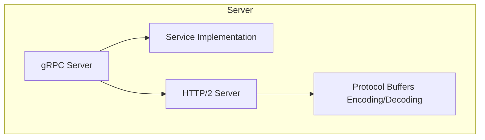
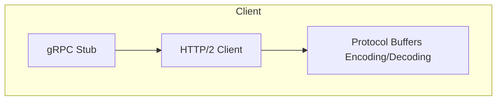

# gRPC 原理与实践

## 概述

gRPC 是一个高性能、开源的通用 RPC（Remote Procedure Call）框架，由 Google 开发并基于 HTTP/2 协议标准设计。它支持多种编程语言，使用 Protocol Buffers 作为接口定义语言（IDL）和底层消息交换格式。

## 核心特性

### 1. 跨语言支持
```markdown
- 支持多种编程语言（C++, Java, Python, Go, Ruby, C#, Node.js 等）
- 自动生成客户端和服务端代码
```

### 2. 高性能
```markdown
- 基于 HTTP/2 协议
- 二进制协议（Protocol Buffers）
- 支持双向流
- 低延迟和高吞吐量
```

### 3. 丰富的服务类型
```markdown
- 一元 RPC（Unary RPC）
- 服务器流式 RPC
- 客户端流式 RPC
- 双向流式 RPC
```

## 核心概念

### Protocol Buffers
**gRPC 的接口定义语言**

```protobuf
// 定义服务接口
service UserService {
  rpc GetUser (UserRequest) returns (UserResponse);
}

// 定义消息格式
message UserRequest {
  string user_id = 1;
}

message UserResponse {
  string user_id = 1;
  string name = 2;
  string email = 3;
}
```

### HTTP/2 基础
```markdown
- **二进制分帧层**：将消息分解为独立的帧
- **多路复用**：多个请求/响应并行
- **头部压缩**：HPACK 压缩减少开销
- **服务器推送**：服务器可以主动推送资源
```

## gRPC 架构

### 服务端架构


### 客户端架构


## 四种服务模式

### 1. 一元 RPC（Unary RPC）
**最简单的请求-响应模式**

```protobuf
rpc GetUser(UserRequest) returns (UserResponse);
```

### 2. 服务器流式 RPC
**客户端发送一个请求，服务器返回一个流**

```protobuf
rpc ListUsers(UserRequest) returns (stream UserResponse);
```

### 3. 客户端流式 RPC
**客户端发送一个流，服务器返回一个响应**

```protobuf
rpc CreateUsers(stream UserRequest) returns (UserResponse);
```

### 4. 双向流式 RPC
**双方都发送一个流**

```protobuf
rpc Chat(stream ChatMessage) returns (stream ChatMessage);
```

## 实践指南

### 定义服务
```protobuf
syntax = "proto3";

package example;

service ProductService {
  // 一元RPC
  rpc GetProduct (ProductRequest) returns (Product);
  
  // 服务器流式
  rpc ListProducts (ProductQuery) returns (stream Product);
  
  // 客户端流式
  rpc RecordProducts (stream Product) returns (ProductSummary);
  
  // 双向流式
  rpc ProcessProducts (stream ProductRequest) returns (stream ProductResponse);
}

message ProductRequest {
  int32 id = 1;
}

message Product {
  int32 id = 1;
  string name = 2;
  float price = 3;
}

message ProductQuery {
  string category = 1;
}

message ProductSummary {
  int32 count = 1;
  float average_price = 2;
}

message ProductResponse {
  Product product = 1;
  string status = 2;
}
```

### 生成代码
```bash
# 生成Go代码
protoc --go_out=. --go_opt=paths=source_relative \
    --go-grpc_out=. --go-grpc_opt=paths=source_relative \
    product.proto

# 生成Java代码
protoc --java_out=. --grpc-java_out=. product.proto

# 生成Python代码
python -m grpc_tools.protoc -I. --python_out=. --grpc_python_out=. product.proto
```

### Go 服务端实现
```go
package main

import (
	"context"
	"log"
	"net"

	"google.golang.org/grpc"
	pb "path/to/your/proto"
)

type server struct {
	pb.UnimplementedProductServiceServer
}

func (s *server) GetProduct(ctx context.Context, req *pb.ProductRequest) (*pb.Product, error) {
	return &pb.Product{
		Id:    req.Id,
		Name:  "Example Product",
		Price: 99.99,
	}, nil
}

func main() {
	lis, err := net.Listen("tcp", ":50051")
	if err != nil {
		log.Fatalf("failed to listen: %v", err)
	}
	
	s := grpc.NewServer()
	pb.RegisterProductServiceServer(s, &server{})
	
	log.Printf("server listening at %v", lis.Addr())
	if err := s.Serve(lis); err != nil {
		log.Fatalf("failed to serve: %v", err)
	}
}
```

### Go 客户端实现
```go
package main

import (
	"context"
	"log"
	"time"

	"google.golang.org/grpc"
	pb "path/to/your/proto"
)

func main() {
	conn, err := grpc.Dial("localhost:50051", grpc.WithInsecure())
	if err != nil {
		log.Fatalf("did not connect: %v", err)
	}
	defer conn.Close()
	
	c := pb.NewProductServiceClient(conn)
	
	ctx, cancel := context.WithTimeout(context.Background(), time.Second)
	defer cancel()
	
	r, err := c.GetProduct(ctx, &pb.ProductRequest{Id: 1})
	if err != nil {
		log.Fatalf("could not get product: %v", err)
	}
	
	log.Printf("Product: %v", r)
}
```

## 高级特性

### 拦截器（Interceptor）
```go
// 服务端拦截器
func loggingInterceptor(ctx context.Context, req interface{}, info *grpc.UnaryServerInfo, handler grpc.UnaryHandler) (interface{}, error) {
    log.Printf("Before handling %s with req %+v", info.FullMethod, req)
    resp, err := handler(ctx, req)
    log.Printf("After handling %s with resp %+v and err %v", info.FullMethod, resp, err)
    return resp, err
}

func main() {
    s := grpc.NewServer(
        grpc.UnaryInterceptor(loggingInterceptor),
    )
    // ...
}
```

### 负载均衡
```go
// 客户端负载均衡
conn, err := grpc.Dial(
    "dns:///my-service.example.com",
    grpc.WithDefaultServiceConfig(`{"loadBalancingPolicy":"round_robin"}`),
    grpc.WithInsecure(),
)
```

### 健康检查
```protobuf
// health.proto
service Health {
  rpc Check(HealthCheckRequest) returns (HealthCheckResponse);
  rpc Watch(HealthCheckRequest) returns (stream HealthCheckResponse);
}
```

```go
// 服务端健康检查注册
import "google.golang.org/grpc/health"
import "google.golang.org/grpc/health/grpc_health_v1"

healthServer := health.NewServer()
healthServer.SetServingStatus("", grpc_health_v1.HealthCheckResponse_SERVING)
grpc_health_v1.RegisterHealthServer(s, healthServer)
```

### 错误处理
```go
// 返回带状态的错误
status.Errorf(codes.NotFound, "Product not found: %d", id)

// 客户端错误处理
if err != nil {
    if status, ok := status.FromError(err); ok {
        switch status.Code() {
        case codes.NotFound:
            log.Println("Product not found")
        case codes.InvalidArgument:
            log.Println("Invalid argument")
        default:
            log.Printf("Unexpected error: %v", err)
        }
    }
}
```

## 性能优化

### 连接池
```go
// 复用gRPC连接
var (
    conn *grpc.ClientConn
    once sync.Once
)

func GetClient() pb.ProductServiceClient {
    once.Do(func() {
        var err error
        conn, err = grpc.Dial("localhost:50051", grpc.WithInsecure())
        if err != nil {
            log.Fatalf("did not connect: %v", err)
        }
    })
    return pb.NewProductServiceClient(conn)
}
```

### 消息压缩
```go
// 服务端启用压缩
s := grpc.NewServer(
    grpc.RPCCompressor(grpc.NewGZIPCompressor()),
    grpc.RPCDecompressor(grpc.NewGZIPDecompressor()),
)

// 客户端请求压缩
conn, err := grpc.Dial(
    "localhost:50051",
    grpc.WithDefaultCallOptions(grpc.UseCompressor("gzip")),
    grpc.WithInsecure(),
)
```

### 保持连接
```go
// 客户端保持连接
conn, err := grpc.Dial(
    "localhost:50051",
    grpc.WithKeepaliveParams(keepalive.ClientParameters{
        Time:                10 * time.Second, // 发送ping的时间间隔
        Timeout:             5 * time.Second,  // ping确认超时时间
        PermitWithoutStream: true,             // 没有活动流时是否发送ping
    }),
    grpc.WithInsecure(),
)
```

## 安全实践

### TLS 加密
```go
// 服务端TLS
creds, err := credentials.NewServerTLSFromFile("server.crt", "server.key")
if err != nil {
    log.Fatalf("failed to load credentials: %v", err)
}
s := grpc.NewServer(grpc.Creds(creds))

// 客户端TLS
creds, err := credentials.NewClientTLSFromFile("server.crt", "")
if err != nil {
    log.Fatalf("failed to load credentials: %v", err)
}
conn, err := grpc.Dial("localhost:50051", grpc.WithTransportCredentials(creds))
```

### 认证机制

#### 基本认证
```go
// 服务端
authInterceptor := func(ctx context.Context, req interface{}, info *grpc.UnaryServerInfo, handler grpc.UnaryHandler) (interface{}, error) {
    md, ok := metadata.FromIncomingContext(ctx)
    if !ok {
        return nil, status.Errorf(codes.Unauthenticated, "missing credentials")
    }
    
    if !valid(md["authorization"]) {
        return nil, status.Errorf(codes.Unauthenticated, "invalid credentials")
    }
    
    return handler(ctx, req)
}

s := grpc.NewServer(grpc.UnaryInterceptor(authInterceptor))

// 客户端
md := metadata.Pairs("authorization", "Bearer valid-token")
ctx := metadata.NewOutgoingContext(context.Background(), md)
response, err := client.SomeMethod(ctx, request)
```

#### JWT 认证
```go
// JWT 拦截器
func jwtInterceptor(ctx context.Context, req interface{}, info *grpc.UnaryServerInfo, handler grpc.UnaryHandler) (interface{}, error) {
    md, ok := metadata.FromIncomingContext(ctx)
    if !ok {
        return nil, status.Errorf(codes.Unauthenticated, "metadata is not provided")
    }
    
    tokens := md.Get("authorization")
    if len(tokens) == 0 {
        return nil, status.Errorf(codes.Unauthenticated, "authorization token is not provided")
    }
    
    token := tokens[0]
    claims, err := validateToken(token)
    if err != nil {
        return nil, status.Errorf(codes.Unauthenticated, "invalid token: %v", err)
    }
    
    // 将claims添加到上下文
    ctx = context.WithValue(ctx, "claims", claims)
    
    return handler(ctx, req)
}
```

## 测试策略

### 单元测试
```go
// 模拟服务端
type mockProductServer struct {
    pb.UnimplementedProductServiceServer
}

func (m *mockProductServer) GetProduct(ctx context.Context, req *pb.ProductRequest) (*pb.Product, error) {
    return &pb.Product{Id: req.Id, Name: "Mock Product"}, nil
}

func TestGetProduct(t *testing.T) {
    s := grpc.NewServer()
    pb.RegisterProductServiceServer(s, &mockProductServer{})
    
    lis, err := net.Listen("tcp", ":0")
    if err != nil {
        t.Fatalf("failed to listen: %v", err)
    }
    
    go s.Serve(lis)
    defer s.Stop()
    
    conn, err := grpc.Dial(lis.Addr().String(), grpc.WithInsecure())
    if err != nil {
        t.Fatalf("failed to dial: %v", err)
    }
    defer conn.Close()
    
    client := pb.NewProductServiceClient(conn)
    resp, err := client.GetProduct(context.Background(), &pb.ProductRequest{Id: 1})
    if err != nil {
        t.Fatalf("GetProduct failed: %v", err)
    }
    
    if resp.Name != "Mock Product" {
        t.Errorf("unexpected product name: %s", resp.Name)
    }
}
```

### 集成测试
```go
func TestProductService(t *testing.T) {
    // 启动真实服务
    s := startTestServer()
    defer s.Stop()
    
    conn, err := grpc.Dial(s.Addr(), grpc.WithInsecure())
    if err != nil {
        t.Fatalf("failed to dial: %v", err)
    }
    defer conn.Close()
    
    client := pb.NewProductServiceClient(conn)
    
    t.Run("GetProduct", func(t *testing.T) {
        resp, err := client.GetProduct(context.Background(), &pb.ProductRequest{Id: 1})
        require.NoError(t, err)
        assert.Equal(t, int32(1), resp.Id)
    })
    
    t.Run("CreateProduct", func(t *testing.T) {
        product := &pb.Product{Name: "Test", Price: 9.99}
        resp, err := client.CreateProduct(context.Background(), product)
        require.NoError(t, err)
        assert.True(t, resp.Id > 0)
    })
}
```

## 部署实践

### Docker 容器化
```dockerfile
# 构建阶段
FROM golang:1.21 as builder

WORKDIR /app
COPY go.mod go.sum ./
RUN go mod download

COPY . .
RUN CGO_ENABLED=0 GOOS=linux go build -o /server

# 运行阶段
FROM alpine:3.18
RUN apk --no-cache add ca-certificates

WORKDIR /root/
COPY --from=builder /server .
COPY --from=builder /app/product.proto .

EXPOSE 50051
CMD ["./server"]
```

### Kubernetes 部署
```yaml
apiVersion: apps/v1
kind: Deployment
metadata:
  name: product-service
spec:
  replicas: 3
  selector:
    matchLabels:
      app: product-service
  template:
    metadata:
      labels:
        app: product-service
    spec:
      containers:
      - name: product-service
        image: product-service:1.0.0
        ports:
        - containerPort: 50051
        readinessProbe:
          grpc:
            port: 50051
          initialDelaySeconds: 5
          periodSeconds: 10
        livenessProbe:
          grpc:
            port: 50051
          initialDelaySeconds: 15
          periodSeconds: 20
        resources:
          requests:
            memory: "128Mi"
            cpu: "100m"
          limits:
            memory: "256Mi"
            cpu: "200m"
---
apiVersion: v1
kind: Service
metadata:
  name: product-service
spec:
  selector:
    app: product-service
  ports:
  - port: 50051
    targetPort: 50051
```

## 监控与可观测性

### Prometheus 监控
```go
import "github.com/grpc-ecosystem/go-grpc-prometheus"

// 注册标准服务器指标
grpc_prometheus.Register(s)

// 启用Prometheus监控
http.Handle("/metrics", promhttp.Handler())
go http.ListenAndServe(":9090", nil)
```

### 日志记录
```go
// 结构化日志中间件
func loggingUnaryInterceptor(ctx context.Context, req interface{}, info *grpc.UnaryServerInfo, handler grpc.UnaryHandler) (interface{}, error) {
    start := time.Now()
    
    resp, err := handler(ctx, req)
    
    log.Printf("method=%s duration=%s error=%v", 
        info.FullMethod, 
        time.Since(start), 
        err)
    
    return resp, err
}
```

### 分布式追踪
```go
import (
    "go.opentelemetry.io/otel"
    "go.opentelemetry.io/otel/exporters/jaeger"
    "go.opentelemetry.io/otel/sdk/resource"
    sdktrace "go.opentelemetry.io/otel/sdk/trace"
    semconv "go.opentelemetry.io/otel/semconv/v1.4.0"
    "google.golang.org/grpc"
    "google.golang.org/grpc/credentials/insecure"
    otelgrpc "go.opentelemetry.io/contrib/instrumentation/google.golang.org/grpc/otelgrpc"
)

// 初始化追踪
func initTracer() (*sdktrace.TracerProvider, error) {
    exporter, err := jaeger.New(jaeger.WithCollectorEndpoint(
        jaeger.WithEndpoint("http://jaeger:14268/api/traces"),
    ))
    if err != nil {
        return nil, err
    }
    
    tp := sdktrace.NewTracerProvider(
        sdktrace.WithBatcher(exporter),
        sdktrace.WithResource(resource.NewWithAttributes(
            semconv.SchemaURL,
            semconv.ServiceNameKey.String("product-service"),
        )),
    )
    
    otel.SetTracerProvider(tp)
    return tp, nil
}

// 服务端配置
s := grpc.NewServer(
    grpc.UnaryInterceptor(otelgrpc.UnaryServerInterceptor()),
    grpc.StreamInterceptor(otelgrpc.StreamServerInterceptor()),
)

// 客户端配置
conn, err := grpc.Dial(
    "product-service:50051",
    grpc.WithTransportCredentials(insecure.NewCredentials()),
    grpc.WithUnaryInterceptor(otelgrpc.UnaryClientInterceptor()),
    grpc.WithStreamInterceptor(otelgrpc.StreamClientInterceptor()),
)
```

## 最佳实践

### API 设计原则
```markdown
1. **版本控制**：在proto文件中使用package声明版本
2. **向后兼容**：
   - 不改变现有字段的标签号
   - 不重命名现有字段
   - 新字段应该是可选的
3. **错误处理**：使用标准的grpc状态码
4. **超时控制**：客户端总是应该设置合理的超时
5. **幂等性**：确保写操作可以安全重试
```

### 性能最佳实践
```markdown
1. **复用gRPC通道**：避免为每个请求创建新连接
2. **批处理请求**：合并多个小请求为一个
3. **流式处理**：对于大数据集使用流式RPC
4. **负载均衡**：使用gRPC内置的负载均衡策略
5. **压缩**：对于大消息启用压缩
```

### 安全最佳实践
```markdown
1. **始终使用TLS**：生产环境必须启用加密
2. **认证和授权**：实现适当的访问控制
3. **输入验证**：验证所有传入的请求数据
4. **速率限制**：防止滥用和DDoS攻击
5. **安全头**：设置适当的安全HTTP头
```

## 常见问题解决

### 连接问题
```markdown
1. **连接池耗尽**：
   - 增加连接池大小
   - 复用连接
   - 实现连接健康检查

2. **连接不稳定**：
   - 配置keepalive参数
   - 实现重试逻辑
   - 使用连接状态监控
```

### 性能问题
```markdown
1. **高延迟**：
   - 检查网络延迟
   - 优化消息大小
   - 考虑使用流式RPC

2. **低吞吐量**：
   - 增加并发连接
   - 启用消息压缩
   - 优化服务端处理逻辑
```

### 调试技巧
```markdown
1. **使用grpcurl**：类似于curl的gRPC调试工具
   ```bash
   grpcurl -plaintext localhost:50051 list
   grpcurl -plaintext -d '{"id":1}' localhost:50051 product.ProductService/GetProduct
   ```

2. **启用详细日志**：
   ```go
   grpc.WithChainUnaryInterceptor(
       grpc_logging.UnaryClientInterceptor(logger),
       grpc_logging.PayloadUnaryClientInterceptor(logger, logAll),
   )
   ```

3. **使用Wireshark**：解密和分析gRPC流量
```

## 总结

gRPC 是一个强大的现代 RPC 框架，特别适合构建高性能、跨语言的分布式系统。通过 Protocol Buffers 的强类型接口定义和 HTTP/2 的高效传输，gRPC 能够提供比传统 REST API 更好的性能和开发体验。

**关键优势：**
- 高性能的二进制协议
- 强类型接口定义
- 跨语言支持
- 丰富的流式处理能力
- 内置的认证、负载均衡和健康检查

**适用场景：**
- 微服务间通信
- 实时流式应用
- 高性能后端服务
- 多语言系统集成

> 提示：虽然 gRPC 有很多优势，但它并不适合所有场景。对于需要浏览器直接访问的 API，REST 或 GraphQL 可能是更好的选择。

***
*相关阅读：./protobuf-deep-dive.md | ./microservice-communication.md | ./service-mesh-grpc.md*