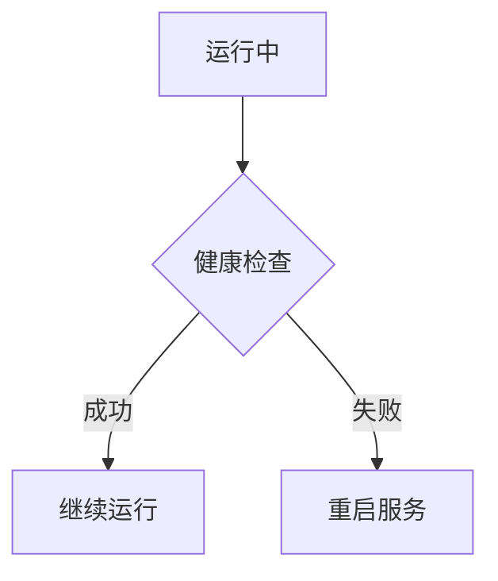
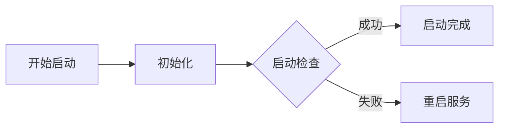

# 健康检查机制指南

## 概述

健康检查是分布式系统中确保服务可用性和可靠性的核心机制。它通过定期检测服务状态，及时发现故障实例并进行处理，保证系统的稳定运行。

## 健康检查类型

### 1. 就绪检查 (Readiness Probe)
**检测服务是否准备好接收流量**


### 2. 存活检查 (Liveness Probe)
**检测服务是否正常运行**



### 3. 启动检查 (Startup Probe)
**检测服务启动过程是否正常**



## 检查机制实现

### HTTP 健康检查
```java
@RestController
public class HealthController {
    
    @GetMapping("/health/readiness")
    public ResponseEntity<String> readiness() {
        if (isDatabaseConnected() && isCacheAvailable()) {
            return ResponseEntity.ok("Ready");
        }
        return ResponseEntity.status(503).body("Not Ready");
    }
    
    @GetMapping("/health/liveness")
    public ResponseEntity<String> liveness() {
        if (isServiceHealthy()) {
            return ResponseEntity.ok("Healthy");
        }
        return ResponseEntity.status(503).body("Unhealthy");
    }
    
    @GetMapping("/health/startup")
    public ResponseEntity<String> startup() {
        if (isStartupComplete()) {
            return ResponseEntity.ok("Started");
        }
        return ResponseEntity.status(503).body("Starting");
    }
}
```

### TCP 健康检查
```java
public class TcpHealthCheck {
    
    public boolean check(int port) {
        try (Socket socket = new Socket()) {
            socket.connect(new InetSocketAddress("localhost", port), 3000);
            return true;
        } catch (IOException e) {
            return false;
        }
    }
}
```

### 命令行健康检查
```bash
#!/bin/bash
# 健康检查脚本

# 检查进程是否存在
if ! pgrep -x "java" > /dev/null; then
    exit 1
fi

# 检查端口监听
if ! netstat -tln | grep ':8080' > /dev/null; then
    exit 1
fi

# 检查磁盘空间
if [ $(df / | awk 'NR==2 {print $5}' | sed 's/%//') -gt 90 ]; then
    exit 1
fi

exit 0
```

## 平台集成实现

### Kubernetes 健康检查
```yaml
apiVersion: apps/v1
kind: Deployment
metadata:
  name: user-service
spec:
  template:
    spec:
      containers:
      - name: user-service
        image: user-service:1.0.0
        ports:
        - containerPort: 8080
        # 就绪检查
        readinessProbe:
          httpGet:
            path: /health/readiness
            port: 8080
          initialDelaySeconds: 10
          periodSeconds: 5
          timeoutSeconds: 3
          failureThreshold: 3
        # 存活检查
        livenessProbe:
          httpGet:
            path: /health/liveness
            port: 8080
          initialDelaySeconds: 30
          periodSeconds: 10
          timeoutSeconds: 3
          failureThreshold: 3
        # 启动检查
        startupProbe:
          httpGet:
            path: /health/startup
            port: 8080
          failureThreshold: 30
          periodSeconds: 10
```

### Spring Boot Actuator
```yaml
# application.yml
management:
  endpoints:
    web:
      exposure:
        include: health,info
  endpoint:
    health:
      show-details: always
      probes:
        enabled: true
      groups:
        readiness:
          include: db,redis,diskSpace
        liveness:
          include: ping
        startup:
          include: startup
```

### 自定义健康指示器
```java
@Component
public class DatabaseHealthIndicator implements HealthIndicator {
    
    private final DataSource dataSource;
    
    @Override
    public Health health() {
        try (Connection connection = dataSource.getConnection()) {
            if (connection.isValid(1)) {
                return Health.up()
                    .withDetail("database", "connected")
                    .withDetail("time", System.currentTimeMillis())
                    .build();
            }
        } catch (Exception e) {
            return Health.down(e)
                .withDetail("database", "disconnected")
                .build();
        }
        return Health.down().withDetail("database", "unknown").build();
    }
}
```

## 服务发现集成

### Eureka 健康检查
```yaml
# Eureka 客户端配置
eureka:
  client:
    healthcheck:
      enabled: true
  instance:
    lease-renewal-interval-in-seconds: 30
    lease-expiration-duration-in-seconds: 90
    status-page-url-path: /actuator/info
    health-check-url-path: /actuator/health
```

### Consul 健康检查
```json
{
  "service": {
    "name": "user-service",
    "port": 8080,
    "check": {
      "http": "http://localhost:8080/health",
      "interval": "10s",
      "timeout": "5s",
      "deregister_critical_service_after": "30m"
    }
  }
}
```

## 高级健康检查模式

### 依赖健康检查
```java
@Component
public class DependencyHealthChecker {
    
    private final List<HealthIndicator> healthIndicators;
    
    public HealthStatus checkDependencies() {
        Map<String, Health> results = new HashMap<>();
        
        for (HealthIndicator indicator : healthIndicators) {
            Health health = indicator.health();
            results.put(indicator.getClass().getSimpleName(), health);
        }
        
        boolean allHealthy = results.values().stream()
            .allMatch(health -> health.getStatus().equals(Status.UP));
            
        return new HealthStatus(allHealthy, results);
    }
    
    @Scheduled(fixedRate = 10000)
    public void monitorDependencies() {
        HealthStatus status = checkDependencies();
        if (!status.isHealthy()) {
            alertService.sendAlert("Dependency health check failed", status.getDetails());
        }
    }
}
```

### 级联健康检查
```java
public class CascadingHealthCheck {
    
    public Health check() {
        // 检查一级依赖
        Health dbHealth = databaseHealthIndicator.health();
        if (dbHealth.getStatus() != Status.UP) {
            return Health.down()
                .withDetail("reason", "Database unavailable")
                .withDetail("database", dbHealth)
                .build();
        }
        
        // 检查二级依赖
        Health cacheHealth = cacheHealthIndicator.health();
        if (cacheHealth.getStatus() != Status.UP) {
            return Health.down()
                .withDetail("reason", "Cache unavailable")
                .withDetail("cache", cacheHealth)
                .build();
        }
        
        return Health.up()
            .withDetail("database", dbHealth)
            .withDetail("cache", cacheHealth)
            .build();
    }
}
```

### 智能健康检查
```java
public class SmartHealthCheck {
    
    private final CircuitBreaker circuitBreaker;
    private final HealthHistory healthHistory;
    
    public Health check() {
        if (circuitBreaker.isOpen()) {
            return Health.down()
                .withDetail("reason", "Circuit breaker open")
                .withDetail("since", circuitBreaker.getOpenedAt())
                .build();
        }
        
        Health currentHealth = performHealthCheck();
        healthHistory.record(currentHealth);
        
        // 基于历史数据的智能判断
        if (healthHistory.getFailureRate() > 0.7) {
            circuitBreaker.trip();
        }
        
        return currentHealth;
    }
}
```

## 监控与告警

### 健康状态指标
```prometheus
# 健康检查指标
health_check_status{service="user-service",type="readiness"} 1
health_check_duration_seconds{service="user-service"} 0.15
health_check_failures_total{service="user-service"} 5

# 依赖健康状态
dependency_health{service="user-service",dependency="database"} 1
dependency_health{service="user-service",dependency="redis"} 0
```

### 告警规则配置
```yaml
groups:
- name: health-check-alerts
  rules:
  - alert: ServiceUnhealthy
    expr: health_check_status == 0
    for: 2m
    labels:
      severity: critical
    annotations:
      summary: "Service {{ $labels.service }} is unhealthy"
      description: "Health check has been failing for 2 minutes"
      
  - alert: DependencyDown
    expr: dependency_health == 0
    for: 5m
    labels:
      severity: warning
    annotations:
      summary: "Dependency {{ $labels.dependency }} is down for {{ $labels.service }}"
```

## 最佳实践

### 检查策略配置
```yaml
healthcheck:
  # 就绪检查配置
  readiness:
    initial_delay: 10s
    interval: 5s
    timeout: 3s
    failure_threshold: 3
    success_threshold: 1
    
  # 存活检查配置
  liveness:
    initial_delay: 30s
    interval: 10s
    timeout: 3s
    failure_threshold: 3
    success_threshold: 1
    
  # 启动检查配置
  startup:
    initial_delay: 0s
    interval: 10s
    timeout: 3s
    failure_threshold: 30
    success_threshold: 1
```

### 检查内容设计
```markdown
## 就绪检查应该验证：
- [ ] 数据库连接可用性
- [ ] 缓存服务连通性
- [ ] 消息队列连接
- [ ] 外部服务依赖
- [ ] 必要的初始化完成

## 存活检查应该验证：
- [ ] 服务进程状态
- [ ] 内存使用情况
- [ ] 线程池状态
- [ ] 内部组件健康度

## 启动检查应该验证：
- [ ] 配置加载正确性
- [ ] 资源初始化成功
- [ ] 前置条件满足
```

## 故障处理策略

### 优雅降级
```java
public class GracefulDegradation {
    
    @GetMapping("/api/data")
    public ResponseEntity<?> getData() {
        if (!healthChecker.isHealthy()) {
            // 返回降级响应
            return ResponseEntity.status(503)
                .header("Retry-After", "60")
                .body(Map.of(
                    "status", "degraded",
                    "message", "Service temporarily unavailable",
                    "estimated_recovery", Instant.now().plusSeconds(60)
                ));
        }
        
        // 正常业务逻辑
        return ResponseEntity.ok(dataService.getData());
    }
}
```

### 自动恢复
```java
public class AutoRecovery {
    
    @Scheduled(fixedRate = 30000)
    public void attemptRecovery() {
        if (!healthChecker.isHealthy()) {
            try {
                // 尝试重建连接
                database.reconnect();
                cache.reconnect();
                
                // 验证恢复状态
                if (healthChecker.isHealthy()) {
                    logger.info("Service recovered successfully");
                }
            } catch (Exception e) {
                logger.warn("Recovery attempt failed", e);
            }
        }
    }
}
```

## 测试策略

### 单元测试
```java
class HealthCheckTest {
    
    @Test
    void shouldReturnHealthyWhenAllDependenciesUp() {
        HealthIndicator indicator = new CompositeHealthIndicator();
        Health health = indicator.health();
        
        assertThat(health.getStatus()).isEqualTo(Status.UP);
        assertThat(health.getDetails()).containsKeys("database", "redis");
    }
    
    @Test
    void shouldReturnUnhealthyWhenDatabaseDown() {
        when(databaseHealthIndicator.health())
            .thenReturn(Health.down().build());
            
        Health health = compositeHealthIndicator.health();
        
        assertThat(health.getStatus()).isEqualTo(Status.DOWN);
        assertThat(health.getDetails().get("database")).isEqualTo("down");
    }
}
```

### 集成测试
```java
@SpringBootTest
class HealthCheckIntegrationTest {
    
    @Autowired
    private TestRestTemplate restTemplate;
    
    @Test
    void shouldReturn200WhenServiceHealthy() {
        ResponseEntity<String> response = restTemplate
            .getForEntity("/actuator/health", String.class);
            
        assertThat(response.getStatusCode()).isEqualTo(HttpStatus.OK);
        assertThat(response.getBody()).contains("\"status\":\"UP\"");
    }
    
    @Test
    void shouldReturn503WhenServiceUnhealthy() {
        // 模拟依赖故障
        mockServer.mockDependencyFailure();
        
        ResponseEntity<String> response = restTemplate
            .getForEntity("/actuator/health", String.class);
            
        assertThat(response.getStatusCode()).isEqualTo(HttpStatus.SERVICE_UNAVAILABLE);
    }
}
```

## 安全考虑

### 安全端点配置
```yaml
# 健康端点安全配置
management:
  endpoints:
    web:
      exposure:
        include: health,info
  endpoint:
    health:
      enabled: true
      roles: ACTUATOR
      show-details: when_authorized
```

### 访问控制
```java
@Configuration
public class HealthSecurityConfig {
    
    @Bean
    public SecurityFilterChain healthSecurity(HttpSecurity http) throws Exception {
        http.requestMatchers()
            .antMatchers("/actuator/health/**")
            .and()
            .authorizeRequests()
            .antMatchers("/actuator/health").permitAll()
            .antMatchers("/actuator/health/**").hasRole("ACTUATOR")
            .and()
            .httpBasic();
        return http.build();
    }
}
```

## 总结

健康检查机制是构建可靠分布式系统的基石，正确实施可以：

**核心价值：**
- 确保服务可用性
- 快速故障检测和恢复
- 自动流量管理
- 系统自愈能力

**实施要点：**
- 分层检查策略（就绪/存活/启动）
- 合理的检查频率和超时设置
- 完善的监控告警
- 优雅的故障处理

> 提示：健康检查应该与熔断器、重试机制等容错模式结合使用，构建弹性的分布式系统。

***
*相关阅读：./service-discovery.md | ./circuit-breaker-pattern.md | ./metrics-monitoring.md*