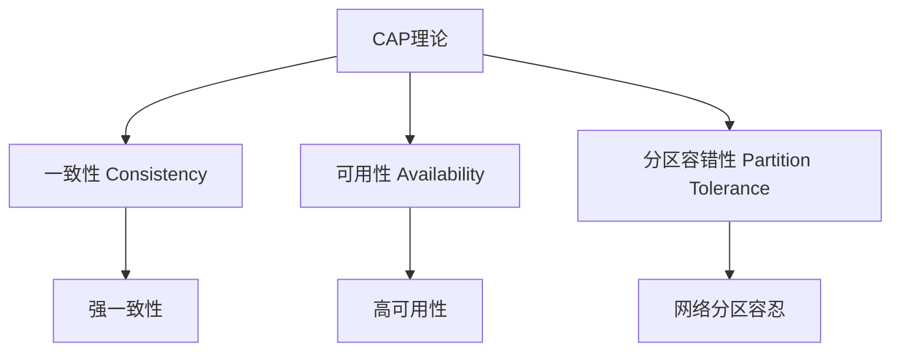
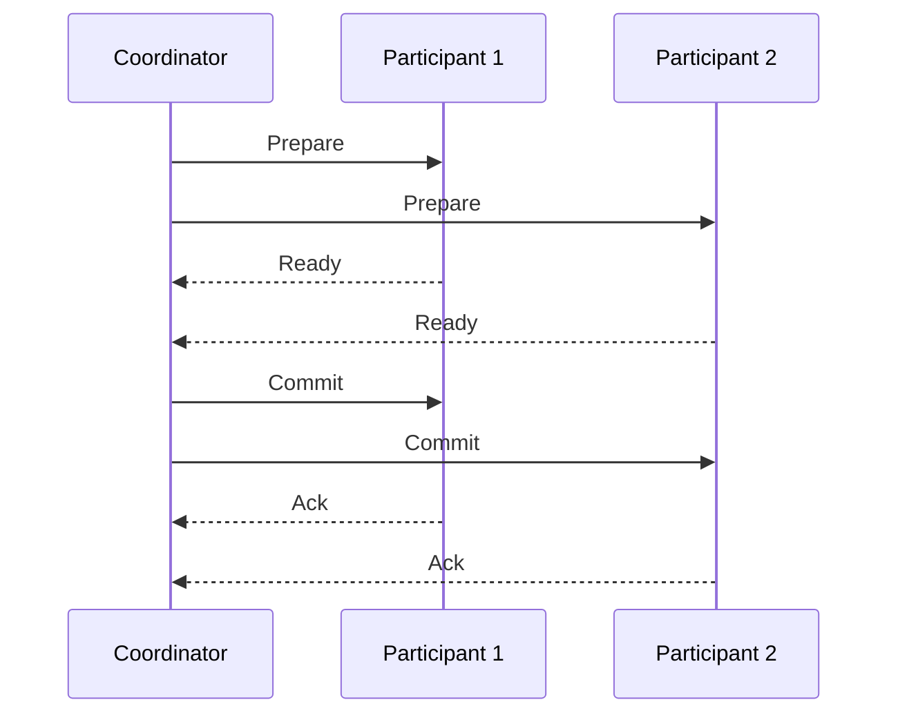
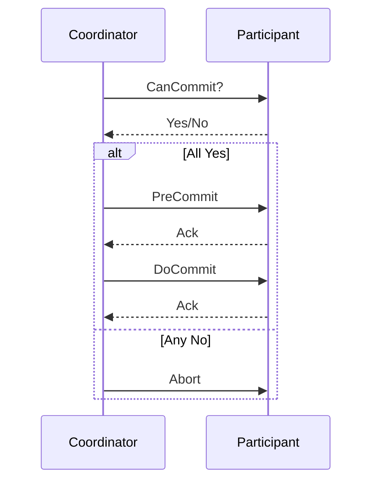

# 分布式事务指南

## 概述

分布式事务是在分布式系统中保证多个服务间数据一致性的关键技术。它通过协调多个独立的数据库操作，确保所有操作要么全部成功，要么全部失败，维护系统的数据完整性。

## 核心挑战

### CAP理论约束


### 分布式事务问题
```markdown
1. **网络延迟**: 跨服务调用延迟不确定性
2. **部分失败**: 部分服务成功，部分失败
3. **数据不一致**: 临时性数据不一致状态
4. **性能开销**: 协调机制带来的额外开销
```

## 解决方案模式

### 1. 两阶段提交 (2PC)
**经典的分布式事务协议**



#### 2PC实现示例
```java
public class TwoPhaseCommitCoordinator {
    
    private List<Participant> participants;
    
    public boolean executeTransaction() {
        // 阶段一：准备阶段
        List<Boolean> prepareResults = participants.stream()
            .map(Participant::prepare)
            .collect(Collectors.toList());
            
        if (prepareResults.contains(false)) {
            // 有任何参与者准备失败，执行回滚
            participants.forEach(Participant::rollback);
            return false;
        }
        
        // 阶段二：提交阶段
        List<Boolean> commitResults = participants.stream()
            .map(Participant::commit)
            .collect(Collectors.toList());
            
        return !commitResults.contains(false);
    }
}

public interface Participant {
    boolean prepare();
    boolean commit();
    boolean rollback();
}
```

### 2. 三阶段提交 (3PC)
**改进的2PC，解决阻塞问题**



### 3. TCC补偿事务
**Try-Confirm-Cancel模式**

```java
public interface TccService {
    
    @Transactional
    boolean tryPhase(String businessId, Object params);
    
    @Transactional
    boolean confirmPhase(String businessId);
    
    @Transactional
    boolean cancelPhase(String businessId);
}

// 业务服务实现
@Service
public class OrderTccService implements TccService {
    
    @Override
    public boolean tryPhase(String orderId, Object params) {
        // 预留资源，冻结库存等
        inventoryService.freezeStock(orderId, params);
        return true;
    }
    
    @Override
    public boolean confirmPhase(String orderId) {
        // 确认操作，实际扣减库存
        inventoryService.deductStock(orderId);
        return true;
    }
    
    @Override
    public boolean cancelPhase(String orderId) {
        // 取消操作，释放冻结资源
        inventoryService.releaseStock(orderId);
        return true;
    }
}
```

### 4. Saga模式
**长事务解决方案**

```java
public class OrderSaga {
    
    private final SagaCoordinator coordinator;
    
    public void createOrder(Order order) {
        Saga saga = coordinator.beginSaga();
        
        try {
            // 步骤1：创建订单
            saga.addStep(() -> orderService.create(order),
                         () -> orderService.cancel(order.getId()));
            
            // 步骤2：扣减库存
            saga.addStep(() -> inventoryService.deduct(order.getItems()),
                         () -> inventoryService.compensateDeduct(order.getItems()));
            
            // 步骤3：处理支付
            saga.addStep(() -> paymentService.process(order),
                         () -> paymentService.refund(order.getId()));
            
            // 执行Saga
            saga.execute();
            
        } catch (Exception e) {
            // 执行补偿操作
            saga.compensate();
            throw e;
        }
    }
}
```

### 5. 消息事务
**基于消息队列的最终一致性**

```java
public class MessageTransactionService {
    
    private final TransactionalMessageProducer messageProducer;
    
    @Transactional
    public void processOrder(Order order) {
        // 1. 本地事务
        orderRepository.save(order);
        
        // 2. 发送事务消息
        Message message = createOrderMessage(order);
        messageProducer.sendInTransaction(message);
    }
}

// 消息消费者
@Component
public class OrderMessageListener {
    
    @Transactional
    @RabbitListener(queues = "order.queue")
    public void handleOrderMessage(Message message) {
        OrderEvent event = parseMessage(message);
        
        // 处理业务逻辑
        inventoryService.update(event);
        notificationService.notify(event);
    }
}
```

## 实现框架

### Seata框架配置
```yaml
# seata-server配置
seata:
  enabled: true
  application-id: order-service
  tx-service-group: default_tx_group
  service:
    vgroup-mapping:
      default_tx_group: default
    grouplist:
      default: 127.0.0.1:8091
  config:
    type: nacos
    nacos:
      server-addr: 127.0.0.1:8848
  registry:
    type: nacos
    nacos:
      server-addr: 127.0.0.1:8848
```

### Seata使用示例
```java
@GlobalTransactional
public void createOrder(Order order) {
    // 1. 创建订单
    orderService.create(order);
    
    // 2. 扣减库存
    inventoryService.deduct(order.getItems());
    
    // 3. 扣减余额
    accountService.debit(order.getUserId(), order.getAmount());
    
    // 如果任何步骤失败，所有操作都会回滚
}
```

### Spring Cloud集成
```java
@Configuration
public class SeataConfig {
    
    @Bean
    public GlobalTransactionScanner globalTransactionScanner() {
        return new GlobalTransactionScanner("order-service", "default_tx_group");
    }
}

@Service
public class OrderService {
    
    @GlobalTransactional
    public Order createOrder(Order order) {
        // 分布式事务操作
        orderRepository.save(order);
        inventoryService.deduct(order.getItems());
        return order;
    }
    
    @Transactional
    public void compensateOrder(Long orderId) {
        // TCC补偿操作
        orderRepository.updateStatus(orderId, "CANCELLED");
        inventoryService.compensate(orderId);
    }
}
```

## 事务模式对比

### 模式选择指南
```markdown
| 模式          | 一致性   | 性能  | 复杂度 | 适用场景                  |
|---------------|----------|-------|--------|-------------------------|
| **2PC**       | 强一致   | 低    | 高     | 银行交易,资金操作        |
| **TCC**       | 最终一致 | 中    | 高     | 电商订单,库存管理        |
| **Saga**      | 最终一致 | 中    | 中     | 长流程业务,订单履约      |
| **消息事务**  | 最终一致 | 高    | 低     | 异步处理,事件驱动架构    |
```

## 性能优化

### 批量事务处理
```java
public class BatchTransactionService {
    
    @GlobalTransactional
    public void processBatchOrders(List<Order> orders) {
        // 批量创建订单
        orderRepository.saveAll(orders);
        
        // 批量库存操作
        Map<Long, Integer> stockChanges = orders.stream()
            .collect(Collectors.toMap(
                Order::getItemId,
                Order::getQuantity
            ));
        inventoryService.batchDeduct(stockChanges);
    }
}
```

### 异步事务处理
```java
public class AsyncTransactionService {
    
    @Async
    @Transactional
    public CompletableFuture<Boolean> asyncTransaction() {
        return CompletableFuture.supplyAsync(() -> {
            // 异步事务处理
            processBusinessLogic();
            return true;
        });
    }
}
```

## 监控与调试

### 事务监控配置
```yaml
# Seata监控配置
management:
  endpoints:
    web:
      exposure:
        include: health,info,seata
  endpoint:
    health:
      show-details: always

# 分布式追踪集成
seata:
  metrics:
    enabled: true
    registry-type: compact
    exporter-list: prometheus
    exporter-prometheus-port: 9898
```

### 事务日志记录
```java
@Aspect
@Component
public class TransactionMonitorAspect {
    
    @Around("@annotation(org.springframework.transaction.annotation.Transactional)")
    public Object monitorTransaction(ProceedingJoinPoint pjp) throws Throwable {
        long startTime = System.currentTimeMillis();
        String methodName = pjp.getSignature().getName();
        
        try {
            Object result = pjp.proceed();
            long duration = System.currentTimeMillis() - startTime;
            
            // 记录成功事务
            logTransactionSuccess(methodName, duration);
            return result;
            
        } catch (Exception e) {
            long duration = System.currentTimeMillis() - startTime;
            
            // 记录失败事务
            logTransactionFailure(methodName, duration, e);
            throw e;
        }
    }
}
```

## 最佳实践

### 事务设计原则
```markdown
1. **尽量使用本地事务**: 优先在单个服务内完成操作
2. **减小事务粒度**: 将大事务拆分为小事务
3. **设置超时时间**: 避免长时间的事务阻塞
4. **实现幂等性**: 保证重试操作的安全性
5. **设计补偿机制**: 为每个操作提供回滚方案
```

### 故障处理策略
```java
public class TransactionRecoveryService {
    
    @Scheduled(fixedDelay = 30000) // 每30秒执行一次
    public void recoverFailedTransactions() {
        List<FailedTransaction> failedTransactions = 
            transactionRepository.findFailedTransactions();
            
        for (FailedTransaction tx : failedTransactions) {
            try {
                // 尝试恢复事务
                if (tx.getType().equals("TCC")) {
                    tccRecoveryService.recover(tx);
                } else if (tx.getType().equals("SAGA")) {
                    sagaRecoveryService.recover(tx);
                }
                
            } catch (Exception e) {
                log.error("Failed to recover transaction: {}", tx.getId(), e);
            }
        }
    }
}
```

## 测试策略

### 单元测试
```java
class DistributedTransactionTest {
    
    @Test
    void testTwoPhaseCommitSuccess() {
        TwoPhaseCommitCoordinator coordinator = new TwoPhaseCommitCoordinator();
        coordinator.addParticipant(new MockParticipant(true));
        coordinator.addParticipant(new MockParticipant(true));
        
        assertTrue(coordinator.executeTransaction());
    }
    
    @Test
    void testTwoPhaseCommitFailure() {
        TwoPhaseCommitCoordinator coordinator = new TwoPhaseCommitCoordinator();
        coordinator.addParticipant(new MockParticipant(true));
        coordinator.addParticipant(new MockParticipant(false)); // 第二个参与者失败
        
        assertFalse(coordinator.executeTransaction());
    }
}
```

### 集成测试
```java
@SpringBootTest
class SagaPatternIntegrationTest {
    
    @Autowired
    private OrderSaga orderSaga;
    
    @Test
    void shouldCompensateWhenPaymentFails() {
        Order order = createTestOrder();
        
        // 模拟支付服务失败
        mockServer.mockPaymentFailure();
        
        assertThrows(PaymentException.class, () -> {
            orderSaga.createOrder(order);
        });
        
        // 验证补偿操作执行
        verify(inventoryService).compensateDeduct(any());
        verify(orderService).cancel(any());
    }
}
```

## 总结

分布式事务是微服务架构中的复杂挑战，正确实施需要：

**核心原则：**
- 根据业务场景选择合适的模式
- 设计完善的补偿和重试机制
- 实现全面的监控和告警
- 保证操作的幂等性和数据一致性

**实施建议：**
- 简单场景使用消息最终一致性
- 复杂业务使用TCC或Saga模式
- 强一致性要求使用2PC
- 结合业务特点设计补偿策略

> 提示：分布式事务会增加系统复杂性，应该尽量避免使用，优先通过设计减少分布式事务的需求。

***
*相关阅读：./microservice-data-consistency.md | ./event-driven-architecture.md | ./system-fault-tolerance.md*