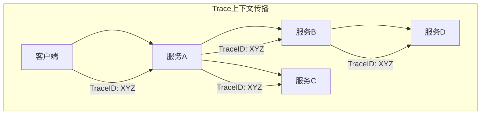

# 分布式追踪指南

## 概述

分布式追踪是微服务架构中用于监控和诊断复杂分布式系统的关键技术。它通过记录请求在多个服务间的调用路径和耗时，帮助开发人员理解系统行为、定位性能问题和分析故障原因。

## 核心概念

### 基本术语
```markdown
- **Trace**: 一个完整的请求处理过程，包含多个Span
- **Span**: 单个操作的工作单元，包含开始时间、结束时间和元数据
- **Trace ID**: 唯一标识一个追踪链的ID
- **Span ID**: 唯一标识一个操作单元的ID
- **Parent Span ID**: 父级Span的ID，用于构建调用树
```

### 追踪上下文传播


## 主流追踪系统

### 1. Jaeger (Uber)
**基于OpenTracing的分布式追踪系统**

```yaml
# Jaeger客户端配置
jaeger:
  service-name: user-service
  endpoint: http://jaeger-collector:14268/api/traces
  sampler:
    type: const
    param: 1
  reporter:
    log-spans: true
    flush-interval: 1000
    max-queue-size: 100
```

### 2. Zipkin (Twitter)
**轻量级分布式追踪系统**

```yaml
# Zipkin客户端配置
spring:
  zipkin:
    base-url: http://zipkin:9411
    sender:
      type: web
  sleuth:
    sampler:
      probability: 1.0
```

### 3. SkyWalking
**APM系统，包含分布式追踪功能**

```yaml
# SkyWalking配置
skywalking:
  agent:
    service_name: user-service
    collector:
      backend_service: skywalking-oap:11800
    sampling:
      trace:
        rate: 1000
```

### 4. OpenTelemetry
**CNCF标准，统一追踪、指标和日志**

```yaml
# OpenTelemetry配置
opentelemetry:
  service:
    name: user-service
  exporters:
    otlp:
      endpoint: http://otel-collector:4317
  propagators:
    - tracecontext
    - baggage
```

## 追踪数据模型

### Span数据结构
```java
public class Span {
    private String traceId;          // 追踪ID
    private String spanId;           // 当前Span ID
    private String parentSpanId;     // 父Span ID
    private String name;             // 操作名称
    private long startTime;          // 开始时间
    private long endTime;            // 结束时间
    private Map<String, String> tags; // 标签信息
    private List<Log> logs;          // 日志事件
    private SpanKind kind;           // Span类型
}

public enum SpanKind {
    CLIENT,        // 客户端调用
    SERVER,        // 服务端处理
    PRODUCER,      // 消息生产者
    CONSUMER,      // 消息消费者
    INTERNAL       // 内部操作
}
```

## 实现实践

### Spring Cloud Sleuth集成
```java
@SpringBootApplication
public class Application {
    public static void main(String[] args) {
        SpringApplication.run(Application.class, args);
    }
}

// 自动追踪HTTP请求
@RestController
public class UserController {
    
    private final Tracer tracer;
    
    @GetMapping("/users/{id}")
    public User getUser(@PathVariable String id) {
        // 创建自定义Span
        Span span = tracer.nextSpan().name("getUser").start();
        try (Scope scope = tracer.withSpan(span)) {
            // 业务逻辑
            return userService.findUser(id);
        } finally {
            span.finish();
        }
    }
}
```

### OpenTelemetry手动追踪
```java
public class TracingService {
    
    private final Tracer tracer;
    
    public void processOrder(Order order) {
        Span span = tracer.spanBuilder("processOrder")
            .setAttribute("order.id", order.getId())
            .setAttribute("order.amount", order.getAmount())
            .startSpan();
            
        try (Scope scope = span.makeCurrent()) {
            // 业务处理
            inventoryService.checkStock(order);
            paymentService.processPayment(order);
            shippingService.scheduleDelivery(order);
            
        } catch (Exception e) {
            span.recordException(e);
            span.setStatus(StatusCode.ERROR);
            throw e;
        } finally {
            span.end();
        }
    }
}
```

### 数据库操作追踪
```java
@Aspect
@Component
public class DatabaseTracingAspect {
    
    private final Tracer tracer;
    
    @Around("execution(* javax.sql.DataSource.getConnection(..))")
    public Object traceConnection(ProceedingJoinPoint pjp) throws Throwable {
        Span span = tracer.spanBuilder("database.connection")
            .setSpanKind(SpanKind.CLIENT)
            .startSpan();
            
        try (Scope scope = span.makeCurrent()) {
            return pjp.proceed();
        } finally {
            span.end();
        }
    }
    
    @Around("execution(* java.sql.Statement.execute*(..))")
    public Object traceQuery(ProceedingJoinPoint pjp) throws Throwable {
        String methodName = pjp.getSignature().getName();
        Object[] args = pjp.getArgs();
        String sql = args.length > 0 ? (String) args[0] : "unknown";
        
        Span span = tracer.spanBuilder("database.query")
            .setAttribute("db.operation", methodName)
            .setAttribute("db.statement", sql)
            .startSpan();
            
        try (Scope scope = span.makeCurrent()) {
            return pjp.proceed();
        } finally {
            span.end();
        }
    }
}
```

## 上下文传播

### HTTP头传播
```java
public class TracingFilter implements Filter {
    
    private final Tracer tracer;
    private final TextMapPropagator propagator;
    
    @Override
    public void doFilter(ServletRequest request, ServletResponse response, FilterChain chain) {
        HttpServletRequest httpRequest = (HttpServletRequest) request;
        
        // 提取追踪上下文
        Context context = propagator.extract(Context.current(), httpRequest, 
            (carrier, key) -> carrier.getHeader(key));
            
        Span span = tracer.spanBuilder(httpRequest.getMethod() + " " + httpRequest.getRequestURI())
            .setParent(context)
            .setSpanKind(SpanKind.SERVER)
            .startSpan();
            
        try (Scope scope = span.makeCurrent()) {
            chain.doFilter(request, response);
        } finally {
            span.end();
        }
    }
}
```

### 消息队列传播
```java
public class MessageTracing {
    
    private final Tracer tracer;
    private final TextMapPropagator propagator;
    
    public void sendMessage(String message, Map<String, String> headers) {
        Span span = tracer.spanBuilder("send.message")
            .setSpanKind(SpanKind.PRODUCER)
            .startSpan();
            
        try (Scope scope = span.makeCurrent()) {
            // 注入追踪上下文到消息头
            propagator.inject(Context.current(), headers, 
                (carrier, key, value) -> carrier.put(key, value));
                
            // 发送消息
            kafkaTemplate.send("topic", message, headers);
        } finally {
            span.end();
        }
    }
    
    public void receiveMessage(String message, Map<String, String> headers) {
        // 提取追踪上下文
        Context context = propagator.extract(Context.current(), headers,
            (carrier, key) -> carrier.get(key));
            
        Span span = tracer.spanBuilder("receive.message")
            .setParent(context)
            .setSpanKind(SpanKind.CONSUMER)
            .startSpan();
            
        try (Scope scope = span.makeCurrent()) {
            // 处理消息
            processMessage(message);
        } finally {
            span.end();
        }
    }
}
```

## 采样策略

### 概率采样
```java
public class ProbabilitySampler implements Sampler {
    
    private final double probability;
    private final Random random = new Random();
    
    public ProbabilitySampler(double probability) {
        this.probability = probability;
    }
    
    @Override
    public SamplingResult shouldSample(Context context, String traceId, String name, SpanKind kind) {
        boolean sample = random.nextDouble() < probability;
        return SamplingResult.create(sample);
    }
}
```

### 速率限制采样
```java
public class RateLimitingSampler implements Sampler {
    
    private final RateLimiter rateLimiter;
    
    public RateLimitingSampler(int tracesPerSecond) {
        this.rateLimiter = RateLimiter.create(tracesPerSecond);
    }
    
    @Override
    public SamplingResult shouldSample(Context context, String traceId, String name, SpanKind kind) {
        boolean sample = rateLimiter.tryAcquire();
        return SamplingResult.create(sample);
    }
}
```

### 自适应采样
```java
public class AdaptiveSampler implements Sampler {
    
    private final Map<String, Double> serviceRates;
    private final double defaultRate;
    
    @Override
    public SamplingResult shouldSample(Context context, String traceId, String name, SpanKind kind) {
        String serviceName = getServiceName(context);
        double rate = serviceRates.getOrDefault(serviceName, defaultRate);
        boolean sample = Math.random() < rate;
        return SamplingResult.create(sample);
    }
}
```

## 性能优化

### 异步Span处理
```java
public class AsyncSpanExporter implements SpanExporter {
    
    private final BlockingQueue<Span> queue = new LinkedBlockingQueue<>(1000);
    private final ExecutorService executor = Executors.newSingleThreadExecutor();
    
    public AsyncSpanExporter(SpanExporter delegate) {
        executor.submit(() -> {
            while (!Thread.currentThread().isInterrupted()) {
                try {
                    Span span = queue.take();
                    delegate.export(Collections.singletonList(span));
                } catch (InterruptedException e) {
                    Thread.currentThread().interrupt();
                }
            }
        });
    }
    
    @Override
    public ResultCode export(Collection<Span> spans) {
        for (Span span : spans) {
            if (!queue.offer(span)) {
                // 队列满，丢弃Span
                metrics.recordDroppedSpans(1);
            }
        }
        return ResultCode.SUCCESS;
    }
}
```

### Span数据压缩
```java
public class CompressingSpanExporter implements SpanExporter {
    
    private final SpanExporter delegate;
    private final Compressor compressor;
    
    @Override
    public ResultCode export(Collection<Span> spans) {
        List<Span> compressedSpans = spans.stream()
            .map(this::compressSpan)
            .collect(Collectors.toList());
            
        return delegate.export(compressedSpans);
    }
    
    private Span compressSpan(Span span) {
        // 移除不必要的属性
        // 压缩标签值
        // 优化数据结构
        return span;
    }
}
```

## 监控与告警

### 追踪指标监控
```prometheus
# 追踪相关指标
tracing_spans_total{service="user-service",span_kind="server"}
tracing_spans_duration_seconds{service="user-service",operation="getUser"}
tracing_errors_total{service="user-service",error_type="timeout"}
tracing_sampling_rate{service="user-service"}
```

### 性能告警规则
```yaml
groups:
- name: tracing_alerts
  rules:
  - alert: HighSpanLatency
    expr: histogram_quantile(0.95, tracing_spans_duration_seconds_bucket) > 2
    for: 5m
    labels:
      severity: warning
    annotations:
      summary: "High latency detected for {{ $labels.operation }}"
      
  - alert: HighErrorRate
    expr: rate(tracing_errors_total[5m]) / rate(tracing_spans_total[5m]) > 0.1
    for: 2m
    labels:
      severity: critical
    annotations:
      summary: "High error rate for {{ $labels.service }}"
```

## 最佳实践

### 采样策略配置
```yaml
# 生产环境采样配置
sampling:
  probability: 0.1  # 10%的请求被采样
  rate_limit: 100    # 每秒最多100个追踪
  adaptive:
    enabled: true
    min_probability: 0.01
    max_probability: 0.5
    target_spans_per_minute: 1000

# 开发环境采样配置  
development:
  sampling:
    probability: 1.0  # 采样所有请求
```

### Span命名规范
```markdown
## HTTP操作
- `HTTP {METHOD}` - `HTTP GET`, `HTTP POST`
- `{service}.{operation}` - `user-service.getUser`

## 数据库操作  
- `db.query` - 数据库查询
- `db.update` - 数据库更新
- `db.{operation}.{table}` - `db.select.users`

## 消息操作
- `mq.send.{topic}` - `mq.send.orders`
- `mq.receive.{topic}` - `mq.receive.payments`

## 缓存操作
- `cache.get.{key_pattern}` - `cache.get.user.*`
- `cache.put.{key_pattern}` - `cache.put.session.*`
```

### 标签使用指南
```java
// 标准标签
span.setAttribute("http.method", "GET");
span.setAttribute("http.url", "/users/123");
span.setAttribute("http.status_code", 200);
span.setAttribute("db.system", "mysql");
span.setAttribute("db.instance", "users");
span.setAttribute("db.statement", "SELECT * FROM users");
span.setAttribute("mq.topic", "orders");
span.setAttribute("mq.message_size", 1024);

// 业务标签
span.setAttribute("user.id", "123");
span.setAttribute("order.amount", 99.99);
span.setAttribute("business.region", "us-west-1");
```

## 故障排查

### 常见问题解决
```markdown
1. **追踪数据丢失**
   - 检查采样率配置
   - 验证导出器连接
   - 监控队列状态

2. **性能开销大**
   - 调整采样率
   - 优化Span数据
   - 使用异步导出

3. **上下文传播失败**
   - 检查传播器配置
   - 验证Header传递
   - 测试跨服务追踪
```

### 诊断工具
```bash
# 查看追踪数据
curl http://jaeger-query:16686/api/traces?service=user-service

# 检查采样状态
curl http://localhost:9464/metrics | grep tracing_sampling

# 诊断上下文传播
curl -H "traceparent: 00-abc123def456-789abcdef012-01" http://service:8080/endpoint
```

## 总结

分布式追踪是微服务可观测性的核心支柱，正确实施可以：

**核心价值：**
- 端到端请求追踪
- 性能瓶颈定位
- 故障根本原因分析
- 系统依赖关系可视化

**实施要点：**
- 统一的Span命名规范
- 完整的上下文传播
- 合理的采样策略
- 有效的监控告警

> 提示：分布式追踪应该与日志和指标系统结合使用，形成完整的可观测性体系。

***
*相关阅读：./microservice-observability.md | ./log-aggregation.md | ./performance-monitoring.md*