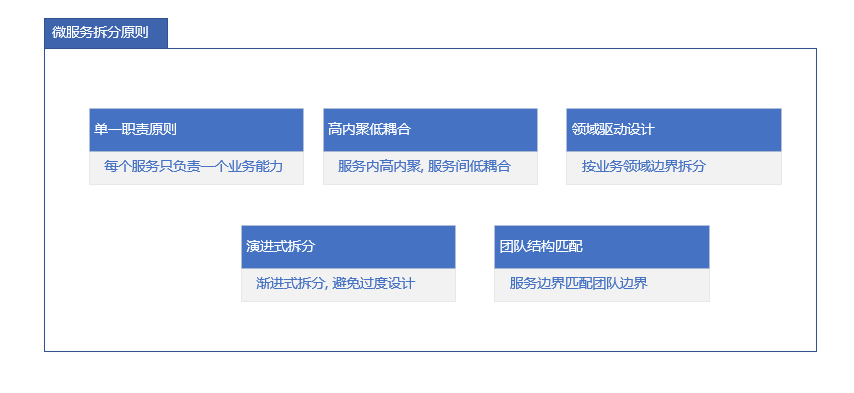
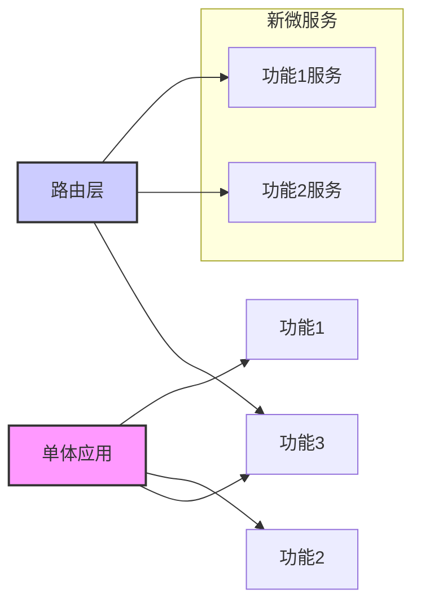

# 微服务拆分策略指南

## 概述

微服务拆分是微服务架构设计的核心环节，合理的服务拆分能够实现团队自治、技术异构和独立部署，而不合理的拆分会导致分布式单体，增加系统复杂度。

## 拆分原则

### 核心拆分原则



## 拆分方法

### 1. 领域驱动设计 (DDD) 拆分
**基于业务领域进行服务划分**

```java
// 领域模型示例
public class OrderDomain {
    
    // 订单聚合根
    public class Order {
        private Long id;
        private String orderNo;
        private OrderStatus status;
        private List<OrderItem> items;
        private Customer customer;
        
        // 领域行为
        public void placeOrder() {
            validateOrder();
            calculateTotal();
            this.status = OrderStatus.CREATED;
        }
        
        public void cancelOrder() {
            if (canCancel()) {
                this.status = OrderStatus.CANCELLED;
                // 发布领域事件
                domainEventPublisher.publish(new OrderCancelledEvent(this));
            }
        }
    }
    
    // 值对象
    public class Money {
        private BigDecimal amount;
        private Currency currency;
    }
    
    // 领域服务
    public interface OrderService {
        Order createOrder(Order order);
        Order getOrder(Long orderId);
        void processPayment(Long orderId, Payment payment);
    }
}

// 限界上下文识别
public class BoundedContextIdentification {
    
    public List<BoundedContext> identifyContexts() {
        return Arrays.asList(
            new BoundedContext("订单上下文", "订单处理、支付、履约"),
            new BoundedContext("库存上下文", "库存管理、库存操作"),
            new BoundedContext("客户上下文", "客户管理、客户信息"),
            new BoundedContext("商品上下文", "商品管理、商品信息")
        );
    }
}
```

### 2. 基于业务能力拆分
**按组织业务功能划分服务**

```java
// 业务能力分析
public class BusinessCapabilityAnalysis {
    
    public List<BusinessCapability> analyzeCapabilities() {
        List<BusinessCapability> capabilities = new ArrayList<>();
        
        // 核心业务能力
        capabilities.add(new BusinessCapability("订单管理", "CRITICAL", "处理订单生命周期"));
        capabilities.add(new BusinessCapability("支付处理", "CRITICAL", "处理支付交易"));
        capabilities.add(new BusinessCapability("库存管理", "IMPORTANT", "管理商品库存"));
        
        // 支撑业务能力
        capabilities.add(new BusinessCapability("用户管理", "SUPPORTING", "管理用户信息"));
        capabilities.add(new BusinessCapability("商品目录", "SUPPORTING", "管理商品信息"));
        
        return capabilities;
    }
}

// 服务映射
public class ServiceMapping {
    
    public Map<BusinessCapability, Microservice> mapCapabilitiesToServices(
        List<BusinessCapability> capabilities) {
        
        Map<BusinessCapability, Microservice> mapping = new HashMap<>();
        
        capabilities.forEach(capability -> {
            Microservice service = new Microservice(
                capability.getName() + "Service",
                getTeamForCapability(capability),
                determineTechStack(capability)
            );
            mapping.put(capability, service);
        });
        
        return mapping;
    }
}
```

### 3. 基于团队结构拆分
**按康威定律设计服务边界**

```java
// 团队结构分析
public class TeamStructureAnalysis {
    
    public List<DevelopmentTeam> analyzeTeams() {
        return Arrays.asList(
            new DevelopmentTeam("订单团队", 8, 
                Arrays.asList("Java", "Spring Boot", "MySQL")),
            new DevelopmentTeam("支付团队", 6, 
                Arrays.asList("Go", "gRPC", "PostgreSQL")),
            new DevelopmentTeam("库存团队", 5, 
                Arrays.asList("Kotlin", "Spring", "MongoDB")),
            new DevelopmentTeam("用户团队", 4, 
                Arrays.asList("Node.js", "Express", "Redis"))
        );
    }
    
    public void assignServicesToTeams(List<Microservice> services, 
                                    List<DevelopmentTeam> teams) {
        Map<String, DevelopmentTeam> teamMap = teams.stream()
            .collect(Collectors.toMap(DevelopmentTeam::getName, Function.identity()));
        
        services.forEach(service -> {
            DevelopmentTeam team = findBestTeamForService(service, teamMap.values());
            service.setOwningTeam(team);
            team.addService(service);
        });
    }
}
```

## 拆分模式

### 1. 绞杀者模式 (Strangler Pattern)
**逐步替换单体应用**



```java
public class StranglerFigApplication {
    
    private final MonolithicApp monolithicApp;
    private final Map<String, Microservice> microservices;
    private final RoutingService routingService;
    
    public Response handleRequest(Request request) {
        String feature = extractFeature(request);
        
        if (microservices.containsKey(feature)) {
            // 路由到微服务
            return routingService.routeToMicroservice(feature, request);
        } else {
            // 回退到单体应用
            return monolithicApp.handleRequest(request);
        }
    }
    
    public void migrateFeature(String feature, Microservice newService) {
        // 迁移功能到新服务
        microservices.put(feature, newService);
        
        // 逐步迁移流量
        routingService.startMigration(feature, newService);
    }
}
```

### 2. 并行运行模式
**新旧系统并行运行**

```java
public class ParallelRunStrategy {
    
    private final OldSystem oldSystem;
    private final NewSystem newSystem;
    private final ResultComparator resultComparator;
    
    public void execute(Request request) {
        // 并行执行
        CompletableFuture<Response> oldFuture = CompletableFuture.supplyAsync(
            () -> oldSystem.process(request));
        CompletableFuture<Response> newFuture = CompletableFuture.supplyAsync(
            () -> newSystem.process(request));
        
        // 比较结果
        try {
            Response oldResponse = oldFuture.get();
            Response newResponse = newFuture.get();
            
            boolean resultsMatch = resultComparator.compare(oldResponse, newResponse);
            
            if (!resultsMatch) {
                log.warn("结果不一致: old={}, new={}", oldResponse, newResponse);
                metrics.recordMismatch();
            }
            
            // 使用新系统结果
            return newResponse;
            
        } catch (Exception e) {
            log.error("并行执行失败", e);
            // 回退到旧系统
            return oldSystem.process(request);
        }
    }
}
```

## 服务粒度设计

### 服务粒度评估矩阵
```java
public class ServiceGranularityEvaluator {
    
    public GranularityScore evaluateService(Microservice service) {
        GranularityScore score = new GranularityScore();
        
        // 评估维度
        score.setComplexityScore(calculateComplexity(service));
        score.setTeamSizeScore(calculateTeamSizeScore(service));
        score.setDeploymentFrequencyScore(calculateDeploymentScore(service));
        score.setErrorIsolationScore(calculateErrorIsolationScore(service));
        
        return score;
    }
    
    public ServiceGranularity determineGranularity(GranularityScore score) {
        double totalScore = score.getTotalScore();
        
        if (totalScore < 30) {
            return ServiceGranularity.FINE; // 细粒度
        } else if (totalScore < 70) {
            return ServiceGranularity.MEDIUM; // 中粒度
        } else {
            return ServiceGranularity.COARSE; // 粗粒度
        }
    }
    
    public List<Microservice> splitCoarseGrainedService(Microservice coarseService) {
        // 根据业务边界拆分粗粒度服务
        List<BusinessCapability> capabilities = extractCapabilities(coarseService);
        
        return capabilities.stream()
            .map(capability -> createMicroserviceForCapability(capability))
            .collect(Collectors.toList());
    }
    
    public Microservice mergeFineGrainedServices(List<Microservice> fineServices) {
        // 合并过细的服务
        if (shouldMerge(fineServices)) {
            return createMergedService(fineServices);
        }
        return null;
    }
}
```

## 依赖管理

### 服务依赖分析
```java
public class DependencyAnalyzer {
    
    public DependencyGraph analyzeDependencies(List<Microservice> services) {
        DependencyGraph graph = new DependencyGraph();
        
        for (Microservice service : services) {
            Set<Microservice> dependencies = findDependencies(service);
            graph.addNode(service, dependencies);
        }
        
        return graph;
    }
    
    public void detectCyclicDependencies(DependencyGraph graph) {
        List<List<Microservice>> cycles = graph.findCycles();
        
        if (!cycles.isEmpty()) {
            throw new CyclicDependencyException("发现循环依赖: " + cycles);
        }
    }
    
    public void optimizeDependencies(DependencyGraph graph) {
        // 减少不必要的依赖
        graph.getNodes().forEach(node -> {
            Set<Microservice> dependencies = graph.getDependencies(node);
            Set<Microservice> essentialDeps = filterEssentialDependencies(dependencies);
            graph.updateDependencies(node, essentialDeps);
        });
    }
}
```

### 依赖倒置设计
```java
// 使用依赖倒置原则减少直接依赖
public interface OrderService {
    Order createOrder(Order order);
    Order getOrder(Long orderId);
}

public interface PaymentService {
    PaymentResult processPayment(Payment payment);
}

// 通过领域事件解耦
public class OrderCreatedEvent {
    private Long orderId;
    private BigDecimal amount;
    private Long customerId;
    // 其他必要信息
}

public class PaymentProcessedEvent {
    private Long orderId;
    private boolean success;
    private String transactionId;
}
```

## 数据拆分策略

### 数据库拆分模式
```java
public class DatabaseSplitStrategy {
    
    public DatabaseDesign designDatabaseForService(Microservice service) {
        DatabaseDesign design = new DatabaseDesign();
        
        // 确定数据库类型
        design.setDatabaseType(determineDatabaseType(service));
        
        // 设计表结构
        design.setTables(designTables(service));
        
        // 设置访问模式
        design.setAccessPatterns(defineAccessPatterns(service));
        
        return design;
    }
    
    public void implementDatabasePerService(List<Microservice> services) {
        services.forEach(service -> {
            DatabaseDesign design = designDatabaseForService(service);
            createDatabase(service.getName(), design);
        });
    }
    
    public void handleCrossServiceQueries(Microservice source, Microservice target) {
        // 通过API调用而不是直接数据库访问
        if (needsDataFromTarget(source, target)) {
            // 使用服务API获取数据
            Object data = targetService.getDataViaApi();
            return data;
        }
        
        // 或者使用数据复制（最终一致性）
        if (canUseReplicatedData()) {
            return getDataFromLocalReplica();
        }
    }
}
```

## 拆分评估指标

### 拆分质量评估
```java
public class SplitQualityEvaluator {
    
    public QualityMetrics evaluateSplitQuality(List<Microservice> services) {
        QualityMetrics metrics = new QualityMetrics();
        
        // 内聚性评估
        metrics.setCohesionScore(calculateCohesion(services));
        
        // 耦合度评估
        metrics.setCouplingScore(calculateCoupling(services));
        
        // 团队匹配度
        metrics.setTeamFitScore(calculateTeamFit(services));
        
        // 部署独立性
        metrics.setDeploymentIndependenceScore(calculateDeploymentIndependence(services));
        
        return metrics;
    }
    
    public boolean isGoodSplit(QualityMetrics metrics) {
        return metrics.getCohesionScore() > 0.7 &&
               metrics.getCouplingScore() < 0.3 &&
               metrics.getTeamFitScore() > 0.8 &&
               metrics.getDeploymentIndependenceScore() > 0.7;
    }
    
    public List<SplitRecommendation> generateRecommendations(QualityMetrics metrics) {
        List<SplitRecommendation> recommendations = new ArrayList<>();
        
        if (metrics.getCohesionScore() < 0.7) {
            recommendations.add(new SplitRecommendation(
                "INCREASE_COHESION", "考虑进一步拆分低内聚服务"));
        }
        
        if (metrics.getCouplingScore() > 0.3) {
            recommendations.add(new SplitRecommendation(
                "REDUCE_COUPLING", "减少服务间耦合，引入领域事件"));
        }
        
        return recommendations;
    }
}
```

## 拆分实施路线图

### 渐进式拆分计划
```java
public class IncrementalSplitPlanner {
    
    public SplitRoadmap createRoadmap(MonolithicApp monolith, 
                                    List<BusinessCapability> capabilities) {
        SplitRoadmap roadmap = new SplitRoadmap();
        
        // 阶段1: 准备阶段
        roadmap.addPhase(createPreparationPhase());
        
        // 阶段2: 拆分核心业务能力
        roadmap.addPhase(createCoreBusinessPhase(capabilities));
        
        // 阶段3: 拆分支撑功能
        roadmap.addPhase(createSupportingFeaturesPhase());
        
        // 阶段4: 完善和优化
        roadmap.addPhase(createOptimizationPhase());
        
        return roadmap;
    }
    
    private RoadmapPhase createPreparationPhase() {
        RoadmapPhase phase = new RoadmapPhase("准备阶段", 1);
        phase.addTask("建立微服务基础设施");
        phase.addTask("制定拆分标准和规范");
        phase.addTask("培训团队");
        phase.addTask("建立监控体系");
        return phase;
    }
    
    private RoadmapPhase createCoreBusinessPhase(List<BusinessCapability> capabilities) {
        RoadmapPhase phase = new RoadmapPhase("核心业务拆分", 2);
        
        capabilities.stream()
            .filter(capability -> capability.getPriority() == Priority.CRITICAL)
            .forEach(capability -> {
                phase.addTask("拆分 " + capability.getName() + " 服务");
            });
        
        return phase;
    }
}
```

## 常见陷阱与解决方案

### 拆分反模式
```java
public class SplitAntiPatternDetector {
    
    public List<AntiPattern> detectAntiPatterns(List<Microservice> services) {
        List<AntiPattern> antiPatterns = new ArrayList<>();
        
        // 检查分布式单体
        if (isDistributedMonolith(services)) {
            antiPatterns.add(AntiPattern.DISTRIBUTED_MONOLITH);
        }
        
        // 检查过细拆分
        if (hasOverlyFineGrainedServices(services)) {
            antiPatterns.add(AntiPattern.OVERLY_FINE_GRANED);
        }
        
        // 检查共享数据库
        if (hasSharedDatabase(services)) {
            antiPatterns.add(AntiPattern.SHARED_DATABASE);
        }
        
        return antiPatterns;
    }
    
    public void fixAntiPatterns(List<AntiPattern> antiPatterns, 
                               List<Microservice> services) {
        for (AntiPattern pattern : antiPatterns) {
            switch (pattern) {
                case DISTRIBUTED_MONOLITH:
                    fixDistributedMonolith(services);
                    break;
                case OVERLY_FINE_GRANED:
                    mergeFineGrainedServices(services);
                    break;
                case SHARED_DATABASE:
                    implementDatabasePerService(services);
                    break;
            }
        }
    }
}
```

## 总结

微服务拆分需要综合考虑：

**关键因素：**
- 业务领域边界
- 团队组织结构
- 技术能力约束
- 演进式需求

**最佳实践：**
- 从粗粒度开始，逐步细化
- 优先拆分核心业务能力
- 确保团队和服务匹配
- 建立完善的监控和治理

> 提示：微服务拆分不是一次性的活动，而是一个持续演进的过程。建议采用渐进式策略，根据业务发展和团队能力动态调整。

***
*相关阅读：./ddd-practice.md | ./microservice-patterns.md | ./system-evolution-strategy.md*