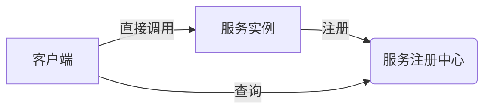
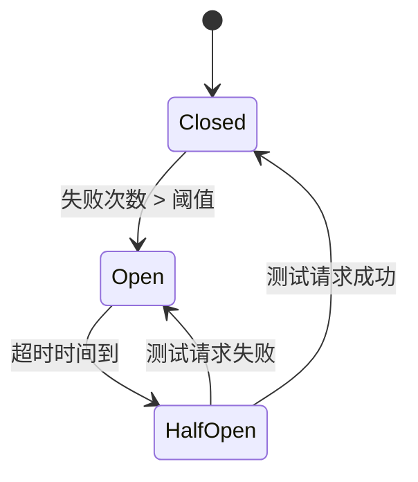
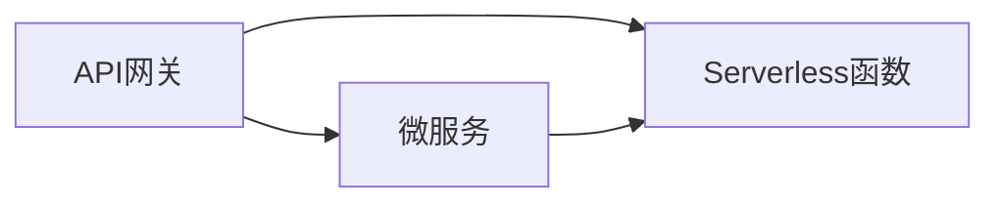
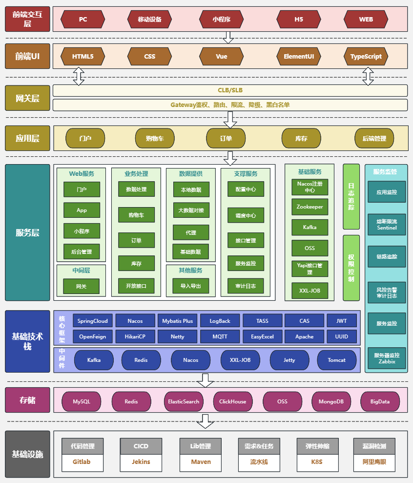
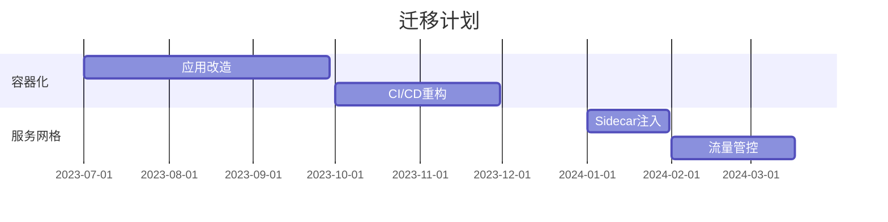
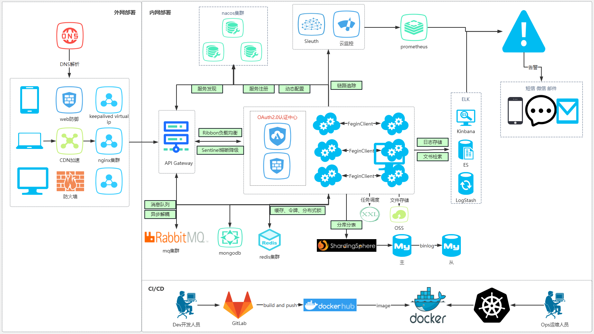
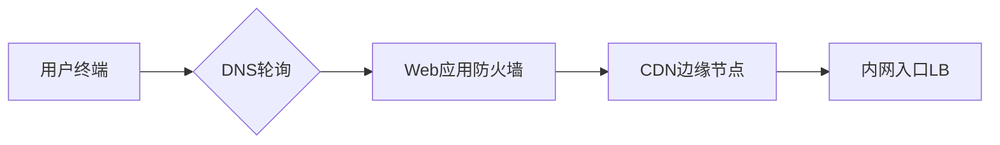
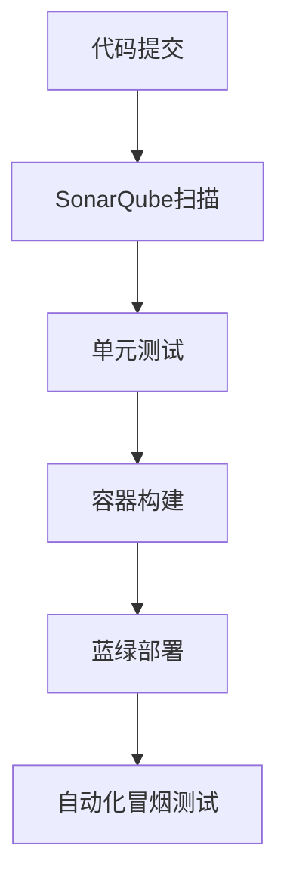

# 微服务架构深度解析

## 架构定义与核心特征

微服务架构是一种将单一应用程序划分为一组小型服务的架构风格，每个服务运行在自己的进程中，服务间采用轻量级通信机制（通常是HTTP/REST）。微服务架构的核心特征包括：

1. **组件化服务**：每个服务都是独立可部署的单元
2. **业务能力导向**：围绕业务能力而非技术层次组织服务
3. **去中心化治理**：允许使用不同的编程语言和数据存储技术
4. **基础设施自动化**：强调CI/CD和DevOps实践
5. **容错设计**：服务需设计为可独立故障而不影响系统整体

## 架构演进历程

```
单体架构 → 垂直拆分 → SOA架构 → 微服务架构 → 服务网格
```

### 架构对比分析

| 维度         | 单体架构                  | SOA                       | 微服务架构                |
|--------------|--------------------------|---------------------------|--------------------------|
| 组件划分      | 功能模块                 | 业务服务                  | 独立业务能力             |
| 通信方式      | 进程内调用               | ESB/WS-*                 | REST/gRPC/消息队列       |
| 数据管理      | 共享数据库               | 共享数据模型              | 独立数据库               |
| 部署单元      | 单个war/ear包           | 服务组合                  | 独立容器/进程            |
| 治理重点      | 应用监控                 | ESB治理                   | 服务发现/熔断            |

## 核心架构组件

### 1. 服务通信机制

**通信模式矩阵**：

| 类型          | 协议示例        | 适用场景                  | 性能指标                  |
|---------------|----------------|--------------------------|--------------------------|
| 同步调用      | HTTP/REST      | 实时性要求高的操作       | 延迟：50-500ms           |
| 异步消息      | Kafka/RabbitMQ | 最终一致性业务           | 吞吐量：10K-100K msg/s   |
| RPC框架       | gRPC/Thrift    | 内部高性能通信           | 延迟：1-10ms             |
| 事件驱动      | Event Sourcing | 状态变更通知             | 事件顺序保证              |

**通信性能优化公式**：
$$
\text{系统吞吐量} = \min\left(\frac{N}{\text{平均响应时间}}, \text{网络带宽}\right)
$$
其中$N$为并发连接数

### 2. 服务发现与负载均衡

**典型实现方案**：



**负载均衡算法对比**：

| 算法           | 复杂度 | 特点                          | 适用场景              |
|----------------|--------|-------------------------------|----------------------|
| 轮询(RR)       | O(1)   | 均匀分配但忽略负载            | 同质化服务           |
| 加权轮询       | O(n)   | 考虑服务器性能差异            | 异构环境             |
| 最少连接       | O(n)   | 动态适应负载变化              | 长连接服务           |
| 一致性哈希     | O(log n)| 保持会话粘性                 | 缓存/状态ful服务     |

### 3. 数据一致性方案

**CAP理论实践**：

```
┌───────────────────────┐
│  一致性(Consistency)  │ ← 2PC/TCC
├───────────────────────┤
│  可用性(Availability) │ ← 最终一致性
├───────────────────────┤
│  分区容错(Partition)  │ ← 必须保证
└───────────────────────┘
```

**事务模式对比**：

| 模式       | 实现复杂度 | 性能影响 | 数据延迟 | 典型框架             |
|------------|------------|----------|----------|----------------------|
| 2PC        | 高         | 严重     | 低       | Atomikos             |
| TCC        | 中         | 中等     | 中       | Seata                |
| SAGA       | 中         | 较小     | 高       | Eventuate            |
| 事件溯源   | 高         | 较小     | 高       | Axon Framework       |

## 关键设计模式

### 1. 容错模式

**熔断器状态机**：


**重试策略公式**：
$$
\text{下次重试间隔} = \min(\text{初始间隔} \times 2^{n}, \text{最大间隔})
$$
其中$n$为已重试次数

### 2. API网关模式

**网关功能架构**：
```
┌───────────────────────┐
│   客户端              │
├───────────────────────┤
│   API网关             │ ← 路由/认证/限流
├───────────────────────┤
│   微服务集群          │
└───────────────────────┘
```

**网关性能指标**：
- 请求处理延迟：<50ms
- 最大并发连接：10K-100K
- SSL/TPS：5K-20K

### 3. 配置管理方案

**配置分发模型**：
$$
\text{配置版本一致性} = \frac{\text{已更新节点数}}{\text{集群总节点数}}
$$

**典型配置中心对比**：

| 系统       | 一致性模型   | 监听机制      | 适用规模       |
|------------|-------------|--------------|---------------|
| Spring Cloud Config | 最终一致   | 轮询/Webhook | 中小型        |
| Apollo     | 准实时一致   | 长轮询        | 大型          |
| Nacos      | CP/AP可选   | UDP推送       | 全场景        |

## 实施挑战与解决方案

### 1. 分布式事务挑战

**SAGA模式实现**：
```python
def execute_saga():
    try:
        step1_result = service_a.compensable_op()
        step2_result = service_b.compensable_op()
        # 所有操作成功则提交
        service_a.confirm()
        service_b.confirm()
    except Exception:
        # 任何失败触发补偿
        if step1_result: service_a.compensate()
        if step2_result: service_b.compensate()
        raise
```

### 2. 性能监控体系

**监控指标公式**：
$$
\text{服务健康度} = \frac{\text{成功请求数}}{\text{总请求数}} \times \frac{\text{达标响应数}}{\text{总响应数}}
$$

**监控数据聚合**：
```
┌─────────────┐   ┌─────────────┐   ┌─────────────┐
│ 指标采集    │ → │ 流处理      │ → │ 存储展示    │
│ (Prometheus)│   │ (Flink)     │   │ (Grafana)   │
└─────────────┘   └─────────────┘   └─────────────┘
```

### 3. 安全架构设计

**零信任模型实现**：
```
1. 每个服务独立认证
2. 基于JWT的细粒度授权
3. 服务间mTLS加密
4. 动态访问控制策略
```

## 现代演进方向

### 服务网格(Service Mesh)

**数据平面与控制平面**：
```
┌───────────────────────┐
│   应用代码            │
├───────────────────────┤
│   Sidecar代理         │ ← 数据平面(Envoy)
├───────────────────────┤
│   控制平面            │ ← Istio/Linkerd
└───────────────────────┘
```

**Mesh性能开销**：
- 延迟增加：10-50ms
- 吞吐量下降：15-30%
- CPU消耗增加：5-10%

### 无服务器架构集成

**Serverless适配模式**：


**冷启动优化公式**：
$$
\text{预热实例数} = \lambda \times \text{平均执行时间}
$$
其中$\lambda$为请求到达率

## 架构决策框架

### 微服务拆分原则

1. **业务内聚性**：单一服务完成完整业务能力
2. **变更隔离性**：频繁变更的部分应独立
3. **规模适度性**：每个服务2-10人团队可维护
4. **技术异构性**：允许不同技术栈实现

### 技术选型矩阵

| 需求场景          | 推荐技术栈                     | 关键考量因素               |
|-------------------|-------------------------------|--------------------------|
| 高并发IO          | Go + gRPC + Kafka             | 协程性能/二进制协议效率    |
| 复杂业务逻辑      | Java + Spring Cloud + RabbitMQ | 生态完整性/事务支持        |
| 快速迭代          | Node.js + REST + AWS Lambda   | 开发效率/无服务器集成      |
| 数据密集型        | Python + Flask + Celery       | 数据分析库支持/异步任务    |

该架构通过解耦服务实现了系统的高度灵活性和可扩展性，但也带来了分布式系统固有的复杂性。成功的微服务实施需要配套的组织结构（如跨功能团队）和工程实践（如持续交付）的支持。

## 微服务架构一览

### 企业级电商平台微服务架构案例


#### 一、架构全景视图




本案例展示了一个完整的电商平台微服务架构，采用前后端分离设计，基于Spring Cloud生态构建。架构严格遵循分层原则，共划分为8个垂直层次：
```
1. 前端交互层（用户触点）
2. 前端UI层（表现层）
3. 网关层（接入层）
4. 应用层（业务聚合）
5. 服务层（能力输出）
6. 基础技术栈（支撑体系）
7. 数据存储层（持久化）
8. 基础设施层（运维底座）
```

#### 二、核心组件详解

**1. 前端体系架构**
- **多端适配**：支持PC/WEB/移动/小程序全渠道
- **技术栈**：
  ```mermaid
  graph LR
      A[Vue] --> B[ElementUI]
      A --> C[TypeScript]
      D[HTML5] --> E[CSS3]
  ```
- **优化建议**：可引入微前端架构解决模块独立部署问题

**2. 网关层设计**
- **核心功能矩阵**：
  | 功能模块   | 实现方案          | QPS保障措施       |
  |------------|-------------------|-------------------|
  | 流量管控   | 集群化SLB        | 自动弹性伸缩      |
  | 安全防护   | JWT+动态黑白名单  | 硬件WAF加持       |
  | 熔断降级   | Sentinel仪表盘    | 规则热更新        |

**3. 服务治理体系**
- **服务注册发现**：Nacos集群（AP模式）
- **配置管理**：版本化配置+灰度发布
- **容错机制**：
  ```python
  def circuit_breaker():
      if error_rate > threshold:
          enter_open_state()
      elif half_open_test_ok():
          resume_service()
  ```

**4. 数据架构**
- **存储选型策略**：
  | 数据类型       | 存储方案          | 扩展方案          |
  |----------------|-------------------|-------------------|
  | 交易订单       | MySQL分库分表     | 增加读写分离      |
  | 商品缓存       | Redis集群         | 启用持久化        |
  | 用户行为       | ClickHouse        | 构建物化视图      |

#### 三、关键技术决策

**1. 通信机制设计**
- 同步调用：OpenFeign（HTTP/REST）
- 异步通信：Kafka+重试队列
- 性能关键指标：
  $$
  \text{端到端延迟} = \sum_{i=1}^{n}(\text{服务处理时间}_i + \text{网络传输时间}_i)
  $$

**2. 安全体系构建**
```
┌─────────────┐   ┌─────────────┐
│ 传输安全    │ ← │ mTLS双向认证│
├─────────────┤   └─────────────┘
│ 访问控制    │ ← RBAC+ABAC混合模型
├─────────────┤
│ 数据安全    │ ← TDE+字段级加密
└─────────────┘
```

**3. 运维支撑平台**
- **监控体系**：
  - 指标监控：Prometheus + Grafana
  - 日志分析：ELK + 告警机器人
  - 链路追踪：SkyWalking采样策略：
  $$
  \text{采样率} = \begin{cases}
  100\% & \text{异常请求} \\
  10\% & \text{正常流量}
  \end{cases}
  $$

#### 四、架构演进建议

**1. 云原生改造路线**


**2. 性能优化方向**
- 数据库优化：引入Vitess分片管理
- 缓存策略：实施多级缓存（Redis+Caffeine）
- 计算加速：关键服务Go语言重写

该架构案例展示了传统企业向互联网架构转型的典型实践，既保留了Spring Cloud的稳定性优势，又通过Nacos/Sentinel等组件实现了新一代微服务治理能力。建议后续重点关注服务网格化和数据湖建设，以应对未来业务规模的增长。

### 企业级系统部署架构案例解析

#### 一、架构全景视图




该架构图展示了一个完整的企业级分布式系统部署方案，采用"内外网分离"设计原则，主要包含三大平面：
1. **流量平面**：外网接入→CDN加速→内网服务
2. **服务平面**：注册中心→业务服务→数据支撑
3. **运维平面**：CI/CD流水线→监控告警→日志分析

典型技术指标：
- 支持百万级QPS访问
- 服务发现延迟<10ms
- 99.99%的系统可用性
- 灾备RTO<5分钟

#### 二、核心组件详解

##### 1. 外网接入层

关键配置：
- DNS采用TTL=60s的智能解析
- WAF规则包含OWASP Top10防护
- CDN缓存策略：静态资源30天，API响应5s

##### 2. 服务治理体系
**Nacos集群部署模型**：
```
┌───────────────────────┐
│   Nacos Node1         │ ← 3节点集群
├───────────────────────┤
│   Nacos Node2         │ ← RAFT协议
├───────────────────────┤
│   Nacos Node3         │ ← 持久化存储
└───────────────────────┘
```
服务注册性能：
- 注册请求吞吐：5000 ops/s
- 配置推送延迟：<1s（集群内）

##### 3. 安全认证中心
OAuth2.0实现流程：
```python
def oauth_flow():
    client = validate_client_id()
    user = authenticate_user()
    token = generate_jwt(
        iss="auth-center",
        exp=3600,
        scopes=["read:data"]
    )
    return encrypt_token(token)
```
安全指标：
- JWT签名算法：ES256
- Token刷新周期：30分钟
- 抗暴力破解：5次/分钟限流

#### 三、数据支撑体系

##### 存储架构矩阵
| 数据类型 | 技术方案 | 规模示例 | 性能要求 |
|---------|----------|----------|----------|
| 业务数据 | MySQL集群 | 8C32G×3 | 10K TPS |
| 缓存数据 | Redis哨兵 | 16C64G×3 | 100K QPS |
| 消息数据 | Kafka集群 | 10节点 | 50K msg/s |
| 日志数据 | ELK Stack | 20TB/day | 95%查询<3s |

##### 消息队列设计
```
┌───────────────┐   ┌───────────────┐
│ 订单服务      │ → │ order_topic   │
├───────────────┤   ├───────────────┤
│ 支付服务      │ → │ payment_topic │
└───────────────┘   └───────────────┘
```
分区策略：
- 按订单ID哈希分区
- 保留策略：7天压缩存储

#### 四、运维保障体系

##### CI/CD流水线

关键指标：
- 构建平均耗时：3分钟
- 部署成功率：99.95%
- 回滚时间：<2分钟

##### 监控告警系统
**多维度监控**：
1. 基础设施层：节点CPU/MEM/Disk
2. 服务层：接口成功率/P99延迟
3. 业务层：订单创建峰值/支付成功率

告警规则示例：
```
IF api_error_rate > 5% FOR 5m THEN P1警报
IF redis_mem_used > 80% THEN P2警报
```

#### 五、架构亮点分析

1. **弹性扩展能力**：
   - 计算层：K8S HPA自动扩缩容
   - 数据层：Redis Cluster分片扩展
   - 公式：`所需节点数 = ⌈(峰值QPS × 平均延迟) / 单节点容量⌉`

2. **全链路可观测性**：
   ```mermaid
   graph LR
       A[前端埋点] --> B[链路追踪]
       B --> C[指标聚合]
       C --> D[根因分析]
   ```
   - 日志采集延迟：<30s
   - 追踪采样率：生产环境10%

3. **安全纵深防御**：
   - 网络层：VPC+安全组
   - 应用层：RBAC+数据脱敏
   - 审计层：操作日志保留180天

该架构实现了从流量接入到业务处理的完整闭环，既满足高并发场景的技术要求，也符合等保三级的安全规范。建议后续可向服务网格（Istio）和混沌工程方向演进，进一步提升系统韧性。

