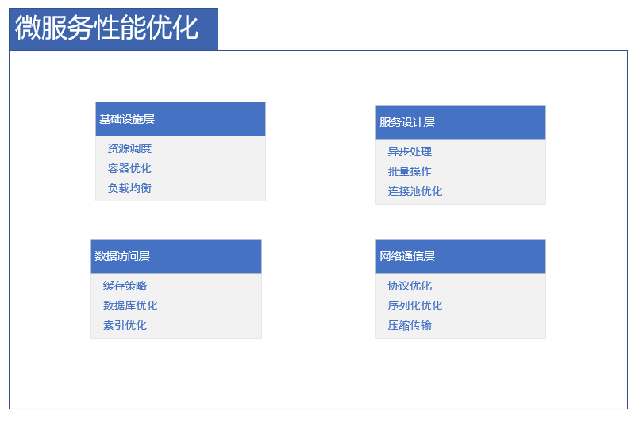

# 微服务性能优化指南

## 概述

微服务架构的性能优化需要从多个层面综合考虑，包括网络通信、服务设计、数据访问、缓存策略等。合理的性能优化可以显著提升系统吞吐量，降低延迟，提高资源利用率。

## 性能优化体系

### 优化层次架构



## 基础设施优化

### 容器资源优化
```yaml
# Kubernetes资源配置优化
apiVersion: apps/v1
kind: Deployment
metadata:
  name: optimized-service
spec:
  template:
    spec:
      containers:
      - name: app
        resources:
          requests:
            cpu: "250m"      # 保证最小资源
            memory: "512Mi"
          limits:
            cpu: "1000m"     # 限制最大资源
            memory: "1024Mi"
        env:
        - name: JAVA_OPTS
          value: "
            -XX:+UseContainerSupport
            -XX:MaxRAMPercentage=75.0
            -XX:+UseG1GC
            -XX:MaxGCPauseMillis=200
            -XX:InitiatingHeapOccupancyPercent=45
            -Xms512m
            -Xmx1024m
          "

# HPA自动扩缩容配置
apiVersion: autoscaling/v2
kind: HorizontalPodAutoscaler
metadata:
  name: service-hpa
spec:
  scaleTargetRef:
    apiVersion: apps/v1
    kind: Deployment
    name: optimized-service
  minReplicas: 2
  maxReplicas: 10
  metrics:
  - type: Resource
    resource:
      name: cpu
      target:
        type: Utilization
        averageUtilization: 70
  - type: Resource
    resource:
      name: memory
      target:
        type: Utilization
        averageUtilization: 80
```

### JVM调优配置
```java
// 基于G1GC的JVM优化参数
public class JvmOptimization {
    // 推荐JVM参数
    public static final String[] OPTIMIZED_JVM_OPTIONS = {
        "-XX:+UseG1GC",                    // 使用G1垃圾收集器
        "-XX:MaxGCPauseMillis=200",        // 最大GC暂停时间目标
        "-XX:InitiatingHeapOccupancyPercent=45", // 启动并发GC周期堆占用百分比
        "-XX:+UseStringDeduplication",     // 字符串去重
        "-XX:StringTableSize=1000000",     // 字符串表大小
        "-XX:MetaspaceSize=256m",          // 元空间初始大小
        "-XX:MaxMetaspaceSize=512m",       // 元空间最大大小
        "-XX:+UseCompressedOops",          // 使用压缩指针
        "-XX:+UseCompressedClassPointers", // 使用压缩类指针
        "-XX:+ExitOnOutOfMemoryError",     // OOM时直接退出
        "-XX:+HeapDumpOnOutOfMemoryError", // OOM时生成堆转储
        "-XX:HeapDumpPath=/opt/heapdumps", // 堆转储路径
        "-Xlog:gc*:file=/opt/logs/gc.log:time,uptime,level,tags:filecount=5,filesize=10m" // GC日志配置
    };
    
    // 根据容器环境调整JVM参数
    public static void adjustForContainer() {
        String containerMemory = System.getenv("CONTAINER_MEMORY_LIMIT");
        if (containerMemory != null) {
            long memoryLimit = Long.parseLong(containerMemory);
            long heapSize = (long) (memoryLimit * 0.7); // 70%给堆内存
            System.setProperty("Xmx", heapSize + "m");
            System.setProperty("Xms", heapSize + "m");
        }
    }
}
```

## 服务设计优化

### 异步非阻塞设计
```java
@Service
public class AsyncServiceOptimization {
    
    private final WebClient webClient;
    private final ReactiveRepository reactiveRepo;
    private final Scheduler boundedElastic;
    
    public AsyncServiceOptimization() {
        this.webClient = WebClient.builder()
            .clientConnector(new ReactorClientHttpConnector(
                HttpClient.create()
                    .responseTimeout(Duration.ofSeconds(5))
                    .compress(true)
            ))
            .build();
            
        this.boundedElastic = Schedulers.newBoundedElastic(
            50,                      // 最大线程数
            1000,                    // 任务队列容量
            "async-worker"
        );
    }
    
    // 异步HTTP调用
    public Mono<String> asyncHttpCall(String url) {
        return webClient.get()
            .uri(url)
            .retrieve()
            .bodyToMono(String.class)
            .timeout(Duration.ofSeconds(3))
            .onErrorResume(e -> Mono.just("fallback"));
    }
    
    // 批量异步处理
    public Flux<Result> processBatchAsync(List<Request> requests) {
        return Flux.fromIterable(requests)
            .parallel()                          // 并行处理
            .runOn(Schedulers.parallel())
            .flatMap(this::processSingle)
            .sequential();
    }
    
    // 异步数据库操作
    public Mono<Void> asyncDatabaseOperation() {
        return Mono.fromCallable(() -> blockingDatabaseCall())
            .subscribeOn(boundedElastic)         // 将阻塞操作转移到弹性线程池
            .then();
    }
    
    // 使用Project Reactor进行流水线优化
    public Mono<Response> optimizedPipeline(Request request) {
        return validateRequest(request)
            .flatMap(this::enrichData)
            .flatMap(this::transformData)
            .flatMap(this::persistData)
            .flatMap(this::sendNotification)
            .timeout(Duration.ofSeconds(5))
            .retryWhen(Retry.backoff(3, Duration.ofMillis(100)));
    }
}
```

### 连接池优化配置
```yaml
# 数据库连接池优化
spring:
  datasource:
    hikari:
      maximum-pool-size: 20           # 最大连接数 (CPU核心数 * 2 + 磁盘数)
      minimum-idle: 5                # 最小空闲连接
      idle-timeout: 30000            # 空闲连接超时时间
      connection-timeout: 2000       # 连接超时时间
      max-lifetime: 1800000          # 连接最大生命周期
      leak-detection-threshold: 5000  # 泄漏检测阈值
      pool-name: "HikariPool-${spring.application.name}"

# Redis连接池优化
lettuce:
  pool:
    max-active: 20                   # 最大连接数
    max-idle: 10                     # 最大空闲连接
    min-idle: 5                      # 最小空闲连接
    max-wait: 1000                   # 获取连接最大等待时间
    time-between-eviction-runs: 30000 # 驱逐检查间隔
```

## 数据访问优化

### 缓存策略优化
```java
@Service
@CacheConfig(cacheNames = "users")
public class CacheOptimizationService {
    
    private final UserRepository userRepository;
    private final CacheManager cacheManager;
    
    // 多级缓存策略
    @Cacheable(value = "users", key = "#userId", 
        unless = "#result == null")
    public User getUserWithCache(String userId) {
        return userRepository.findById(userId);
    }
    
    // 批量缓存获取
    public Map<String, User> getUsersBatch(List<String> userIds) {
        Map<String, User> result = new HashMap<>();
        Map<String, User> cachedUsers = getFromCache(userIds);
        
        // 找出未缓存的用户ID
        List<String> missingIds = userIds.stream()
            .filter(id -> !cachedUsers.containsKey(id))
            .collect(Collectors.toList());
        
        if (!missingIds.isEmpty()) {
            // 批量查询数据库
            List<User> dbUsers = userRepository.findByIdIn(missingIds);
            // 批量写入缓存
            cacheUsers(dbUsers);
            dbUsers.forEach(user -> result.put(user.getId(), user));
        }
        
        result.putAll(cachedUsers);
        return result;
    }
    
    // 缓存预热
    @PostConstruct
    public void warmUpCache() {
        List<User> activeUsers = userRepository.findActiveUsers();
        cacheUsers(activeUsers);
    }
    
    // 自定义TTL策略
    public void cacheWithCustomTTL(String key, Object value, long ttlSeconds) {
        Cache cache = cacheManager.getCache("custom-ttl-cache");
        cache.put(key, value, () -> Duration.ofSeconds(ttlSeconds));
    }
}
```

### 数据库查询优化
```java
@Repository
public class DatabaseOptimizationRepository {
    
    @PersistenceContext
    private EntityManager entityManager;
    
    // 批量插入优化
    @Transactional
    public void batchInsert(List<Entity> entities) {
        for (int i = 0; i < entities.size(); i++) {
            entityManager.persist(entities.get(i));
            
            // 每100条刷新一次
            if (i % 100 == 0) {
                entityManager.flush();
                entityManager.clear();
            }
        }
    }
    
    // 分页查询优化
    public Page<Entity> optimizedPagination(Pageable pageable) {
        CriteriaBuilder cb = entityManager.getCriteriaBuilder();
        CriteriaQuery<Entity> query = cb.createQuery(Entity.class);
        Root<Entity> root = query.from(Entity.class);
        
        // 使用游标分页而不是OFFSET
        if (pageable instanceof KeysetPageRequest) {
            KeysetPageRequest keysetPage = (KeysetPageRequest) pageable;
            applyKeysetPagination(cb, query, root, keysetPage);
        }
        
        query.orderBy(getSortOrders(cb, root, pageable.getSort()));
        
        TypedQuery<Entity> typedQuery = entityManager.createQuery(query);
        typedQuery.setMaxResults(pageable.getPageSize());
        
        return new PageImpl<>(typedQuery.getResultList(), pageable, getTotalCount());
    }
    
    // 索引优化查询
    public List<Entity> indexOptimizedQuery(String filter, LocalDate date) {
        String sql = """
            SELECT * FROM entities 
            WHERE filter_field = ? 
            AND date_field >= ?
            AND date_field < ? + INTERVAL 1 DAY
            USE INDEX (idx_filter_date)
        """;
        
        return entityManager.createNativeQuery(sql, Entity.class)
            .setParameter(1, filter)
            .setParameter(2, date)
            .setParameter(3, date)
            .getResultList();
    }
}
```

## 网络通信优化

### 协议与序列化优化
```java
@Configuration
public class ProtocolOptimizationConfig {
    
    @Bean
    public WebClient.Builder optimizedWebClientBuilder() {
        return WebClient.builder()
            .codecs(configurer -> {
                // 配置编解码器
                configurer.defaultCodecs().maxInMemorySize(16 * 1024 * 1024); // 16MB
                configurer.defaultCodecs().jackson2JsonEncoder(new Jackson2JsonEncoder(
                    new ObjectMapper().registerModule(new JavaTimeModule())
                ));
            });
    }
    
    @Bean
    public ProtobufHttpMessageConverter protobufHttpMessageConverter() {
        return new ProtobufHttpMessageConverter();
    }
    
    @Bean
    public GrpcClientConfigurer grpcClientConfigurer() {
        return clientBuilder -> {
            clientBuilder
                .maxInboundMessageSize(16 * 1024 * 1024) // 16MB
                .enableRetry()
                .setCompression("gzip");
        };
    }
}

// 序列化性能比较
public class SerializationBenchmark {
    
    public void compareSerialization() {
        // JSON序列化
        ObjectMapper jsonMapper = new ObjectMapper();
        byte[] jsonBytes = jsonMapper.writeValueAsBytes(dataObject);
        
        // Protobuf序列化
        byte[] protobufBytes = dataObject.toByteArray();
        
        // MessagePack序列化
        MessagePack msgpack = new MessagePack();
        byte[] msgpackBytes = msgpack.write(dataObject);
        
        // 性能指标记录
        metrics.recordSerializationSize("json", jsonBytes.length);
        metrics.recordSerializationSize("protobuf", protobufBytes.length);
        metrics.recordSerializationSize("msgpack", msgpackBytes.length);
    }
}
```

### HTTP连接优化
```yaml
# HTTP客户端优化配置
http:
  client:
    connect-timeout: 2000            # 连接超时2秒
    read-timeout: 5000               # 读取超时5秒
    write-timeout: 5000              # 写入超时5秒
    max-connections: 1000            # 最大连接数
    max-per-route: 100               # 每路由最大连接数
    keep-alive: 30000                # 保持连接时间
    evict-idle-connections: true     # 驱逐空闲连接
    compression: true               # 启用压缩

# gRPC客户端优化
grpc:
  client:
    target: "dns:///service.example.com:8080"
    enable-keepalive: true
    keepalive-time: 30
    keepalive-timeout: 10
    keepalive-without-calls: true
    idle-timeout: 300
```

## 监控与调优

### 性能监控配置
```java
@Component
public class PerformanceMonitor {
    
    private final MeterRegistry meterRegistry;
    private final Timer globalTimer;
    private final DistributionSummary payloadSizeSummary;
    
    public PerformanceMonitor(MeterRegistry meterRegistry) {
        this.meterRegistry = meterRegistry;
        this.globalTimer = Timer.builder("request.process.time")
            .publishPercentiles(0.5, 0.95, 0.99)
            .register(meterRegistry);
        
        this.payloadSizeSummary = DistributionSummary.builder("request.payload.size")
            .baseUnit("bytes")
            .register(meterRegistry);
    }
    
    @Around("@within(org.springframework.web.bind.annotation.RestController)")
    public Object monitorRestController(ProceedingJoinPoint pjp) throws Throwable {
        Timer.Sample sample = Timer.start(meterRegistry);
        String methodName = pjp.getSignature().getName();
        
        try {
            Object result = pjp.proceed();
            sample.stop(Timer.builder("controller.execution.time")
                .tag("method", methodName)
                .register(meterRegistry));
            return result;
        } catch (Exception e) {
            sample.stop(Timer.builder("controller.error.time")
                .tag("method", methodName)
                .tag("error", e.getClass().getSimpleName())
                .register(meterRegistry));
            throw e;
        }
    }
    
    public void recordDatabaseQueryTime(String queryType, long duration) {
        Timer.builder("database.query.time")
            .tag("type", queryType)
            .register(meterRegistry)
            .record(duration, TimeUnit.MILLISECONDS);
    }
    
    public void recordCacheHitMiss(String cacheName, boolean hit) {
        Counter.builder("cache.access")
            .tag("name", cacheName)
            .tag("result", hit ? "hit" : "miss")
            .register(meterRegistry)
            .increment();
    }
}
```

### 实时性能分析
```java
public class RealTimePerformanceAnalyzer {
    
    @Scheduled(fixedRate = 60000) // 每分钟分析一次
    public void analyzePerformance() {
        // 收集性能指标
        Map<String, Double> metrics = collectMetrics();
        
        // 检测性能异常
        detectAnomalies(metrics);
        
        // 生成优化建议
        generateRecommendations(metrics);
        
        // 自动调整配置
        autoTuneConfiguration(metrics);
    }
    
    private Map<String, Double> collectMetrics() {
        return Map.of(
            "p95_response_time", getPercentile(95),
            "error_rate", getErrorRate(),
            "throughput", getThroughput(),
            "cpu_usage", getCpuUsage(),
            "memory_usage", getMemoryUsage(),
            "gc_time", getGcTime()
        );
    }
    
    private void detectAnomalies(Map<String, Double> metrics) {
        if (metrics.get("p95_response_time") > 1000) {
            alertService.alert("高延迟警告", "P95响应时间超过1秒");
        }
        
        if (metrics.get("error_rate") > 0.05) {
            alertService.alert("高错误率警告", "错误率超过5%");
        }
    }
    
    private void autoTuneConfiguration(Map<String, Double> metrics) {
        // 根据负载自动调整线程池大小
        if (metrics.get("throughput") > 1000) {
            threadPoolConfigurator.increaseCorePoolSize(5);
        }
        
        // 根据内存使用调整缓存策略
        if (metrics.get("memory_usage") > 0.8) {
            cacheManager.reduceCacheSize();
        }
    }
}
```

## 最佳实践总结

### 性能优化清单
```markdown
## 基础设施层
- [ ] 合理配置容器资源限制
- [ ] 优化JVM参数和垃圾收集器
- [ ] 实施自动扩缩容策略
- [ ] 使用高效的负载均衡器

## 服务设计层  
- [ ] 采用异步非阻塞编程模型
- [ ] 优化连接池配置
- [ ] 实现批量处理操作
- [ ] 使用背压控制流量

## 数据访问层
- [ ] 设计多级缓存策略
- [ ] 优化数据库查询和索引
- [ ] 使用读写分离
- [ ] 实施分库分表

## 网络通信层
- [ ] 选择高效的序列化协议
- [ ] 启用传输压缩
- [ ] 优化HTTP/2或gRPC配置
- [ ] 减少网络往返次数

## 监控调优层
- [ ] 建立全面的性能监控
- [ ] 设置合理的告警阈值
- [ ] 定期进行性能测试
- [ ] 实施持续性能优化
```

### 性能测试方案
```java
public class PerformanceTestPlan {
    
    @Test
    public void loadTest() {
        // 模拟不同负载场景
        loadTestingFramework.simulateUsers(1000, Duration.ofMinutes(10));
        
        // 测量关键指标
        PerformanceMetrics metrics = loadTestingFramework.getMetrics();
        assertThat(metrics.p95ResponseTime()).isLessThan(500);
        assertThat(metrics.errorRate()).isLessThan(0.01);
        assertThat(metrics.throughput()).isGreaterThan(1000);
    }
    
    @Test
    public void stressTest() {
        // 压力测试
        stressTestingFramework.increaseLoadUntilBreakpoint();
        
        // 确定系统极限
        int maxCapacity = stressTestingFramework.findMaxCapacity();
        assertThat(maxCapacity).isGreaterThan(5000);
    }
    
    @Test 
    public void enduranceTest() {
        // 耐久性测试（24小时）
        enduranceTestingFramework.runFor(Duration.ofHours(24));
        
        // 检查内存泄漏和性能衰减
        assertNoMemoryLeak();
        assertNoPerformanceDegradation();
    }
}
```

## 总结

微服务性能优化是一个系统工程，需要从多个层面综合考虑：

**优化重点：**
- 基础设施资源合理分配
- 服务设计的异步和非阻塞
- 数据访问的缓存和批量化
- 网络通信的协议和序列化优化

**关键原则：**
- 度量驱动：基于数据做优化决策
- 渐进式优化：从瓶颈最严重的部分开始
- 自动化：实现自动扩缩容和调优
- 持续优化：建立性能优化闭环

> 提示：性能优化应该在保证系统稳定性的前提下进行，避免过度优化和过早优化。

***
*相关阅读：./microservice-monitoring.md | ./container-performance.md | ./database-performance.md*