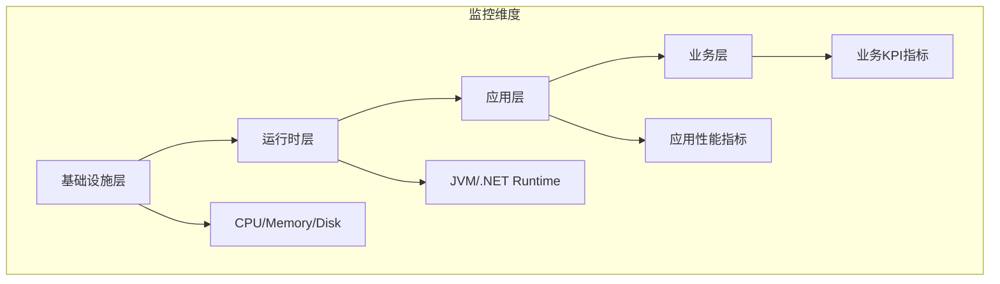

# 性能监控指标体系

## 概述

性能监控指标是衡量系统健康状态和性能表现的关键数据点。一个完善的监控指标体系应该覆盖基础设施、应用程序、业务逻辑等多个层面，为系统优化和故障排查提供数据支撑。

## 监控体系架构

### 监控层次模型


## 核心监控指标分类

### 1. 基础设施指标
**服务器和网络基础资源监控**

```prometheus
# 节点资源指标
node_cpu_usage_percentage{instance="server01"}  # CPU使用率
node_memory_usage_bytes{instance="server01"}    # 内存使用量
node_disk_io_seconds{instance="server01"}       # 磁盘IO时间
node_network_receive_bytes_total{instance="server01"}  # 网络接收流量
node_filesystem_usage_percentage{instance="server01"} # 磁盘使用率
```

### 2. 运行时指标
**应用运行时环境监控**

#### JVM 监控指标
```prometheus
# JVM 内存指标
jvm_memory_used_bytes{area="heap"}      # 堆内存使用
jvm_memory_max_bytes{area="heap"}       # 堆内存最大值
jvm_gc_collection_seconds_count{gc="G1"} # GC次数
jvm_gc_collection_seconds_sum{gc="G1"}  # GC总时间

# JVM 线程指标  
jvm_threads_live                         # 活动线程数
jvm_threads_daemon                       # 守护线程数
jvm_threads_peak                         # 峰值线程数
```

#### .NET CLR 监控指标
```prometheus
dotnet_gc_total_memory_bytes             # 总内存使用
dotnet_gc_collection_count_total{gc="0"} # GC回收次数
dotnet_threadpool_worker_threads_total   # 线程池工作线程
dotnet_exceptions_thrown_total           # 异常抛出次数
```

### 3. 应用性能指标
**应用程序性能表现监控**

#### HTTP 服务指标
```prometheus
# HTTP 请求指标
http_requests_total{method="GET",endpoint="/api/users",status="200"}  # 请求总数
http_request_duration_seconds{method="GET",endpoint="/api/users"}     # 请求耗时
http_request_errors_total{method="GET",endpoint="/api/users"}        # 错误请求数

# 速率和错误率
rate(http_requests_total[5m])           # 请求速率
rate(http_request_errors_total[5m]) / rate(http_requests_total[5m])  # 错误率
```

#### 数据库指标
```prometheus
# 数据库连接指标
db_connections_active{db="users"}      # 活跃连接数
db_connections_idle{db="users"}         # 空闲连接数
db_connections_waiting{db="users"}      # 等待连接数

# 查询性能指标
db_query_duration_seconds{query="SELECT"} # 查询耗时
db_query_errors_total{query="SELECT"}    # 查询错误数
db_transaction_duration_seconds           # 事务耗时
```

#### 缓存指标
```prometheus
# Redis 缓存指标
redis_memory_used_bytes                  # 内存使用量
redis_connected_clients                  # 连接客户端数
redis_commands_processed_total           # 命令处理数
redis_keyspace_hits_total                # 键命中次数
redis_keyspace_misses_total              # 键未命中次数

# 命中率计算
redis_keyspace_hits_total / (redis_keyspace_hits_total + redis_keyspace_misses_total)
```

### 4. 业务指标
**业务关键性能指标**

```prometheus
# 电商业务指标
orders_created_total                     # 订单创建总数
orders_completed_total                   # 订单完成总数  
orders_failed_total                      # 订单失败总数
order_processing_duration_seconds        # 订单处理耗时
payment_success_rate                     # 支付成功率

# 用户行为指标
user_registrations_total                 # 用户注册数
user_login_attempts_total               # 用户登录尝试
user_session_duration_seconds           # 会话持续时间
```

## 指标收集与暴露

### Spring Boot Actuator
```yaml
# application.yml
management:
  endpoints:
    web:
      exposure:
        include: health,metrics,prometheus
  metrics:
    export:
      prometheus:
        enabled: true
    tags:
      application: ${spring.application.name}
      environment: ${spring.profiles.active}
```

### 自定义指标收集
```java
@Component
public class OrderMetrics {
    
    private final Counter orderCounter;
    private final Timer orderProcessingTimer;
    private final Gauge activeOrdersGauge;
    
    public OrderMetrics(MeterRegistry registry) {
        // 计数器：订单创建总数
        orderCounter = Counter.builder("orders.created.total")
            .description("Total number of orders created")
            .tag("service", "order-service")
            .register(registry);
            
        // 计时器：订单处理耗时
        orderProcessingTimer = Timer.builder("order.processing.duration")
            .description("Time spent processing orders")
            .register(registry);
            
        // 仪表盘：活跃订单数
        activeOrdersGauge = Gauge.builder("orders.active.count")
            .description("Number of currently active orders")
            .register(registry);
    }
    
    public void recordOrderCreation(Order order) {
        orderCounter.increment();
        activeOrdersGauge.set(getActiveOrderCount());
    }
    
    public Timer.Sample startProcessingTimer() {
        return Timer.start();
    }
    
    public void stopProcessingTimer(Timer.Sample sample) {
        sample.stop(orderProcessingTimer);
    }
}
```

### 中间件指标暴露
```yaml
# Redis 指标导出
redis:
  metrics:
    enabled: true
    export:
      enabled: true
    command:
      latency:
        enabled: true

# 数据库连接池指标
datasource:
  hikari:
    metrics:
      enabled: true
    register-mbeans: true
```

## 监控仪表板配置

### Grafana 仪表板
```json
{
  "dashboard": {
    "title": "订单服务监控",
    "panels": [
      {
        "title": "请求速率",
        "type": "graph",
        "targets": [{
          "expr": "rate(http_requests_total{service=\"order-service\"}[5m])",
          "legendFormat": "{{method}} {{endpoint}}"
        }]
      },
      {
        "title": "错误率",
        "type": "singlestat",
        "targets": [{
          "expr": "rate(http_request_errors_total{service=\"order-service\"}[5m]) / rate(http_requests_total{service=\"order-service\"}[5m])",
          "format": "percent"
        }]
      },
      {
        "title": "响应时间",
        "type": "heatmap",
        "targets": [{
          "expr": "histogram_quantile(0.95, rate(http_request_duration_seconds_bucket{service=\"order-service\"}[5m]))"
        }]
      }
    ]
  }
}
```

## 告警规则配置

### Prometheus 告警规则
```yaml
groups:
- name: application-alerts
  rules:
  - alert: HighErrorRate
    expr: rate(http_request_errors_total[5m]) / rate(http_requests_total[5m]) > 0.05
    for: 5m
    labels:
      severity: critical
    annotations:
      summary: "High error rate detected"
      description: "Error rate is above 5% for the last 5 minutes"
      
  - alert: HighResponseTime
    expr: histogram_quantile(0.95, rate(http_request_duration_seconds_bucket[5m])) > 2
    for: 10m
    labels:
      severity: warning
    annotations:
      summary: "High response time detected"
      description: "95th percentile response time is above 2 seconds"
      
  - alert: MemoryUsageCritical
    expr: node_memory_usage_percentage > 90
    for: 2m
    labels:
      severity: critical
    annotations:
      summary: "Memory usage critical"
      description: "Memory usage is above 90%"
```

## 性能分析工具

### 火焰图生成
```bash
# 生成CPU火焰图
./async-profiler.sh -d 60 -f flamegraph.html <pid>

# 生成内存分配火焰图
./async-profiler.sh -d 60 -e alloc -f alloc-flamegraph.html <pid>

# JVM性能分析
jstack <pid> > thread-dump.txt
jmap -histo <pid> > memory-histogram.txt
```

### 分布式追踪集成
```java
@Aspect
@Component
public class MetricsTracingAspect {
    
    @Around("execution(* com.example..*(..))")
    public Object measurePerformance(ProceedingJoinPoint pjp) throws Throwable {
        String methodName = pjp.getSignature().toShortString();
        Timer.Sample sample = Timer.start(Metrics.globalRegistry);
        
        try {
            return pjp.proceed();
        } finally {
            sample.stop(Timer.builder("method.execution.time")
                .tag("method", methodName)
                .register(Metrics.globalRegistry));
        }
    }
}
```

## 容量规划指标

### 资源预测指标
```prometheus
# 容量规划指标
container_memory_usage_bytes{container="app"}      # 容器内存使用
container_cpu_usage_seconds_total{container="app"} # CPU使用时间
http_requests_per_second                            # 每秒请求数
database_connections_utilization                    # 数据库连接利用率

# 预测公式
predict_linear(container_memory_usage_bytes[24h], 3600 * 24 * 7)  # 7天内存预测
```

## 最佳实践

### 指标命名规范
```markdown
## 命名约定
- **后缀单位**: `_seconds`, `_bytes`, `_total`, `_count`
- **前缀标识**: `http_`, `db_`, `jvm_`, `node_`
- **标签维度**: `method`, `endpoint`, `status`, `service`

## 示例规范
- `http_request_duration_seconds` - HTTP请求耗时
- `jvm_memory_used_bytes` - JVM内存使用
- `db_query_errors_total` - 数据库查询错误
- `orders_created_total` - 订单创建总数
```

### 监控等级划分
```yaml
monitoring:
  levels:
    critical:
      - error_rate > 5%
      - response_time_p95 > 2s
      - memory_usage > 90%
    warning:
      - error_rate > 2%
      - response_time_p95 > 1s  
      - memory_usage > 80%
    info:
      - gc_time > 100ms
      - thread_count > 200
      - disk_usage > 70%
```

## 故障排查指南

### 性能问题诊断
```markdown
1. **高CPU使用率**
   - 检查线程转储中的繁忙线程
   - 分析CPU火焰图
   - 查看GC活动频率

2. **高内存使用**
   - 分析堆转储文件
   - 检查内存泄漏
   - 调整JVM内存参数

3. **慢响应时间**
   - 分析数据库查询性能
   - 检查外部服务调用
   - 查看网络延迟指标

4. **高错误率**
   - 检查依赖服务状态
   - 分析异常日志
   - 验证配置参数
```

### 监控调试命令
```bash
# 查看当前指标
curl http://localhost:8080/actuator/metrics

# 检查特定指标
curl http://localhost:8080/actuator/metrics/http.requests

# Prometheus查询测试
curl -G 'http://prometheus:9090/api/v1/query' \
  --data-urlencode 'query=rate(http_requests_total[5m])'

# 压力测试指标
wrk -t4 -c100 -d30s http://localhost:8080/api/users
```

## 总结

一个完善的性能监控指标体系应该：

**核心价值：**
- 实时系统健康状态可视化
- 性能瓶颈快速定位
- 容量规划数据支撑
- 故障预警和快速响应

**实施要点：**
- 统一的指标命名规范
- 多层次的监控覆盖
- 智能的告警机制
- 持续的优化改进

> 提示：监控指标应该与日志和追踪数据结合分析，形成完整的可观测性解决方案。

***
*相关阅读：./distributed-tracing.md | ./log-aggregation.md | ./capacity-planning.md*