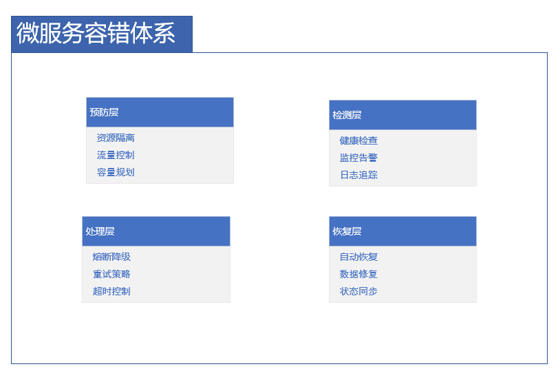

# 微服务故障处理与容错指南

## 概述

在分布式微服务架构中，故障是不可避免的。有效的故障处理和容错机制能够确保系统在部分组件失败时仍能提供服务，保证系统的可用性和可靠性。本章将深入探讨微服务环境下的故障处理策略和容错模式。

## 容错架构体系

### 多层次容错防护



## 核心容错模式

### 1. 熔断器模式 (Circuit Breaker)
**防止故障扩散和级联失败**

```java
public class CircuitBreaker {
    private enum State { CLOSED, OPEN, HALF_OPEN }
    
    private volatile State state = State.CLOSED;
    private volatile int failureCount = 0;
    private final int failureThreshold;
    private final long resetTimeoutMs;
    private volatile long lastFailureTime;
    private final int halfOpenSuccessThreshold;
    private volatile int halfOpenSuccessCount = 0;
    
    private final Object lock = new Object();
    
    public CircuitBreaker(int failureThreshold, long resetTimeoutMs, int halfOpenSuccessThreshold) {
        this.failureThreshold = failureThreshold;
        this.resetTimeoutMs = resetTimeoutMs;
        this.halfOpenSuccessThreshold = halfOpenSuccessThreshold;
    }
    
    public <T> T execute(Callable<T> operation) throws Exception {
        if (state == State.OPEN) {
            // 检查是否应该尝试恢复
            if (System.currentTimeMillis() - lastFailureTime > resetTimeoutMs) {
                synchronized (lock) {
                    if (state == State.OPEN && 
                        System.currentTimeMillis() - lastFailureTime > resetTimeoutMs) {
                        transitionToHalfOpen();
                    }
                }
            } else {
                throw new CircuitBreakerOpenException("Circuit breaker is open");
            }
        }
        
        try {
            T result = operation.call();
            recordSuccess();
            return result;
        } catch (Exception e) {
            recordFailure();
            throw e;
        }
    }
    
    private void recordSuccess() {
        synchronized (lock) {
            if (state == State.HALF_OPEN) {
                halfOpenSuccessCount++;
                if (halfOpenSuccessCount >= halfOpenSuccessThreshold) {
                    transitionToClosed();
                }
            }
        }
    }
    
    private void recordFailure() {
        synchronized (lock) {
            failureCount++;
            lastFailureTime = System.currentTimeMillis();
            
            if (state == State.HALF_OPEN || failureCount >= failureThreshold) {
                transitionToOpen();
            }
        }
    }
    
    private void transitionToOpen() {
        state = State.OPEN;
        halfOpenSuccessCount = 0;
    }
    
    private void transitionToHalfOpen() {
        state = State.HALF_OPEN;
        failureCount = 0;
    }
    
    private void transitionToClosed() {
        state = State.CLOSED;
        failureCount = 0;
        halfOpenSuccessCount = 0;
    }
    
    public State getState() {
        return state;
    }
    
    public boolean isOpen() {
        return state == State.OPEN;
    }
}
```

### 2. 智能重试策略
**处理瞬时故障和网络波动**

```java
public class RetryStrategy {
    private final int maxAttempts;
    private final long initialDelayMs;
    private final long maxDelayMs;
    private final double backoffMultiplier;
    private final Set<Class<? extends Exception>> retryableExceptions;
    private final Random random = new Random();
    
    public RetryStrategy(int maxAttempts, long initialDelayMs, long maxDelayMs, 
                        double backoffMultiplier, Set<Class<? extends Exception>> retryableExceptions) {
        this.maxAttempts = maxAttempts;
        this.initialDelayMs = initialDelayMs;
        this.maxDelayMs = maxDelayMs;
        this.backoffMultiplier = backoffMultiplier;
        this.retryableExceptions = retryableExceptions;
    }
    
    public <T> T execute(RetryableOperation<T> operation) throws Exception {
        int attempt = 1;
        long delay = initialDelayMs;
        
        while (true) {
            try {
                return operation.execute();
            } catch (Exception e) {
                if (!shouldRetry(e) || attempt >= maxAttempts) {
                    throw new RetryExhaustedException("Operation failed after " + attempt + " attempts", e);
                }
                
                // 添加随机抖动避免惊群效应
                long jitteredDelay = (long) (delay * (0.8 + 0.4 * random.nextDouble()));
                Thread.sleep(jitteredDelay);
                
                delay = (long) Math.min(delay * backoffMultiplier, maxDelayMs);
                attempt++;
            }
        }
    }
    
    private boolean shouldRetry(Exception e) {
        return retryableExceptions.stream().anyMatch(clazz -> clazz.isInstance(e));
    }
    
    // 分层重试策略
    public static class LayeredRetryStrategy {
        private final Map<String, RetryStrategy> strategyMap;
        
        public LayeredRetryStrategy() {
            this.strategyMap = new HashMap<>();
            
            // 数据库操作重试策略
            strategyMap.put("database", new RetryStrategy(3, 100, 1000, 2.0, 
                Set.of(SQLException.class, DataAccessException.class)));
            
            // 网络调用重试策略
            strategyMap.put("network", new RetryStrategy(5, 200, 2000, 1.5,
                Set.of(ConnectException.class, SocketTimeoutException.class)));
            
            // 第三方服务重试策略
            strategyMap.put("external", new RetryStrategy(2, 500, 5000, 2.0,
                Set.of(RemoteServiceException.class)));
        }
        
        public <T> T execute(String category, RetryableOperation<T> operation) throws Exception {
            RetryStrategy strategy = strategyMap.get(category);
            if (strategy == null) {
                strategy = strategyMap.get("default");
            }
            return strategy.execute(operation);
        }
    }
}
```

### 3. 超时控制机制
**防止资源阻塞和雪崩效应**

```java
public class TimeoutManager {
    private final ScheduledExecutorService scheduler;
    private final long defaultTimeoutMs;
    
    public TimeoutManager(long defaultTimeoutMs) {
        this.defaultTimeoutMs = defaultTimeoutMs;
        this.scheduler = Executors.newScheduledThreadPool(4);
    }
    
    public <T> CompletableFuture<T> executeWithTimeout(Callable<T> task, long timeoutMs) {
        CompletableFuture<T> future = new CompletableFuture<>();
        
        // 提交任务
        Future<T> taskFuture = scheduler.submit(task);
        
        // 设置超时
        ScheduledFuture<?> timeoutFuture = scheduler.schedule(() -> {
            if (!taskFuture.isDone()) {
                taskFuture.cancel(true);
                future.completeExceptionally(new TimeoutException("Operation timed out after " + timeoutMs + "ms"));
            }
        }, timeoutMs, TimeUnit.MILLISECONDS);
        
        // 处理正常完成
        CompletableFuture.runAsync(() -> {
            try {
                T result = taskFuture.get();
                timeoutFuture.cancel(false);
                future.complete(result);
            } catch (CancellationException e) {
                // 超时取消，无需处理
            } catch (Exception e) {
                timeoutFuture.cancel(false);
                future.completeExceptionally(e);
            }
        });
        
        return future;
    }
    
    // 分层超时配置
    public static class LayeredTimeoutConfig {
        private final Map<String, Long> timeoutConfigs;
        
        public LayeredTimeoutConfig() {
            timeoutConfigs = Map.of(
                "database_query", 1000L,
                "cache_operation", 500L,
                "external_api", 3000L,
                "internal_service", 2000L,
                "file_operation", 5000L
            );
        }
        
        public long getTimeout(String operationType) {
            return timeoutConfigs.getOrDefault(operationType, defaultTimeoutMs);
        }
    }
}
```

### 4. 降级与回退策略
**保证核心功能的可用性**

```java
public class FallbackStrategy {
    private final Map<Class<?>, FallbackHandler<?>> fallbackHandlers;
    private final FallbackHandler<?> defaultHandler;
    
    public FallbackStrategy() {
        this.fallbackHandlers = new HashMap<>();
        this.defaultHandler = new DefaultFallbackHandler();
        
        // 注册特定异常的处理器
        fallbackHandlers.put(TimeoutException.class, new TimeoutFallbackHandler());
        fallbackHandlers.put(CircuitBreakerOpenException.class, new CircuitBreakerFallbackHandler());
        fallbackHandlers.put(RemoteServiceException.class, new RemoteServiceFallbackHandler());
    }
    
    @SuppressWarnings("unchecked")
    public <T> T executeWithFallback(Callable<T> operation) {
        try {
            return operation.call();
        } catch (Exception e) {
            FallbackHandler<T> handler = (FallbackHandler<T>) fallbackHandlers.getOrDefault(
                e.getClass(), defaultHandler);
            return handler.handle(e);
        }
    }
    
    public interface FallbackHandler<T> {
        T handle(Exception exception);
    }
    
    // 具体降级实现
    public static class CacheFallbackHandler implements FallbackHandler<Object> {
        private final Cache cache;
        
        @Override
        public Object handle(Exception exception) {
            return cache.get("fallback_data").orElseGet(() -> {
                // 返回静态默认值
                return Collections.emptyMap();
            });
        }
    }
    
    public static class DefaultValueFallbackHandler implements FallbackHandler<Object> {
        private final Object defaultValue;
        
        public DefaultValueFallbackHandler(Object defaultValue) {
            this.defaultValue = defaultValue;
        }
        
        @Override
        public Object handle(Exception exception) {
            return defaultValue;
        }
    }
}
```

## 分布式容错机制

### 服务发现与健康检查
```java
public class ResilientServiceDiscovery {
    private final ServiceRegistry serviceRegistry;
    private final HealthChecker healthChecker;
    private final LoadBalancer loadBalancer;
    private final Map<String, List<ServiceInstance>> healthyInstancesCache = new ConcurrentHashMap<>();
    
    @Scheduled(fixedRate = 30000)
    public void refreshServiceHealth() {
        serviceRegistry.getAllServices().forEach(serviceName -> {
            List<ServiceInstance> instances = serviceRegistry.getInstances(serviceName);
            List<ServiceInstance> healthyInstances = instances.parallelStream()
                .filter(instance -> healthChecker.checkHealth(instance).isHealthy())
                .collect(Collectors.toList());
            
            healthyInstancesCache.put(serviceName, healthyInstances);
        });
    }
    
    public ServiceInstance selectHealthyInstance(String serviceName) {
        List<ServiceInstance> instances = healthyInstancesCache.get(serviceName);
        if (instances == null || instances.isEmpty()) {
            throw new NoHealthyInstanceException("No healthy instances available for service: " + serviceName);
        }
        
        return loadBalancer.select(instances);
    }
    
    // 故障实例自动隔离
    public void handleUnhealthyInstance(ServiceInstance instance) {
        serviceRegistry.deregisterInstance(instance);
        healthChecker.quarantineInstance(instance, Duration.ofMinutes(5));
    }
}
```

### 幂等性保证机制
```java
public class IdempotencyService {
    private final DistributedLockManager lockManager;
    private final IdempotencyStorage storage;
    
    public <T> T executeIdempotent(String operationId, Supplier<T> operation) {
        // 获取分布式锁确保同一操作ID的串行执行
        Lock lock = lockManager.acquireLock("idempotent:" + operationId, 5000);
        
        try {
            // 检查是否已执行
            if (storage.hasOperationCompleted(operationId)) {
                return storage.getOperationResult(operationId);
            }
            
            // 执行操作
            T result = operation.get();
            
            // 存储结果
            storage.storeOperationResult(operationId, result);
            
            return result;
        } finally {
            lock.release();
        }
    }
    
    // 分布式锁实现
    public static class RedisDistributedLockManager {
        private final RedisTemplate<String, String> redisTemplate;
        
        public Lock acquireLock(String lockKey, long ttlMs) {
            String token = UUID.randomUUID().toString();
            long expireTime = System.currentTimeMillis() + ttlMs;
            
            while (System.currentTimeMillis() < expireTime) {
                Boolean acquired = redisTemplate.opsForValue().setIfAbsent(lockKey, token, ttlMs, TimeUnit.MILLISECONDS);
                if (Boolean.TRUE.equals(acquired)) {
                    return new RedisLock(lockKey, token, redisTemplate);
                }
                
                try {
                    Thread.sleep(100);
                } catch (InterruptedException e) {
                    Thread.currentThread().interrupt();
                    throw new LockAcquisitionException("Lock acquisition interrupted", e);
                }
            }
            
            throw new LockTimeoutException("Failed to acquire lock within timeout");
        }
    }
}
```

## 数据一致性容错

### 分布式事务补偿
```java
public class TransactionCompensator {
    private final TransactionRecorder transactionRecorder;
    private final CompensationExecutor compensationExecutor;
    
    @Scheduled(fixedDelay = 60000)
    public void compensateFailedTransactions() {
        List<FailedTransaction> failedTransactions = transactionRecorder.findFailedTransactions();
        
        for (FailedTransaction transaction : failedTransactions) {
            try {
                compensationExecutor.compensate(transaction);
                transactionRecorder.markAsCompensated(transaction.getId());
            } catch (Exception e) {
                log.error("Compensation failed for transaction: {}", transaction.getId(), e);
                transactionRecorder.recordCompensationFailure(transaction.getId(), e);
            }
        }
    }
    
    // Saga模式实现
    public static class SagaTransactionManager {
        private final List<SagaStep> steps;
        private final SagaLog sagaLog;
        
        public void executeSaga() {
            SagaContext context = new SagaContext();
            
            try {
                for (SagaStep step : steps) {
                    try {
                        step.execute(context);
                        sagaLog.recordStepSuccess(step, context);
                    } catch (Exception e) {
                        sagaLog.recordStepFailure(step, context, e);
                        compensatePreviousSteps(steps.subList(0, steps.indexOf(step)));
                        throw new SagaExecutionException("Saga execution failed", e);
                    }
                }
            } catch (SagaExecutionException e) {
                log.warn("Saga completed with compensation", e);
            }
        }
        
        private void compensatePreviousSteps(List<SagaStep> stepsToCompensate) {
            for (int i = stepsToCompensate.size() - 1; i >= 0; i--) {
                SagaStep step = stepsToCompensate.get(i);
                try {
                    step.compensate();
                    sagaLog.recordCompensationSuccess(step);
                } catch (Exception e) {
                    log.error("Compensation failed for step: {}", step.getName(), e);
                    sagaLog.recordCompensationFailure(step, e);
                }
            }
        }
    }
}
```

## 监控与自愈

### 智能熔断器监控
```java
public class CircuitBreakerMonitor {
    private final Map<String, CircuitBreaker> circuitBreakers;
    private final MetricsRegistry metricsRegistry;
    
    @Scheduled(fixedRate = 5000)
    public void monitorCircuitBreakers() {
        circuitBreakers.forEach((name, breaker) -> {
            metricsRegistry.recordGauge("circuit_breaker_state", 
                Map.of("name", name), 
                breaker.getState().ordinal());
            
            metricsRegistry.recordGauge("circuit_breaker_failure_count", 
                Map.of("name", name), 
                breaker.getFailureCount());
            
            // 自动调整熔断器配置基于负载
            if (breaker.getState() == CircuitBreaker.State.OPEN) {
                adjustCircuitBreakerConfig(name, breaker);
            }
        });
    }
    
    private void adjustCircuitBreakerConfig(String name, CircuitBreaker breaker) {
        double systemLoad = getSystemLoad();
        long currentResetTimeout = breaker.getResetTimeoutMs();
        
        if (systemLoad > 0.8) {
            // 高负载时延长恢复时间
            breaker.setResetTimeoutMs(currentResetTimeout * 2);
        } else if (systemLoad < 0.3) {
            // 低负载时缩短恢复时间
            breaker.setResetTimeoutMs(Math.max(currentResetTimeout / 2, 1000));
        }
    }
}
```

### 自动故障恢复
```java
public class AutoRecoveryManager {
    private final ServiceRegistry serviceRegistry;
    private final HealthMonitor healthMonitor;
    private final RecoveryStrategy recoveryStrategy;
    
    @Scheduled(fixedRate = 10000)
    public void performHealthChecksAndRecovery() {
        serviceRegistry.getAllServices().forEach(serviceName -> {
            List<ServiceInstance> instances = serviceRegistry.getInstances(serviceName);
            
            instances.forEach(instance -> {
                HealthStatus status = healthMonitor.checkHealth(instance);
                
                switch (status) {
                    case UNHEALTHY:
                        handleUnhealthyInstance(instance);
                        break;
                    case DEGRADED:
                        handleDegradedInstance(instance);
                        break;
                    case HEALTHY:
                        // 实例健康，无需操作
                        break;
                }
            });
        });
    }
    
    private void handleUnhealthyInstance(ServiceInstance instance) {
        log.warn("Instance {} is unhealthy, initiating recovery", instance.getId());
        
        try {
            recoveryStrategy.recover(instance);
            healthMonitor.markAsRecovering(instance);
        } catch (Exception e) {
            log.error("Recovery failed for instance: {}", instance.getId(), e);
            serviceRegistry.deregisterInstance(instance);
        }
    }
    
    private void handleDegradedInstance(ServiceInstance instance) {
        // 减少流量权重
        loadBalancer.adjustWeight(instance, 0.5);
        
        // 尝试轻度恢复
        recoveryStrategy.softRecover(instance);
    }
}
```

## 配置化管理

### 弹性配置模板
```yaml
resilience:
  circuit-breaker:
    default:
      failure-threshold: 5
      reset-timeout: 30000
      half-open-success-threshold: 3
    services:
      order-service:
        failure-threshold: 3
        reset-timeout: 60000
      payment-service:
        failure-threshold: 2
        reset-timeout: 120000
  
  retry:
    default:
      max-attempts: 3
      initial-delay: 100
      max-delay: 1000
      backoff-multiplier: 2.0
    strategies:
      database:
        max-attempts: 3
        initial-delay: 50
      network:
        max-attempts: 5
        initial-delay: 200
      external:
        max-attempts: 2
        initial-delay: 500
  
  timeout:
    default: 3000
    services:
      database-query: 1000
      cache-operation: 500
      external-api: 5000
      internal-call: 2000
  
  bulkhead:
    max-concurrent-calls: 100
    max-wait-duration: 1000
```

### 动态配置更新
```java
@Configuration
@RefreshScope
public class ResilienceConfig {
    
    @Value("${resilience.circuit-breaker.failure-threshold:5}")
    private int circuitBreakerFailureThreshold;
    
    @Value("${resilience.retry.max-attempts:3}")
    private int retryMaxAttempts;
    
    @Value("${resilience.timeout.default:3000}")
    private long defaultTimeoutMs;
    
    @Bean
    public CircuitBreakerConfig circuitBreakerConfig() {
        return CircuitBreakerConfig.custom()
            .failureRateThreshold(circuitBreakerFailureThreshold)
            .waitDurationInOpenState(Duration.ofMillis(30000))
            .slidingWindowType(SlidingWindowType.COUNT_BASED)
            .slidingWindowSize(10)
            .permittedNumberOfCallsInHalfOpenState(2)
            .build();
    }
    
    @Bean
    public RetryConfig retryConfig() {
        return RetryConfig.custom()
            .maxAttempts(retryMaxAttempts)
            .waitDuration(Duration.ofMillis(100))
            .intervalFunction(IntervalFunction.ofExponentialBackoff(500, 2.0))
            .retryOnException(e -> e instanceof RuntimeException)
            .build();
    }
    
    @Bean
    public TimeoutConfig timeoutConfig() {
        return TimeoutConfig.custom()
            .timeoutDuration(Duration.ofMillis(defaultTimeoutMs))
            .build();
    }
}
```

## 测试策略

### 故障注入测试
```java
public class FaultInjectionTest {
    
    @Test
    public void testCircuitBreakerUnderFailure() {
        CircuitBreaker breaker = new CircuitBreaker(3, 30000, 2);
        
        // 注入连续失败
        for (int i = 0; i < 3; i++) {
            assertThrows(Exception.class, () -> 
                breaker.execute(() -> { throw new RuntimeException("Injected failure"); })
            );
        }
        
        // 验证熔断器打开
        assertTrue(breaker.isOpen());
        
        // 验证快速失败
        assertThrows(CircuitBreakerOpenException.class, () -> 
            breaker.execute(() -> "should fail fast")
        );
    }
    
    @Test
    public void testRetryWithIntermittentFailures() {
        RetryStrategy retry = new RetryStrategy(3, 100, 1000, 2.0, 
            Set.of(RuntimeException.class));
        
        AtomicInteger attemptCount = new AtomicInteger();
        
        String result = retry.execute(() -> {
            attemptCount.incrementAndGet();
            if (attemptCount.get() < 3) {
                throw new RuntimeException("Temporary failure");
            }
            return "success";
        });
        
        assertEquals("success", result);
        assertEquals(3, attemptCount.get());
    }
}
```

### 混沌工程测试
```java
public class ChaosEngineeringTest {
    
    @Autowired
    private ChaosEngine chaosEngine;
    
    @Test
    public void testNetworkPartitionResilience() {
        // 模拟网络分区
        chaosEngine.networkPartition("service-a", "service-b");
        
        // 验证系统降级能力
        assertDoesNotThrow(() -> {
            Object result = fallbackStrategy.executeWithFallback(() -> 
                serviceA.callServiceB()
            );
            assertNotNull(result);
        });
        
        // 恢复网络
        chaosEngine.healNetworkPartition();
        
        // 验证系统恢复
        assertDoesNotThrow(() -> {
            Object result = serviceA.callServiceB();
            assertNotNull(result);
        });
    }
    
    @Test
    public void testServiceFailureRecovery() {
        // 模拟服务故障
        chaosEngine.stopService("database-service");
        
        // 验证熔断器触发
        await().until(() -> circuitBreaker.isOpen());
        
        // 恢复服务
        chaosEngine.startService("database-service");
        
        // 验证自动恢复
        await().until(() -> !circuitBreaker.isOpen());
    }
}
```

## 总结

有效的微服务故障处理与容错需要：

**核心原则：**
- 假设故障会发生并做好准备
- 快速检测和隔离故障
- 优雅降级而不是完全失败
- 具备自动恢复能力

**关键实践：**
- 实施熔断器防止级联故障
- 设计智能重试处理瞬时故障
- 使用超时控制避免资源耗尽
- 实现降级策略保证核心功能
- 建立完善的监控和自愈机制

> 提示：容错设计需要在系统复杂性和可靠性之间找到平衡。建议根据业务关键程度选择合适的容错策略。

***
*相关阅读：./distributed-system-design.md | ./microservice-monitoring.md | ./performance-optimization.md*