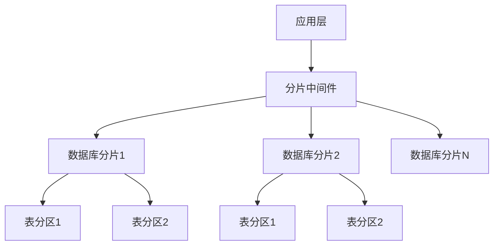

# 数据库分库分表指南

## 概述

数据库分库分表是解决单库性能瓶颈和数据容量限制的核心技术。通过将数据分散到多个数据库和表中，实现水平扩展，提升系统的吞吐量和容错能力。

## 核心概念

### 分库分表架构


### 分片策略对比
```markdown
| 策略类型     | 优点                  | 缺点                    | 适用场景               |
|-------------|---------------------|-----------------------|----------------------|
| **范围分片**  | 简单易用             | 数据分布可能不均匀      | 时间序列数据,有序数据  |
| **哈希分片**  | 数据分布均匀         | 扩容需要数据迁移        | 用户数据,订单数据      |
| **列表分片**  | 灵活控制数据分布     | 需要维护映射关系        | 地理分区,业务分区     |
| **复合分片**  | 结合多种策略优点     | 实现复杂度高            | 复杂业务场景          |
```

## 分片策略实现

### 1. 范围分片 (Range Sharding)
**基于数据范围进行分片**

```java
public class RangeShardingStrategy implements ShardingStrategy {
    
    private final Map<Range<Long>, String> rangeToDatabase;
    
    public RangeShardingStrategy() {
        rangeToDatabase = new HashMap<>();
        rangeToDatabase.put(Range.closedOpen(0L, 1000000L), "db0");
        rangeToDatabase.put(Range.closedOpen(1000000L, 2000000L), "db1");
        rangeToDatabase.put(Range.atLeast(2000000L), "db2");
    }
    
    @Override
    public String determineDatabase(Long shardKey) {
        for (Map.Entry<Range<Long>, String> entry : rangeToDatabase.entrySet()) {
            if (entry.getKey().contains(shardKey)) {
                return entry.getValue();
            }
        }
        throw new IllegalArgumentException("No database found for shard key: " + shardKey);
    }
    
    @Override
    public String determineTable(Long shardKey, String logicTableName) {
        long tableSuffix = (shardKey / 100000) % 10; // 每10万数据一个表
        return logicTableName + "_" + tableSuffix;
    }
}
```

### 2. 哈希分片 (Hash Sharding)
**基于哈希算法均匀分布数据**

```java
public class HashShardingStrategy implements ShardingStrategy {
    
    private final int databaseCount;
    private final int tableCountPerDatabase;
    
    public HashShardingStrategy(int databaseCount, int tableCountPerDatabase) {
        this.databaseCount = databaseCount;
        this.tableCountPerDatabase = tableCountPerDatabase;
    }
    
    @Override
    public String determineDatabase(String shardKey) {
        int hash = Math.abs(shardKey.hashCode());
        int dbIndex = hash % databaseCount;
        return "db" + dbIndex;
    }
    
    @Override
    public String determineTable(String shardKey, String logicTableName) {
        int hash = Math.abs(shardKey.hashCode());
        int tableIndex = (hash / databaseCount) % tableCountPerDatabase;
        return logicTableName + "_" + tableIndex;
    }
}
```

### 3. 一致性哈希分片
**减少扩容时的数据迁移**

```java
public class ConsistentHashSharding {
    
    private final ConsistentHash<String> consistentHash;
    
    public ConsistentHashSharding(List<String> nodes, int virtualNodes) {
        this.consistentHash = new ConsistentHash<>(virtualNodes, nodes);
    }
    
    public String getShard(String key) {
        return consistentHash.get(key);
    }
    
    // 添加新节点
    public void addNode(String node) {
        consistentHash.add(node);
    }
    
    // 移除节点
    public void removeNode(String node) {
        consistentHash.remove(node);
    }
}
```

## 分库分表中间件

### ShardingSphere 配置
```yaml
# ShardingSphere数据源配置
spring:
  shardingsphere:
    datasource:
      names: ds0, ds1, ds2
      ds0:
        type: com.zaxxer.hikari.HikariDataSource
        driver-class-name: com.mysql.cj.jdbc.Driver
        jdbc-url: jdbc:mysql://db0:3306/db
        username: root
        password: password
      ds1:
        type: com.zaxxer.hikari.HikariDataSource
        driver-class-name: com.mysql.cj.jdbc.Driver
        jdbc-url: jdbc:mysql://db1:3306/db
        username: root
        password: password
      ds2:
        type: com.zaxxer.hikari.HikariDataSource
        driver-class-name: com.mysql.cj.jdbc.Driver
        jdbc-url: jdbc:mysql://db2:3306/db
        username: root
        password: password
    
    sharding:
      tables:
        user:
          actual-data-nodes: ds$->{0..2}.user_$->{0..7}
          table-strategy:
            standard:
              sharding-column: user_id
              precise-algorithm-class-name: com.example.UserTableShardingAlgorithm
          key-generator:
            column: user_id
            type: SNOWFLAKE
        
        order:
          actual-data-nodes: ds$->{0..2}.order_$->{0..15}
          database-strategy:
            standard:
              sharding-column: user_id
              precise-algorithm-class-name: com.example.OrderDatabaseShardingAlgorithm
          table-strategy:
            standard:
              sharding-column: order_id
              precise-algorithm-class-name: com.example.OrderTableShardingAlgorithm
    
    props:
      sql:
        show: true
```

### MyCat 配置
```xml
<!-- MyCat schema配置 -->
<schema name="TESTDB" checkSQLschema="false" sqlMaxLimit="100">
    <table name="user" dataNode="dn0,dn1,dn2" rule="sharding-by-user-id" />
    <table name="order" dataNode="dn0,dn1,dn2" rule="sharding-by-order-id" />
</schema>

<!-- 数据节点配置 -->
<dataNode name="dn0" dataHost="host1" database="db0" />
<dataNode name="dn1" dataHost="host2" database="db1" />
<dataNode name="dn2" dataHost="host3" database="db2" />

<!-- 分片规则 -->
<tableRule name="sharding-by-user-id">
    <rule>
        <columns>user_id</columns>
        <algorithm>hash-mod</algorithm>
    </rule>
</tableRule>

<tableRule name="sharding-by-order-id">
    <rule>
        <columns>order_id</columns>
        <algorithm>order-sharding</algorithm>
    </rule>
</tableRule>
```

## 分片算法实现

### 自定义分片算法
```java
public class UserDatabaseShardingAlgorithm implements PreciseShardingAlgorithm<Long> {
    
    private static final int DATABASE_COUNT = 3;
    
    @Override
    public String doSharding(Collection<String> availableTargetNames, 
                           PreciseShardingValue<Long> shardingValue) {
        long userId = shardingValue.getValue();
        int databaseIndex = (int) (userId % DATABASE_COUNT);
        
        for (String each : availableTargetNames) {
            if (each.endsWith(String.valueOf(databaseIndex))) {
                return each;
            }
        }
        
        throw new IllegalArgumentException("No database found for user id: " + userId);
    }
}

public class UserTableShardingAlgorithm implements PreciseShardingAlgorithm<Long> {
    
    private static final int TABLE_COUNT_PER_DB = 8;
    
    @Override
    public String doSharding(Collection<String> availableTargetNames,
                           PreciseShardingValue<Long> shardingValue) {
        long userId = shardingValue.getValue();
        long tableIndex = (userId / TABLE_COUNT_PER_DB) % TABLE_COUNT_PER_DB;
        
        for (String each : availableTargetNames) {
            if (each.endsWith("_" + tableIndex)) {
                return each;
            }
        }
        
        throw new IllegalArgumentException("No table found for user id: " + userId);
    }
}
```

## 数据迁移方案

### 双写迁移策略
```java
public class DualWriteMigration {
    
    private final DataSource oldDataSource;
    private final DataSource newDataSource;
    private final ShardingStrategy shardingStrategy;
    
    @Transactional
    public void migrateData() {
        // 1. 开启双写
        enableDualWrite();
        
        // 2. 历史数据迁移
        migrateHistoricalData();
        
        // 3. 数据校验
        validateDataConsistency();
        
        // 4. 切换读流量
        switchReadTraffic();
        
        // 5. 关闭双写
        disableDualWrite();
    }
    
    private void migrateHistoricalData() {
        int batchSize = 1000;
        long maxId = getMaxIdFromOldDataSource();
        
        for (long i = 0; i <= maxId; i += batchSize) {
            List<Record> records = readBatchFromOldDataSource(i, i + batchSize);
            
            for (Record record : records) {
                String shardKey = record.getShardKey();
                String database = shardingStrategy.determineDatabase(shardKey);
                String table = shardingStrategy.determineTable(shardKey, record.getTableName());
                
                writeToNewDataSource(database, table, record);
            }
        }
    }
}
```

### 在线数据迁移工具
```java
public class OnlineDataMigrator {
    
    public void onlineMigrate(String tableName, ShardingStrategy newStrategy) {
        // 1. 创建新表结构
        createNewShardingTables(newStrategy);
        
        // 2. 增量数据同步
        startIncrementalSync(tableName);
        
        // 3. 全量数据迁移
        migrateFullData(tableName, newStrategy);
        
        // 4. 数据一致性验证
        validateDataConsistency();
        
        // 5. 切换数据源
        switchDataSource();
        
        // 6. 清理旧数据
        cleanupOldData();
    }
}
```

## 查询优化

### 分页查询处理
```java
public class ShardingPagination {
    
    public PageResult<User> findUsersByPage(PageRequest pageRequest) {
        int shardCount = getShardCount();
        int pageSize = pageRequest.getPageSize();
        int offset = pageRequest.getOffset();
        
        // 并行查询所有分片
        List<CompletableFuture<List<User>>> futures = new ArrayList<>();
        for (int i = 0; i < shardCount; i++) {
            futures.add(queryShardAsync(i, pageSize, offset));
        }
        
        // 合并结果
        List<User> allResults = futures.stream()
            .map(CompletableFuture::join)
            .flatMap(List::stream)
            .sorted(Comparator.comparing(User::getCreateTime).reversed())
            .collect(Collectors.toList());
        
        // 内存分页
        List<User> pageResults = allResults.stream()
            .skip(offset)
            .limit(pageSize)
            .collect(Collectors.toList());
        
        return new PageResult<>(pageResults, allResults.size());
    }
}
```

### 全局二级索引
```java
public class GlobalSecondaryIndex {
    
    private final ElasticsearchClient esClient;
    
    public List<User> searchUsers(String keyword, int page, int size) {
        // 1. 从ES查询主键列表
        List<Long> userIds = esClient.search("users", keyword, page, size);
        
        // 2. 按分片分组批量查询
        Map<String, List<Long>> shardedUserIds = userIds.stream()
            .collect(Collectors.groupingBy(
                userId -> shardingStrategy.determineDatabase(userId)
            ));
        
        // 3. 并行查询各分片
        List<User> results = shardedUserIds.entrySet().parallelStream()
            .map(entry -> {
                String database = entry.getKey();
                List<Long> ids = entry.getValue();
                return queryUsersByIds(database, ids);
            })
            .flatMap(List::stream)
            .collect(Collectors.toList());
        
        return results;
    }
}
```

## 事务处理

### 分布式事务集成
```java
public class ShardingTransactionService {
    
    @GlobalTransactional
    public void createOrder(Order order) {
        // 1. 计算分片信息
        String userDatabase = userShardingStrategy.determineDatabase(order.getUserId());
        String orderDatabase = orderShardingStrategy.determineDatabase(order.getOrderId());
        
        // 2. 跨分片事务操作
        userService.updateUserBalance(userDatabase, order.getUserId(), order.getAmount());
        orderService.createOrder(orderDatabase, order);
        inventoryService.updateInventory(order.getItems());
    }
}
```

## 监控与管理

### 分片监控配置
```yaml
# 监控配置
monitoring:
  sharding:
    enabled: true
    metrics:
      - shard.query.count
      - shard.query.duration
      - shard.data.size
      - shard.connection.pool
    alerts:
      - name: shard_unbalanced
        condition: shard.data.size.max / shard.data.size.min > 2
        severity: warning
      - name: shard_slow_query
        condition: shard.query.duration.99th > 1000
        severity: critical
```

### 分片平衡检查
```java
public class ShardBalanceChecker {
    
    @Scheduled(fixedRate = 3600000) // 每小时检查一次
    public void checkShardBalance() {
        Map<String, Long> shardSizes = getShardDataSizes();
        double maxSize = Collections.max(shardSizes.values());
        double minSize = Collections.min(shardSizes.values());
        
        if (maxSize / minSize > 2) {
            // 分片数据不均衡，触发告警
            alertService.sendAlert("Shard imbalance detected", shardSizes);
            
            // 自动执行数据重平衡
            rebalanceData(shardSizes);
        }
    }
    
    private void rebalanceData(Map<String, Long> shardSizes) {
        double averageSize = shardSizes.values().stream()
            .mapToLong(Long::longValue)
            .average()
            .orElse(0);
        
        shardSizes.entrySet().stream()
            .filter(entry -> entry.getValue() > averageSize * 1.2)
            .forEach(entry -> {
                String fromShard = entry.getKey();
                long excessData = entry.getValue() - (long) averageSize;
                migrateDataToOtherShards(fromShard, excessData);
            });
    }
}
```

## 最佳实践

### 分片键选择原则
```markdown
1. **高基数**: 分片键应有大量唯一值
2. **均匀分布**: 数据应能均匀分布到各分片
3. **查询模式**: 匹配常见查询模式
4. **避免热点**: 防止某些分片成为热点
5. **业务相关**: 与业务逻辑相关联
```

### 分片策略建议
```yaml
sharding_strategies:
  user_data:
    shard_key: user_id
    strategy: hash
    databases: 4
    tables_per_database: 8
    description: 用户数据按ID哈希分片
    
  order_data:
    shard_key: order_id
    strategy: range
    range_rules:
      - range: 0-1000000
        database: db0
      - range: 1000000-2000000
        database: db1
    description: 订单数据按范围分片
    
  log_data:
    shard_key: create_time
    strategy: time_based
    time_unit: MONTH
    retention: 12
    description: 日志数据按月分片，保留12个月
```

## 故障处理

### 分片故障转移
```java
public class ShardFailover {
    
    private final Map<String, DataSource> primaryDataSources;
    private final Map<String, DataSource> standbyDataSources;
    
    public DataSource getDataSource(String shardName) {
        DataSource primary = primaryDataSources.get(shardName);
        
        if (isDataSourceHealthy(primary)) {
            return primary;
        } else {
            DataSource standby = standbyDataSources.get(shardName);
            if (isDataSourceHealthy(standby)) {
                switchToStandby(shardName);
                return standby;
            } else {
                throw new ShardUnavailableException("Shard " + shardName + " unavailable");
            }
        }
    }
    
    private void switchToStandby(String shardName) {
        // 1. 停止写入主库
        stopWriteToPrimary(shardName);
        
        // 2. 同步数据到备库
        syncDataToStandby(shardName);
        
        // 3. 切换路由到备库
        updateRoutingConfig(shardName);
        
        // 4. 通知监控系统
        notifyFailover(shardName);
    }
}
```

### 数据一致性验证
```java
public class DataConsistencyValidator {
    
    @Scheduled(cron = "0 0 2 * * ?") // 每天凌晨2点执行
    public void validateAllShards() {
        List<String> allShards = getAllShardNames();
        
        allShards.parallelStream().forEach(shard -> {
            try {
                validateShardConsistency(shard);
            } catch (Exception e) {
                log.error("Failed to validate shard: {}", shard, e);
                alertService.sendAlert("Shard validation failed: " + shard, e);
            }
        });
    }
    
    private void validateShardConsistency(String shardName) {
        // 1. 检查行数一致性
        long expectedCount = getExpectedRowCount(shardName);
        long actualCount = getActualRowCount(shardName);
        
        if (expectedCount != actualCount) {
            throw new ConsistencyException("Row count mismatch for shard: " + shardName);
        }
        
        // 2. 检查数据校验和
        String expectedChecksum = calculateExpectedChecksum(shardName);
        String actualChecksum = calculateActualChecksum(shardName);
        
        if (!expectedChecksum.equals(actualChecksum)) {
            throw new ConsistencyException("Data checksum mismatch for shard: " + shardName);
        }
    }
}
```

## 总结

分库分表是解决数据库扩展性的关键方案，正确实施需要：

**核心原则：**
- 合理的分片键选择
- 均衡的数据分布策略
- 完善的迁移方案
- 全面的监控体系

**实施建议：**
- 提前规划分片策略
- 使用成熟中间件方案
- 实现自动化运维工具
- 建立数据一致性保障机制

> 提示：分库分表会增加系统复杂度，应该在单库性能真正成为瓶颈时才考虑使用。

***
*相关阅读：./database-performance-optimization.md | ./distributed-system-design.md | ./data-migration-strategies.md*