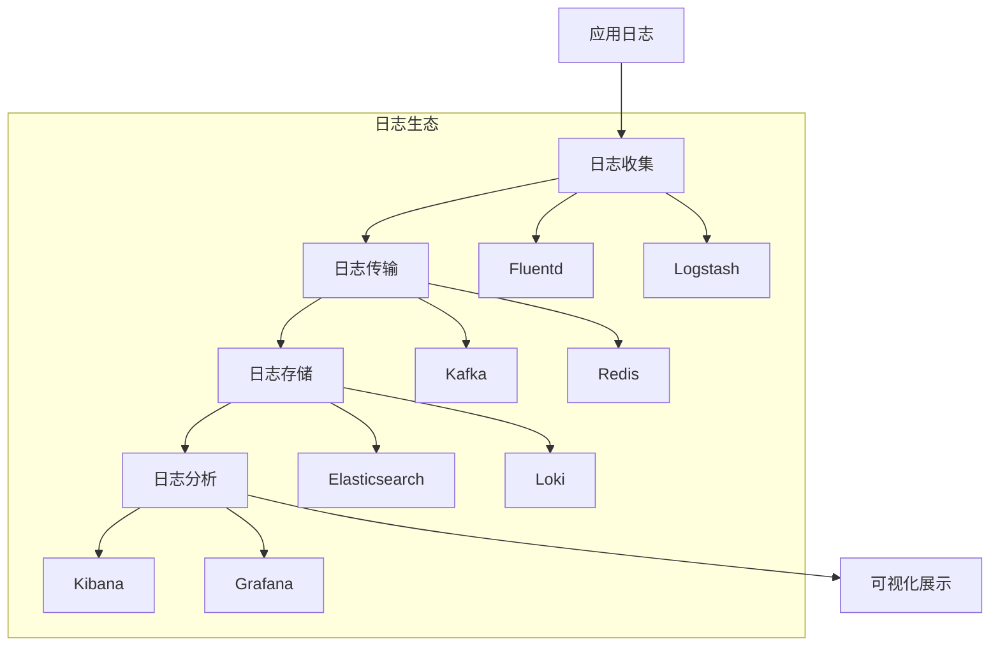

# 日志聚合分析指南

## 概述

日志聚合分析是现代分布式系统中至关重要的可观测性实践。它通过集中收集、存储和分析来自多个服务的日志数据，为系统监控、故障排查和性能优化提供统一视图。

## 核心架构

### 日志处理管道


## 主流技术栈

### 1. ELK/EFK Stack
**最流行的日志解决方案**

```yaml
# Filebeat 配置
filebeat.inputs:
- type: filestream
  paths:
    - /var/log/*.log
  fields:
    service: user-service
    environment: production

output.elasticsearch:
  hosts: ["elasticsearch:9200"]
  indices:
    - index: "logs-%{[fields.environment]}-%{+yyyy.MM.dd}"
```

### 2. Loki Stack (Grafana)
**轻量级日志聚合系统**

```yaml
# Loki 配置
loki:
  schema_config:
    configs:
    - from: 2023-01-01
      store: boltdb-shipper
      object_store: s3
      schema: v11
      index:
        prefix: index_
        period: 24h
```

### 3. Splunk
**企业级日志管理平台**

```bash
# Splunk 转发器配置
[splunkforwarder]
server = splunk-server:9997

[monitor:///var/log/app/*.log]
sourcetype = app_logs
index = main
```

## 日志收集策略

### 结构化日志规范
```java
// 结构化日志示例
import org.slf4j.Logger;
import org.slf4j.LoggerFactory;
import net.logstash.logback.marker.Markers;

public class UserService {
    private static final Logger logger = LoggerFactory.getLogger(UserService.class);
    
    public User getUser(String userId) {
        long startTime = System.currentTimeMillis();
        
        try {
            User user = userRepository.findById(userId);
            
            logger.info(Markers.append("user_id", userId)
                .and(Markers.append("response_time", System.currentTimeMillis() - startTime)),
                "User retrieved successfully");
                
            return user;
        } catch (Exception e) {
            logger.error(Markers.append("user_id", userId)
                .and(Markers.append("error_type", e.getClass().getSimpleName())),
                "Failed to retrieve user", e);
            throw e;
        }
    }
}
```

### 日志格式标准
```json
{
  "timestamp": "2023-01-01T12:00:00.000Z",
  "level": "INFO",
  "service": "user-service",
  "thread": "main",
  "logger": "com.example.UserService",
  "message": "User retrieved successfully",
  "context": {
    "user_id": "12345",
    "response_time": 150,
    "trace_id": "abc123def456",
    "span_id": "789ghi012jkl"
  },
  "environment": "production"
}
```

## 日志传输与缓冲

### Kafka 日志管道
```yaml
# Logstash Kafka 输出
output {
  kafka {
    topic_id => "app-logs"
    bootstrap_servers => "kafka-broker1:9092,kafka-broker2:9092"
    compression_type => "snappy"
    acks => "1"
    codec => json {
      format => "%{message}"
    }
  }
}
```

### Redis 缓冲队列
```yaml
# Redis 输出配置
output {
  redis {
    host => "redis-server"
    port => 6379
    data_type => "list"
    key => "logstash"
    password => "${REDIS_PASSWORD}"
  }
}
```

## 日志存储优化

### Elasticsearch 索引策略
```json
{
  "settings": {
    "number_of_shards": 3,
    "number_of_replicas": 1,
    "index.lifecycle.name": "logs_policy",
    "index.lifecycle.rollover_alias": "logs"
  },
  "mappings": {
    "dynamic_templates": [
      {
        "strings_as_keywords": {
          "match_mapping_type": "string",
          "mapping": {
            "type": "keyword"
          }
        }
      }
    ],
    "properties": {
      "timestamp": { "type": "date" },
      "level": { "type": "keyword" },
      "service": { "type": "keyword" },
      "message": { "type": "text" },
      "context": { "type": "object" }
    }
  }
}
```

### Loki 存储配置
```yaml
# Loki 存储配置
storage_config:
  boltdb_shipper:
    active_index_directory: /loki/index
    cache_location: /loki/cache
    shared_store: s3
  aws:
    s3: s3://logs-bucket/loki
    region: us-west-2
```

## 日志分析查询

### Elasticsearch 查询 DSL
```json
{
  "query": {
    "bool": {
      "must": [
        {
          "range": {
            "timestamp": {
              "gte": "now-1h",
              "lte": "now"
            }
          }
        },
        {
          "term": {
            "level": "ERROR"
          }
        },
        {
          "wildcard": {
            "service": "user-service*"
          }
        }
      ]
    }
  },
  "aggs": {
    "errors_by_service": {
      "terms": {
        "field": "service"
      }
    },
    "error_trend": {
      "date_histogram": {
        "field": "timestamp",
        "calendar_interval": "5m"
      }
    }
  }
}
```

### Loki LogQL 查询
```logql
# 错误日志查询
{service="user-service"} |= "ERROR" | json | response_time > 1000

# 统计查询
sum by (service) (
  rate(
    {environment="production"} |= "ERROR" [5m]
  )
)

# 延迟分析
quantile_over_time(0.95, 
  {service="api-gateway"} | json | unwrap response_time [1h]
)
```

## 监控与告警

### 错误率告警
```yaml
# Prometheus 告警规则
groups:
- name: log_alerts
  rules:
  - alert: HighErrorRate
    expr: >
      sum(rate({environment="production"} |= "ERROR" [5m])) by (service)
      /
      sum(rate({environment="production"}[5m])) by (service)
      > 0.05
    for: 10m
    labels:
      severity: critical
    annotations:
      summary: "High error rate for {{ $labels.service }}"
      description: "Error rate is above 5% for the last 10 minutes"
```

### 性能监控
```logql
# 响应时间监控
{service="user-service"} | json 
  | unwrap response_time 
  | response_time > 500

# 99th percentile 响应时间
quantile_over_time(0.99, 
  {service="user-service"} | json | unwrap response_time [5m]
)
```

## 安全与合规

### 日志脱敏
```java
public class LogSanitizer {
    
    private static final Pattern SENSITIVE_PATTERNS = Pattern.compile(
        "(\"password\"\\s*:\\s*\")([^\"]+)(\")|" +
        "(\"credit_card\"\\s*:\\s*\")([^\"]+)(\")|" +
        "(\"ssn\"\\s*:\\s*\")([^\"]+)(\")",
        Pattern.CASE_INSENSITIVE
    );
    
    public static String sanitize(String logMessage) {
        return SENSITIVE_PATTERNS.matcher(logMessage)
            .replaceAll("$1***$3");
    }
}
```

### 访问控制
```yaml
# Elasticsearch 权限配置
{
  "role": "log_viewer",
  "indices": [
    {
      "names": ["logs-*"],
      "privileges": ["read", "view_index_metadata"]
    }
  ],
  "applications": [
    {
      "application": "kibana-.kibana",
      "privileges": ["read"],
      "resources": ["*"]
    }
  ]
}
```

## 最佳实践

### 日志级别规范
```markdown
| 级别    | 使用场景                          | 示例                                      |
|---------|---------------------------------|-----------------------------------------|
| **ERROR** | 系统错误，需要立即关注            | 数据库连接失败，支付处理失败              |
| **WARN**  | 潜在问题，需要监控                | API响应慢，资源使用率高                  |
| **INFO**  | 重要业务操作                     | 用户注册成功，订单创建完成               |
| **DEBUG** | 调试信息，开发环境使用            | SQL查询语句，方法参数值                  |
| **TRACE** | 详细跟踪信息，性能分析            | 循环迭代次数，内存分配细节               |
```

### 日志采样策略
```yaml
# 采样配置
logging:
  sampling:
    enabled: true
    default: 0.1  # 10%的日志被记录
    overrides:
      - level: ERROR
        rate: 1.0  # 所有错误日志都记录
      - level: DEBUG
        rate: 0.01 # 1%的调试日志
      - service: payment-service
        rate: 0.5   # 50%的支付服务日志
```

## 成本优化

### 日志生命周期管理
```yaml
# Elasticsearch ILM 策略
{
  "policy": {
    "phases": {
      "hot": {
        "min_age": "0ms",
        "actions": {
          "rollover": {
            "max_size": "50gb",
            "max_age": "7d"
          }
        }
      },
      "warm": {
        "min_age": "7d",
        "actions": {
          "shrink": {
            "number_of_shards": 1
          },
          "forcemerge": {
            "max_num_segments": 1
          }
        }
      },
      "delete": {
        "min_age": "30d",
        "actions": {
          "delete": {}
        }
      }
    }
  }
}
```

### 存储格式优化
```yaml
# 压缩配置
{
  "settings": {
    "index.codec": "best_compression",
    "index.store.compress.stored": true,
    "index.store.compress.tv": true
  }
}
```

## 故障排查

### 常见问题解决
```markdown
1. **日志丢失**
   - 检查收集器状态
   - 验证缓冲区配置
   - 监控磁盘空间

2. **查询性能慢**
   - 优化索引策略
   - 调整分片数量
   - 使用缓存查询

3. **存储成本高**
   - 实施日志采样
   - 配置生命周期策略
   - 使用压缩存储
```

### 诊断命令
```bash
# 检查Elasticsearch健康状态
curl -XGET 'elasticsearch:9200/_cluster/health?pretty'

# 查看索引状态
curl -XGET 'elasticsearch:9200/_cat/indices?v'

# 测试日志收集
docker logs -f logstash-container

# 监控队列积压
kafka-consumer-groups --bootstrap-server kafka:9092 --describe --group logstash
```

## 总结

日志聚合分析是现代可观测性体系的核心支柱，正确实施可以：

**核心价值：**
- 集中式日志管理
- 实时故障排查
- 性能监控分析
- 安全合规审计

**实施要点：**
- 统一的日志格式标准
- 可靠的收集传输管道
- 高效的存储查询方案
- 智能的监控告警机制

> 提示：日志系统应该与追踪和指标系统协同工作，形成完整的可观测性解决方案。

***
*相关阅读：./distributed-tracing.md | ./metrics-monitoring.md | ./observability-architecture.md*