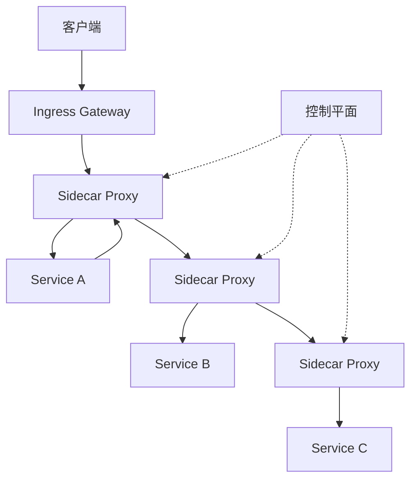

# 服务网格 (Service Mesh)

## 什么是服务网格？

服务网格是一个专门处理服务间通信的基础设施层，它负责在复杂的微服务架构中可靠地交付服务请求。服务网格通常通过一组轻量级网络代理来实现，这些代理与应用程序代码部署在一起，但对应用程序透明。

## 核心架构

### 数据平面 (Data Plane)
**负责处理服务间的实际网络通信。**

```bash
# 数据平面组件
- Sidecar 代理 (Envoy, Linkerd-proxy)
- 服务间通信拦截
- TLS 加密/解密
- 流量控制执行
```

### 控制平面 (Control Plane)
**管理和配置数据平面代理。**

```bash
# 控制平面组件
- 配置管理 (Istiod, Linkerd-control)
- 服务发现
- 证书管理
- 策略执行
```

## 主要功能特性

### 1. 服务发现与负载均衡
```yaml
# Istio DestinationRule 示例
apiVersion: networking.istio.io/v1beta1
kind: DestinationRule
metadata:
  name: product-service
spec:
  host: product-service
  trafficPolicy:
    loadBalancer:
      simple: ROUND_ROBIN
    outlierDetection:
      consecutiveErrors: 5
      interval: 30s
      baseEjectionTime: 30s
```

### 2. 流量管理
```yaml
# 金丝雀发布配置
apiVersion: networking.istio.io/v1beta1
kind: VirtualService
metadata:
  name: reviews
spec:
  hosts:
  - reviews
  http:
  - route:
    - destination:
        host: reviews
        subset: v1
      weight: 90
    - destination:
        host: reviews
        subset: v2
      weight: 10
```

### 3. 安全通信
```yaml
# mTLS 配置
apiVersion: security.istio.io/v1beta1
kind: PeerAuthentication
metadata:
  name: default
spec:
  mtls:
    mode: STRICT
```

### 4. 可观测性
```bash
# 提供的观测数据
- 指标收集 (Metrics): QPS, 延迟, 错误率
- 分布式追踪 (Tracing): 请求链路追踪
- 访问日志 (Logging): 详细的通信日志
```

## 主流服务网格方案

### Istio
**最流行的服务网格，功能丰富**

```markdown
优势：
- 功能全面，生态丰富
- 强大的流量管理能力
- 良好的Kubernetes集成

组件：
- Istiod: 控制平面
- Envoy: 数据平面代理
- Citadel: 安全组件
```

### Linkerd
**轻量级，性能优化**

```markdown
优势：
- 资源消耗低
- 简单易用
- 快速启动

特点：
- Rust编写的轻量级代理
- 专注于核心功能
```

### Consul Service Mesh
**基于Consul的服务网格**

```markdown
优势：
- 与Consul服务发现深度集成
- 多数据中心支持
- 成熟稳定
```

## 部署架构

### Sidecar 模式
```bash
# 典型的Sidecar注入
apiVersion: apps/v1
kind: Deployment
metadata:
  name: product-service
spec:
  template:
    metadata:
      annotations:
        sidecar.istio.io/inject: "true"
    spec:
      containers:
      - name: product-app
        image: product-service:1.0
      # Istio自动注入envoy sidecar
```

### 服务网格架构图


## 核心配置示例

### VirtualService
```yaml
apiVersion: networking.istio.io/v1beta1
kind: VirtualService
metadata:
  name: product-vs
spec:
  hosts:
  - product-service
  - product.example.com
  http:
  - match:
    - uri:
        prefix: /api/products
    route:
    - destination:
        host: product-service
        port:
          number: 8080
```

### DestinationRule
```yaml
apiVersion: networking.istio.io/v1beta1
kind: DestinationRule
metadata:
  name: product-dr
spec:
  host: product-service
  subsets:
  - name: v1
    labels:
      version: v1
  - name: v2
    labels:
      version: v2
  trafficPolicy:
    tls:
      mode: ISTIO_MUTUAL
```

## 高级功能

### 故障注入
```yaml
# 注入HTTP 500错误
http:
- fault:
    abort:
      percentage:
        value: 10.0
      httpStatus: 500
  route:
  - destination:
      host: product-service
```

### 熔断器
```yaml
trafficPolicy:
  connectionPool:
    tcp:
      maxConnections: 100
    http:
      http1MaxPendingRequests: 1024
      maxRequestsPerConnection: 1
  outlierDetection:
    consecutiveErrors: 5
    interval: 30s
    baseEjectionTime: 30s
    maxEjectionPercent: 50
```

### 访问控制
```yaml
apiVersion: security.istio.io/v1beta1
kind: AuthorizationPolicy
metadata:
  name: product-access
spec:
  selector:
    matchLabels:
      app: product-service
  rules:
  - from:
    - source:
        principals: ["cluster.local/ns/default/sa/frontend"]
    to:
    - operation:
        methods: ["GET", "POST"]
        paths: ["/api/products/*"]
```

## 监控与观测

### 指标收集
```bash
# 预置的监控指标
- istio_requests_total
- istio_request_duration_milliseconds
- istio_request_bytes
- istio_response_bytes
```

### 追踪集成
```yaml
# Jaeger追踪配置
tracing:
  sampling: 100
  zipkin:
    address: zipkin.istio-system:9411
```

## 实施考虑

### 何时使用服务网格？
```markdown
✅ 适合场景：
- 大规模的微服务架构
- 需要复杂的流量管理
- 严格的安全要求
- 深度的可观测性需求

❌ 不适合场景：
- 小规模应用（<10个服务）
- 简单的架构需求
- 资源受限的环境
```

### 性能考量
```markdown
资源消耗：
- 每个Pod增加~100MB内存
- 增加~10ms的延迟
- 需要额外的CPU资源

优化建议：
- 调整Sidecar资源限制
- 使用eBPF加速网络
- 合理配置采样率
```

## 最佳实践

### 1. 渐进式采用
```markdown
- 从非关键服务开始
- 逐步启用功能
- 监控性能影响
```

### 2. 安全配置
```markdown
- 默认启用mTLS
- 使用网络策略限制通信
- 定期轮换证书
```

### 3. 监控告警
```markdown
- 设置Sidecar健康检查
- 监控代理资源使用
- 配置有意义的告警
```

## 常见问题解决

### Sidecar 注入失败
```bash
# 检查命名空间标签
kubectl label namespace default istio-injection=enabled

# 验证Webhook配置
kubectl get mutatingwebhookconfiguration
```

### 网络策略冲突
```yaml
# 调整NetworkPolicy
apiVersion: networking.k8s.io/v1
kind: NetworkPolicy
metadata:
  name: allow-istio
spec:
  podSelector: {}
  ingress:
  - from:
    - namespaceSelector:
        matchLabels:
          istio-injection: enabled
```

## 工具生态

### 管理工具
```markdown
- istioctl: Istio命令行工具
- Kiali: 服务网格可视化
- Jaeger: 分布式追踪
- Prometheus: 指标收集
- Grafana: 监控仪表板
```

### 集成扩展
```markdown
- Flagger: 渐进式交付
- OpenPolicyAgent: 策略执行
- SkyWalking: APM集成
```

## 总结

> 重要：服务网格引入了额外的复杂性和资源开销，在决定采用前需要仔细评估实际需求。

**服务网格的价值：**
- 统一处理微服务通信问题
- 提供一致的安全策略
- 增强系统可观测性
- 简化运维复杂度

***
*相关阅读：./istio-deep-dive.md | ./envoy-proxy.md | ./microservice-networking.md*