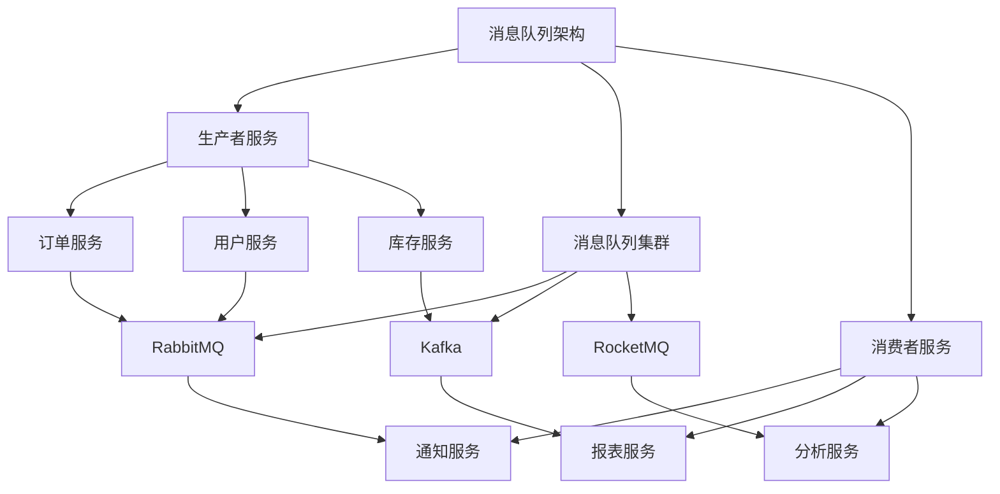

# 微服务消息队列应用指南

## 概述

消息队列在微服务架构中扮演着关键角色，用于实现服务解耦、异步通信、流量削峰和最终一致性。本指南详细介绍如何在微服务中有效使用消息队列。

## 消息队列架构

### 消息队列在微服务中的角色


## 消息模式

### 1. 点对点模式 (Point-to-Point)
```java
// 订单处理示例
@Service
public class OrderProducer {
    
    private final RabbitTemplate rabbitTemplate;
    
    public void createOrder(Order order) {
        // 创建订单
        orderRepository.save(order);
        
        // 发送订单创建消息
        rabbitTemplate.convertAndSend(
            "order.exchange",
            "order.created",
            new OrderCreatedEvent(order.getId(), order.getUserId(), order.getAmount())
        );
    }
}

@Service
public class OrderConsumer {
    
    @RabbitListener(queues = "order.created.queue")
    public void handleOrderCreated(OrderCreatedEvent event) {
        // 处理订单创建逻辑
        inventoryService.deductStock(event.getOrderId());
        notificationService.sendOrderConfirmation(event.getUserId());
    }
}
```

### 2. 发布订阅模式 (Pub/Sub)
```java
// 用户注册示例
@Service
public class UserRegistrationProducer {
    
    private final KafkaTemplate<String, Object> kafkaTemplate;
    
    public void registerUser(User user) {
        userRepository.save(user);
        
        // 发布用户注册事件
        kafkaTemplate.send(
            "user.registered.topic", 
            new UserRegisteredEvent(user.getId(), user.getEmail(), user.getName())
        );
    }
}

@Service
public class EmailServiceConsumer {
    
    @KafkaListener(topics = "user.registered.topic", groupId = "email-service")
    public void sendWelcomeEmail(UserRegisteredEvent event) {
        emailService.sendWelcomeEmail(event.getEmail(), event.getName());
    }
}

@Service
public class AnalyticsConsumer {
    
    @KafkaListener(topics = "user.registered.topic", groupId = "analytics-service")
    public void trackUserRegistration(UserRegisteredEvent event) {
        analyticsService.trackRegistration(event.getUserId());
    }
}
```

## 消息可靠性

### 1. 消息持久化
```java
// RabbitMQ 持久化配置
@Configuration
public class RabbitMQConfig {
    
    @Bean
    public Queue orderQueue() {
        return QueueBuilder.durable("order.created.queue") // 持久化队列
            .withArgument("x-message-ttl", 60000) // 消息TTL
            .withArgument("x-dead-letter-exchange", "dlx.exchange") // 死信交换机
            .withArgument("x-dead-letter-routing-key", "order.dead") // 死信路由键
            .build();
    }
    
    @Bean
    public Exchange orderExchange() {
        return ExchangeBuilder.directExchange("order.exchange")
            .durable(true) // 持久化交换机
            .build();
    }
}

// 发送持久化消息
public void sendPersistentMessage(Order order) {
    Message message = MessageBuilder.withBody(objectMapper.writeValueAsBytes(order))
        .setDeliveryMode(MessageDeliveryMode.PERSISTENT) // 持久化消息
        .setHeader("X-Retry-Count", 0)
        .build();
    
    rabbitTemplate.send("order.exchange", "order.created", message);
}
```

### 2. 生产者确认
```java
// RabbitMQ 生产者确认
@Configuration
public class RabbitMQProducerConfig {
    
    @Bean
    public RabbitTemplate rabbitTemplate(ConnectionFactory connectionFactory) {
        RabbitTemplate template = new RabbitTemplate(connectionFactory);
        template.setConfirmCallback((correlationData, ack, cause) -> {
            if (ack) {
                log.info("Message confirmed: {}", correlationData.getId());
            } else {
                log.error("Message failed: {}, cause: {}", correlationData.getId(), cause);
                // 重试逻辑
                retryService.scheduleRetry(correlationData);
            }
        });
        return template;
    }
}

// Kafka 生产者确认
@Configuration
public class KafkaProducerConfig {
    
    @Bean
    public ProducerFactory<String, Object> producerFactory() {
        Map<String, Object> config = new HashMap<>();
        config.put(ProducerConfig.ACKS_CONFIG, "all"); // 所有副本确认
        config.put(ProducerConfig.RETRIES_CONFIG, 3);
        config.put(ProducerConfig.ENABLE_IDEMPOTENCE_CONFIG, true);
        return new DefaultKafkaProducerFactory<>(config);
    }
}
```

### 3. 消费者确认
```java
// RabbitMQ 手动确认
@Service
public class ReliableConsumer {
    
    @RabbitListener(queues = "order.queue")
    public void handleOrder(Order order, Channel channel, Message message) throws IOException {
        try {
            // 处理业务逻辑
            processOrder(order);
            
            // 手动确认消息
            channel.basicAck(message.getMessageProperties().getDeliveryTag(), false);
        } catch (Exception e) {
            log.error("Order processing failed", e);
            
            // 判断是否需要重试
            if (shouldRetry(message)) {
                // 拒绝消息并重新入队
                channel.basicNack(
                    message.getMessageProperties().getDeliveryTag(), 
                    false, 
                    true
                );
            } else {
                // 拒绝消息并进入死信队列
                channel.basicNack(
                    message.getMessageProperties().getDeliveryTag(), 
                    false, 
                    false
                );
            }
        }
    }
    
    private boolean shouldRetry(Message message) {
        Integer retryCount = (Integer) message.getMessageProperties().getHeaders().get("X-Retry-Count");
        return retryCount == null || retryCount < 3;
    }
}
```

## 消息顺序性

### 1. 顺序消息处理
```java
// Kafka 顺序消息
public class OrderedMessageProducer {
    
    public void sendOrderedMessage(String orderId, OrderEvent event) {
        // 使用订单ID作为key确保顺序性
        kafkaTemplate.send(
            "order.events.topic",
            orderId, // 相同的key会发送到同一个分区
            event
        );
    }
}

@Service
public class OrderedMessageConsumer {
    
    @KafkaListener(
        topics = "order.events.topic",
        groupId = "order-service",
        concurrency = "1" // 单个消费者确保顺序处理
    )
    public void handleOrderEvent(OrderEvent event) {
        // 顺序处理逻辑
        orderStateMachine.processEvent(event);
    }
}
```

## 消息幂等性

### 1. 幂等消费者实现
```java
@Service
public class IdempotentConsumer {
    
    private final MessageIdStore messageIdStore;
    
    @KafkaListener(topics = "payment.events.topic")
    public void handlePaymentEvent(PaymentEvent event) {
        String messageId = event.getMessageId();
        
        // 检查消息是否已处理
        if (messageIdStore.isMessageProcessed(messageId)) {
            log.info("Message already processed: {}", messageId);
            return;
        }
        
        try {
            // 处理支付逻辑
            paymentService.processPayment(event);
            
            // 记录已处理的消息ID
            messageIdStore.markAsProcessed(messageId);
        } catch (Exception e) {
            log.error("Payment processing failed", e);
            throw e;
        }
    }
}

// 幂等存储实现
@Component
public class RedisMessageIdStore implements MessageIdStore {
    
    private final RedisTemplate<String, String> redisTemplate;
    private static final String KEY_PREFIX = "message:id:";
    private static final long TTL = 24 * 60 * 60; // 24小时
    
    @Override
    public boolean isMessageProcessed(String messageId) {
        return Boolean.TRUE.equals(
            redisTemplate.hasKey(KEY_PREFIX + messageId)
        );
    }
    
    @Override
    public void markAsProcessed(String messageId) {
        redisTemplate.opsForValue().set(
            KEY_PREFIX + messageId,
            "processed",
            TTL,
            TimeUnit.SECONDS
        );
    }
}
```

## 死信队列

### 1. 死信处理机制
```java
// 死信队列配置
@Configuration
public class DLQConfig {
    
    @Bean
    public Queue dlq() {
        return QueueBuilder.durable("order.dlq")
            .withArgument("x-message-ttl", 86400000) // 24小时
            .build();
    }
    
    @Bean
    public Exchange dlx() {
        return ExchangeBuilder.directExchange("dlx.exchange")
            .durable(true)
            .build();
    }
    
    @Bean
    public Binding dlqBinding() {
        return BindingBuilder.bind(dlq())
            .to(dlx())
            .with("order.dead")
            .noargs();
    }
}

// 死信消息处理
@Service
public class DLQConsumer {
    
    @RabbitListener(queues = "order.dlq")
    public void handleDeadLetter(Order order, Message message) {
        log.warn("Received dead letter: {}", message.getMessageProperties().getHeaders());
        
        // 发送告警
        alertService.sendAlert(
            "DLQ Alert", 
            "Message failed after retries: " + order.getId()
        );
        
        // 记录到数据库
        deadMessageRepository.save(
            new DeadMessage(order, message.getMessageProperties().getHeaders())
        );
    }
}
```

## 流量削峰

### 1. 消息缓冲设计
```java
// 流量削峰生产者
@Service
public class TrafficShapingProducer {
    
    private final RateLimiter rateLimiter;
    private final KafkaTemplate<String, Object> kafkaTemplate;
    
    public TrafficShapingProducer() {
        this.rateLimiter = RateLimiter.create(1000); // 1000消息/秒
    }
    
    public void sendWithRateLimit(Order order) {
        // 获取令牌，阻塞直到可用
        rateLimiter.acquire();
        
        kafkaTemplate.send(
            "order.requests.topic",
            new OrderRequest(order)
        );
    }
}

// 批量消费者
@Service
public class BatchConsumer {
    
    @KafkaListener(
        topics = "order.requests.topic",
        groupId = "order-processor",
        containerFactory = "batchFactory"
    )
    public void handleBatch(List<ConsumerRecord<String, OrderRequest>> records) {
        List<OrderRequest> orders = records.stream()
            .map(ConsumerRecord::value)
            .collect(Collectors.toList());
        
        // 批量处理订单
        orderService.processBatch(orders);
    }
}

// 批量监听器配置
@Configuration
public class KafkaBatchConfig {
    
    @Bean
    public ConcurrentKafkaListenerContainerFactory<String, Object> batchFactory() {
        ConcurrentKafkaListenerContainerFactory<String, Object> factory = 
            new ConcurrentKafkaListenerContainerFactory<>();
        factory.setConsumerFactory(consumerFactory());
        factory.setBatchListener(true); // 启用批量监听
        factory.getContainerProperties().setPollTimeout(3000);
        return factory;
    }
}
```

## 消息事务

### 1. 事务消息处理
```java
// 本地事务消息
@Service
@Transactional
public class TransactionalMessageService {
    
    private final RabbitTemplate rabbitTemplate;
    private final UserRepository userRepository;
    
    public void registerUser(User user) {
        // 1. 保存用户到数据库
        userRepository.save(user);
        
        // 2. 发送消息（在同一个事务中）
        rabbitTemplate.convertAndSend(
            "user.exchange",
            "user.registered",
            new UserRegisteredEvent(user.getId(), user.getEmail())
        );
        
        // 如果事务回滚，消息也不会发送
    }
}

// 分布式事务（TCC模式）
@Service
public class DistributedTransactionService {
    
    @Transactional
    public void createOrder(Order order) {
        // 阶段1：Try - 预留资源
        inventoryService.freezeStock(order.getItems());
        orderRepository.save(order);
        
        // 发送预备消息
        messageService.sendPrepareMessage(
            "order.create.prepare", 
            order
        );
    }
    
    @Transactional
    public void confirmOrder(Long orderId) {
        // 阶段2：Confirm - 确认操作
        inventoryService.deductStock(orderId);
        orderRepository.updateStatus(orderId, "CONFIRMED");
        
        // 发送确认消息
        messageService.sendConfirmMessage(
            "order.create.confirm", 
            orderId
        );
    }
    
    @Transactional
    public void cancelOrder(Long orderId) {
        // 阶段3：Cancel - 取消操作
        inventoryService.releaseStock(orderId);
        orderRepository.updateStatus(orderId, "CANCELLED");
        
        // 发送取消消息
        messageService.sendCancelMessage(
            "order.create.cancel", 
            orderId
        );
    }
}
```

## 监控告警

### 1. 消息队列监控
```java
// 监控指标收集
@Component
public class MessageQueueMetrics {
    
    private final MeterRegistry meterRegistry;
    
    public void recordMessageProduced(String topic, long size) {
        meterRegistry.counter("message.produced", "topic", topic).increment();
        meterRegistry.summary("message.size", "topic", topic).record(size);
    }
    
    public void recordMessageConsumed(String topic, long duration) {
        meterRegistry.counter("message.consumed", "topic", topic).increment();
        meterRegistry.timer("message.process.time", "topic", topic).record(duration, TimeUnit.MILLISECONDS);
    }
    
    public void recordConsumerLag(String group, String topic, long lag) {
        meterRegistry.gauge("consumer.lag", Tags.of("group", group, "topic", topic), lag);
    }
}

// 健康检查
@Component
public class MessageQueueHealth implements HealthIndicator {
    
    private final RabbitTemplate rabbitTemplate;
    
    @Override
    public Health health() {
        try {
            // 检查RabbitMQ连接
            rabbitTemplate.execute(channel -> {
                channel.queueDeclarePassive("health.check");
                return null;
            });
            return Health.up().build();
        } catch (Exception e) {
            return Health.down()
                .withDetail("error", e.getMessage())
                .build();
        }
    }
}
```

### 2. 告警配置
```yaml
# Prometheus告警规则
groups:
- name: message-queue-alerts
  rules:
  - alert: HighConsumerLag
    expr: message_queue_consumer_lag > 1000
    for: 5m
    labels:
      severity: warning
    annotations:
      summary: "高消费者延迟"
      description: "消费者组 {{ $labels.group }} 在主题 {{ $labels.topic }} 上的延迟超过1000条消息"
  
  - alert: MessageProcessingErrorRate
    expr: rate(message_processing_errors_total[5m]) > 0.1
    for: 2m
    labels:
      severity: critical
    annotations:
      summary: "高消息处理错误率"
      description: "消息处理错误率超过10%"
  
  - alert: QueueMemoryUsage
    expr: rabbitmq_queue_memory > 1000000000
    for: 10m
    labels:
      severity: warning
    annotations:
      summary: "队列内存使用过高"
      description: "队列 {{ $labels.queue }} 内存使用超过1GB"
```

## 最佳实践

### 1. 消息设计规范
```java
// 消息契约定义
public abstract class BaseMessage {
    private String messageId;
    private String messageType;
    private Long timestamp;
    private String sourceService;
    private Integer version = 1;
    
    // 消息ID生成
    protected String generateMessageId() {
        return UUID.randomUUID().toString();
    }
}

// 具体消息实现
public class OrderCreatedEvent extends BaseMessage {
    private Long orderId;
    private Long userId;
    private BigDecimal amount;
    private List<OrderItem> items;
    
    public OrderCreatedEvent() {
        this.messageId = generateMessageId();
        this.messageType = "OrderCreated";
        this.timestamp = System.currentTimeMillis();
        this.sourceService = "order-service";
    }
}

// 消息版本兼容性
public class MessageVersionHandler {
    
    public BaseMessage handleMessageCompatibility(BaseMessage message) {
        if (message.getVersion() == 1) {
            return convertV1ToV2(message);
        }
        return message;
    }
    
    private BaseMessage convertV1ToV2(BaseMessage v1Message) {
        // 版本转换逻辑
        OrderCreatedEventV2 v2Event = new OrderCreatedEventV2();
        // 字段映射...
        return v2Event;
    }
}
```

### 2. 错误处理策略
```java
// 重试策略配置
@Configuration
public class RetryConfig {
    
    @Bean
    public RetryTopic retryTopic() {
        return RetryTopic.builder()
            .maxAttempts(3)
            .timeToLive(Duration.ofMinutes(10))
            .backOffPolicy(BackOffPolicy.EXPONENTIAL)
            .dltTopic("order.events.dlt")
            .includeTopics(Set.of("order.events.topic"))
            .create();
    }
}

// 错误处理器
@Service
public class MessageErrorHandler {
    
    public void handleError(Message<?> message, Throwable exception) {
        log.error("Message processing failed: {}", message.getPayload(), exception);
        
        // 根据异常类型选择处理策略
        if (exception instanceof TemporaryException) {
            // 临时异常，重试
            throw new AmqpRejectAndDontRequeueException("Temporary failure", exception);
        } else if (exception instanceof BusinessException) {
            // 业务异常，进入死信队列
            throw new AmqpRejectAndDontRequeueException("Business rule violation", exception);
        } else {
            // 系统异常，重试有限次数后进入死信队列
            throw new ListenerExecutionFailedException("System error", exception);
        }
    }
}
```

## 总结

消息队列在微服务架构中至关重要：

**核心价值：**
- 服务解耦和异步通信
- 流量削峰和系统缓冲
- 最终一致性保证
- 故障隔离和恢复

**实施建议：**
- 根据业务场景选择合适的消息模式
- 实现完整的消息可靠性保障
- 设计幂等和顺序消息处理
- 建立完善的监控和告警体系

> 提示：消息队列会增加系统复杂度，建议根据实际需求选择合适的功能和配置。

***
*相关阅读：./microservice-architecture.md | ./distributed-transactions.md | ./system-fault-tolerance.md*