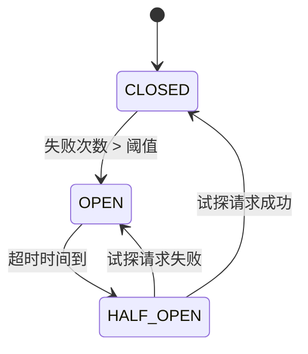

# 熔断器模式 (Circuit Breaker Pattern)

## 概述

熔断器模式是一种用于构建容错和弹性的分布式系统的设计模式。它通过监控服务调用的失败率，在达到阈值时自动"跳闸"，防止级联故障，给系统恢复的时间。

## 核心概念

### 熔断器三种状态


### 状态转换机制
```markdown
1. **闭合状态 (CLOSED)**: 正常处理请求，监控失败率
2. **断开状态 (OPEN)**: 拒绝所有请求，直接失败
3. **半开状态 (HALF_OPEN)**: 允许少量试探请求，测试服务恢复情况
```

## 主流实现方案

### 1. Resilience4j (Java)
**轻量级容错库**

```java
// 熔断器配置
CircuitBreakerConfig config = CircuitBreakerConfig.custom()
    .failureRateThreshold(50) // 失败率阈值50%
    .slidingWindowType(SlidingWindowType.COUNT_BASED) // 基于计数的滑动窗口
    .slidingWindowSize(10) // 窗口大小10个请求
    .minimumNumberOfCalls(5) // 最少5次调用才开始计算
    .waitDurationInOpenState(Duration.ofSeconds(30)) // 开放状态等待30秒
    .permittedNumberOfCallsInHalfOpenState(3) // 半开状态允许3个请求
    .recordExceptions(IOException.class, TimeoutException.class) // 记录哪些异常
    .ignoreExceptions(BusinessException.class) // 忽略哪些异常
    .build();

// 创建熔断器
CircuitBreaker circuitBreaker = CircuitBreaker.of("backendService", config);

// 使用熔断器
String result = circuitBreaker.executeSupplier(() -> {
    // 调用外部服务
    return backendService.call();
});
```

### 2. Hystrix (Netflix)
**成熟的容错库（已进入维护模式）**

```java
// Hystrix 命令配置
@HystrixCommand(
    fallbackMethod = "fallbackMethod",
    commandProperties = {
        @HystrixProperty(name = "circuitBreaker.requestVolumeThreshold", value = "20"),
        @HitzrixProperty(name = "circuitBreaker.errorThresholdPercentage", value = "50"),
        @HystrixProperty(name = "circuitBreaker.sleepWindowInMilliseconds", value = "5000"),
        @HystrixProperty(name = "execution.isolation.thread.timeoutInMilliseconds", value = "1000")
    }
)
public String backendCall() {
    return backendService.call();
}

public String fallbackMethod() {
    return "Fallback response";
}
```

### 3. Envoy Proxy
**网络层熔断**

```yaml
# Envoy 熔断配置
clusters:
- name: backend_service
  connect_timeout: 0.25s
  circuit_breakers:
    thresholds:
      - priority: DEFAULT
        max_connections: 1000  # 最大连接数
        max_pending_requests: 1000  # 最大等待请求数
        max_requests: 500  # 最大并发请求数
        max_retries: 3  # 最大重试次数
  outlier_detection:
    consecutive_5xx: 5  # 连续5xx错误次数
    interval: 30s  # 检测间隔
    base_ejection_time: 30s  # 基本驱逐时间
    max_ejection_percent: 50  # 最大驱逐百分比
```

## 核心配置参数

### 熔断器配置详解
```java
public class CircuitBreakerConfiguration {
    // 失败率阈值 (百分比)
    private int failureRateThreshold = 50;
    
    // 滑动窗口配置
    private int slidingWindowSize = 100; // 窗口大小
    private SlidingWindowType slidingWindowType = SlidingWindowType.COUNT_BASED;
    
    // 最小调用次数
    private int minimumNumberOfCalls = 10;
    
    // 开放状态等待时间
    private Duration waitDurationInOpenState = Duration.ofSeconds(60);
    
    // 半开状态允许的请求数
    private int permittedNumberOfCallsInHalfOpenState = 10;
    
    // 慢调用阈值
    private Duration slowCallDurationThreshold = Duration.ofSeconds(2);
    private int slowCallRateThreshold = 100;
    
    // 记录/忽略的异常类型
    private Class<? extends Throwable>[] recordExceptions;
    private Class<? extends Throwable>[] ignoreExceptions;
}
```

## 实践实现

### 基础熔断器实现
```java
public class SimpleCircuitBreaker {
    private enum State { CLOSED, OPEN, HALF_OPEN }
    
    private State state = State.CLOSED;
    private int failureCount = 0;
    private int successCount = 0;
    private final int failureThreshold;
    private final long resetTimeout;
    private long lastFailureTime;
    private final int halfOpenSuccessThreshold;
    
    public SimpleCircuitBreaker(int failureThreshold, long resetTimeout, int halfOpenSuccessThreshold) {
        this.failureThreshold = failureThreshold;
        this.resetTimeout = resetTimeout;
        this.halfOpenSuccessThreshold = halfOpenSuccessThreshold;
    }
    
    public <T> T execute(Callable<T> callable) throws Exception {
        if (state == State.OPEN) {
            if (System.currentTimeMillis() - lastFailureTime > resetTimeout) {
                state = State.HALF_OPEN;
                successCount = 0;
            } else {
                throw new CircuitBreakerOpenException("Circuit breaker is open");
            }
        }
        
        try {
            T result = callable.call();
            onSuccess();
            return result;
        } catch (Exception e) {
            onFailure();
            throw e;
        }
    }
    
    private void onSuccess() {
        if (state == State.HALF_OPEN) {
            successCount++;
            if (successCount >= halfOpenSuccessThreshold) {
                state = State.CLOSED;
                failureCount = 0;
            }
        }
    }
    
    private void onFailure() {
        failureCount++;
        lastFailureTime = System.currentTimeMillis();
        
        if (state == State.HALF_OPEN || failureCount >= failureThreshold) {
            state = State.OPEN;
        }
    }
}
```

### 高级熔断器 with Metrics
```java
public class AdvancedCircuitBreaker {
    private final RingBuffer<Boolean> resultBuffer;
    private final int windowSize;
    private State state = State.CLOSED;
    private long openedTime;
    private final long resetTimeout;
    
    public AdvancedCircuitBreaker(int windowSize, long resetTimeout) {
        this.windowSize = windowSize;
        this.resetTimeout = resetTimeout;
        this.resultBuffer = new RingBuffer<>(windowSize);
    }
    
    public boolean allowRequest() {
        switch (state) {
            case CLOSED:
                return true;
            case OPEN:
                if (System.currentTimeMillis() - openedTime > resetTimeout) {
                    state = State.HALF_OPEN;
                    return true; // 允许试探请求
                }
                return false;
            case HALF_OPEN:
                return false; // 只允许一个试探请求
            default:
                return false;
        }
    }
    
    public void recordSuccess() {
        resultBuffer.add(true);
        updateState();
    }
    
    public void recordFailure() {
        resultBuffer.add(false);
        updateState();
    }
    
    private void updateState() {
        if (resultBuffer.size() < windowSize) {
            return;
        }
        
        long failures = resultBuffer.stream().filter(success -> !success).count();
        double failureRate = (double) failures / windowSize;
        
        if (state == State.CLOSED && failureRate > 0.5) {
            state = State.OPEN;
            openedTime = System.currentTimeMillis();
        } else if (state == State.HALF_OPEN) {
            // 半开状态下根据试探结果决定
            state = State.CLOSED;
        }
    }
}
```

## 集成模式

### Spring Boot 集成
```java
@Configuration
public class CircuitBreakerConfig {
    
    @Bean
    public CircuitBreakerConfig customCircuitBreakerConfig() {
        return CircuitBreakerConfig.custom()
            .failureRateThreshold(50)
            .slidingWindowSize(10)
            .waitDurationInOpenState(Duration.ofSeconds(30))
            .build();
    }
    
    @Bean
    public CircuitBreakerRegistry circuitBreakerRegistry() {
        return CircuitBreakerRegistry.of(customCircuitBreakerConfig());
    }
}

@Service
public class BackendService {
    
    private final CircuitBreaker circuitBreaker;
    
    public BackendService(CircuitBreakerRegistry registry) {
        this.circuitBreaker = registry.circuitBreaker("backendService");
    }
    
    @CircuitBreaker(name = "backendService", fallbackMethod = "fallback")
    public String callExternalService() {
        // 调用外部服务
        return externalService.call();
    }
    
    private String fallback(Throwable t) {
        return "Fallback response due to: " + t.getMessage();
    }
}
```

### 微服务架构集成
```java
public class ServiceClient {
    private final CircuitBreaker circuitBreaker;
    private final HttpClient httpClient;
    
    public ServiceClient(CircuitBreaker circuitBreaker) {
        this.circuitBreaker = circuitBreaker;
        this.httpClient = HttpClient.newBuilder()
            .connectTimeout(Duration.ofSeconds(2))
            .build();
    }
    
    public String callService(String url) {
        return circuitBreaker.executeSupplier(() -> {
            HttpRequest request = HttpRequest.newBuilder()
                .uri(URI.create(url))
                .timeout(Duration.ofSeconds(5))
                .build();
                
            HttpResponse<String> response = httpClient.send(
                request, HttpResponse.BodyHandlers.ofString());
                
            if (response.statusCode() >= 500) {
                throw new ServiceException("Server error: " + response.statusCode());
            }
            
            return response.body();
        });
    }
}
```

## 监控和指标

### Micrometer 指标集成
```java
public class MonitoredCircuitBreaker {
    private final CircuitBreaker circuitBreaker;
    private final MeterRegistry meterRegistry;
    
    public MonitoredCircuitBreaker(String name, CircuitBreakerConfig config, MeterRegistry registry) {
        this.circuitBreaker = CircuitBreaker.of(name, config);
        this.meterRegistry = registry;
        registerMetrics();
    }
    
    private void registerMetrics() {
        Gauge.builder("circuit_breaker.state", circuitBreaker, cb -> {
            switch (cb.getState()) {
                case CLOSED: return 0;
                case OPEN: return 1;
                case HALF_OPEN: return 2;
                default: return -1;
            }
        }).register(meterRegistry);
        
        Gauge.builder("circuit_breaker.failure_rate", circuitBreaker, 
            cb -> cb.getMetrics().getFailureRate())
            .register(meterRegistry);
    }
}
```

### Prometheus 监控配置
```yaml
# Prometheus 监控规则
groups:
- name: circuit_breaker_alerts
  rules:
  - alert: CircuitBreakerOpen
    expr: circuit_breaker_state == 1
    for: 5m
    labels:
      severity: warning
    annotations:
      summary: "Circuit breaker is open for {{ $labels.name }}"
      
  - alert: HighFailureRate
    expr: circuit_breaker_failure_rate > 0.3
    for: 2m
    labels:
      severity: warning
    annotations:
      summary: "High failure rate for {{ $labels.name }}"
```

## 高级特性

### 慢调用熔断
```java
CircuitBreakerConfig config = CircuitBreakerConfig.custom()
    .slowCallRateThreshold(50) // 慢调用率阈值50%
    .slowCallDurationThreshold(Duration.ofSeconds(2)) // 2秒以上为慢调用
    .build();
```

### 自适应熔断
```java
public class AdaptiveCircuitBreaker {
    private double failureRateThreshold = 50.0;
    private final double learningRate = 0.1;
    
    public void adjustThresholdBasedOnLoad(double currentLoad) {
        // 根据系统负载动态调整阈值
        if (currentLoad > 0.8) {
            failureRateThreshold = Math.min(70.0, failureRateThreshold + 5.0);
        } else {
            failureRateThreshold = Math.max(30.0, failureRateThreshold - 2.0);
        }
    }
}
```

### 熔断器组
```java
public class CircuitBreakerGroup {
    private final Map<String, CircuitBreaker> breakers = new ConcurrentHashMap<>();
    
    public CircuitBreaker getBreaker(String serviceName) {
        return breakers.computeIfAbsent(serviceName, name -> 
            CircuitBreaker.of(name, defaultConfig()));
    }
    
    public void updateAllConfigs(CircuitBreakerConfig newConfig) {
        breakers.values().forEach(breaker -> breaker.changeConfig(newConfig));
    }
}
```

## 测试策略

### 单元测试
```java
class CircuitBreakerTest {
    
    @Test
    void shouldTripWhenFailureThresholdExceeded() {
        CircuitBreaker breaker = new SimpleCircuitBreaker(3, 1000, 1);
        
        // 前两次失败
        executeWithFailure(breaker);
        executeWithFailure(breaker);
        assertFalse(breaker.isOpen());
        
        // 第三次失败触发熔断
        executeWithFailure(breaker);
        assertTrue(breaker.isOpen());
    }
    
    @Test
    void shouldAllowTestRequestAfterTimeout() throws InterruptedException {
        CircuitBreaker breaker = new SimpleCircuitBreaker(1, 100, 1);
        executeWithFailure(breaker); // 触发熔断
        
        Thread.sleep(150); // 等待超时
        
        assertTrue(breaker.allowRequest()); // 应该允许试探请求
    }
    
    private void executeWithFailure(CircuitBreaker breaker) {
        try {
            breaker.execute(() -> { throw new RuntimeException("Failure"); });
        } catch (Exception e) {
            // 预期失败
        }
    }
}
```

### 集成测试
```java
@SpringBootTest
class CircuitBreakerIntegrationTest {
    
    @Autowired
    private BackendService backendService;
    
    @MockBean
    private ExternalService externalService;
    
    @Test
    void shouldUseFallbackWhenServiceFails() {
        when(externalService.call()).thenThrow(new RuntimeException("Service unavailable"));
        
        String result = backendService.callExternalService();
        
        assertEquals("Fallback response", result);
        verify(externalService, times(1)).call();
    }
}
```

## 最佳实践

### 配置建议
```yaml
circuitbreaker:
  # 生产环境配置
  production:
    failureRateThreshold: 50
    slidingWindowSize: 100
    minimumNumberOfCalls: 20
    waitDurationInOpenState: 30s
    permittedNumberOfCallsInHalfOpenState: 5
  
  # 开发环境配置  
  development:
    failureRateThreshold: 80
    slidingWindowSize: 10
    waitDurationInOpenState: 10s
  
  # 关键服务配置
  critical:
    failureRateThreshold: 30
    waitDurationInOpenState: 10s
```

### 熔断策略选择
```markdown
| 场景                | 推荐配置                           | 说明                          |
|---------------------|----------------------------------|-----------------------------|
| **关键服务**         | 低失败率阈值(30%)，短超时(10s)     | 快速失败，及时恢复            |
| **非关键服务**       | 高失败率阈值(70%)，长超时(60s)     | 容忍更高失败率，减少误熔断     |
| **高并发服务**       | 大窗口大小(100+)，基于时间窗口      | 更准确的失败率统计            |
| **低流量服务**       | 小窗口大小(10)，低最小调用数(5)     | 即使请求少也能及时熔断         |
```

## 故障排查

### 常见问题解决
```markdown
1. **频繁误熔断**
   - 调整失败率阈值
   - 增加滑动窗口大小
   - 检查健康检查逻辑

2. **熔断后不恢复**
   - 检查超时时间配置
   - 验证试探请求逻辑
   - 监控后端服务状态

3. **性能开销大**
   - 优化指标收集
   - 调整监控频率
   - 使用更高效的算法
```

### 监控指标分析
```bash
# 查看熔断器状态
curl http://localhost:8080/actuator/health

# 查看详细指标
curl http://localhost:8080/actuator/metrics/circuitbreaker.calls

# 熔断器调试信息
curl http://localhost:8080/actuator/circuitbreakers
```

## 总结

熔断器模式是构建弹性分布式系统的关键组件，正确实施可以：

**核心价值：**
- 防止级联故障
- 提供优雅降级
- 增强系统韧性
- 改善用户体验

**实施要点：**
- 合理的配置参数
- 完善的监控告警
- 适当的降级策略
- 定期的演练测试

> 提示：熔断器不是万能的，需要与其他容错模式（重试、超时、降级）结合使用。

***
*相关阅读：./microservice-resilience-patterns.md | ./distributed-system-monitoring.md | ./system-resilience-design.md*