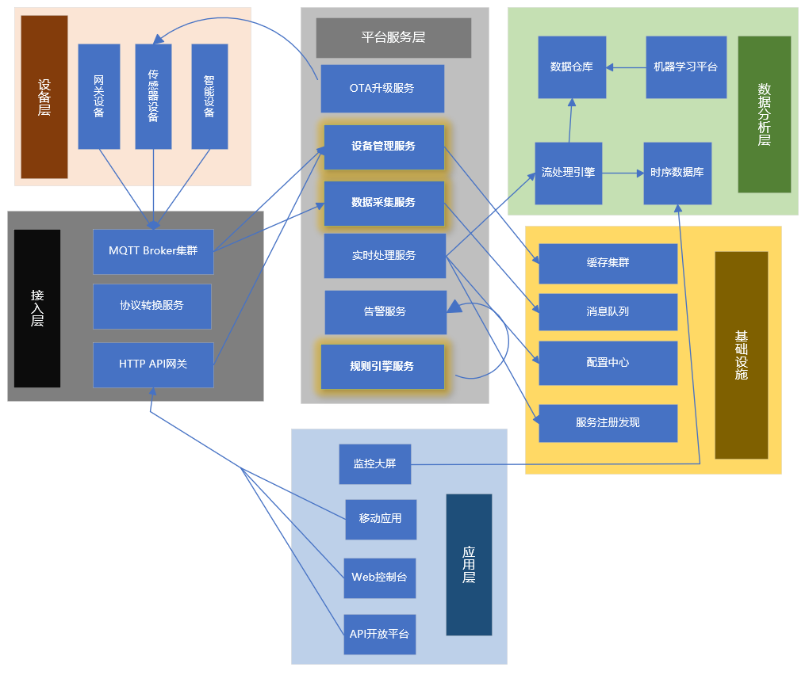

# 物联网平台架构实践

## 概述

物联网平台连接物理世界和数字世界，处理海量设备连接、数据采集、实时分析和设备管理。微服务架构为物联网平台提供了可扩展、高可用的技术基础。

## 架构全景

### 物联网平台架构



## 核心服务设计

### 1. 设备接入服务 (Device Connectivity Service)
**设备连接管理和协议处理**

```java
@Service
public class DeviceConnectivityServiceImpl implements DeviceConnectivityService {
    
    @Autowired
    private MqttMessageHandler mqttHandler;
    
    @Autowired
    private DeviceRegistry deviceRegistry;
    
    @Autowired
    private MessageQueueService messageQueue;
    
    @Override
    public void handleDeviceConnect(String deviceId, String clientId) {
        // 验证设备身份
        Device device = deviceRegistry.getDevice(deviceId);
        if (device == null || !device.isActive()) {
            throw new DeviceAuthenticationException("设备未注册或已禁用");
        }
        
        // 更新设备在线状态
        deviceRegistry.updateDeviceStatus(deviceId, DeviceStatus.ONLINE);
        
        // 记录连接日志
        auditService.logDeviceConnection(deviceId, clientId, "CONNECT");
    }
    
    @Override
    public void handleDeviceDisconnect(String deviceId, String clientId) {
        // 更新设备离线状态
        deviceRegistry.updateDeviceStatus(deviceId, DeviceStatus.OFFLINE);
        
        // 记录断开日志
        auditService.logDeviceConnection(deviceId, clientId, "DISCONNECT");
    }
    
    @Override
    public void processDeviceMessage(String topic, MqttMessage message) {
        try {
            // 解析设备消息
            DeviceMessage deviceMessage = parseMessage(topic, message);
            
            // 验证消息格式和设备权限
            validateMessage(deviceMessage);
            
            // 转发到消息队列
            messageQueue.publishDeviceData(deviceMessage);
            
            // 更新设备最后活跃时间
            deviceRegistry.updateLastActiveTime(deviceMessage.getDeviceId());
            
        } catch (InvalidMessageException e) {
            log.warn("无效的设备消息: {}", e.getMessage());
            metrics.recordInvalidMessage();
        }
    }
    
    private DeviceMessage parseMessage(String topic, MqttMessage message) {
        // 根据topic解析设备ID和数据
        String[] parts = topic.split("/");
        if (parts.length < 3) {
            throw new InvalidMessageException("无效的topic格式: " + topic);
        }
        
        String deviceId = parts[1];
        String messageType = parts[2];
        
        DeviceMessage deviceMessage = new DeviceMessage();
        deviceMessage.setDeviceId(deviceId);
        deviceMessage.setMessageType(messageType);
        deviceMessage.setPayload(new String(message.getPayload(), StandardCharsets.UTF_8));
        deviceMessage.setTimestamp(System.currentTimeMillis());
        deviceMessage.setQos(message.getQos());
        
        return deviceMessage;
    }
}
```

### 2. 设备管理服务 (Device Management Service)
**设备生命周期管理**

```java
@Service
public class DeviceManagementServiceImpl implements DeviceManagementService {
    
    @Autowired
    private DeviceRepository deviceRepository;
    
    @Autowired
    private DeviceShadowService deviceShadowService;
    
    @Override
    public Device registerDevice(DeviceRegistrationRequest request) {
        // 生成设备唯一标识
        String deviceId = generateDeviceId(request.getProductKey());
        
        // 创建设备记录
        Device device = new Device();
        device.setDeviceId(deviceId);
        device.setProductKey(request.getProductKey());
        device.setDeviceName(request.getDeviceName());
        device.setDeviceSecret(generateDeviceSecret());
        device.setStatus(DeviceStatus.INACTIVE);
        device.setCreateTime(new Date());
        device.setLastUpdateTime(new Date());
        
        // 保存设备信息
        Device savedDevice = deviceRepository.save(device);
        
        // 创建设备影子
        deviceShadowService.createDeviceShadow(deviceId);
        
        // 记录审计日志
        auditService.logDeviceOperation("REGISTER", deviceId, null);
        
        return savedDevice;
    }
    
    @Override
    public void activateDevice(String deviceId) {
        Device device = deviceRepository.findByDeviceId(deviceId)
                .orElseThrow(() -> new DeviceNotFoundException("设备不存在"));
        
        if (device.getStatus() != DeviceStatus.INACTIVE) {
            throw new DeviceOperationException("设备状态异常");
        }
        
        device.setStatus(DeviceStatus.ACTIVE);
        device.setActivateTime(new Date());
        device.setLastUpdateTime(new Date());
        
        deviceRepository.save(device);
        
        // 发布设备激活事件
        eventPublisher.publishDeviceEvent(
            new DeviceEvent(deviceId, DeviceEventType.ACTIVATED)
        );
    }
    
    @Override
    public DeviceShadow getDeviceShadow(String deviceId) {
        return deviceShadowService.getDeviceShadow(deviceId);
    }
    
    @Override
    public void updateDeviceShadow(String deviceId, DeviceShadowUpdate update) {
        deviceShadowService.updateDeviceShadow(deviceId, update);
        
        // 如果是在线设备，立即下发配置
        if (deviceRegistry.isDeviceOnline(deviceId)) {
            pushConfigurationToDevice(deviceId, update);
        }
    }
    
    private String generateDeviceId(String productKey) {
        return productKey + "_" + UUID.randomUUID().toString().replace("-", "").substring(0, 16);
    }
    
    private String generateDeviceSecret() {
        return RandomStringUtils.randomAlphanumeric(32);
    }
}
```

### 3. 数据采集服务 (Data Ingestion Service)
**设备数据接收和处理**

```java
@Service
public class DataIngestionServiceImpl implements DataIngestionService {
    
    @Autowired
    private MessageQueueService messageQueue;
    
    @Autowired
    private TimeseriesDatabase timeseriesDB;
    
    @Autowired
    private DataValidator dataValidator;
    
    @Override
    @KafkaListener(topics = "device-data")
    public void consumeDeviceData(DeviceMessage message) {
        try {
            // 数据验证
            dataValidator.validate(message);
            
            // 数据转换
            TimeseriesData data = convertToTimeseriesData(message);
            
            // 存储到时序数据库
            timeseriesDB.insertData(data);
            
            // 触发规则引擎
            ruleEngine.evaluateRules(message);
            
            // 更新设备最新数据
            deviceShadowService.updateReportedState(
                message.getDeviceId(), 
                message.getPayload()
            );
            
            metrics.recordDataIngestionSuccess();
            
        } catch (ValidationException e) {
            log.warn("数据验证失败: {}", e.getMessage());
            metrics.recordDataIngestionFailure();
        } catch (Exception e) {
            log.error("数据处理异常", e);
            metrics.recordDataIngestionError();
        }
    }
    
    private TimeseriesData convertToTimeseriesData(DeviceMessage message) {
        TimeseriesData data = new TimeseriesData();
        data.setDeviceId(message.getDeviceId());
        data.setTimestamp(message.getTimestamp());
        data.setValues(parsePayload(message.getPayload()));
        data.setTags(buildTags(message));
        return data;
    }
    
    private Map<String, Object> parsePayload(String payload) {
        try {
            return objectMapper.readValue(payload, new TypeReference<Map<String, Object>>() {});
        } catch (Exception e) {
            throw new DataProcessingException("payload解析失败", e);
        }
    }
    
    private Map<String, String> buildTags(DeviceMessage message) {
        Map<String, String> tags = new HashMap<>();
        tags.put("device_id", message.getDeviceId());
        tags.put("message_type", message.getMessageType());
        tags.put("qos", String.valueOf(message.getQos()));
        return tags;
    }
}
```

### 4. 规则引擎服务 (Rule Engine Service)
**实时数据分析和规则处理**

```java
@Service
public class RuleEngineServiceImpl implements RuleEngineService {
    
    @Autowired
    private RuleRepository ruleRepository;
    
    @Autowired
    private ActionExecutor actionExecutor;
    
    private final Map<String, CompiledRule> compiledRules = new ConcurrentHashMap<>();
    
    @PostConstruct
    public void init() {
        // 加载所有启用的规则
        List<Rule> enabledRules = ruleRepository.findEnabledRules();
        for (Rule rule : enabledRules) {
            compileAndCacheRule(rule);
        }
        
        // 监听规则变化
        subscribeRuleChanges();
    }
    
    @Override
    public void evaluateRules(DeviceMessage message) {
        // 获取设备相关的规则
        List<CompiledRule> deviceRules = getRulesForDevice(message.getDeviceId());
        
        for (CompiledRule rule : deviceRules) {
            try {
                // 执行规则条件判断
                boolean triggered = rule.evaluate(message);
                
                if (triggered) {
                    // 触发规则动作
                    actionExecutor.executeActions(rule.getActions(), message);
                    
                    // 记录规则触发
                    ruleTriggerService.recordTrigger(rule.getRuleId(), message);
                }
            } catch (Exception e) {
                log.error("规则执行失败: {}", rule.getRuleId(), e);
            }
        }
    }
    
    @Override
    public void addRule(Rule rule) {
        ruleRepository.save(rule);
        compileAndCacheRule(rule);
    }
    
    @Override
    public void updateRule(String ruleId, Rule rule) {
        rule.setId(ruleId);
        ruleRepository.save(rule);
        compileAndCacheRule(rule);
    }
    
    @Override
    public void deleteRule(String ruleId) {
        ruleRepository.deleteById(ruleId);
        compiledRules.remove(ruleId);
    }
    
    private void compileAndCacheRule(Rule rule) {
        try {
            CompiledRule compiledRule = ruleCompiler.compile(rule);
            compiledRules.put(rule.getId(), compiledRule);
        } catch (RuleCompilationException e) {
            log.error("规则编译失败: {}", rule.getId(), e);
        }
    }
    
    private List<CompiledRule> getRulesForDevice(String deviceId) {
        return compiledRules.values().stream()
            .filter(rule -> rule.matchesDevice(deviceId))
            .collect(Collectors.toList());
    }
}
```

## 数据库设计

### 设备管理表结构
```sql
CREATE TABLE devices (
    id BIGINT PRIMARY KEY AUTO_INCREMENT,
    device_id VARCHAR(50) UNIQUE NOT NULL,
    product_key VARCHAR(50) NOT NULL,
    device_name VARCHAR(100) NOT NULL,
    device_secret VARCHAR(100) NOT NULL,
    firmware_version VARCHAR(50),
    status VARCHAR(20) NOT NULL,
    last_online_time DATETIME,
    last_offline_time DATETIME,
    last_active_time DATETIME,
    create_time DATETIME NOT NULL,
    update_time DATETIME NOT NULL,
    metadata JSON,
    INDEX idx_device_id (device_id),
    INDEX idx_product_key (product_key),
    INDEX idx_status (status),
    INDEX idx_last_active_time (last_active_time)
);

CREATE TABLE device_shadows (
    id BIGINT PRIMARY KEY AUTO_INCREMENT,
    device_id VARCHAR(50) UNIQUE NOT NULL,
    reported_state JSON,
    desired_state JSON,
    version BIGINT NOT NULL DEFAULT 0,
    create_time DATETIME NOT NULL,
    update_time DATETIME NOT NULL,
    FOREIGN KEY (device_id) REFERENCES devices(device_id) ON DELETE CASCADE,
    INDEX idx_device_id (device_id)
);

CREATE TABLE device_connections (
    id BIGINT PRIMARY KEY AUTO_INCREMENT,
    device_id VARCHAR(50) NOT NULL,
    client_id VARCHAR(100),
    remote_address VARCHAR(50),
    protocol VARCHAR(20) NOT NULL,
    connect_time DATETIME NOT NULL,
    disconnect_time DATETIME,
    session_duration BIGINT,
    reason VARCHAR(100),
    INDEX idx_device_id (device_id),
    INDEX idx_connect_time (connect_time),
    INDEX idx_protocol (protocol)
);
```

### 时序数据表结构
```sql
-- InfluxDB示例测量结构
-- 设备遥测数据
CREATE MEASUREMENT device_telemetry (
    time TIMESTAMP,
    device_id TAG,
    sensor_type TAG,
    temperature FIELD,
    humidity FIELD,
    pressure FIELD,
    battery_level FIELD,
    signal_strength FIELD
);

-- 设备事件数据
CREATE MEASUREMENT device_events (
    time TIMESTAMP,
    device_id TAG,
    event_type TAG,
    event_code TAG,
    severity TAG,
    message FIELD,
    details FIELD
);

-- 设备状态历史
CREATE MEASUREMENT device_status_history (
    time TIMESTAMP,
    device_id TAG,
    old_status TAG,
    new_status TAG,
    reason FIELD
);
```

### 规则引擎表结构
```sql
CREATE TABLE rules (
    id VARCHAR(50) PRIMARY KEY,
    name VARCHAR(100) NOT NULL,
    description TEXT,
    condition_expression TEXT NOT NULL,
    actions JSON NOT NULL,
    enabled BOOLEAN NOT NULL DEFAULT TRUE,
    severity VARCHAR(20) NOT NULL DEFAULT 'MEDIUM',
    trigger_count BIGINT NOT NULL DEFAULT 0,
    last_trigger_time DATETIME,
    create_time DATETIME NOT NULL,
    update_time DATETIME NOT NULL,
    INDEX idx_enabled (enabled),
    INDEX idx_severity (severity)
);

CREATE TABLE rule_device_bindings (
    id BIGINT PRIMARY KEY AUTO_INCREMENT,
    rule_id VARCHAR(50) NOT NULL,
    device_id VARCHAR(50) NOT NULL,
    create_time DATETIME NOT NULL,
    FOREIGN KEY (rule_id) REFERENCES rules(id) ON DELETE CASCADE,
    FOREIGN KEY (device_id) REFERENCES devices(device_id) ON DELETE CASCADE,
    UNIQUE KEY uk_rule_device (rule_id, device_id),
    INDEX idx_device_id (device_id)
);

CREATE TABLE rule_triggers (
    id BIGINT PRIMARY KEY AUTO_INCREMENT,
    rule_id VARCHAR(50) NOT NULL,
    device_id VARCHAR(50) NOT NULL,
    trigger_time DATETIME NOT NULL,
    trigger_data JSON,
    action_results JSON,
    FOREIGN KEY (rule_id) REFERENCES rules(id) ON DELETE CASCADE,
    FOREIGN KEY (device_id) REFERENCES devices(device_id) ON DELETE CASCADE,
    INDEX idx_rule_id (rule_id),
    INDEX idx_device_id (device_id),
    INDEX idx_trigger_time (trigger_time)
);
```

## 消息协议设计

### MQTT主题设计
```java
public class MqttTopicDesign {
    
    // 设备遥测数据主题
    public static String getTelemetryTopic(String deviceId) {
        return String.format("devices/%s/telemetry", deviceId);
    }
    
    // 设备事件主题
    public static String getEventTopic(String deviceId) {
        return String.format("devices/%s/events", deviceId);
    }
    
    // 设备命令主题（设备订阅）
    public static String getCommandTopic(String deviceId) {
        return String.format("devices/%s/commands", deviceId);
    }
    
    // 设备配置主题（设备订阅）
    public static String getConfigurationTopic(String deviceId) {
        return String.format("devices/%s/configuration", deviceId);
    }
    
    // OTA升级主题
    public static String getOtaTopic(String deviceId) {
        return String.format("devices/%s/ota", deviceId);
    }
    
    // 网关批量数据主题
    public static String getGatewayBatchTopic(String gatewayId) {
        return String.format("gateways/%s/batch", gatewayId);
    }
}
```

### 设备消息格式
```json
{
  "deviceId": "device_123456",
  "timestamp": 1640995200000,
  "messageType": "telemetry",
  "payload": {
    "temperature": 25.6,
    "humidity": 65.2,
    "pressure": 1013.25,
    "battery": 85,
    "rssi": -55
  },
  "qos": 1,
  "retain": false
}
```

## 性能优化

### 连接池优化
```yaml
# MQTT连接池配置
mqtt:
  broker:
    url: tcp://mqtt-cluster:1883
    username: ${MQTT_USERNAME}
    password: ${MQTT_PASSWORD}
    connection:
      timeout: 30
      keep-alive: 60
      max-in-flight: 1000
    pool:
      max-connections: 1000
      max-connections-per-host: 100
      connection-timeout: 10000
      idle-timeout: 30000
```

### 批量处理优化
```java
@Service
public class BatchProcessingService {
    
    @Autowired
    private TimeseriesDatabase timeseriesDB;
    
    @Autowired
    private KafkaTemplate<String, List<DeviceMessage>> kafkaTemplate;
    
    private final BatchQueue batchQueue = new BatchQueue(1000, 1000); // 1000条或1秒
    
    @PostConstruct
    public void init() {
        // 启动批量处理线程
        ScheduledExecutorService executor = Executors.newSingleThreadScheduledExecutor();
        executor.scheduleAtFixedRate(this::processBatch, 1, 1, TimeUnit.SECONDS);
    }
    
    public void addToBatch(DeviceMessage message) {
        batchQueue.add(message);
    }
    
    private void processBatch() {
        List<DeviceMessage> batch = batchQueue.drain();
        if (!batch.isEmpty()) {
            // 批量写入时序数据库
            timeseriesDB.batchInsert(convertToTimeseriesData(batch));
            
            // 发送到Kafka供其他服务消费
            kafkaTemplate.send("device-data-batch", batch);
        }
    }
    
    private List<TimeseriesData> convertToTimeseriesData(List<DeviceMessage> messages) {
        return messages.stream()
            .map(this::convertToTimeseriesData)
            .collect(Collectors.toList());
    }
}
```

## 安全设计

### 设备认证
```java
@Service
public class DeviceAuthenticationService {
    
    @Autowired
    private DeviceRepository deviceRepository;
    
    @Autowired
    private TokenService tokenService;
    
    public AuthenticationResult authenticateDevice(String deviceId, String credential) {
        Device device = deviceRepository.findByDeviceId(deviceId)
                .orElseThrow(() -> new DeviceAuthenticationException("设备不存在"));
        
        if (device.getStatus() != DeviceStatus.ACTIVE) {
            throw new DeviceAuthenticationException("设备未激活");
        }
        
        // 验证设备凭证
        if (validateCredential(device, credential)) {
            // 生成访问令牌
            String token = tokenService.generateDeviceToken(deviceId);
            
            return AuthenticationResult.success(token, device);
        } else {
            metrics.recordAuthFailure();
            return AuthenticationResult.failure("认证失败");
        }
    }
    
    private boolean validateCredential(Device device, String credential) {
        // 支持多种认证方式
        switch (device.getAuthType()) {
            case "secret":
                return device.getDeviceSecret().equals(credential);
            case "certificate":
                return validateCertificate(device, credential);
            case "token":
                return validateToken(device, credential);
            default:
                return false;
        }
    }
}
```

### 数据传输加密
```java
@Component
public class DeviceEncryptionService {
    
    @Autowired
    private KeyManagementService keyManagementService;
    
    public String encryptDeviceData(String deviceId, String data) {
        // 获取设备加密密钥
        SecretKey key = keyManagementService.getDeviceKey(deviceId);
        
        try {
            Cipher cipher = Cipher.getInstance("AES/GCM/NoPadding");
            cipher.init(Cipher.ENCRYPT_MODE, key);
            
            byte[] encrypted = cipher.doFinal(data.getBytes(StandardCharsets.UTF_8));
            return Base64.getEncoder().encodeToString(encrypted);
            
        } catch (Exception e) {
            throw new EncryptionException("设备数据加密失败", e);
        }
    }
    
    public String decryptDeviceData(String deviceId, String encryptedData) {
        // 获取设备加密密钥
        SecretKey key = keyManagementService.getDeviceKey(deviceId);
        
        try {
            Cipher cipher = Cipher.getInstance("AES/GCM/NoPadding");
            cipher.init(Cipher.DECRYPT_MODE, key);
            
            byte[] decoded = Base64.getDecoder().decode(encryptedData);
            byte[] decrypted = cipher.doFinal(decoded);
            return new String(decrypted, StandardCharsets.UTF_8);
            
        } catch (Exception e) {
            throw new EncryptionException("设备数据解密失败", e);
        }
    }
}
```

## 监控与运维

### 设备监控
```java
@Component
public class DeviceMonitor {
    
    @Autowired
    private DeviceRegistry deviceRegistry;
    
    @Autowired
    private AlertService alertService;
    
    @Scheduled(fixedRate = 60000) // 每分钟检查一次
    public void monitorDeviceStatus() {
        // 检查设备离线状态
        List<Device> offlineDevices = deviceRegistry.findLongOfflineDevices(30); // 离线30分钟以上
        
        for (Device device : offlineDevices) {
            if (shouldAlert(device)) {
                alertService.sendDeviceOfflineAlert(device);
            }
        }
        
        // 检查设备数据异常
        monitorDeviceDataAnomalies();
    }
    
    @Scheduled(cron = "0 0 * * * ?") // 每小时执行一次
    public void checkDeviceHealth() {
        // 设备健康检查
        List<DeviceHealth> healthStats = deviceRegistry.getDeviceHealthStats();
        
        for (DeviceHealth health : healthStats) {
            if (health.getAvailability() < 0.9) { // 可用性低于90%
                alertService.sendDeviceHealthAlert(health);
            }
        }
    }
    
    private void monitorDeviceDataAnomalies() {
        // 使用机器学习检测数据异常
        AnomalyDetectionResult result = anomalyDetector.detect();
        
        for (Anomaly anomaly : result.getAnomalies()) {
            alertService.sendDataAnomalyAlert(anomaly);
        }
    }
}
```

### 平台监控
```yaml
# Prometheus监控配置
metrics:
  device:
    connections:
      total: gauge
      active: gauge
      incoming: counter
      outgoing: counter
    messages:
      received: counter
      processed: counter
      dropped: counter
    latency:
      processing: histogram
      end_to_end: histogram

# 告警规则
alerts:
  - alert: HighDeviceConnectionRate
    expr: rate(device_connections_incoming_total[5m]) > 1000
    for: 2m
    labels:
      severity: warning
      
  - alert: HighMessageProcessingLatency
    expr: histogram_quantile(0.95, device_latency_processing_seconds) > 5
    for: 5m
    labels:
      severity: critical
      
  - alert: ManyDevicesOffline
    expr: device_connections_active < (device_connections_total * 0.8)
    for: 10m
    labels:
      severity: warning
```

## 总结

物联网平台架构需要特别关注：

**核心挑战：**
- 海量设备连接管理
- 高频数据采集和处理
- 实时规则引擎执行
- 设备安全和认证

**最佳实践：**
- 采用MQTT等轻量级协议
- 实现设备影子机制
- 设计可扩展的规则引擎
- 建立完善的监控体系

> 提示：物联网平台建设需要根据设备类型、数据量和业务需求进行架构设计，建议采用渐进式演进策略。

***
*相关阅读：./microservice-architecture.md | ./real-time-data-processing.md | ./edge-computing-architecture.md*