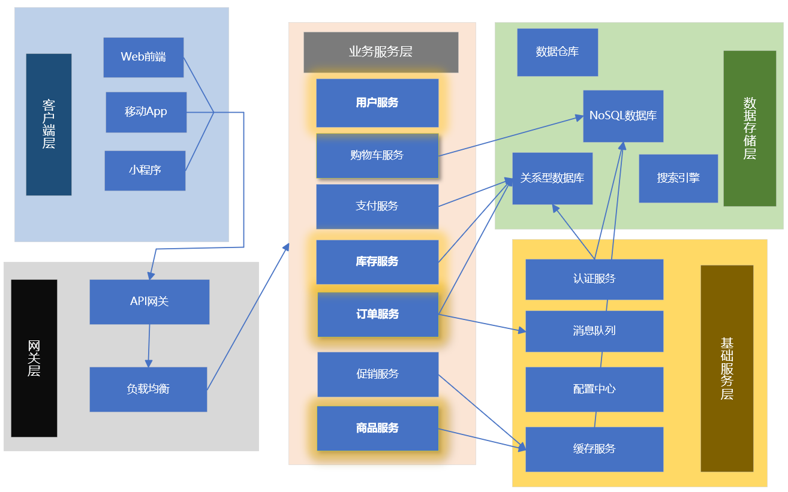

# 电商微服务架构案例

## 概述

电商平台是微服务架构的典型应用场景，涉及商品管理、订单处理、支付结算、库存管理等多个复杂业务领域。通过微服务架构可以实现系统的高可用、可扩展和敏捷开发。

## 架构全景

### 电商微服务架构图



## 核心服务设计

### 1. 用户服务 (User Service)
**用户管理和认证**

```java
@Service
public class UserServiceImpl implements UserService {
    
    @Autowired
    private UserRepository userRepository;
    
    @Autowired
    private PasswordEncoder passwordEncoder;
    
    @Override
    public User register(User user) {
        // 密码加密
        user.setPassword(passwordEncoder.encode(user.getPassword()));
        user.setStatus(UserStatus.ACTIVE);
        user.setCreateTime(new Date());
        
        return userRepository.save(user);
    }
    
    @Override
    public User login(String username, String password) {
        User user = userRepository.findByUsername(username);
        if (user != null && passwordEncoder.matches(password, user.getPassword())) {
            // 生成JWT token
            String token = JwtUtil.generateToken(user);
            user.setToken(token);
            return user;
        }
        throw new AuthenticationException("用户名或密码错误");
    }
    
    @Override
    public User getUserProfile(Long userId) {
        return userRepository.findById(userId)
                .orElseThrow(() -> new UserNotFoundException("用户不存在"));
    }
}
```

### 2. 商品服务 (Product Service)
**商品管理和搜索**

```java
@Service
public class ProductServiceImpl implements ProductService {
    
    @Autowired
    private ProductRepository productRepository;
    
    @Autowired
    private ElasticsearchRestTemplate elasticsearchTemplate;
    
    @Override
    public Product createProduct(Product product) {
        product.setStatus(ProductStatus.ACTIVE);
        product.setCreateTime(new Date());
        product.setUpdateTime(new Date());
        
        Product savedProduct = productRepository.save(product);
        
        // 同步到搜索引擎
        syncToSearchEngine(savedProduct);
        
        return savedProduct;
    }
    
    @Override
    public Page<Product> searchProducts(String keyword, Pageable pageable) {
        NativeSearchQuery searchQuery = new NativeSearchQueryBuilder()
            .withQuery(QueryBuilders.multiMatchQuery(keyword, "name", "description", "category"))
            .withPageable(pageable)
            .build();
        
        return elasticsearchTemplate.search(searchQuery, Product.class);
    }
    
    @Override
    public Product getProductDetail(Long productId) {
        return productRepository.findById(productId)
                .orElseThrow(() -> new ProductNotFoundException("商品不存在"));
    }
    
    private void syncToSearchEngine(Product product) {
        // 异步同步到ES
        CompletableFuture.runAsync(() -> {
            elasticsearchTemplate.save(product);
        });
    }
}
```

### 3. 订单服务 (Order Service)
**订单处理和状态管理**

```java
@Service
@Transactional
public class OrderServiceImpl implements OrderService {
    
    @Autowired
    private OrderRepository orderRepository;
    
    @Autowired
    private InventoryService inventoryService;
    
    @Autowired
    private PaymentService paymentService;
    
    @Autowired
    private KafkaTemplate<String, OrderEvent> kafkaTemplate;
    
    @Override
    public Order createOrder(Order order) {
        // 校验库存
        for (OrderItem item : order.getItems()) {
            boolean available = inventoryService.checkStock(item.getProductId(), item.getQuantity());
            if (!available) {
                throw new InsufficientStockException("库存不足");
            }
        }
        
        // 扣减库存
        inventoryService.deductStock(order.getItems());
        
        // 创建订单
        order.setStatus(OrderStatus.CREATED);
        order.setOrderNo(generateOrderNo());
        order.setCreateTime(new Date());
        
        Order savedOrder = orderRepository.save(order);
        
        // 发送订单创建事件
        sendOrderCreatedEvent(savedOrder);
        
        return savedOrder;
    }
    
    @Override
    public Order payOrder(Long orderId, Payment payment) {
        Order order = orderRepository.findById(orderId)
                .orElseThrow(() -> new OrderNotFoundException("订单不存在"));
        
        // 调用支付服务
        PaymentResult result = paymentService.processPayment(payment);
        
        if (result.isSuccess()) {
            order.setStatus(OrderStatus.PAID);
            order.setPayTime(new Date());
            orderRepository.save(order);
            
            // 发送支付成功事件
            sendOrderPaidEvent(order);
        } else {
            order.setStatus(OrderStatus.PAY_FAILED);
            orderRepository.save(order);
        }
        
        return order;
    }
    
    private String generateOrderNo() {
        return "ORD" + System.currentTimeMillis() + RandomUtils.nextInt(1000, 9999);
    }
    
    private void sendOrderCreatedEvent(Order order) {
        OrderEvent event = new OrderEvent(order, OrderEventType.CREATED);
        kafkaTemplate.send("order-events", event);
    }
}
```

### 4. 库存服务 (Inventory Service)
**库存管理和并发控制**

```java
@Service
public class InventoryServiceImpl implements InventoryService {
    
    @Autowired
    private InventoryRepository inventoryRepository;
    
    @Override
    @Transactional
    public boolean checkStock(Long productId, Integer quantity) {
        Inventory inventory = inventoryRepository.findByProductId(productId);
        return inventory != null && inventory.getAvailableQuantity() >= quantity;
    }
    
    @Override
    @Transactional
    public void deductStock(List<OrderItem> items) {
        for (OrderItem item : items) {
            int affectedRows = inventoryRepository.deductStock(
                item.getProductId(), 
                item.getQuantity()
            );
            
            if (affectedRows == 0) {
                throw new InsufficientStockException("扣减库存失败，商品ID: " + item.getProductId());
            }
        }
    }
    
    @Override
    @Transactional
    public void increaseStock(Long productId, Integer quantity) {
        inventoryRepository.increaseStock(productId, quantity);
    }
    
    @Override
    @Transactional
    public void freezeStock(Long productId, Integer quantity) {
        inventoryRepository.freezeStock(productId, quantity);
    }
}
```

## 数据库设计

### 用户服务表结构
```sql
CREATE TABLE users (
    id BIGINT PRIMARY KEY AUTO_INCREMENT,
    username VARCHAR(50) UNIQUE NOT NULL,
    password VARCHAR(100) NOT NULL,
    email VARCHAR(100) UNIQUE NOT NULL,
    phone VARCHAR(20),
    status VARCHAR(20) DEFAULT 'ACTIVE',
    create_time DATETIME NOT NULL,
    update_time DATETIME NOT NULL,
    INDEX idx_username (username),
    INDEX idx_email (email)
);

CREATE TABLE user_address (
    id BIGINT PRIMARY KEY AUTO_INCREMENT,
    user_id BIGINT NOT NULL,
    recipient VARCHAR(50) NOT NULL,
    phone VARCHAR(20) NOT NULL,
    province VARCHAR(50) NOT NULL,
    city VARCHAR(50) NOT NULL,
    district VARCHAR(50) NOT NULL,
    detail_address VARCHAR(200) NOT NULL,
    is_default BOOLEAN DEFAULT FALSE,
    FOREIGN KEY (user_id) REFERENCES users(id) ON DELETE CASCADE,
    INDEX idx_user_id (user_id)
);
```

### 商品服务表结构
```sql
CREATE TABLE products (
    id BIGINT PRIMARY KEY AUTO_INCREMENT,
    name VARCHAR(200) NOT NULL,
    description TEXT,
    price DECIMAL(10,2) NOT NULL,
    original_price DECIMAL(10,2),
    category_id BIGINT NOT NULL,
    brand VARCHAR(100),
    main_image VARCHAR(200),
    images JSON,
    status VARCHAR(20) DEFAULT 'ACTIVE',
    stock_quantity INT DEFAULT 0,
    sale_count INT DEFAULT 0,
    create_time DATETIME NOT NULL,
    update_time DATETIME NOT NULL,
    INDEX idx_category (category_id),
    INDEX idx_name (name),
    INDEX idx_status (status)
);

CREATE TABLE product_sku (
    id BIGINT PRIMARY KEY AUTO_INCREMENT,
    product_id BIGINT NOT NULL,
    sku_code VARCHAR(100) NOT NULL,
    attributes JSON NOT NULL,
    price DECIMAL(10,2) NOT NULL,
    stock_quantity INT DEFAULT 0,
    image VARCHAR(200),
    FOREIGN KEY (product_id) REFERENCES products(id) ON DELETE CASCADE,
    UNIQUE KEY uk_sku_code (sku_code),
    INDEX idx_product_id (product_id)
);
```

### 订单服务表结构
```sql
CREATE TABLE orders (
    id BIGINT PRIMARY KEY AUTO_INCREMENT,
    order_no VARCHAR(50) UNIQUE NOT NULL,
    user_id BIGINT NOT NULL,
    total_amount DECIMAL(10,2) NOT NULL,
    discount_amount DECIMAL(10,2) DEFAULT 0,
    payment_amount DECIMAL(10,2) NOT NULL,
    status VARCHAR(20) DEFAULT 'CREATED',
    payment_status VARCHAR(20) DEFAULT 'UNPAID',
    delivery_status VARCHAR(20) DEFAULT 'PENDING',
    address_id BIGINT NOT NULL,
    create_time DATETIME NOT NULL,
    pay_time DATETIME,
    deliver_time DATETIME,
    complete_time DATETIME,
    INDEX idx_user_id (user_id),
    INDEX idx_order_no (order_no),
    INDEX idx_create_time (create_time),
    INDEX idx_status (status)
);

CREATE TABLE order_items (
    id BIGINT PRIMARY KEY AUTO_INCREMENT,
    order_id BIGINT NOT NULL,
    product_id BIGINT NOT NULL,
    sku_id BIGINT,
    product_name VARCHAR(200) NOT NULL,
    product_image VARCHAR(200),
    quantity INT NOT NULL,
    price DECIMAL(10,2) NOT NULL,
    total_amount DECIMAL(10,2) NOT NULL,
    FOREIGN KEY (order_id) REFERENCES orders(id) ON DELETE CASCADE,
    INDEX idx_order_id (order_id),
    INDEX idx_product_id (product_id)
);
```

## 服务间通信

### REST API设计
```java
@RestController
@RequestMapping("/api/products")
public class ProductController {
    
    @Autowired
    private ProductService productService;
    
    @GetMapping("/{id}")
    public ResponseEntity<Product> getProduct(@PathVariable Long id) {
        Product product = productService.getProductDetail(id);
        return ResponseEntity.ok(product);
    }
    
    @GetMapping("/search")
    public ResponseEntity<Page<Product>> searchProducts(
            @RequestParam String keyword,
            @RequestParam(defaultValue = "0") int page,
            @RequestParam(defaultValue = "20") int size) {
        Pageable pageable = PageRequest.of(page, size);
        Page<Product> products = productService.searchProducts(keyword, pageable);
        return ResponseEntity.ok(products);
    }
    
    @PostMapping
    public ResponseEntity<Product> createProduct(@RequestBody Product product) {
        Product createdProduct = productService.createProduct(product);
        return ResponseEntity.status(HttpStatus.CREATED).body(createdProduct);
    }
}
```

### 消息队列通信
```java
@Component
public class OrderEventListener {
    
    @Autowired
    private InventoryService inventoryService;
    
    @Autowired
    private NotificationService notificationService;
    
    @KafkaListener(topics = "order-events")
    public void handleOrderEvent(OrderEvent event) {
        switch (event.getEventType()) {
            case CREATED:
                handleOrderCreated(event);
                break;
            case PAID:
                handleOrderPaid(event);
                break;
            case CANCELED:
                handleOrderCanceled(event);
                break;
        }
    }
    
    private void handleOrderCreated(OrderEvent event) {
        // 预占库存
        Order order = event.getOrder();
        inventoryService.freezeStock(order.getItems());
        
        // 发送订单创建通知
        notificationService.sendOrderCreatedNotification(order);
    }
    
    private void handleOrderPaid(OrderEvent event) {
        Order order = event.getOrder();
        
        // 扣减实际库存
        inventoryService.deductStock(order.getItems());
        
        // 发送支付成功通知
        notificationService.sendPaymentSuccessNotification(order);
    }
}
```

## 配置管理

### 应用配置
```yaml
# application.yml
spring:
  application:
    name: ecommerce-service
  datasource:
    url: jdbc:mysql://mysql:3306/ecommerce
    username: ${DB_USERNAME}
    password: ${DB_PASSWORD}
    driver-class-name: com.mysql.cj.jdbc.Driver
    hikari:
      maximum-pool-size: 20
      minimum-idle: 5
  redis:
    host: redis
    port: 6379
    password: ${REDIS_PASSWORD}
  kafka:
    bootstrap-servers: kafka:9092
    consumer:
      group-id: ecommerce-group
  elasticsearch:
    uris: http://elasticsearch:9200

# 业务配置
ecommerce:
  order:
    timeout-minutes: 30
    max-retry-times: 3
  inventory:
    low-stock-threshold: 10
  payment:
    timeout-seconds: 300
    callback-url: https://api.example.com/payment/callback
```

### Kubernetes部署配置
```yaml
# deployment.yaml
apiVersion: apps/v1
kind: Deployment
metadata:
  name: order-service
  labels:
    app: order-service
spec:
  replicas: 3
  selector:
    matchLabels:
      app: order-service
  template:
    metadata:
      labels:
        app: order-service
    spec:
      containers:
      - name: order-service
        image: order-service:1.0.0
        ports:
        - containerPort: 8080
        env:
        - name: DB_USERNAME
          valueFrom:
            secretKeyRef:
              name: db-secrets
              key: username
        - name: DB_PASSWORD
          valueFrom:
            secretKeyRef:
              name: db-secrets
              key: password
        resources:
          requests:
            memory: "512Mi"
            cpu: "250m"
          limits:
            memory: "1Gi"
            cpu: "500m"
        livenessProbe:
          httpGet:
            path: /actuator/health
            port: 8080
          initialDelaySeconds: 30
          periodSeconds: 10
        readinessProbe:
          httpGet:
            path: /actuator/health/readiness
            port: 8080
          initialDelaySeconds: 5
          periodSeconds: 5
---
apiVersion: v1
kind: Service
metadata:
  name: order-service
spec:
  selector:
    app: order-service
  ports:
  - port: 80
    targetPort: 8080
  type: ClusterIP
```

## 监控与告警

### 业务指标监控
```java
@Component
public class OrderMetrics {
    
    private final MeterRegistry meterRegistry;
    
    public OrderMetrics(MeterRegistry meterRegistry) {
        this.meterRegistry = meterRegistry;
    }
    
    public void recordOrderCreated() {
        meterRegistry.counter("order.created.total").increment();
    }
    
    public void recordOrderPaid() {
        meterRegistry.counter("order.paid.total").increment();
    }
    
    public void recordOrderCreationTime(long duration) {
        meterRegistry.timer("order.creation.time")
                    .record(duration, TimeUnit.MILLISECONDS);
    }
    
    public void recordInventoryOperation(String operation, long duration) {
        meterRegistry.timer("inventory.operation.time", "operation", operation)
                    .record(duration, TimeUnit.MILLISECONDS);
    }
}
```

### 告警规则配置
```yaml
# prometheus-alerts.yml
groups:
- name: ecommerce-alerts
  rules:
  - alert: HighOrderCreationErrorRate
    expr: rate(order_creation_errors_total[5m]) / rate(order_created_total[5m]) > 0.05
    for: 5m
    labels:
      severity: critical
    annotations:
      summary: "订单创建错误率过高"
      description: "过去5分钟订单创建错误率超过5%"
  
  - alert: LowInventoryWarning
    expr: inventory_quantity < 10
    for: 10m
    labels:
      severity: warning
    annotations:
      summary: "库存不足警告"
      description: "商品库存低于10件"
  
  - alert: PaymentTimeout
    expr: rate(payment_timeout_total[5m]) > 10
    for: 2m
    labels:
      severity: warning
    annotations:
      summary: "支付超时频繁"
      description: "支付操作超时次数过多"
```

## 安全设计

### JWT认证配置
```java
@Configuration
@EnableWebSecurity
public class SecurityConfig extends WebSecurityConfigurerAdapter {
    
    @Override
    protected void configure(HttpSecurity http) throws Exception {
        http.csrf().disable()
            .authorizeRequests()
            .antMatchers("/api/auth/**").permitAll()
            .antMatchers("/api/public/**").permitAll()
            .antMatchers("/api/admin/**").hasRole("ADMIN")
            .anyRequest().authenticated()
            .and()
            .addFilterBefore(jwtAuthenticationFilter(), UsernamePasswordAuthenticationFilter.class)
            .sessionManagement().sessionCreationPolicy(SessionCreationPolicy.STATELESS);
    }
    
    @Bean
    public JwtAuthenticationFilter jwtAuthenticationFilter() {
        return new JwtAuthenticationFilter();
    }
    
    @Bean
    public PasswordEncoder passwordEncoder() {
        return new BCryptPasswordEncoder();
    }
}
```

### 数据加密配置
```java
@Component
public class DataEncryptionService {
    
    private final String encryptionKey;
    
    public DataEncryptionService(@Value("${encryption.key}") String encryptionKey) {
        this.encryptionKey = encryptionKey;
    }
    
    public String encrypt(String data) {
        try {
            Cipher cipher = Cipher.getInstance("AES/GCM/NoPadding");
            SecretKeySpec keySpec = new SecretKeySpec(encryptionKey.getBytes(), "AES");
            cipher.init(Cipher.ENCRYPT_MODE, keySpec);
            
            byte[] encryptedData = cipher.doFinal(data.getBytes());
            return Base64.getEncoder().encodeToString(encryptedData);
        } catch (Exception e) {
            throw new EncryptionException("数据加密失败", e);
        }
    }
    
    public String decrypt(String encryptedData) {
        try {
            Cipher cipher = Cipher.getInstance("AES/GCM/NoPadding");
            SecretKeySpec keySpec = new SecretKeySpec(encryptionKey.getBytes(), "AES");
            cipher.init(Cipher.DECRYPT_MODE, keySpec);
            
            byte[] decodedData = Base64.getDecoder().decode(encryptedData);
            byte[] decryptedData = cipher.doFinal(decodedData);
            return new String(decryptedData);
        } catch (Exception e) {
            throw new EncryptionException("数据解密失败", e);
        }
    }
}
```

## 性能优化

### 缓存策略实现
```java
@Service
public class ProductCacheService {
    
    @Autowired
    private RedisTemplate<String, Product> redisTemplate;
    
    @Autowired
    private ProductRepository productRepository;
    
    private static final String PRODUCT_KEY_PREFIX = "product:";
    private static final long PRODUCT_CACHE_TTL = 3600; // 1小时
    
    public Product getProductWithCache(Long productId) {
        String cacheKey = PRODUCT_KEY_PREFIX + productId;
        
        // 先查缓存
        Product product = redisTemplate.opsForValue().get(cacheKey);
        if (product != null) {
            return product;
        }
        
        // 缓存未命中，查数据库
        product = productRepository.findById(productId)
                .orElseThrow(() -> new ProductNotFoundException("商品不存在"));
        
        // 写入缓存
        redisTemplate.opsForValue().set(
            cacheKey, 
            product, 
            PRODUCT_CACHE_TTL, 
            TimeUnit.SECONDS
        );
        
        return product;
    }
    
    public void evictProductCache(Long productId) {
        String cacheKey = PRODUCT_KEY_PREFIX + productId;
        redisTemplate.delete(cacheKey);
    }
}
```

### 数据库查询优化
```java
@Repository
public class ProductRepositoryImpl implements ProductRepositoryCustom {
    
    @PersistenceContext
    private EntityManager entityManager;
    
    @Override
    public Page<Product> findProductsByCriteria(ProductCriteria criteria, Pageable pageable) {
        CriteriaBuilder cb = entityManager.getCriteriaBuilder();
        CriteriaQuery<Product> query = cb.createQuery(Product.class);
        Root<Product> root = query.from(Product.class);
        
        // 动态构建查询条件
        List<Predicate> predicates = new ArrayList<>();
        
        if (criteria.getCategoryId() != null) {
            predicates.add(cb.equal(root.get("categoryId"), criteria.getCategoryId()));
        }
        
        if (criteria.getMinPrice() != null) {
            predicates.add(cb.ge(root.get("price"), criteria.getMinPrice()));
        }
        
        if (criteria.getMaxPrice() != null) {
            predicates.add(cb.le(root.get("price"), criteria.getMaxPrice()));
        }
        
        if (criteria.getStatus() != null) {
            predicates.add(cb.equal(root.get("status"), criteria.getStatus()));
        }
        
        query.where(predicates.toArray(new Predicate[0]));
        
        // 执行分页查询
        TypedQuery<Product> typedQuery = entityManager.createQuery(query);
        typedQuery.setFirstResult((int) pageable.getOffset());
        typedQuery.setMaxResults(pageable.getPageSize());
        
        List<Product> products = typedQuery.getResultList();
        
        // 获取总数
        CriteriaQuery<Long> countQuery = cb.createQuery(Long.class);
        Root<Product> countRoot = countQuery.from(Product.class);
        countQuery.select(cb.count(countRoot)).where(predicates.toArray(new Predicate[0]));
        Long total = entityManager.createQuery(countQuery).getSingleResult();
        
        return new PageImpl<>(products, pageable, total);
    }
}
```

## 总结

电商微服务架构通过服务拆分实现了：

**核心优势：**
- 独立部署和扩展
- 技术栈灵活性
- 故障隔离
- 团队协作效率

**关键实践：**
- 合理的服务边界划分
- 异步消息通信
- 分布式事务处理
- 全面的监控告警
- 安全防护措施

> 提示：微服务架构不是银弹，需要根据业务规模和团队能力选择合适的拆分粒度。

***
*相关阅读：./microservice-architecture.md | ./distributed-transactions.md | ./performance-optimization.md*