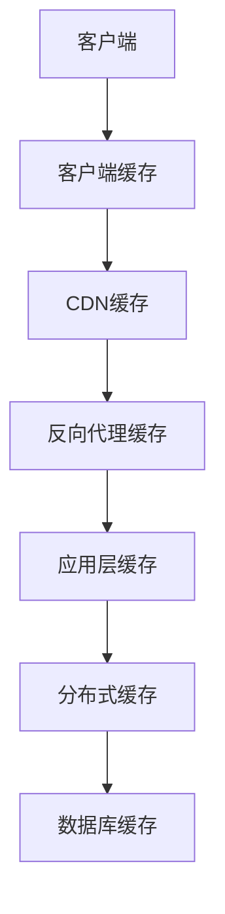
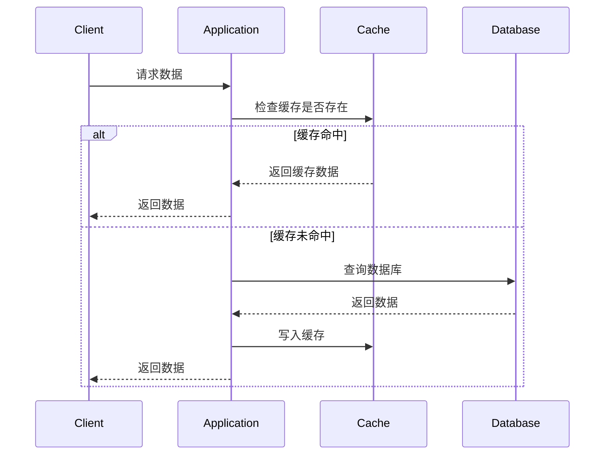

# 缓存策略设计指南

## 概述

缓存是提升系统性能的关键技术，通过将频繁访问的数据存储在快速存储介质中，减少对后端存储的直接访问。合理的缓存策略可以显著降低系统延迟，提高吞吐量，并减轻数据库压力。

## 缓存架构

### 多级缓存体系


## 缓存类型

### 1. 本地缓存 (In-Memory Cache)
**应用进程内缓存，速度最快**

```java
// Guava Cache示例
LoadingCache<String, User> userCache = CacheBuilder.newBuilder()
    .maximumSize(10000) // 最大缓存条目数
    .expireAfterWrite(10, TimeUnit.MINUTES) // 写入后过期时间
    .expireAfterAccess(5, TimeUnit.MINUTES) // 访问后过期时间
    .refreshAfterWrite(1, TimeUnit.MINUTES) // 写入后刷新时间
    .recordStats() // 记录统计信息
    .build(new CacheLoader<String, User>() {
        @Override
        public User load(String userId) throws Exception {
            return userRepository.findById(userId); // 缓存未命中时加载数据
        }
    });

// Caffeine缓存（性能更优）
Cache<String, User> caffeineCache = Caffeine.newBuilder()
    .maximumSize(10_000)
    .expireAfterWrite(10, TimeUnit.MINUTES)
    .refreshAfterWrite(1, TimeUnit.MINUTES)
    .build(key -> userRepository.findById(key));
```

### 2. 分布式缓存 (Distributed Cache)
**集群共享缓存，保证数据一致性**

```yaml
# Redis配置示例
spring:
  redis:
    host: redis-cluster.example.com
    port: 6379
    password: ${REDIS_PASSWORD}
    lettuce:
      pool:
        max-active: 20
        max-idle: 10
        min-idle: 5
        max-wait: 1000ms
    cluster:
      nodes:
        - redis-node1:6379
        - redis-node2:6379
        - redis-node3:6379
      max-redirects: 3
```

## 缓存策略模式

### 1. Cache-Aside (旁路缓存)
**最常用的缓存模式**



```java
public class CacheAsideService {
    
    private final CacheRepository cacheRepo;
    private final DatabaseRepository dbRepo;
    
    public User getUser(String userId) {
        // 1. 先查缓存
        User user = cacheRepo.getUser(userId);
        if (user != null) {
            return user;
        }
        
        // 2. 缓存未命中，查询数据库
        user = dbRepo.findUserById(userId);
        if (user == null) {
            return null;
        }
        
        // 3. 写入缓存
        cacheRepo.setUser(userId, user);
        return user;
    }
    
    public void updateUser(User user) {
        // 1. 更新数据库
        dbRepo.updateUser(user);
        
        // 2. 删除缓存（避免脏数据）
        cacheRepo.deleteUser(user.getId());
    }
}
```

### 2. Read-Through (读穿透)
**缓存作为主要数据源**

```java
public class ReadThroughCache implements LoadingCache<String, User> {
    
    private final CacheLoader<String, User> loader;
    
    @Override
    public User get(String key) {
        User user = cache.getIfPresent(key);
        if (user == null) {
            user = loader.load(key); // 自动加载数据
            cache.put(key, user);
        }
        return user;
    }
}
```

### 3. Write-Through (写穿透)
**先写缓存，再写数据库**

```java
public class WriteThroughService {
    
    public void saveUser(User user) {
        // 1. 先写缓存
        cacheRepo.setUser(user.getId(), user);
        
        // 2. 再写数据库（异步）
        asyncExecute(() -> dbRepo.saveUser(user));
    }
}
```

### 4. Write-Behind (写回)
**先写缓存，异步写数据库**

```java
public class WriteBehindService {
    
    private final Queue<WriteTask> writeQueue = new ConcurrentLinkedQueue<>();
    
    @PostConstruct
    public void init() {
        // 启动异步写线程
        ScheduledExecutorService executor = Executors.newSingleThreadScheduledExecutor();
        executor.scheduleAtFixedRate(this::flushToDatabase, 1, 1, TimeUnit.SECONDS);
    }
    
    public void saveUser(User user) {
        // 1. 写缓存
        cacheRepo.setUser(user.getId(), user);
        
        // 2. 加入写队列
        writeQueue.offer(new WriteTask("save", user));
    }
    
    private void flushToDatabase() {
        WriteTask task;
        while ((task = writeQueue.poll()) != null) {
            try {
                if ("save".equals(task.getOperation())) {
                    dbRepo.saveUser(task.getUser());
                } else if ("delete".equals(task.getOperation())) {
                    dbRepo.deleteUser(task.getUserId());
                }
            } catch (Exception e) {
                // 重试机制
                writeQueue.offer(task);
            }
        }
    }
}
```

## 缓存失效策略

### 1. TTL (Time-To-Live)
**基于时间的过期策略**

```java
public class TTLCacheService {
    
    public void setWithTTL(String key, Object value, long ttlSeconds) {
        redisTemplate.opsForValue().set(
            key, 
            value, 
            ttlSeconds, 
            TimeUnit.SECONDS
        );
    }
    
    public void setWithDynamicTTL(String key, Object value) {
        // 根据业务特性动态设置TTL
        long ttl = calculateTTL(value);
        redisTemplate.opsForValue().set(key, value, ttl, TimeUnit.SECONDS);
    }
    
    private long calculateTTL(Object value) {
        if (value instanceof User user) {
            // 活跃用户缓存时间短，非活跃用户缓存时间长
            return user.isActive() ? 300 : 3600;
        }
        return 600; // 默认10分钟
    }
}
```

### 2. 主动失效
**基于事件驱动失效**

```java
public class ActiveInvalidationService {
    
    @EventListener
    public void onUserUpdate(UserUpdatedEvent event) {
        // 用户信息更新时，主动失效缓存
        cacheRepo.deleteUser(event.getUserId());
        
        // 同时失效相关缓存
        cacheRepo.deleteUserProfile(event.getUserId());
        cacheRepo.deleteUserPermissions(event.getUserId());
    }
    
    @EventListener
    public void onOrderCreate(OrderCreatedEvent event) {
        // 订单创建时，更新用户订单列表缓存
        String cacheKey = "user_orders:" + event.getUserId();
        cacheRepo.delete(cacheKey);
    }
}
```

## 缓存穿透解决方案

### 1. 布隆过滤器 (Bloom Filter)
**防止缓存穿透**

```java
public class BloomFilterService {
    
    private final BloomFilter<String> bloomFilter;
    
    public BloomFilterService() {
        this.bloomFilter = BloomFilter.create(
            Funnels.stringFunnel(Charset.defaultCharset()),
            1000000, // 预期元素数量
            0.01     // 误判率
        );
    }
    
    public User getUser(String userId) {
        // 1. 先检查布隆过滤器
        if (!bloomFilter.mightContain(userId)) {
            return null; // 肯定不存在
        }
        
        // 2. 查询缓存
        User user = cacheRepo.getUser(userId);
        if (user != null) {
            return user;
        }
        
        // 3. 查询数据库
        user = dbRepo.findUserById(userId);
        if (user != null) {
            cacheRepo.setUser(userId, user);
            bloomFilter.put(userId); // 加入布隆过滤器
        }
        
        return user;
    }
}
```

### 2. 空值缓存
**缓存空结果**

```java
public class NullValueCacheService {
    
    private static final User NULL_USER = new User(); // 特殊空值对象
    
    public User getUser(String userId) {
        User user = cacheRepo.getUser(userId);
        if (user != null) {
            return user == NULL_USER ? null : user;
        }
        
        user = dbRepo.findUserById(userId);
        if (user == null) {
            // 缓存空值，防止穿透
            cacheRepo.setUser(userId, NULL_USER, 300); // 5分钟过期
            return null;
        }
        
        cacheRepo.setUser(userId, user);
        return user;
    }
}
```

## 缓存击穿解决方案

### 1. 互斥锁 (Mutex Lock)
**防止热点key失效时大量请求击穿数据库**

```java
public class MutexLockService {
    
    private final LockManager lockManager;
    
    public User getUser(String userId) {
        User user = cacheRepo.getUser(userId);
        if (user != null) {
            return user;
        }
        
        // 获取分布式锁
        Lock lock = lockManager.getLock("user:" + userId);
        try {
            if (lock.tryLock(100, TimeUnit.MILLISECONDS)) {
                try {
                    // 再次检查缓存（双重检查锁）
                    user = cacheRepo.getUser(userId);
                    if (user != null) {
                        return user;
                    }
                    
                    // 查询数据库
                    user = dbRepo.findUserById(userId);
                    if (user != null) {
                        cacheRepo.setUser(userId, user);
                    }
                    return user;
                } finally {
                    lock.unlock();
                }
            } else {
                // 获取锁失败，短暂等待后重试
                Thread.sleep(50);
                return getUser(userId);
            }
        } catch (InterruptedException e) {
            Thread.currentThread().interrupt();
            throw new RuntimeException("Lock acquisition interrupted", e);
        }
    }
}
```

### 2. 后台刷新
**异步刷新热点数据**

```java
public class BackgroundRefreshService {
    
    private final ScheduledExecutorService scheduler = 
        Executors.newScheduledThreadPool(5);
    
    private final Map<String, AtomicInteger> accessCounts = new ConcurrentHashMap<>();
    
    public User getUser(String userId) {
        User user = cacheRepo.getUser(userId);
        if (user != null) {
            // 记录访问次数
            accessCounts.computeIfAbsent(userId, k -> new AtomicInteger())
                       .incrementAndGet();
            
            // 如果访问频繁，安排后台刷新
            if (accessCounts.get(userId).get() > 100) {
                scheduleBackgroundRefresh(userId);
            }
            
            return user;
        }
        
        user = dbRepo.findUserById(userId);
        if (user != null) {
            cacheRepo.setUser(userId, user);
        }
        return user;
    }
    
    private void scheduleBackgroundRefresh(String userId) {
        scheduler.schedule(() -> {
            try {
                User freshUser = dbRepo.findUserById(userId);
                if (freshUser != null) {
                    cacheRepo.setUser(userId, freshUser);
                }
            } catch (Exception e) {
                log.error("Background refresh failed for user: {}", userId, e);
            }
        }, 1, TimeUnit.SECONDS);
    }
}
```

## 缓存雪崩解决方案

### 1. 随机过期时间
**避免大量key同时过期**

```java
public class RandomExpirationService {
    
    private final Random random = new Random();
    
    public void setWithRandomTTL(String key, Object value, long baseTTL) {
        // 基础TTL ± 随机偏移量
        long randomOffset = random.nextInt(300) - 150; // ±2.5分钟
        long actualTTL = baseTTL + randomOffset;
        
        redisTemplate.opsForValue().set(
            key, 
            value, 
            Math.max(actualTTL, 60), // 最少1分钟
            TimeUnit.SECONDS
        );
    }
}
```

### 2. 永不过期策略
**通过后台线程更新缓存**

```java
public class NeverExpireService {
    
    private final ScheduledExecutorService scheduler = 
        Executors.newScheduledThreadPool(10);
    
    private final Map<String, Long> lastUpdateTimes = new ConcurrentHashMap<>();
    
    public User getUser(String userId) {
        User user = cacheRepo.getUser(userId);
        if (user != null) {
            // 检查是否需要更新
            if (needUpdate(userId)) {
                scheduler.submit(() -> updateUserInBackground(userId));
            }
            return user;
        }
        
        user = dbRepo.findUserById(userId);
        if (user != null) {
            cacheRepo.setUser(userId, user); // 永不过期
            lastUpdateTimes.put(userId, System.currentTimeMillis());
        }
        return user;
    }
    
    private boolean needUpdate(String userId) {
        Long lastUpdate = lastUpdateTimes.get(userId);
        if (lastUpdate == null) {
            return true;
        }
        return System.currentTimeMillis() - lastUpdate > 3600000; // 1小时
    }
    
    private void updateUserInBackground(String userId) {
        try {
            User freshUser = dbRepo.findUserById(userId);
            if (freshUser != null) {
                cacheRepo.setUser(userId, freshUser);
                lastUpdateTimes.put(userId, System.currentTimeMillis());
            }
        } catch (Exception e) {
            log.error("Background update failed for user: {}", userId, e);
        }
    }
}
```

## 缓存监控与管理

### 监控指标
```yaml
# 缓存监控指标
metrics:
  cache:
    hit_rate: gauge        # 缓存命中率
    miss_rate: gauge      # 缓存未命中率
    size: gauge           # 缓存大小
    eviction_count: counter # 缓存驱逐次数
    load_duration: timer   # 缓存加载耗时
    error_count: counter  # 缓存错误次数

# 告警规则
alerts:
  - name: low_cache_hit_rate
    condition: cache_hit_rate < 0.8
    severity: warning
    
  - name: high_cache_miss_duration
    condition: cache_load_duration.99th > 1000
    severity: critical
```

### 缓存统计
```java
public class CacheStatsService {
    
    private final CacheStats cacheStats;
    
    public void recordHit() {
        cacheStats.recordHit();
    }
    
    public void recordMiss() {
        cacheStats.recordMiss();
    }
    
    public void recordLoadSuccess(long loadTime) {
        cacheStats.recordLoadSuccess(loadTime);
    }
    
    public void recordLoadFailure(long loadTime) {
        cacheStats.recordLoadFailure(loadTime);
    }
    
    public CacheStats getStats() {
        return cacheStats;
    }
    
    public double getHitRate() {
        return cacheStats.hitRate();
    }
    
    public long getRequestCount() {
        return cacheStats.requestCount();
    }
}
```

## 最佳实践

### 缓存键设计
```java
public class CacheKeyGenerator {
    
    public static String generateUserKey(String userId) {
        return String.format("user:%s", userId);
    }
    
    public static String generateUserOrdersKey(String userId, int page, int size) {
        return String.format("user_orders:%s:page%d:size%d", userId, page, size);
    }
    
    public static String generateProductKey(String productId, String region) {
        return String.format("product:%s:region:%s", productId, region);
    }
    
    // 带版本的缓存键（用于强制失效）
    public static String generateVersionedKey(String baseKey, int version) {
        return String.format("%s:v%d", baseKey, version);
    }
}
```

### 缓存配置优化
```yaml
# Redis连接池优化
redis:
  lettuce:
    pool:
      max-active: 100      # 最大连接数
      max-idle: 50         # 最大空闲连接
      min-idle: 10         # 最小空闲连接
      max-wait: 1000ms     # 获取连接最大等待时间
      time-between-eviction-runs: 30000ms # 驱逐检查间隔

# 本地缓存配置
caffeine:
  maximum-size: 10000      # 最大缓存条目
  expire-after-write: 10m  # 写入后过期时间
  refresh-after-write: 1m  # 写入后刷新时间
  record-stats: true       # 记录统计信息
```

## 故障处理

### 缓存降级策略
```java
public class CacheFallbackService {
    
    private final CircuitBreaker circuitBreaker;
    
    public User getUser(String userId) {
        try {
            return circuitBreaker.executeSupplier(() -> {
                User user = cacheRepo.getUser(userId);
                if (user != null) {
                    return user;
                }
                
                user = dbRepo.findUserById(userId);
                if (user != null) {
                    cacheRepo.setUser(userId, user);
                }
                return user;
            });
        } catch (CircuitBreakerOpenException e) {
            // 缓存服务不可用，直接查询数据库
            log.warn("Cache service unavailable, falling back to database");
            return dbRepo.findUserById(userId);
        } catch (Exception e) {
            log.error("Failed to get user from cache and database", e);
            throw e;
        }
    }
}
```

### 缓存预热
```java
public class CacheWarmUpService {
    
    @PostConstruct
    public void warmUpCache() {
        // 预热热点数据
        warmUpHotUsers();
        warmUpFrequentProducts();
        warmUpConfigurationData();
    }
    
    private void warmUpHotUsers() {
        List<String> hotUserIds = userRepo.findHotUserIds(100);
        hotUserIds.parallelStream().forEach(userId -> {
            User user = userRepo.findUserById(userId);
            if (user != null) {
                cacheRepo.setUser(userId, user);
            }
        });
    }
}
```

## 总结

合理的缓存策略设计需要综合考虑：

**核心原则：**
- 选择合适的缓存模式
- 设计合理的失效策略
- 预防缓存异常情况
- 实施全面监控告警

**实施建议：**
- 根据数据访问模式选择缓存策略
- 使用多级缓存架构
- 实现缓存降级和熔断机制
- 定期优化缓存配置

> 提示：缓存不是银弹，需要根据具体业务场景和数据特性来设计合适的策略。

***
*相关阅读：./performance-optimization.md | ./distributed-system-design.md | ./database-optimization.md*